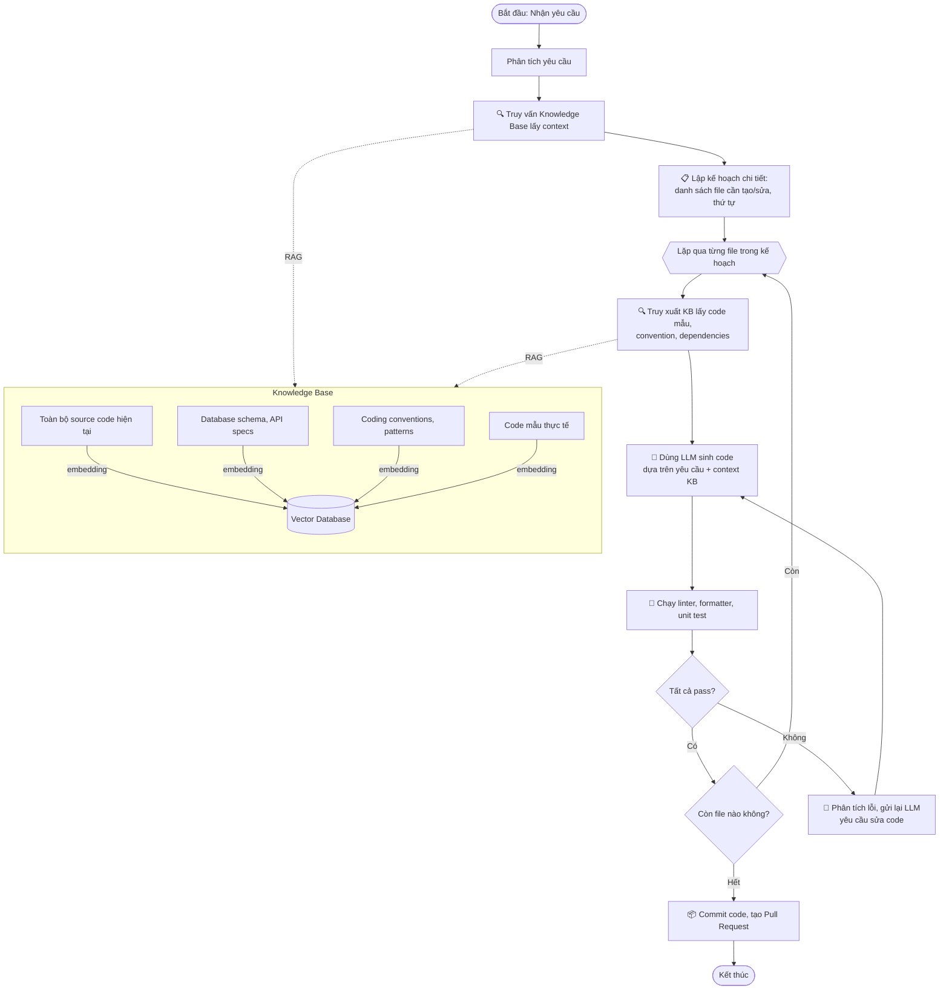
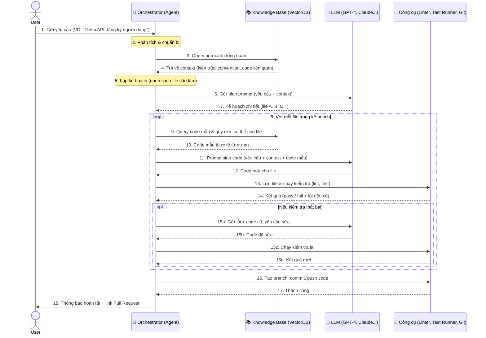

# Workflow AI + Knowledge Base

## 1. Đúng ý bạn: Workflow AI + Knowledge Base để sinh source code

Thay vì hỏi “viết hàm này cho tôi”, bạn muốn có một pipeline tự động hoá: 
- Nhận yêu cầu (tính năng / module).  
- Tra cứu **Knowledge Base** (tri thức về dự án: kiến trúc, coding convention, API nội bộ, CSDL schema, code mẫu…).  
- Phân rã thành các bước, lập kế hoạch.  
- Gọi AI (LLM) sinh code cho từng phần, nhưng code đó **phải nhất quán với chuẩn của team** nhờ KB.  
- Tự kiểm tra (chạy test, lint), nếu lỗi thì tự sửa.  
- Tạo pull request hoặc merge.

Đây chính là hướng mà các dự án như **GPT-Engineer**, **MetaGPT**, **Sweep AI**, **Cody (Sourcegraph)** đang làm — và bạn hoàn toàn có thể tự build một workflow tùy chỉnh.

---

## 2. Các thành phần cốt lõi

### a) Knowledge Base (KB) – Cơ sở tri thức
KB không chỉ là documentation mà là **toàn bộ ngữ cảnh cần thiết để sinh code đúng chuẩn**:
- **Mã nguồn hiện có** (đã được indexing để tìm kiếm ngữ nghĩa).
- **Database schema**, API specs (OpenAPI), GraphQL schema.
- **Quy ước code**: cách đặt tên, cấu trúc thư mục, pattern (ví dụ: dùng Repository pattern, dependency injection…).
- **Tài liệu thiết kế**: quyết định kiến trúc, lý do chọn công nghệ.
- **Ví dụ code mẫu (few-shot examples)** cho từng loại tác vụ.

**Lưu trữ KB**:  
- Dạng văn bản → chunk → embedding → lưu vào VectorDB (Chroma, Qdrant, Pinecone).  
- Dạng cấu trúc (API endpoint, class, method) → có thể dùng code graph / AST để truy vấn chính xác (Sourcegraph làm vậy).

### b) RAG – Retrieval Augmented Generation (Tăng cường sinh bằng truy xuất)
Thay vì gửi nguyên cả codebase vào prompt (tốn token, dễ lạc), workflow sẽ:
1. Nhận yêu cầu (ví dụ: “Thêm API đăng ký người dùng”).
2. Truy vấn KB để lấy những phần liên quan: cách project đang xử lý user model, middleware auth, cấu trúc response, validation rules…
3. Chèn các ngữ cảnh đó vào prompt cùng yêu cầu.
4. LLM sinh code **dựa trên đúng kiến thức nội bộ**, không bịa đặt API ảo.

=> Code sinh ra sẽ import đúng module, dùng đúng function helper đã có, tuân thủ convention.

### c) Workflow / Agent orchestrator – Điều phối quy trình
Đây là “bộ não” chia nhỏ công việc và điều khiển các bước. Có thể xây dựng bằng:
- **LangChain Agents + Tools** (tool đọc file, ghi file, chạy lệnh terminal, truy vấn KB).
- **AutoGen** (Microsoft) – tạo nhiều agent đóng vai (architect, developer, reviewer).
- **CrewAI** – multi-agent collaboration.
- **Semantic Kernel** (Microsoft) – nếu dùng .NET.
- Hoặc chỉ cần một Python script tuần tự nhưng thông minh.

**Các bước trong workflow mẫu**:
1. **Understand**: Phân tích yêu cầu, tra KB để hiểu context.
2. **Plan**: Liệt kê các file cần tạo/sửa, thứ tự thực hiện.
3. **Retrieve**: Với mỗi file, query KB lấy code mẫu / chuẩn liên quan.
4. **Generate**: Sinh code (có thể dùng LLM riêng cho code như GPT-4, Claude).
5. **Validate**: Chạy linter, formatter, unit test (tool thực thi).
6. **Self-heal**: Nếu fail, đưa lỗi + log vào prompt yêu cầu sửa lại.
7. **Commit**: Tạo nhánh, commit code.

### d) Phương pháp luận nâng cao
- **Self-reflection / Self-critique**: Agent tự review code mình sinh, đối chiếu với KB, phát hiện sai sót trước khi test.
- **Plan-and-Execute**: Tách bước lập kế hoạch khỏi bước thực thi, giúp kiểm soát dễ hơn.
- **Few-shot prompting với KB**: Luôn kèm 2-3 đoạn code mẫu thực tế từ dự án khi yêu cầu sinh code tương tự.
- **Human-in-the-loop**: Dừng ở bước Review để người duyệt trước khi merge.

---

## 3. Ví dụ thực tế: Tự build “AI Developer” nội bộ với LangChain

Giả sử team bạn có project FastAPI + PostgreSQL, đã có sẵn các module: `auth`, `models`, `schemas`, `services`.

**Bước 1 – Xây dựng Knowledge Base**  
- Dùng script quét toàn bộ source code, chia thành các chunk: mỗi file, mỗi class, mỗi function.  
- Tạo metadata: tên class, dependencies, path file.  
- Embedding bằng OpenAI `text-embedding-3-small` → lưu vào ChromaDB.

**Bước 2 – Định nghĩa Tools cho Agent**  
Ví dụ trong LangChain:
```python
tools = [
    Tool(name="search_knowledge_base", func=retrieve_relevant_code),
    Tool(name="write_file", func=write_file),
    Tool(name="run_tests", func=run_pytest),
    Tool(name="lint", func=run_black_and_isort),
]
```

**Bước 3 – Tạo Prompt cho Planner Agent**  
System prompt kiểu:  
> Bạn là software architect. Dựa vào yêu cầu và context từ KB, hãy lập kế hoạch chi tiết: cần tạo/sửa những file nào, dùng những module nào, theo thứ tự nào.

**Bước 4 – Agent thực thi từng bước**  
- Với mỗi file, Agent gọi `search_knowledge_base` để lấy code liên quan.  
- Tạo prompt developer: “Dưới đây là yêu cầu, context từ KB (code mẫu, quy ước...), hãy viết code cho file X”.  
- Ghi file, chạy lint, nếu fail thì phản hồi lỗi cho Agent để sửa.

**Bước 5 – Chạy test & mở PR**  
Sau khi pass lint, Agent chạy unit test, nếu fail sẽ phân tích log, tìm nguyên nhân, sửa lại code. Cuối cùng commit lên nhánh mới, mở PR với description tự sinh.

---

## 4. Các dự án tham khảo sát ý tưởng của bạn

- **[Sweep AI](https://sweep.dev/)** : Nhận issue trên GitHub, tự tìm file liên quan, sinh code, chạy CI, tạo PR. Nó dùng RAG trên codebase của bạn.
- **[Cody (Sourcegraph)](https://sourcegraph.com/cody)** : Kết hợp code graph và LLM để hiểu toàn bộ codebase, sinh code đúng ngữ cảnh.
- **[GPT-Engineer](https://github.com/gpt-engineer-org/gpt-engineer)** : Từ một prompt ý tưởng, nó hỏi bạn làm rõ, rồi sinh toàn bộ project. Bạn có thể chỉnh sửa các bước thành workflow riêng.
- **[MetaGPT](https://github.com/geekan/MetaGPT)** : Mô phỏng công ty phần mềm với các role Product Manager, Architect, Engineer… có thể xuất ra cả tài liệu thiết kế lẫn code.
- **[CrewAI](https://www.crewai.com/)** : Framework cho multi-agent, dễ custom role.

Bạn có thể dùng các dự án này làm xương sống, rồi tích hợp KB nội bộ của riêng mình.

---

## 5. Tổng kết: Đây là “build a project software source code with AI workflow” đúng như bạn hình dung

- **Workflow** = quy trình tự động, chia nhỏ nhiệm vụ, phối hợp nhiều bước, có vòng lặp phản hồi.
- **Knowledge Base** = nơi lưu toàn bộ tri thức dự án để đảm bảo AI sinh code không “bịa”, tuân thủ kiến trúc và chuẩn team.
- **Phương pháp** = RAG + Agent Orchestration + Self-healing.


Tất nhiên rồi, đây là sơ đồ Mermaid mô tả workflow “AI + Knowledge Base” để sinh source code mà bạn đã hình dung.



**Giải thích nhanh sơ đồ:**

- **Knowledge Base (góc phải)** là nơi lưu toàn bộ tri thức dự án dưới dạng embedding để truy xuất ngữ nghĩa (RAG).
- **Luồng chính**: tiếp nhận yêu cầu → phân tích & truy vấn KB lấy ngữ cảnh tổng quan → lập kế hoạch chi tiết.
- Sau đó **lặp qua từng file**, mỗi file đều: truy xuất KB lấy chuẩn code → sinh code bằng LLM → kiểm tra (lint, test).
- Nếu kiểm tra lỗi, workflow sẽ **tự sửa lỗi** bằng cách gửi lại lỗi cho LLM rồi sinh lại code, lặp đến khi pass hết.
- Cuối cùng commit và tạo PR.

Đây là bản **Sequence Diagram** cho workflow đó, để bạn thấy rõ các thành phần "nói chuyện" với nhau theo thời gian:



**Giải thích nhanh:**

- **User** chỉ là người đưa ra yêu cầu.
- **Orchestrator** chính là trung tâm điều phối (có thể xây bằng LangChain Agent hoặc custom script).
- **Knowledge Base** dùng RAG để lấy đúng context, code mẫu, quy chuẩn.
- **LLM** sinh code và sửa lỗi dựa trên feedback.
- **Công cụ (Tools)** là các bước xác thực tự động (lint, test, git...).

