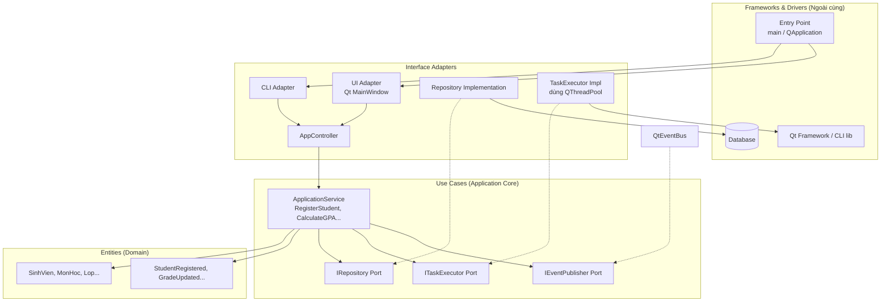
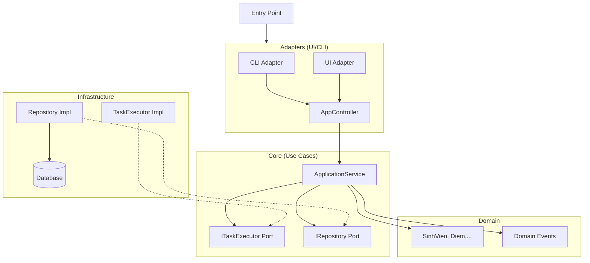

Tuyệt vời! Sơ đồ của bạn mô tả một kiến trúc **Headless-first** rất hiện đại, đặc biệt phù hợp cho các hệ thống cần chạy đa nền tảng (CLI, batch, GUI) mà vẫn giữ được logic lõi sạch sẽ. Hãy cùng mổ xẻ từng thành phần và map chúng sang **Clean Architecture** của Uncle Bob.

---

## 1. Phân tích từng thành phần và vai trò

### Entry Point
- **Là gì?** Điểm khởi đầu của ứng dụng, có thể là `main()` trong CLI, một script batch, hay `QApplication::exec()`.
- **Trong Clean Architecture:** Nằm ở **lớp ngoài cùng** (Frameworks & Drivers). Nó có nhiệm vụ "bật công tắc" và chọn adapter phù hợp.

### Adapters (CLI Adapter, UI Adapter)
- **Là gì?** Chịu trách nhiệm chuyển đổi input từ người dùng (dòng lệnh, giao diện Qt/Web) thành lời gọi đến `AppController`.
- **Ví dụ:**
  - `CLI Adapter` đọc tham số `argv`, gọi `AppController.runCommand(...)`.
  - `UI Adapter` (Qt) nhận signal từ `QPushButton`, gọi `AppController.onUserAction(...)`.
- **Trong Clean Architecture:** Đây chính là tầng **Interface Adapters** (cùng với Presenter nếu có). Chúng phụ thuộc vào `AppController` bên trong.

### Application Core (Headless-first)

Bạn gói các thành phần sau vào một module không phụ thuộc vào giao diện, database – đó là trái tim của ứng dụng.

- **AppController**
  - **Vai trò:** Điều phối viên trung tâm, nhận yêu cầu từ mọi adapter (CLI, UI) và phân phối đến đúng `ApplicationService`. Nó giống như một **Front Controller**.
  - **Trong Clean Architecture:** Nằm ở tầng **Interface Adapters** (vì nó gần với input), nhưng cũng có thể coi là một phần của **Use Cases** nếu bạn muốn tối giản. Tuy nhiên, để đúng Dependency Rule, tốt nhất nên xem nó như một **controller** (adapter) – lớp trong cùng chỉ nên chứa business rules, còn điều phối flow thì có thể là adapter.
  - **Lưu ý:** Trong sơ đồ của bạn, `AppController` nằm trong Core và được gọi trực tiếp từ Adapter, điều này đúng với mô hình "controller ở biên giới".

- **ApplicationService**
  - **Vai trò:** Chứa logic nghiệp vụ của ứng dụng. Mỗi service có thể đại diện cho một Use Case (hoặc tập hợp các Use Case liên quan). Nó thao tác với `DomainModel`, gọi repository (qua interface), và phát ra `DomainEvent`.
  - **Ví dụ:** `StudentRegistrationService.execute(...)` sẽ kiểm tra MSSV, tạo `SinhVien` entity, lưu qua repository, rồi emit `StudentRegisteredEvent`.
  - **Trong Clean Architecture:** Đây chính là tầng **Use Cases**. Nó chỉ phụ thuộc vào Entities và các Port (interface của repository, event publisher). Hoàn toàn không biết CLI hay Qt là gì.

- **TaskRegistry, TaskExecutor, TaskRuntimeStore**
  - Đây là các thành phần hỗ trợ quản lý tác vụ dài hơi (long-running tasks), thường thấy trong ứng dụng xử lý batch hoặc workflow.
  - **TaskRegistry:** Một danh sách các loại Task được định nghĩa (giống như factory). Có thể là một phần của **Use Cases** (nếu nó chứa logic đăng ký task) hoặc là một **Port** (interface) để adapter triển khai.
  - **TaskExecutor:** Thực thi task. Nếu nó chứa logic điều phối chạy task (gọi domain service), thì nó thuộc **Use Cases**. Nếu nó chỉ đơn thuần là thread pool / scheduler, thì nó là **Framework/Infrastructure** và bên trong chỉ nên dùng interface của nó (Port).
  - **TaskRuntimeStore:** Lưu trữ trạng thái runtime của các task (đang chạy, thất bại...). Nếu đây là nơi lưu trạng thái để truy vấn sau, nó có thể là một **Port** (interface) được Repository triển khai. Hoặc cũng có thể là một phần của Use Cases nếu nó chỉ là cấu trúc dữ liệu trong bộ nhớ.
  - **Trong Clean Architecture:** Để đúng tinh thần, bạn nên tách interface của chúng (Port) vào tầng Use Cases, phần triển khai cụ thể (ví dụ: dùng QtConcurrent) để ở Infrastructure.

### Domain Layer
- **DomainModel:** Đây là các **Entities** trong Clean Architecture. Đối với ứng dụng quản lý sinh viên: `SinhVien`, `MonHoc`, `Diem`. Chúng chứa dữ liệu và quy tắc bất biến (vd: điểm từ 0-10).
- **DomainEvent:** Các sự kiện miền (domain events) như `StudentRegistered`, `GradeUpdated`. Chúng là một phần của Entities hoặc có thể đặt riêng trong Domain Layer.
- **Trong Clean Architecture:** Đây là tầng **Entities** – lõi trong cùng, không phụ thuộc vào bất kỳ tầng nào khác.

### Infrastructure
- **Repository:** Triển khai các interface repository (ví dụ: `ISinhVienRepository`) bằng công nghệ cụ thể (SQLAlchemy, QSqlDatabase).
- **DB:** Cơ sở dữ liệu thực tế.
- **Trong Clean Architecture:** Đây là tầng **Frameworks & Drivers** (lớp ngoài cùng). Repository nằm ở ranh giới giữa Interface Adapters và Frameworks, nhưng thường được xếp vào Adapters (vì nó chuyển đổi dữ liệu). Tuy nhiên, vì nó phụ thuộc vào framework DB, ta có thể coi nó là một phần của Infrastructure.

---

## 2. Map sang Clean Architecture – Vòng tròn đồng tâm

Hãy hình dung lại sơ đồ của bạn theo **Dependency Rule**:

**Lưu ý:** Trong sơ đồ gốc của bạn, `TaskRegistry`, `TaskExecutor`, `TaskRuntimeStore` nằm trong Core. Để tuân thủ Clean Architecture triệt để:
- `TaskRegistry` (nếu là nơi đăng ký loại task) có thể là một phần của **Use Cases** (vì nó biết các service nào tương ứng với task). Nhưng nếu nó chỉ là map `taskType -> lambda` thì có thể là cấu trúc dữ liệu đơn thuần, vẫn nằm trong Use Cases.
- `TaskExecutor` **nên là interface (Port)** trong Use Cases, còn implementation dùng `QThreadPool` nằm ở Infrastructure/Adapters. Điều này cho phép kiểm thử dễ dàng (mock executor).
- `TaskRuntimeStore` cũng nên là interface (Port) để lưu trạng thái, triển khai bằng in-memory store hoặc DB.

---

## 3. Điều chỉnh để hoàn thiện Clean Architecture

Sơ đồ của bạn đã rất gần với Clean Architecture, nhưng có một điểm có thể cải thiện:

- **Dependency Inversion cho TaskExecutor:** Hiện tại mũi tên `ApplicationService --> TaskRegistry --> TaskExecutor` cho thấy `ApplicationService` biết đến `TaskExecutor` cụ thể. Để đảo ngược phụ thuộc, hãy để `ApplicationService` phụ thuộc vào **interface** `ITaskExecutor` (Port), và `TaskExecutor` implement interface đó. `TaskRegistry` cũng có thể là một Port nếu cần mở rộng.
- **Tách AppController:** Nếu muốn chuẩn chỉ, `AppController` nên được đặt trong **Adapters** thay vì Core, vì nó biết cách thức nhận input từ CLI/UI. Tuy nhiên, nhiều thiết kế vẫn để nó trong Core như một "điều phối trung tâm" không phụ thuộc framework. Miễn là nó không import Qt hay thư viện CLI, bạn có thể để trong Core như một **Use Case orchestrator**. Tốt nhất: coi `AppController` như một **boundary interface** giữa Adapters và Use Cases.

**Đề xuất sơ đồ điều chỉnh (tinh gọn, giữ tinh thần của bạn):**

---

## 4. Kết luận

Sơ đồ của bạn đã phản ánh rất tốt tư duy **Headless-first** và phân tách rạch ròi. Nó gần như là một biến thể của Clean Architecture với:
- **Entities:** `DomainModel`, `DomainEvent`
- **Use Cases:** `ApplicationService`, các interface `TaskRegistry` (nếu là port), `TaskExecutor` (nếu là port)
- **Interface Adapters:** `AppController`, `CLI Adapter`, `UI Adapter`, `Repository Implementation`
- **Frameworks:** `Database`, `Qt/CLI libs`, `TaskExecutor triển khai thật`

Chỉ cần áp dụng Dependency Inversion cho các thành phần như `TaskExecutor` (dùng interface), kiến trúc này sẽ hoàn toàn tuân thủ Clean Architecture và cực kỳ linh hoạt: bạn có thể thay đổi database, framework giao diện, thậm chí chạy không cần giao diện (headless) một cách dễ dàng.

Nếu bạn muốn đi sâu vào code minh họa cho từng phần hoặc cách triển khai trong Qt/C++, mình sẵn sàng hỗ trợ nhé!