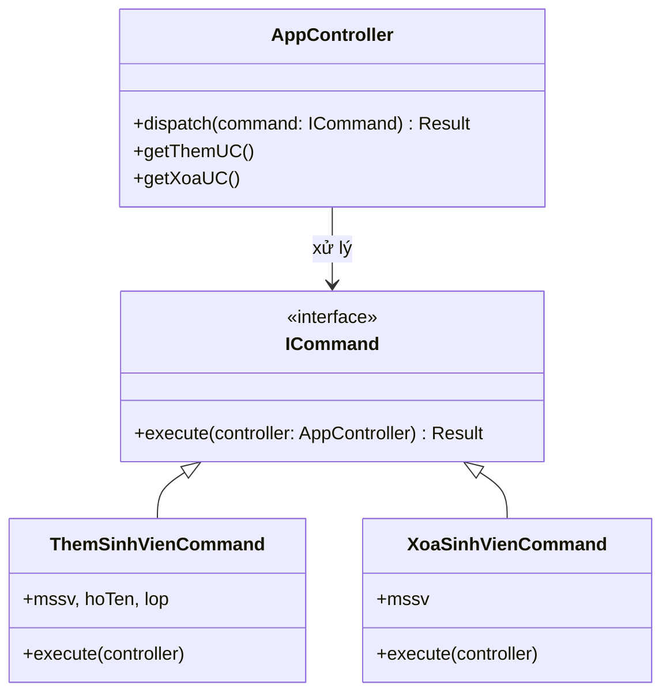
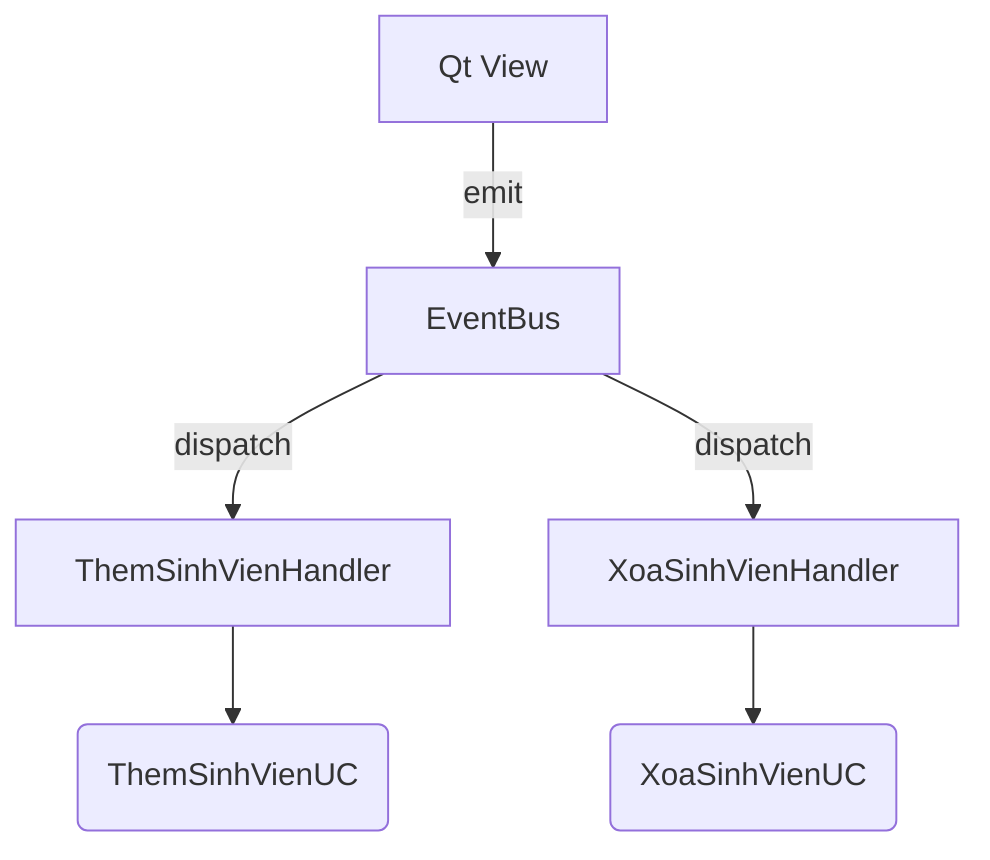
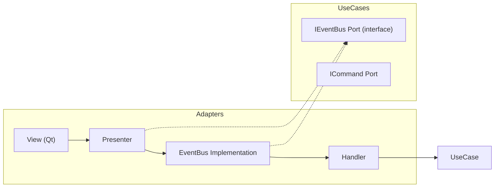

AppController trong các hệ thống phức tạp. Suy nghĩ "AppController giống như xây dựng một event-driven pattern và các handler" là hoàn toàn đúng – đó là một trong những cách triển khai mạnh mẽ nhất của nó.

Hãy cùng phân tích sâu hơn và khám phá các cách thiết kế AppController, từ đơn giản đến phức tạp, để thấy rõ sự đa dạng và mối liên hệ với event-driven.

---

## 1. Tại sao AppController có thể là Event-Driven + Handler?

- **AppController** nhận các yêu cầu từ bên ngoài (có thể coi là các sự kiện - event).
- Nó không tự xử lý, mà **phân phối** cho các **handler** phù hợp.  
- Handler chính là các Use Case hoặc Application Service, đã được đăng ký trước đó.

Mô hình này thường được gọi là **Mediator Pattern** hoặc **Command Bus Pattern**, nơi AppController đóng vai trò trung tâm điều phối, giảm kết nối trực tiếp giữa UI và logic nghiệp vụ.

---

## 2. Các cách thiết kế AppController (từ đơn giản đến Event-Driven)

### 2.1 Simple Facade (God Controller)
- **Mô tả**: Một class chứa tất cả các method tương ứng với hành động người dùng.
- **Handler**: Chính là các method đó, gọi thẳng đến Use Case.
- **Đặc điểm**: Không có event, không phân phối động. Dễ hiểu, dễ code, nhưng dễ trở thành "God Object".

### 2.2 Facade có tổ chức (đã thảo luận trước)
- Tách logic xử lý vào Use Case riêng, AppController chỉ gọi chúng. Vẫn là một class duy nhất.

### 2.3 Command Pattern
- Mỗi hành động là một **Command object**.  
- AppController nhận Command, gọi `command.execute()`.  
- **Handler** nằm trong chính Command hoặc AppController có map `CommandType -> Handler`.

**Mermaid - Command Pattern:**


**Python code:**
```python
from abc import ABC, abstractmethod

class ICommand(ABC):
    @abstractmethod
    def execute(self, handler_provider) -> Result:
        pass

class ThemSinhVienCommand(ICommand):
    def __init__(self, mssv, ho_ten, lop):
        self.mssv = mssv
        self.ho_ten = ho_ten
        self.lop = lop

    def execute(self, provider):
        uc = provider.get_them_uc()
        return uc.execute(self.mssv, self.ho_ten, self.lop)

class AppController:
    def __init__(self, them_uc, xoa_uc):
        self._them_uc = them_uc
        self._xoa_uc = xoa_uc

    def dispatch(self, command: ICommand):
        return command.execute(self)  # tự cung cấp chính mình làm provider
```
- **Ưu điểm**: Thêm hành động mới chỉ cần thêm Command class, không sửa AppController.
- **Nhược điểm**: Nhiều class, hơi nặng cho ứng dụng nhỏ.

### 2.4 Event Bus / Message Bus (Event-Driven thực thụ)
- **Mô tả**: UI (hoặc Presenter) phát **Event** vào một Bus. Các **Handler** đăng ký lắng nghe loại Event đó.
- **AppController có thể chính là Event Bus**, hoặc một Mediator wrapper. Không cần một class AppController riêng biệt nếu Bus đủ mạnh.
- **Handler**: Các hàm hoặc object được đăng ký theo loại event.

**Mermaid - Event Bus:**


**Python code (EventBus tự xây):**
```python
from collections import defaultdict

class EventBus:
    def __init__(self):
        self._handlers = defaultdict(list)

    def register(self, event_type, handler):
        self._handlers[event_type].append(handler)

    def publish(self, event):
        for handler in self._handlers[type(event)]:
            handler(event)

# Event (plain object)
@dataclass
class ThemSinhVienEvent:
    mssv: str
    ho_ten: str
    lop: str

# Handler
def them_sinh_vien_handler(event: ThemSinhVienEvent, uc: ThemSinhVienUseCase) -> Result:
    try:
        sv = uc.execute(event.mssv, event.ho_ten, event.lop)
        return Result(success=True, data=sv)
    except Exception as e:
        return Result(success=False, error=str(e))

# Lắp ráp
bus = EventBus()
bus.register(ThemSinhVienEvent, lambda e: them_sinh_vien_handler(e, them_uc))

# Trong Qt adapter:
bus.publish(ThemSinhVienEvent(mssv, hoten, lop))
```
- **Ưu điểm**: Tách biệt hoàn toàn, dễ thêm middleware (logging, validation) bằng cách decorate handler hoặc bus.
- **Nhược điểm**: Luồng điều khiển khó theo dõi hơn; cần quản lý đăng ký.

**So sánh trực tiếp với suy nghĩ của bạn:** Bạn nói "AppController giống event-driven pattern và các handler". Đây chính là cách 4, và trong nhiều dự án, AppController được thay bằng **CommandBus** hoặc **EventBus**. Vậy nên, AppController không nhất thiết phải là một class cụ thể; nó có thể là một module, một bus, hoặc một Mediator.

---

## 3. Đâu là lựa chọn phù hợp?

| Cách thiết kế | Khi nào dùng |
|---------------|--------------|
| Simple Facade | Ứng dụng nhỏ, ít Use Case, nhanh gọn. |
| Command Pattern | Muốn tường minh hành động, cần undo/redo, log tập trung. |
| Event Bus | Hệ thống lớn, nhiều module, muốn UI hoàn toàn độc lập với Core, có nhiều nguồn sự kiện (không chỉ UI). |

Trong ứng dụng Qt quản lý sinh viên của bạn:
- Nếu chỉ có vài hành động CRUD, **Simple Facade** là đủ.
- Nếu muốn mở rộng sau này hoặc có nhiều loại sự kiện (ví dụ: cập nhật từ background task), dùng **Event Bus** với Presenter sẽ linh hoạt hơn.

---

## 4. Mở rộng AppController thành Mediator/Event Bus trong Clean Architecture

Để không vi phạm Dependency Rule, các Event và Interface của Bus phải được định nghĩa ở tầng Use Cases (như một Port), còn implementation (EventBus, handler đăng ký) để trong Adapters. Khi đó, Core hoàn toàn không biết gì về Qt hay cơ chế bus thực tế.

**Sơ đồ tổng quan:**

Handler được inject Use Case, bus sẽ gọi handler khi có event từ Presenter.

---

## 5. Kết luận

Bạn đã đoán rất chính xác: AppController có thể được xây dựng như một **event-driven dispatcher** với các handler. Thực tế, có nhiều cách:
- **Đơn giản**: Class với nhiều method.
- **Trung bình**: Command Pattern.
- **Phức tạp**: Event Bus / Mediator.

Tất cả đều phục vụ mục đích điều phối yêu cầu từ ngoài vào trong, giúp tuân thủ Clean Architecture. Tùy vào quy mô và nhu cầu, bạn chọn cách phù hợp. Với kinh nghiệm của bạn, có lẽ bạn đang nghiêng về kiến trúc hướng sự kiện – đó là hướng đi rất hiện đại và linh hoạt.

Nếu bạn muốn, tôi có thể cùng bạn xây dựng một EventBus hoàn chỉnh tích hợp trong ứng dụng Qt, hoặc phân tích sâu hơn về Mediator Pattern trong Clean Architecture. Bạn thấy sao?