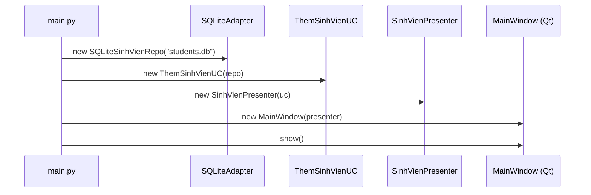
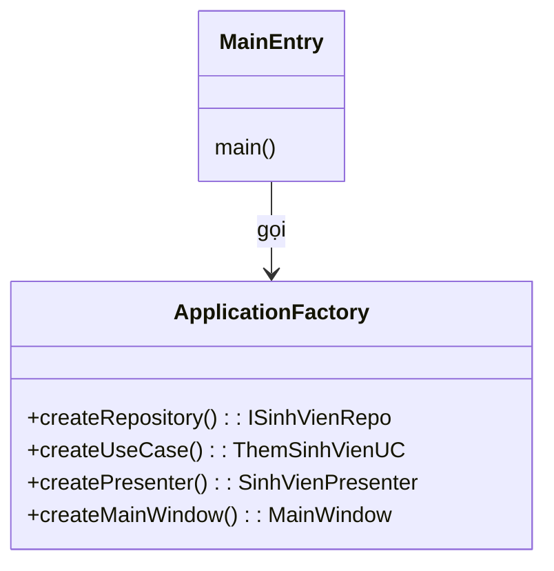
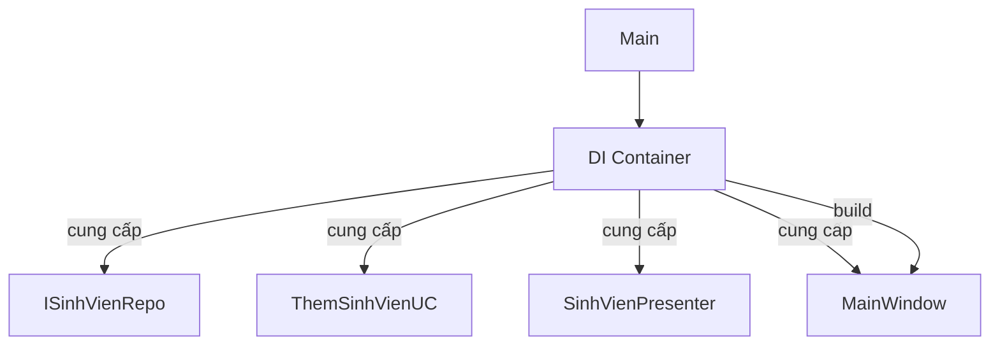
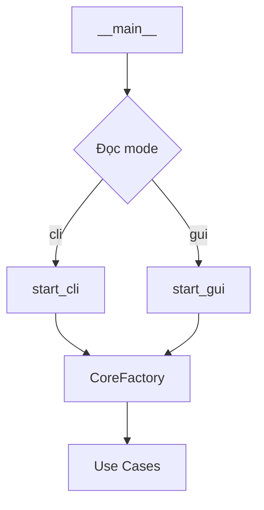

Chúng ta sẽ cùng khám phá chi tiết **Entry Point** – nơi “lắp ráp” toàn bộ ứng dụng Clean Architecture. Bạn sẽ thấy các pattern thiết kế Entry Point khác nhau, ưu nhược điểm, và cách triển khai bằng Python + Mermaid.

## Vai trò của Entry Point

- **Cấu hình và chọn adapter**: UI (Qt), CLI, Web.
- **Khai báo phụ thuộc (Dependency Injection)**: Tạo các implementation cụ thể của Port, inject vào Use Cases.
- **Khởi động vòng đời ứng dụng**: Hiển thị cửa sổ chính, chạy event loop.
- **Không chứa logic nghiệp vụ**.

Trong Clean Architecture, Entry Point nằm ở **vòng ngoài cùng** (Frameworks & Drivers), nhưng nó biết **tất cả các tầng** để kết nối chúng lại – vi phạm Dependency Rule một cách có kiểm soát (đây là “Composition Root” duy nhất).

---

## 1. Các Pattern Thiết Kế Entry Point

### 1.1 Poor Man’s Dependency Injection (Thủ công)

Dành cho ứng dụng nhỏ hoặc mới bắt đầu. Bạn “new” mọi thứ ngay trong `main` theo đúng thứ tự phụ thuộc (từ trong ra ngoài).

**Mermaid – Flow khởi tạo:**


**Python code:**
```python
# frameworks/main.py
import sys
from PySide6.QtWidgets import QApplication
from adapters.sqlite_repo import SQLiteSinhVienRepo
from usecases.them_sinh_vien import ThemSinhVienUseCase
from adapters.presenter import SinhVienPresenter
from frameworks.main_window import MainWindow

def main():
    app = QApplication(sys.argv)

    # Lắp ráp thủ công
    repo = SQLiteSinhVienRepo("data.db")
    uc = ThemSinhVienUseCase(repo)
    presenter = SinhVienPresenter(uc)
    window = MainWindow(presenter)

    window.show()
    sys.exit(app.exec())

if __name__ == "__main__":
    main()
```
- **Ưu điểm**: Đơn giản, dễ hiểu, không thêm dependency.
- **Nhược điểm**: Khi ứng dụng lớn, code `main` trở nên dài và lặp.

### 1.2 Composition Root + Factory

Sử dụng một lớp `ApplicationFactory` để đóng gói toàn bộ logic tạo đối tượng. Entry point chỉ gọi đến factory.

**Mermaid – Cấu trúc Factory:**


**Python code:**
```python
# composition_root.py
class ApplicationFactory:
    def __init__(self, db_path="data.db"):
        self.db_path = db_path

    def create_repo(self):
        return SQLiteSinhVienRepo(self.db_path)

    def create_use_case(self):
        return ThemSinhVienUseCase(self.create_repo())

    def create_presenter(self):
        return SinhVienPresenter(self.create_use_case())

    def create_main_window(self):
        return MainWindow(self.create_presenter())
```

Entry point:
```python
from composition_root import ApplicationFactory

def main():
    app = QApplication(sys.argv)
    factory = ApplicationFactory("students.db")
    window = factory.create_main_window()
    window.show()
    sys.exit(app.exec())
```
- **Ưu điểm**: Tách biệt logic tạo lập, dễ thay đổi cấu hình, tái sử dụng.
- **Nhược điểm**: Vẫn cần viết tay các bước tạo đối tượng, nhưng có thể mở rộng thành container.

### 1.3 Sử dụng Dependency Injection Container

Dành cho ứng dụng phức tạp hơn, dùng thư viện như `dependency_injector` để tự động phân giải phụ thuộc.

**Mermaid – Luồng Container:**


**Python code (dependency_injector):**
```python
from dependency_injector import containers, providers
from adapters.sqlite_repo import SQLiteSinhVienRepo
from usecases.them_sinh_vien import ThemSinhVienUseCase
from adapters.presenter import SinhVienPresenter
from frameworks.main_window import MainWindow

class AppContainer(containers.DeclarativeContainer):
    config = providers.Configuration()

    repo = providers.Singleton(
        SQLiteSinhVienRepo,
        db_path=config.db_path
    )
    use_case = providers.Factory(
        ThemSinhVienUseCase,
        repo=repo
    )
    presenter = providers.Factory(
        SinhVienPresenter,
        uc=use_case
    )
    main_window = providers.Factory(
        MainWindow,
        presenter=presenter
    )

# main.py
def main():
    container = AppContainer()
    container.config.db_path.from_env("DB_PATH", "default.db")

    app = QApplication(sys.argv)
    window = container.main_window()
    window.show()
    sys.exit(app.exec())
```
- **Ưu điểm**: Quản lý phụ thuộc tốt, tận dụng singleton/factory, dễ cấu hình qua environment.
- **Nhược điểm**: Thêm dependency bên ngoài, đường cong học tập.

### 1.4 Modular Entry Point (với Config & Environment)

Khi ứng dụng có nhiều “mode” (CLI, GUI, Web), bạn có thể tạo các hàm `start_cli`, `start_gui`, dùng chung khối tạo lõi. Thường kết hợp với Factory hoặc Container.

**Mermaid – Điều hướng theo mode:**


Python code minh họa:
```python
def start_gui(db_path):
    factory = ApplicationFactory(db_path)
    presenter = factory.create_presenter()
    window = MainWindow(presenter)
    window.show()
    app.exec()

def start_cli(db_path, args):
    repo = SQLiteSinhVienRepo(db_path)
    uc = ThemSinhVienUseCase(repo)
    # Xử lý args, gọi uc.execute(...)
    print("Thêm thành công")

if __name__ == "__main__":
    mode = sys.argv[1] if len(sys.argv) > 1 else "gui"
    if mode == "gui":
        start_gui("data.db")
    else:
        start_cli("data.db", sys.argv[2:])
```

---

## 2. Tổng kết: Chọn pattern nào?

| Pattern | Phù hợp khi | Độ phức tạp |
|---------|-------------|--------------|
| Poor Man’s DI | Ứng dụng nhỏ, ít phụ thuộc, nguyên mẫu | Thấp |
| Composition Root + Factory | Ứng dụng trung bình, muốn tách biệt cấu hình khởi tạo | Trung bình |
| DI Container | Dự án lớn, nhiều module, cần quản lý vòng đời đối tượng phức tạp | Cao |
| Modular Entry | Ứng dụng đa giao diện (CLI + GUI) hoặc cần chạy nhiều mode khác nhau | Trung bình |

---

## 3. Nguyên tắc vàng khi thiết kế Entry Point

- **Không để logic nghiệp vụ** trong Entry Point.
- **Luôn khởi tạo từ trong ra ngoài**: Entity → Use Case → Adapter → Framework.
- **Entry Point là nơi duy nhất biết mọi class cụ thể** – đây là `Composition Root`.
- **Dễ dàng thay đổi**: Chỉ cần sửa một file nếu muốn đổi database hoặc giao diện.

Với các bản vẽ Mermaid và code mẫu trên, bạn có thể áp dụng ngay vào dự án Qt quản lý sinh viên của mình. Nếu muốn xem thêm phần test Entry Point hoặc cách xử lý sự kiện khởi động, hãy nói nhé!