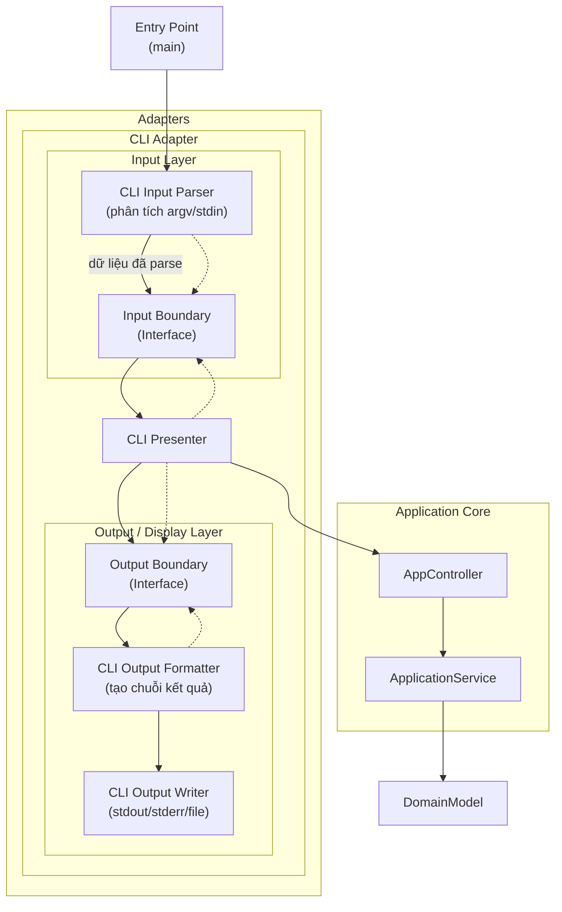

Chính xác! CLI Adapter hoàn toàn có thể áp dụng mô hình **MVP** (hoặc ít nhất là tách biệt Input/Output Model) giống như UI. Dù CLI không có giao diện đồ họa liên tục, nó vẫn cần **nhận input**, **gọi logic**, và **hiển thị output**. Ta có thể tách bạch thành các lớp:

- **View tối giản**: điểm vào nhận tham số dòng lệnh.
- **Input Parser**: chuẩn hóa input từ `sys.argv`, stdin hoặc file.
- **Presenter**: điều phối gọi AppController/Use Case.
- **Display Formatter + Output Writer**: định dạng kết quả và ghi ra stdout/stderr/file.

---

## 1. Sơ đồ CLI Adapter theo MVP trong Clean Architecture



---

## 2. Giải thích các thành phần trong CLI Adapter
 
| Thành phần | Vai trò | Ví dụ |
|-----------|--------|-------|
| **CLI Input Parser** | Nhận `sys.argv`, stdin, file config. Kiểm tra cú pháp, chuyển thành dữ liệu có cấu trúc. | Dùng `argparse`, `click` để parse lệnh `add-student --mssv SV001 --name "A"`. |
| **Input Boundary** (Interface) | Định nghĩa các phương thức gọi từ Input Parser sang Presenter. | `onAddStudent(mssv, name, class)`, `onListStudents()`. |
| **CLI Presenter** | Nhận input đã chuẩn hóa, gọi `AppController`, nhận kết quả, yêu cầu Output hiển thị. | Phụ thuộc vào Input/Output Boundary, không biết gì về `print` hay file. |
| **Output Boundary** (Interface) | Định nghĩa cách hiển thị kết quả. | `displayStudentList(list)`, `displayError(msg)`. |
| **CLI Output Formatter** | Chuyển kết quả (DTO) thành chuỗi hoặc cấu trúc có thể ghi ra. | Format danh sách sinh viên thành bảng plain text, JSON, CSV. |
| **CLI Output Writer** | Ghi output đã format ra stdout, stderr hoặc file. | `print(...)`, `sys.stdout.write(...)`, `open('out.txt','w')`. |

Mô hình này giống MVP ở chỗ:
- **Model**: là `AppController` + Use Cases trả về dữ liệu.
- **View (thụ động)**: là Input Parser + Output Writer (không có logic, chỉ nhận/gửi dữ liệu).
- **Presenter**: là `CLI Presenter`, biết cách điều phối.

---

## 3. Ví dụ code Python cho CLI Adapter

```python
# adapters/cli/input_parser.py
import argparse
from dataclasses import dataclass
from typing import List

@dataclass
class AddStudentCommand:
    mssv: str
    ho_ten: str
    lop: str

class CLIInputParser:
    def parse(self, args: List[str]):
        parser = argparse.ArgumentParser()
        sub = parser.add_subparsers(dest='command')
        add_parser = sub.add_parser('add')
        add_parser.add_argument('--mssv', required=True)
        add_parser.add_argument('--name', required=True)
        add_parser.add_argument('--class', required=True)
        
        list_parser = sub.add_parser('list')
        
        parsed = parser.parse_args(args)
        if parsed.command == 'add':
            return AddStudentCommand(parsed.mssv, parsed.name, parsed.__dict__['class'])
        elif parsed.command == 'list':
            return 'LIST'
        else:
            return None
```

```python
# adapters/cli/ports.py
from abc import ABC, abstractmethod
from typing import List
from adapters.cli.input_parser import AddStudentCommand

class IInputBoundary(ABC):
    @abstractmethod
    def on_add_student(self, cmd: AddStudentCommand): ...
    @abstractmethod
    def on_list_students(self): ...

class IOutputBoundary(ABC):
    @abstractmethod
    def show_student_list(self, students): ...
    @abstractmethod
    def show_error(self, message: str): ...
    @abstractmethod
    def show_success(self, message: str): ...
```

```python
# adapters/cli/presenter.py
from adapters.cli.ports import IInputBoundary, IOutputBoundary
from adapters.app_controller import AppController

class CLIPresenter(IInputBoundary):
    def __init__(self, controller: AppController, output: IOutputBoundary):
        self._controller = controller
        self._output = output

    def on_add_student(self, cmd):
        result = self._controller.them_sinh_vien(cmd.mssv, cmd.ho_ten, cmd.lop)
        if result.success:
            self._output.show_success("Thêm sinh viên thành công")
        else:
            self._output.show_error(result.error)

    def on_list_students(self):
        result = self._controller.danh_sach_sinh_vien()
        if result.success:
            self._output.show_student_list(result.data)
        else:
            self._output.show_error(result.error)
```

```python
# adapters/cli/output.py
from adapters.cli.ports import IOutputBoundary

class CLIOutputFormatter(IOutputBoundary):
    def show_student_list(self, students):
        lines = ["Danh sách sinh viên:"]
        for sv in students:
            lines.append(f"  - {sv.mssv} | {sv.ho_ten} | {sv.lop}")
        print("\n".join(lines))

    def show_error(self, msg):
        print(f"Lỗi: {msg}", file=sys.stderr)

    def show_success(self, msg):
        print(msg)
```

```python
# frameworks/cli_main.py
import sys
from composition_root import create_app_controller
from adapters.cli.input_parser import CLIInputParser
from adapters.cli.presenter import CLIPresenter
from adapters.cli.output import CLIOutputFormatter

def main():
    controller = create_app_controller("students.db")
    output = CLIOutputFormatter()
    presenter = CLIPresenter(controller, output)

    parser = CLIInputParser()
    command = parser.parse(sys.argv[1:])

    if isinstance(command, AddStudentCommand):
        presenter.on_add_student(command)
    elif command == 'LIST':
        presenter.on_list_students()
    else:
        output.show_error("Lệnh không hợp lệ")

if __name__ == "__main__":
    main()
```

---

## 4. So sánh với UI Adapter (Qt)

| Khía cạnh | UI Adapter (Qt) | CLI Adapter |
|-----------|-----------------|-------------|
| **Input Parser** | Đọc từ QLineEdit, signal | Đọc từ argv, stdin |
| **Input Boundary** | Interface `onThemSinhVien(mssv, hoTen, lop)` | Giống hệt, dùng chung interface nếu muốn |
| **Presenter** | Cùng một Presenter hoặc riêng | Cùng một Presenter hoặc riêng |
| **Output Boundary** | Interface `showStudentList` | Interface tương tự, nhưng có thể thêm `showProgress` nếu cần |
| **Formatter** | Tạo ViewModel để bind | Tạo chuỗi văn bản, JSON |
| **Writer** | View tự cập nhật qua binding | `print`, ghi file |

Điểm mạnh: **Core (Use Cases) không hề thay đổi** dù bạn chạy CLI hay GUI. Cả hai đều dùng chung `AppController` và các interface.

---

## 5. Kết luận

CLI Adapter hoàn toàn có thể có Input/Output Model tương tự MVP. Bạn có thể tận dụng cùng một Presenter (nếu Input/Output Boundary giống nhau) hoặc viết riêng. Mô hình này giúp:
- Tách biệt hoàn toàn logic CLI khỏi business logic.
- Dễ test: mock Input/Output Boundary để kiểm tra Presenter CLI.
- Mở rộng: thêm output dạng JSON, CSV chỉ cần thêm Formatter mới.

Đây là cách làm rất sạch khi xây dựng ứng dụng **headless-first** – bạn có thể phát triển và test toàn bộ nghiệp vụ qua CLI trước, sau đó mới đắp GUI lên.