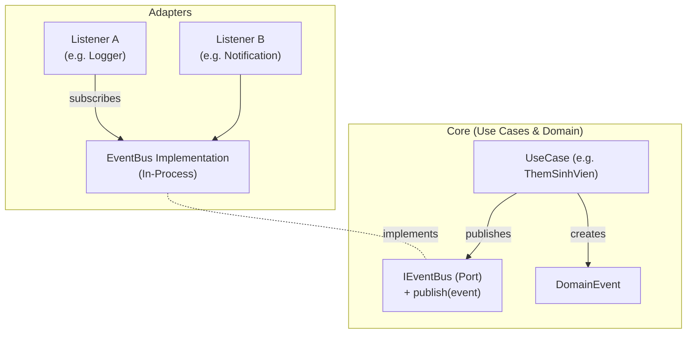
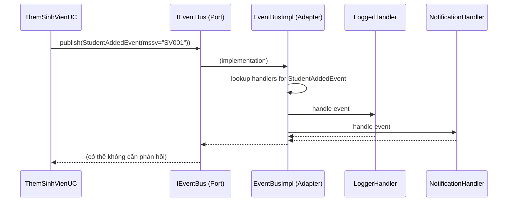
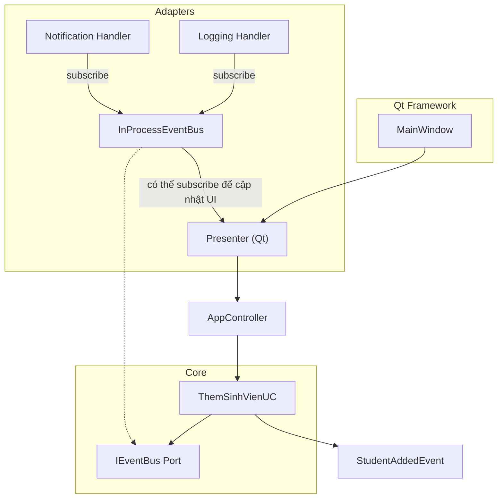

Chúng ta sẽ khám phá **Event Bus / Message Bus**, một thành phần quan trọng trong kiến trúc phần mềm, đặc biệt khi kết hợp với Clean Architecture để đạt được sự tách biệt và linh hoạt tối đa.

---

## 1. Event Bus là gì và tại sao cần?

**Event Bus** là một cơ chế trung gian cho phép các thành phần trong hệ thống giao tiếp với nhau thông qua **sự kiện** (event) mà không cần biết về nhau. Nó giống như một "bảng thông báo": người gửi phát sự kiện lên bus, người nhận đăng ký lắng nghe loại sự kiện đó.

**Lợi ích:**
- **Giảm kết dính (decoupling)**: Module A không cần import Module B.
- **Mở rộng dễ dàng**: Thêm listener mới mà không sửa code hiện có.
- **Phù hợp kiến trúc hướng sự kiện**: Dễ dàng xử lý các tác vụ phụ (logging, gửi email, cập nhật cache) mà không làm rối luồng chính.

Trong Clean Architecture, Event Bus giúp **tách biệt các Use Case** và các thành phần bên ngoài (UI, Infra) một cách sạch sẽ, tuân thủ Dependency Rule: Core chỉ định nghĩa interface (port), Adapter triển khai cụ thể.

---

## 2. Các kiểu Event Bus

### a) In-Process (cùng tiến trình)
- Đơn giản nhất, dùng cho ứng dụng đơn luồng hoặc đa luồng.
- Triển khai bằng danh sách các listener/handler.
- Ví dụ: Tự viết class `EventBus`, dùng `Qt Signal/Slot` (trong cùng QApplication), thư viện `pypubsub`.

### b) Distributed (liên tiến trình / mạng)
- Dùng cho hệ thống microservices, nhiều process.
- Sử dụng message broker: RabbitMQ, Kafka, Redis Pub/Sub.
- Sự kiện thường được serialize (JSON, Protobuf) gửi qua mạng.

Trong phạm vi ứng dụng Qt quản lý sinh viên, ta dùng **In-Process Event Bus** là đủ. Nhưng thiết kế vẫn nên cho phép thay đổi sau này.

---

## 3. Thiết kế Event Bus trong Clean Architecture

Theo Dependency Rule:
- Core (Use Cases) định nghĩa **interface `IEventBus`** (Port) – nơi publish các sự kiện miền (Domain Events) hoặc sự kiện ứng dụng.
- Adapter triển khai `IEventBus` bằng công nghệ cụ thể (Qt signal, pubsub lib, ...).
- Các Use Case chỉ phụ thuộc vào `IEventBus`, không biết ai lắng nghe.

Ngoài ra, ta cũng có thể có **Event Bus riêng cho UI** (ví dụ: bus giữa các widget) nhưng nên tách biệt với bus miền để tránh lẫn lộn.

### Mermaid: Vị trí Event Bus trong Clean Architecture



**Quy tắc:** Core chỉ thấy `IEventBus`. Adapter triển khai nó và đăng ký listeners. Như vậy, khi cần thay đổi cơ chế bus, chỉ cần viết adapter mới.

---

## 4. Thiết kế chi tiết In-Process Event Bus

### Các thành phần cần có:
1. **Event**: Class đơn giản chứa dữ liệu, có thể phân biệt bằng `type` hoặc dùng class type.
2. **IEventBus (Port)**: Interface với method `publish(event: object)`.
3. **EventBus Implementation**:
   - Danh sách các handler đăng ký theo loại sự kiện.
   - `subscribe(event_type, handler)` hoặc `subscribe(handler)` với handler có thể nhận diện qua type hint.
   - Khi `publish`, duyệt qua các handler phù hợp và gọi chúng (có thể đồng bộ hoặc bất đồng bộ bằng thread pool).

4. **Handler**: Hàm hoặc object gọi đến Use Case phụ (logging, notification) hoặc cập nhật UI (qua DisplayPort).

### Mermaid sequence: Luồng publish/subscribe



---

## 5. Triển khai trong Python (không dùng Qt)

### a) Port trong Core
```python
# core/ports/event_bus.py
from abc import ABC, abstractmethod

class IEventBus(ABC):
    @abstractmethod
    def publish(self, event: object) -> None:
        pass

    @abstractmethod
    def subscribe(self, event_type: type, handler: callable) -> None:
        pass
```

### b) Domain Event
```python
# core/domain/events.py
class StudentAddedEvent:
    def __init__(self, mssv: str, ho_ten: str, lop: str):
        self.mssv = mssv
        self.ho_ten = ho_ten
        self.lop = lop
```

### c) Use Case sử dụng IEventBus
```python
# core/usecases/them_sinh_vien.py
from core.ports.event_bus import IEventBus
from core.ports.repository import ISinhVienRepository
from core.domain.events import StudentAddedEvent

class ThemSinhVienUC:
    def __init__(self, repo: ISinhVienRepository, event_bus: IEventBus):
        self.repo = repo
        self.event_bus = event_bus

    def execute(self, mssv, ho_ten, lop):
        # ... validation, lưu repo ...
        sv = ... 
        # Phát sự kiện
        self.event_bus.publish(StudentAddedEvent(sv.mssv, sv.ho_ten, sv.lop))
        return sv
```

### d) Triển khai In-Process EventBus trong Adapter
```python
# adapters/event_bus_impl.py
from core.ports.event_bus import IEventBus
from collections import defaultdict

class InProcessEventBus(IEventBus):
    def __init__(self):
        self._handlers = defaultdict(list)

    def subscribe(self, event_type: type, handler):
        self._handlers[event_type].append(handler)

    def publish(self, event: object):
        event_type = type(event)
        for handler in self._handlers.get(event_type, []):
            handler(event)
```

### e) Đăng ký listeners trong Composition Root
```python
# composition_root.py
def create_app():
    bus = InProcessEventBus()
    repo = SQLiteRepo(...)
    
    # Đăng ký listeners
    bus.subscribe(StudentAddedEvent, lambda e: print(f"LOG: added {e.mssv}"))
    bus.subscribe(StudentAddedEvent, lambda e: send_email_notification(e))
    
    them_uc = ThemSinhVienUC(repo, bus)
    controller = AppController(them_uc)
    return controller
```

---

## 6. Dùng Event Bus với Qt Signal/Slot (vẫn giữ sạch Core)

Nếu muốn tận dụng khả năng của Qt (an toàn luồng, auto disconnect), ta có thể viết adapter sử dụng `QObject` và signal. Core vẫn chỉ phụ thuộc vào `IEventBus`.

```python
# adapters/qt_event_bus.py
from PySide6.QtCore import QObject, Signal
from core.ports.event_bus import IEventBus

class QtEventBus(QObject, IEventBus):
    # Signal cho từng loại event (có thể dùng một signal với object)
    student_added = Signal(str, str, str)  # mssv, ho_ten, lop

    def __init__(self):
        super().__init__()

    def publish(self, event):
        if isinstance(event, StudentAddedEvent):
            self.student_added.emit(event.mssv, event.ho_ten, event.lop)
        # ... các loại khác

    def subscribe(self, event_type, handler):
        # Qt không hỗ trợ subscribe động kiểu này một cách trực tiếp,
        # ta có thể kết nối signal vào handler thông qua một wrapper,
        # hoặc dùng event filter. Tốt nhất là kết nối thủ công khi biết loại event.
        pass
```

Trong thực tế, khi dùng Qt, ta thường kết nối trực tiếp signal của `QtEventBus` vào slot của listener trong Composition Root, thay vì dùng `subscribe` tổng quát. Điều này vẫn OK vì code kết nối nằm ở ngoài cùng.

---

## 7. Tích hợp Event Bus vào AppController hoặc Presenter

Có hai cách dùng:

- **Use Case trực tiếp publish** (tốt nhất cho domain event) – như ví dụ trên.
- **AppController hoặc Presenter publish** (cho sự kiện liên quan đến UI, ví dụ: "người dùng yêu cầu refresh").

Trong sơ đồ tổng thể của bạn, `TaskRegistry`, `TaskExecutor` có thể cũng dùng Event Bus để thông báo hoàn thành task.

---

## 8. Ưu điểm, nhược điểm và lưu ý

| Ưu điểm | Nhược điểm |
|----------|-------------|
| Giảm coupling cực tốt | Khó debug luồng sự kiện (cần log rõ ràng) |
| Dễ thêm tính năng mới (thêm listener) | Có thể gây khó hiểu nếu lạm dụng |
| Hỗ trợ async nếu cần | Thứ tự xử lý có thể không đảm bảo nếu dùng thread |

**Lưu ý khi dùng Event Bus:**
- Đừng lạm dụng cho mọi giao tiếp; với các phụ thuộc trực tiếp, hãy gọi thẳng.
- Đảm bảo handler không ném ngoại lệ làm hỏng bus (bọc try-catch).
- Sử dụng event rõ ràng, nên là immutable.

---

## 9. Sơ đồ tổng kết (Mermaid) – Tích hợp vào app quản lý sinh viên



Trong sơ đồ trên, `UI_Presenter` cũng có thể subscribe vào `StudentAddedEvent` để tự động cập nhật danh sách mà không cần AppController gọi lại – một cách làm rất hiệu quả.

---

## 10. Bắt đầu từ đâu?

1. **Xác định các sự kiện miền** trong hệ thống của bạn (StudentAdded, GradeUpdated...).
2. **Định nghĩa `IEventBus`** trong `core/ports/event_bus.py`.
3. **Viết InProcessEventBus** trong `adapters/`.
4. **Inject `IEventBus` vào các Use Case** cần publish.
5. **Đăng ký các handler** ở `composition_root.py`.
6. **Test**: mock `IEventBus` để kiểm tra Use Case có publish đúng không.

Giờ hãy thử tích hợp Event Bus vào app quản lý sinh viên. Nếu cần code chi tiết hơn (ví dụ: tích hợp với Qt thread, async publish, hoặc dùng thư viện `pypubsub`), mình sẵn sàng hướng dẫn tiếp!