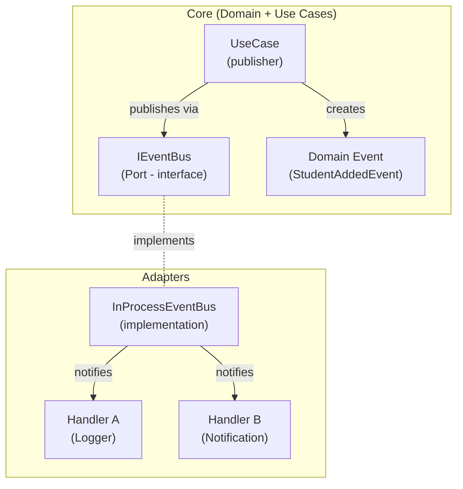
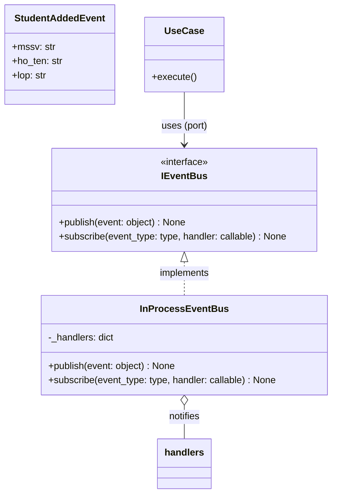
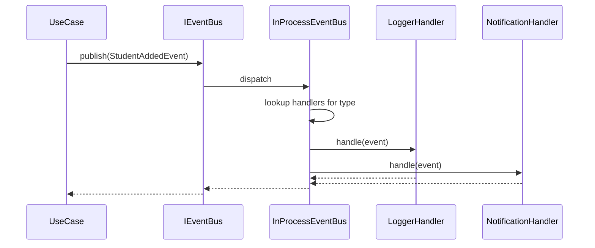
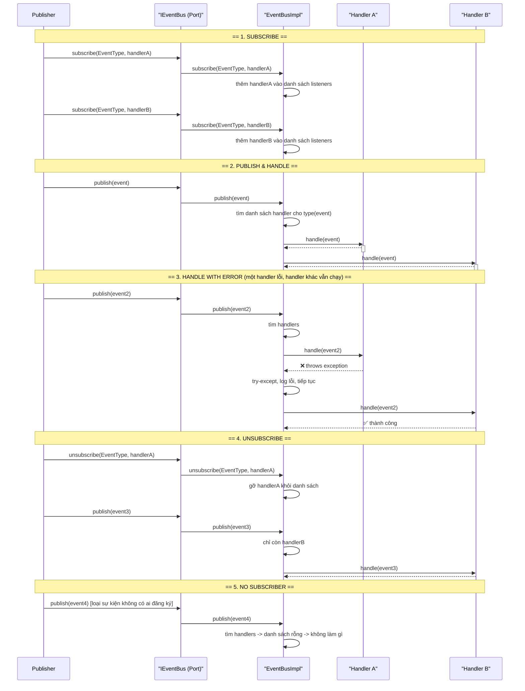

Chúng ta sẽ cùng thiết kế và triển khai một **In-Process Event Bus** chuẩn Clean Architecture, kèm theo các biểu đồ Mermaid rõ ràng, đúng cú pháp. Bạn sẽ hiểu được cách xây dựng bus, cách tích hợp nó để giữ cho Core sạch sẽ, và cách kiểm thử dễ dàng.

---

## 1. In-Process Event Bus là gì?

In-Process Event Bus là một cơ chế giao tiếp **trong cùng một tiến trình**, cho phép các thành phần gửi và nhận sự kiện mà không cần biết đến nhau. Nó giống như một trạm trung chuyển:

- **Publisher** (người gửi) phát một sự kiện lên bus.
- **Subscriber** (người nghe) đăng ký lắng nghe một loại sự kiện cụ thể.
- **Bus** chịu trách nhiệm chuyển sự kiện đến tất cả subscriber đã đăng ký.

Trong Clean Architecture, Event Bus giúp bạn **đảo ngược phụ thuộc**: Core chỉ định nghĩa interface `IEventBus`, còn implementation và handler nằm ở tầng Adapter. Nhờ đó, khi thêm tính năng mới (ví dụ: logging, gửi thông báo), bạn không phải sửa code nghiệp vụ.

---

## 2. Tổng quan kiến trúc (Mermaid)



**Dependency Rule:** Core không biết `BusImpl`, chỉ biết `IEventBus`. Các mũi tên phụ thuộc (nét đứt) đều hướng vào trong.

---

## 3. Thiết kế chi tiết các thành phần

### 3.1. Sơ đồ lớp (Class Diagram)



### 3.2. Luồng tuần tự (Sequence Diagram)



Bạn thấy rằng Use Case không hề biết handler nào đang nghe. Chỉ cần gọi `publish()` là mọi thứ tự động.

---

## 4. Triển khai bằng Python (từng bước)

### 4.1. Domain Event (Core)

```python
# core/domain/events.py
from dataclasses import dataclass

@dataclass(frozen=True)
class StudentAddedEvent:
    mssv: str
    ho_ten: str
    lop: str
```

### 4.2. Port Interface (Core)

```python
# core/ports/event_bus.py
from abc import ABC, abstractmethod
from typing import Type, Callable

class IEventBus(ABC):
    @abstractmethod
    def publish(self, event: object) -> None:
        """Gửi sự kiện lên bus"""
        pass

    @abstractmethod
    def subscribe(self, event_type: Type, handler: Callable[[object], None]) -> None:
        """Đăng ký một handler cho loại sự kiện cụ thể"""
        pass
```

### 4.3. Use Case sử dụng IEventBus (Core)

```python
# core/usecases/them_sinh_vien.py
from core.ports.event_bus import IEventBus
from core.ports.repository import ISinhVienRepository
from core.domain.events import StudentAddedEvent
from core.entities import SinhVien

class ThemSinhVienUC:
    def __init__(self, repo: ISinhVienRepository, event_bus: IEventBus):
        self._repo = repo
        self._event_bus = event_bus

    def execute(self, mssv: str, ho_ten: str, lop: str) -> SinhVien:
        # Logic nghiệp vụ...
        sv = SinhVien(mssv, ho_ten, lop)
        self._repo.save(sv)

        # Phát sự kiện
        self._event_bus.publish(StudentAddedEvent(mssv, ho_ten, lop))
        return sv
```

### 4.4. In-Process EventBus Implementation (Adapter)

```python
# adapters/event_bus_impl.py
from collections import defaultdict
from typing import Type, Callable
from core.ports.event_bus import IEventBus

class InProcessEventBus(IEventBus):
    def __init__(self):
        # key: type của event, value: danh sách các hàm xử lý
        self._handlers: dict[Type, list[Callable]] = defaultdict(list)

    def subscribe(self, event_type: Type, handler: Callable[[object], None]) -> None:
        self._handlers[event_type].append(handler)

    def publish(self, event: object) -> None:
        event_type = type(event)
        for handler in self._handlers.get(event_type, []):
            try:
                handler(event)
            except Exception as e:
                # Không để một handler lỗi làm sập cả bus
                print(f"[EventBus] Error in handler {handler}: {e}")
```

### 4.5. Handler mẫu (Adapter)

```python
# adapters/handlers/logging_handler.py
from core.domain.events import StudentAddedEvent

def log_student_added(event: StudentAddedEvent) -> None:
    print(f"[LOG] Sinh viên mới: {event.mssv} - {event.ho_ten} ({event.lop})")
```

```python
# adapters/handlers/notification_handler.py
def send_notification(event: StudentAddedEvent) -> None:
    # Ở đây có thể gọi service gửi email, SMS...
    print(f"[NOTIFICATION] Gửi thông báo đến giáo viên chủ nhiệm lớp {event.lop}")
```

### 4.6. Lắp ráp tại Composition Root

```python
# composition_root.py
from adapters.event_bus_impl import InProcessEventBus
from core.usecases.them_sinh_vien import ThemSinhVienUC
from core.usecases.xoa_sinh_vien import XoaSinhVienUC
from adapters.repository_impl import SQLiteSinhVienRepo
from adapters.handlers.logging_handler import log_student_added
from adapters.handlers.notification_handler import send_notification
from core.domain.events import StudentAddedEvent

def build_app_controller():
    # 1. Tạo bus
    bus = InProcessEventBus()

    # 2. Đăng ký handlers
    bus.subscribe(StudentAddedEvent, log_student_added)
    bus.subscribe(StudentAddedEvent, send_notification)

    # 3. Tạo repository
    repo = SQLiteSinhVienRepo("students.db")

    # 4. Tạo Use Cases (inject repo và bus)
    them_uc = ThemSinhVienUC(repo, bus)
    xoa_uc = XoaSinhVienUC(repo, bus)  # giả sử có

    # 5. Tạo AppController và trả về
    return AppController(them_uc, xoa_uc), bus
```

**Entry point (main.py)** chỉ cần gọi `build_app_controller()` và truyền controller vào Adapter UI hoặc CLI.

---

## 5. Tích hợp với giao diện (Qt hoặc CLI)

Bạn có thể giữ nguyên `InProcessEventBus` để dùng cho cả UI. Ví dụ:

- **Qt Adapter:** Handler có thể là slot của QObject, cập nhật UI khi nhận event.  
  ```python
  class StudentTableUpdater(QObject):
      def handle_student_added(self, event: StudentAddedEvent):
          # Thêm dòng mới vào QTableView
          self.table_model.add_student(event)
  ```
  Rồi đăng ký: `bus.subscribe(StudentAddedEvent, updater.handle_student_added)`. Hoặc bạn có thể viết một `QtEventBusAdapter` kế thừa cả `QObject` và `IEventBus`, sử dụng Qt signals/slots, nhưng điều này không bắt buộc. Cách dùng `InProcessEventBus` thuần là đơn giản và đủ mạnh.

- **CLI Adapter:** Handler có thể in ra màn hình, ghi file.

---

## 6. Testing Event Bus

### Test Use Case phát sự kiện đúng không

```python
from unittest.mock import Mock, call
from core.usecases.them_sinh_vien import ThemSinhVienUC
from core.domain.events import StudentAddedEvent

def test_publish_event_when_student_added():
    mock_repo = Mock()
    mock_bus = Mock(spec=IEventBus)
    uc = ThemSinhVienUC(mock_repo, mock_bus)
    
    uc.execute("SV001", "An", "CNTT")
    
    # Kiểm tra publish được gọi một lần với đúng sự kiện
    mock_bus.publish.assert_called_once()
    event = mock_bus.publish.call_args[0][0]
    assert isinstance(event, StudentAddedEvent)
    assert event.mssv == "SV001" and event.lop == "CNTT"
```

### Test handler hoạt động đúng

```python
from adapters.handlers.logging_handler import log_student_added

def test_log_handler(capsys):
    event = StudentAddedEvent("SV002", "Bình", "VT")
    log_student_added(event)
    captured = capsys.readouterr()
    assert "SV002 - Bình" in captured.out
```

### Test bus với handler thật

```python
def test_bus_notifies_all_handlers():
    bus = InProcessEventBus()
    records = []

    def fake_handler(event):
        records.append(event)

    bus.subscribe(StudentAddedEvent, fake_handler)
    event = StudentAddedEvent("SV003", "Cường", "KT")
    bus.publish(event)

    assert len(records) == 1
    assert records[0] == event
```

Bạn thấy rằng nhờ có interface `IEventBus`, việc test Use Case hoàn toàn tách biệt với implementation của bus.

---

## 7. Các điểm cần lưu ý khi thiết kế In-Process Event Bus

- **Đừng lạm dụng** – chỉ dùng khi cần decoupling thực sự (ví dụ: logging, UI cập nhật, tác vụ phụ). Nếu một Use Case cần kết quả từ Use Case khác, hãy gọi trực tiếp qua interface.
- **Domain Event phải immutable** – dùng `dataclass(frozen=True)` hoặc chỉ đọc.
- **Handler không nên ném ngoại lệ** – bus nên bọc try-except để bảo vệ các handler khác.
- **Đăng ký handler ở một nơi duy nhất** (Composition Root) để dễ bảo trì.
- **Bus nên đồng bộ mặc định** – nếu cần bất đồng bộ, hãy tạo một wrapper riêng (AsyncEventBus) triển khai cùng interface, hoặc dùng thread pool trong adapter. Đừng nhúng async vào Core.

---

## 8. Mở rộng (bất đồng bộ, threading)

Nếu sau này cần xử lý event trong thread riêng, bạn chỉ cần viết thêm một adapter:

```python
from concurrent.futures import ThreadPoolExecutor

class AsyncEventBus(IEventBus):
    def __init__(self, delegate: IEventBus, max_workers=4):
        self._delegate = delegate
        self._executor = ThreadPoolExecutor(max_workers=max_workers)

    def publish(self, event):
        self._executor.submit(self._delegate.publish, event)

    def subscribe(self, event_type, handler):
        self._delegate.subscribe(event_type, handler)
```

Composition Root có thể quyết định dùng bus đồng bộ hay bất đồng bộ. Core không hề thay đổi.

---

## 9. Kết luận

Bạn đã có một Event Bus trong tiến trình, được thiết kế đúng Clean Architecture:
- **Core** sạch chỉ thông qua `IEventBus`.
- **Adapter** triển khai cụ thể.
- **Handler** dễ thêm, dễ test.
- **Không phụ thuộc framework** nào.

Hãy bắt đầu với `InProcessEventBus` đơn giản, thử tích hợp vào dự án quản lý sinh viên của bạn. Nếu cần mình hướng dẫn sâu hơn về phần bất đồng bộ, Qt thread an toàn, hoặc cách áp dụng Event Bus vào `TaskExecutor`, bạn cứ hỏi nhé!


- **Subscribe** – Đăng ký handler cho một loại sự kiện.
- **Publish** – Phát sự kiện.
- **Handle** – Xử lý sự kiện thành công.
- **Handle with error** – Một handler ném lỗi không ảnh hưởng đến handler khác.
- **Unsubscribe** – Hủy đăng ký handler.
- **No subscriber** – Publish sự kiện nhưng không có ai nghe.
- **Multiple subscribers** – Nhiều handler cùng lắng nghe một sự kiện.
- **Wildcard / Inheritance** (nâng cao) – Đăng ký theo lớp cha.

Dưới đây là Sequence Diagram tổng quát (dùng Mermaid) kết hợp tất cả các tình huống đó, sau đó mình sẽ giải thích từng phần.

---

## 1. Sequence Diagram tổng hợp



---

## 2. Giải thích từng Use Case

### 2.1 Subscribe
- Client (có thể là UseCase, hoặc Composition Root trong lúc khởi tạo) gọi `subscribe(EventType, handler)`.
- Bus lưu handler vào một cấu trúc dữ liệu (thường là `dict[type] -> list[callable]`).
- Đăng ký có thể xảy ra bất kỳ lúc nào trong vòng đời ứng dụng.

### 2.2 Publish & Handle thông thường
- Publisher (thường là UseCase hoặc Presenter) gọi `publish(event)`.
- Bus tra cứu loại sự kiện, tìm danh sách handler.
- Gọi lần lượt từng handler một cách đồng bộ.
- Mỗi handler có thể là một hàm đơn giản hoặc một object có method `handle(event)`.

### 2.3 Handle với lỗi – Error Isolation
- Nếu một handler ném ra ngoại lệ, bus phải **bắt và ghi log**, sau đó tiếp tục gọi các handler còn lại.
- Điều này ngăn một handler lỗi làm hỏng toàn bộ hệ thống hoặc bỏ qua các handler khác.
- Trên diagram ta thấy Sub1 ném lỗi, EBImpl bắt lại, vẫn gọi Sub2 thành công.

### 2.4 Unsubscribe
- Client gọi `unsubscribe(EventType, handler)` để thôi không lắng nghe.
- Bus gỡ handler khỏi danh sách.
- Khi publish sau đó, handler đã bị gỡ sẽ không được gọi nữa (chỉ còn Handler B).

### 2.5 Không có Subscriber (No subscriber)
- Publisher gửi một sự kiện nhưng chưa có ai đăng ký lắng nghe.
- Bus tìm danh sách rỗng, đơn giản là không làm gì, không lỗi.
- Đây là hành vi mặc định hợp lý, tránh phải kiểm tra null.

### 2.6 Multiple Subscribers
- Đã thể hiện ngay trong phần Handle: có nhiều handler cho cùng một loại sự kiện.
- Bus gọi tất cả theo thứ tự đăng ký (có thể không đảm bảo thứ tự nếu không cần).

### 2.7 (Nâng cao) Wildcard / Inheritance
- Nếu bạn muốn đăng ký handler cho lớp cha, bus phải kiểm tra `isinstance(event, registered_type)` thay vì so sánh chính xác type. Điều này cho phép một handler lắng nghe mọi sự kiện (kiểu `object`) hoặc theo hệ thống phân cấp Domain Event. Sequence Diagram cho trường hợp này sẽ có thêm bước kiểm tra `isinstance`, nhưng không khác biệt lớn.

---

## 3. Triển khai code Python hỗ trợ Unsubscribe

Vì phần code trước mình đã có `subscribe` và `publish`, giờ ta thêm `unsubscribe`:

```python
# core/ports/event_bus.py
class IEventBus(ABC):
    @abstractmethod
    def publish(self, event: object) -> None: ...
    @abstractmethod
    def subscribe(self, event_type: Type, handler: Callable[[object], None]) -> None: ...
    @abstractmethod
    def unsubscribe(self, event_type: Type, handler: Callable[[object], None]) -> None: ...
```

```python
# adapters/event_bus_impl.py
class InProcessEventBus(IEventBus):
    def __init__(self):
        self._handlers: dict[Type, list[Callable]] = defaultdict(list)

    def subscribe(self, event_type, handler):
        self._handlers[event_type].append(handler)

    def unsubscribe(self, event_type, handler):
        if event_type in self._handlers:
            try:
                self._handlers[event_type].remove(handler)
            except ValueError:
                pass  # handler không tồn tại cũng không sao

    def publish(self, event):
        for handler in self._handlers.get(type(event), []):
            try:
                handler(event)
            except Exception as e:
                # Log lỗi, đảm bảo không ảnh hưởng handler khác
                print(f"[EventBus] Handler error: {handler.__name__} - {e}")
```

---

## 4. Testing Unsubscribe & Error Isolation

```python
def test_unsubscribe():
    bus = InProcessEventBus()
    calls_a = []
    calls_b = []

    def handler_a(e): calls_a.append(e)
    def handler_b(e): calls_b.append(e)

    bus.subscribe(StudentAddedEvent, handler_a)
    bus.subscribe(StudentAddedEvent, handler_b)
    bus.unsubscribe(StudentAddedEvent, handler_a)

    evt = StudentAddedEvent("SV001", "A", "CNTT")
    bus.publish(evt)
    assert len(calls_a) == 0   # đã hủy đăng ký
    assert calls_b == [evt]

def test_error_isolation():
    bus = InProcessEventBus()
    good = []
    def bad_handler(e): raise RuntimeError("oops")
    def good_handler(e): good.append(e)

    bus.subscribe(StudentAddedEvent, bad_handler)
    bus.subscribe(StudentAddedEvent, good_handler)
    bus.publish(StudentAddedEvent("SV002", "B", "VT"))
    assert len(good) == 1  # vẫn nhận sự kiện dù bad_handler lỗi
```

---

## 5. Những Use Case bổ sung khác (Optional)

- **Reset / Clear all subscribers** – Dùng khi muốn reset toàn bộ bus (ví dụ khi thoát ứng dụng).
- **Publish với priority** – Một số handler cần chạy trước, cần sắp xếp thứ tự.
- **Publish bất đồng bộ** – Như đã nói, có thể tạo `AsyncEventBus` wrapper dùng ThreadPoolExecutor, sequence diagram sẽ có thêm bước gửi vào thread.
- **Middleware / Interceptor** – Cho phép chặn sự kiện trước khi đến handler (validation, logging tập trung).
- **Dead Event (sự kiện không có handler)** – Có thể publish một sự kiện đặc biệt `DeadEvent` nếu không ai xử lý, giúp phát hiện lỗi cấu hình.

Nếu bạn muốn thêm bất kỳ use case nào vào diagram, mình có thể vẽ thêm hoặc điều chỉnh.

---

## 6. Tổng kết

Bây giờ Sequence Diagram của chúng ta đã bao gồm đầy đủ các tương tác chính của In-Process Event Bus: Subscribe, Publish, Handle (với xử lý lỗi), Unsubscribe, No Subscriber, Multiple Subscribers. Nhờ đó bạn có thể triển khai và kiểm thử một Event Bus hoàn chỉnh, vững chắc cho ứng dụng Clean Architecture.

Bạn muốn mình bổ sung thêm Use Case nào nữa không?