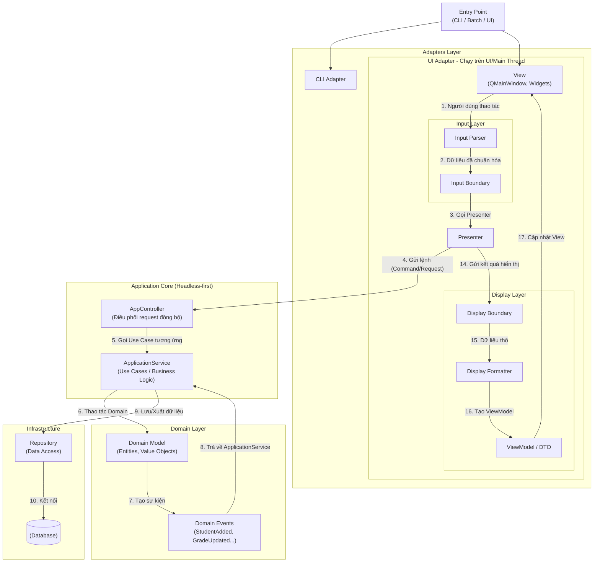
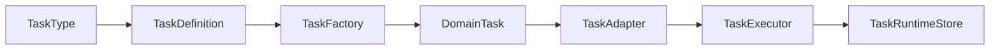
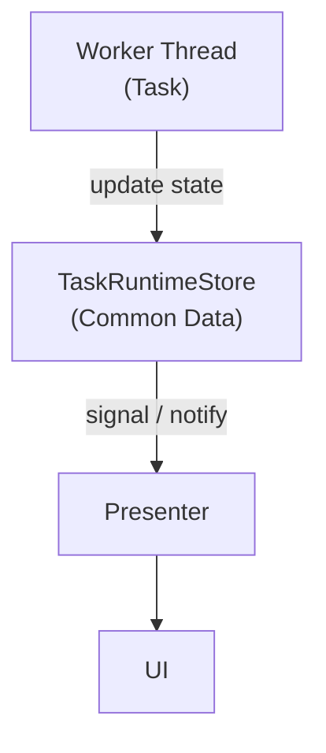
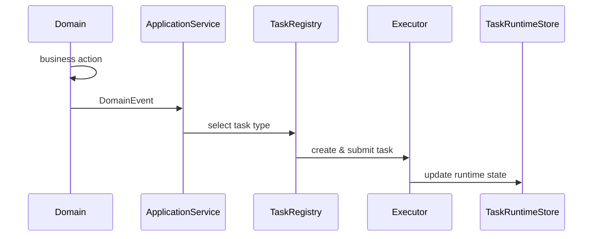
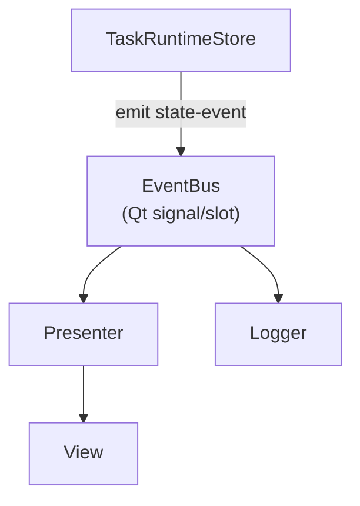
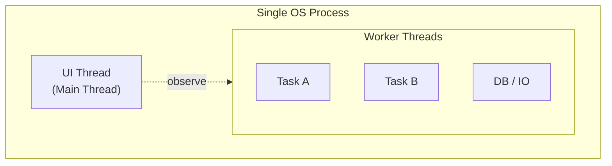
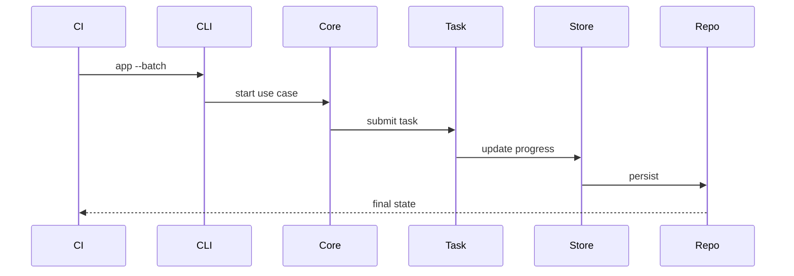
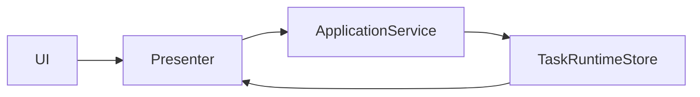
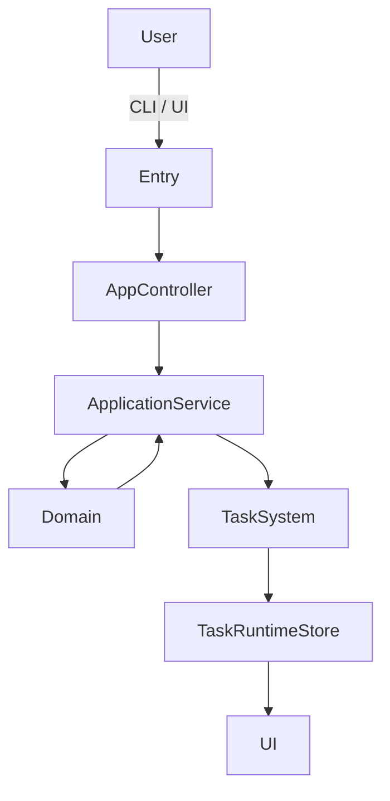

# Headless‑first, Task‑Oriented, CI/CD‑ready, UI‑optional

## 1. Tổng quan toàn bộ hệ thống

- UI KHÔNG thuộc Core
- Core chạy được không cần UI
- CI/CD chạy qua CLI / Batch

## 2. Chi tiết Task System

- TaskDefinition: metadata + wiring
- DomainTask: logic thực sự
- TaskAdapter: bridge Qt / thread
- TaskRuntimeStore: state tập trung

## 3. TaskRuntimeStore – Single Source of Truth

## 4. Domain Event → Task

- Domain KHÔNG trigger task
- Application quyết định phản ứng

## 5. Event Bus + Signal/Slot (MVP‑safe)

- Presenter nghe state event
- View chỉ update qua Presenter
- Không phá MVP

## 6. Thread model

- UI = 1 thread duy nhất
- Task = multiple worker threads
- CLI mode = không có UI thread

## 7. Chạy full app bằng CLI / Batch (CI/CD)

- Không UI
- Không human interaction
- CI chạy full flow

## 8. UI chỉ là Adapter

## 9. Toàn bộ flow tóm gọn

## 10. KẾT LUẬN

Một Headless‑First, Task‑Oriented Application, có đặc tính:

- Core chạy độc lập UI
- Task + State là trung tâm
- Domain event → Application decide
- Multi‑thread an toàn
- CI/CD chạy full app
- UI chỉ là adapter
