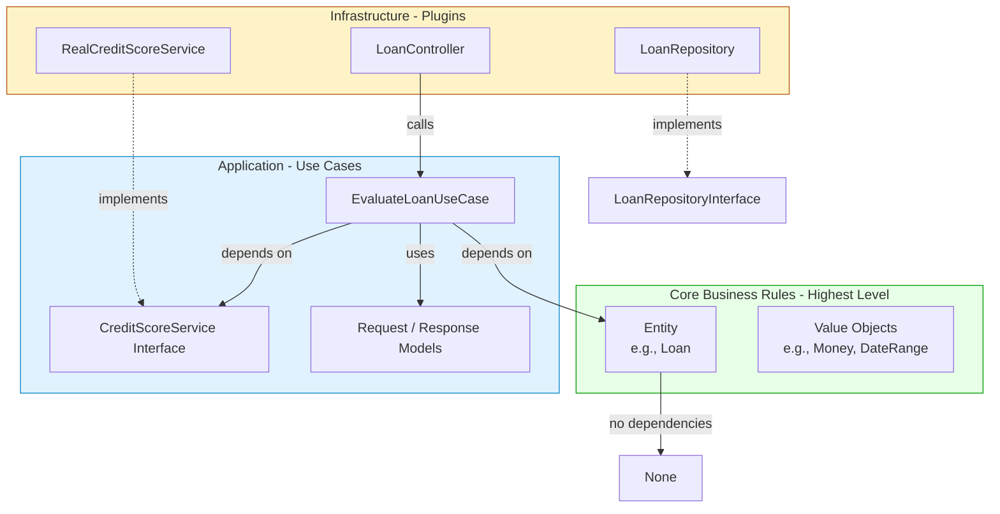

Let’s go deeper into **Entities**—the pure, critical business rule objects that sit at the very heart of a Clean Architecture. We’ll explore what makes a good Entity, how to evaluate one, best practices for keeping it pristine, and the common pitfalls that can corrupt your domain.

---

## 1. What Is an Entity, Really?

An Entity is **a software object that embodies a small set of critical business rules operating on critical business data**.

- **Critical business rules**: rules that would make or save the business money even if no automation existed.
- **Critical business data**: data that those rules need, and that would exist even without the system.

Entities are the highest‑level components in the dependency hierarchy—they are farthest from I/O, and they know nothing of databases, UIs, frameworks, or even the use cases that orchestrate them.

### Entity vs. Everything Else

| Concept | What it contains | Depends on |
|---------|------------------|------------|
| **Entity** | Core, timeless business rules + core business data | Nothing (except maybe other entities or value objects) |
| **Use Case** | Application‑specific rules that orchestrate entities | Entities, abstractions for external services |
| **Adapter** | Implementation of an abstraction for a specific technology (DB, HTTP) | Use‑case interfaces |
| **Framework/UI** | Delivery mechanism details | Use‑case input/output models |

Everything ultimately depends on the Entities; they are the independent core.

---

## 2. How to Identify an Entity

Ask these questions:

- **Would this rule exist in a manual (pen‑and‑paper) version of the business?**  
  - *Yes* → it belongs in an Entity.  
  - *No* (e.g., “must have filled in the contact form before proceeding”) → it’s application‑specific, belongs in a Use Case.

- **Is this data inherent to the business concept?**  
  - E.g., a loan’s principal, interest rate, and payment history are critical; the `created_at` timestamp of a database row is not.

- **Does this behavior protect a business invariant?**  
  - E.g., “a loan’s balance cannot go negative” is an invariant; “throw an error if the user didn’t enter a name” is a validation rule that may be in the request model, not the entity.

### Example: A `Loan` Entity (Banking Domain)

```python
from decimal import Decimal
from datetime import date
from dataclasses import dataclass
from typing import List

class Payment:
    def __init__(self, date: date, amount: Decimal):
        self.date = date
        self.amount = amount

class Loan:
    def __init__(self, principal: Decimal, annual_rate: Decimal, start_date: date):
        if principal <= 0:
            raise ValueError("Principal must be positive")
        self._principal = principal
        self.annual_rate = annual_rate
        self.start_date = start_date
        self._payments: List[Payment] = []
    
    def apply_payment(self, payment: Payment) -> None:
        """Critical business rule: apply a payment, deduct interest first."""
        if payment.amount <= 0:
            raise ValueError("Payment must be positive")
        interest = self._calculate_interest(payment.date)
        effective = max(Decimal('0'), payment.amount - interest)
        self._principal = max(Decimal('0'), self._principal - effective)
        self._payments.append(payment)
    
    def get_outstanding_principal(self) -> Decimal:
        return self._principal

    def _calculate_interest(self, as_of: date) -> Decimal:
        # simplified: daily interest on remaining principal
        days = (as_of - self.start_date).days
        if days <= 0:
            return Decimal('0')
        daily_rate = self.annual_rate / 365
        return (self._principal * Decimal(days) * daily_rate).quantize(Decimal('0.01'))
```

This Entity knows nothing about HTTP, SQL, or even how it’s going to be displayed. It’s pure business logic.

---

## 3. Evaluating an Entity – Is It Well-Designed?

Use these heuristics to evaluate an Entity:

### 3.1. Purity – Zero Infrastructure Dependencies
- Does it import anything from a framework (`django.db`, `sqlalchemy`, `requests`)?
- Does it depend on an operating system call (`open`, `socket`)?
- **Bad:** `class Customer(models.Model): ...` (Django model as entity – leaked persistence)
- **Good:** Plain Python class, no ORM or web imports.

### 3.2. Invariant Protection
- The constructor and all public methods must **guarantee** that the object never enters an invalid state.
- Example: `apply_payment` ensures the principal never goes below zero and that payment amount is positive.
- **Evaluation check:** Can you write a unit test that *proves* the entity cannot be constructed in an invalid state? No setter that bypasses the rules?

### 3.3. Rich Behavior, Not Anemic Model
- The entity should expose behavior (verbs like `apply_payment`, `close_account`, `approve_order`), not just a bag of getters and setters.
- **Anemic:** a class with only `get_balance()`, `set_balance()`, and all logic in a separate “service”.
- **Rich:** the logic lives inside the entity; external services only coordinate.

### 3.4. Ubiquitous Language
- Class names, method names, and field names should mirror exactly the terms used by domain experts.
- Bankers say “apply payment,” not `processPaymentEvent` or `updateLedger`.
- **Evaluation:** Can a non‑technical business expert read the entity’s method names and understand what it does?

### 3.5. Testability
- Entities should be testable in complete isolation. No database, no network, no mocking of external infrastructure.
- Tests should run in milliseconds.
- **Evaluation:** How many test doubles (mocks) do you need? Ideally zero for Entities themselves.

### 3.6. Single Responsibility and Cohesion
- The entity should change only for reasons related to the core business concept it represents.
- If you find yourself changing the `Loan` class because the bank introduces a new type of loan *and* because the payment schedule algorithm changed, that’s fine—it’s still about the loan. But if you change it because you added a new field for marketing, that’s a violation; the marketing data doesn’t belong in the Entity.

---

## 4. Best Practices for Building Entities

1. **Keep them plain.** Use simple Python classes (or dataclasses for value objects) with no base class from any framework.

2. **Use Value Objects for fine‑grained data.** `Money`, `Email`, `DateRange` are examples. They encapsulate validation and formatting, and make the Entity more expressive.

   ```python
   class Money:
       def __init__(self, amount: Decimal, currency: str):
           if amount < 0:
               raise ValueError("Negative money")
           self.amount = amount
           self.currency = currency
       def __add__(self, other): ...
   ```

3. **Guard all state changes.** Use private attributes with public methods that enforce invariants. Never allow direct mutation of internal state.

4. **Entities can reference other Entities or Value Objects, but nothing else.** A `Loan` might reference a `Customer` Entity, but it should not import a `CreditReportService`.

5. **Don’t put persistence methods in the Entity.** No `save()`, `load()`, or `to_dict()` that knows about a database. Use a separate repository interface (in the use‑case layer) and an adapter implementation (in the infrastructure layer).

6. **Use factories when construction is complex.** If creating a valid `Loan` requires many parameters and validation, create a `LoanFactory` that centralises that logic and returns a valid Entity.

7. **Write the tests first.** By writing tests that exercise the business rules without any infrastructure, you naturally keep the Entity pure.

8. **Avoid using ORM objects as Entities.** In many web frameworks it’s tempting to use Django/ SQLAlchemy models as entities. This leaks persistence details and makes testing slow. Instead, create a separate persistence model in the adapter layer and map to/from the Entity.

---

## 5. Common Pitfalls (and How to Avoid Them)

### Pitfall 1: Anemic Domain Model
- **Symptom:** Entity classes are just bags of properties with getters/setters; all business logic sits in “service” classes.
- **Why it’s bad:** The logic becomes scattered, duplicated, and hard to test. The Entity loses its meaning.
- **Fix:** Move the business rules into the Entity. The service becomes a thin use‑case orchestrator.

### Pitfall 2: Leaking Infrastructure Concerns
- **Symptom:** `class User(models.Model):` or `@Entity` annotations from an ORM, or a `to_json()` method that depends on a web serializer.
- **Why it’s bad:** The Entity becomes coupled to a specific technology, making it impossible to reuse or test independently.
- **Fix:** Create a separate plain `User` entity, and an ORM‑backed `UserRecord` in the persistence adapter. Map between them with a mapper.

### Pitfall 3: Putting Application‑Specific Rules in Entities
- **Symptom:** The `Loan` entity has a method `can_apply_for_refinance()` that checks if the customer has filled in a web form.
- **Why it’s bad:** Entities should be application‑agnostic. Application rules change for different reasons and at different rates.
- **Fix:** Put the application flow and validation in the Use Case, not the Entity.

### Pitfall 4: Over‑Engineering with Micro‑Entities
- **Symptom:** Creating a separate Entity for every tiny concept (e.g., `LoanPrincipal`, `LoanInterestRate`) that are just wrappers around a number with no behavior.
- **Why it’s bad:** Too many indirections without real business rules bloat the domain.
- **Fix:** Use value objects for simple, self‑validating types; only create an Entity when there is real behavior.

### Pitfall 5: Not Protecting Invariants
- **Symptom:** A `Loan` can have a negative principal because a developer directly set `loan.principal = -500` (no encapsulation).
- **Why it’s bad:** Invalid state leads to incorrect business results and debugging nightmares.
- **Fix:** Always use private attributes and public methods that validate.

### Pitfall 6: Using Framework Types Inside Entities
- **Symptom:** `from django.http import HttpRequest` inside an Entity (extreme, but I’ve seen it).
- **Why it’s bad:** Ties the core business rule to a delivery mechanism, making it impossible to use in a CLI or batch.
- **Fix:** Keep imports only to standard library types and your own value objects/entities.

### Pitfall 7: Testing Entities Through the Database
- **Symptom:** Tests for `Loan` spin up a test database, insert rows, and then test.
- **Why it’s bad:** Tests become slow, brittle, and no longer test only business rules.
- **Fix:** Unit‑test Entities directly in memory; use repository abstractions for integration tests.

---

## 6. Entity Evaluation Scorecard

Use this quick checklist to evaluate your Entity:

| Criterion | Yes/No |
|-----------|--------|
| Does it have zero imports from frameworks, ORMs, or web libraries? | |
| Can it be instantiated and fully tested without a database or network? | |
| Does its public API express business behavior (verbs)? | |
| Are all business invariants enforced by the Entity itself (not by external validators)? | |
| Does the class name and methods match the domain expert’s language? | |
| Is the state encapsulated (private fields with controlled access)? | |
| Is it free of persistence concerns (no `save()`, `load()`)? | |

If all answers are “yes,” you have a well‑designed Entity.

---

## 7. Visual Summary: Entity in the Architecture



The Entity sits at the top, untouched by the details below. All arrows point toward it.

---

## 8. Conclusion

Entities are the soul of your software. When you keep them pure, self‑contained, and aligned with the real business, you build a system that can survive changes to frameworks, databases, and UIs without losing its essence. Evaluate every Entity against the purity checklist, avoid the common pitfalls, and treat them as the precious family jewels they are.