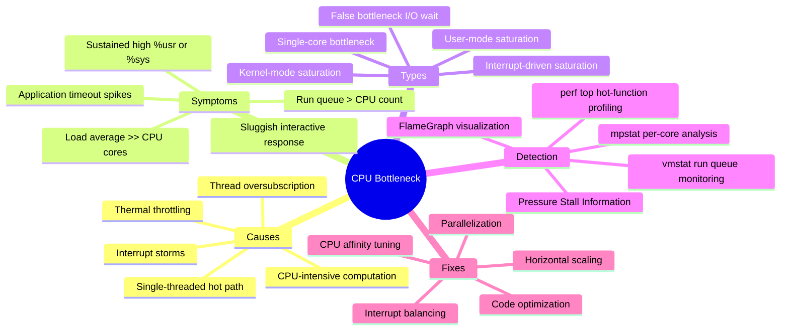
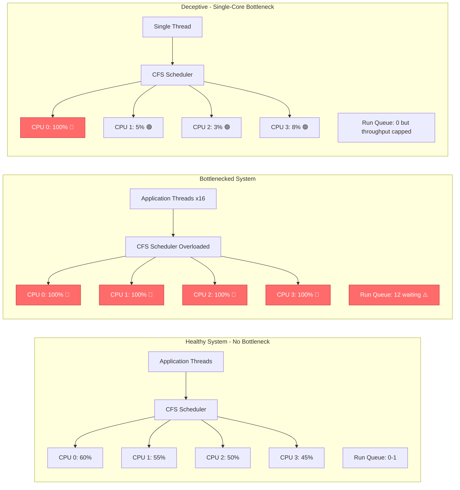
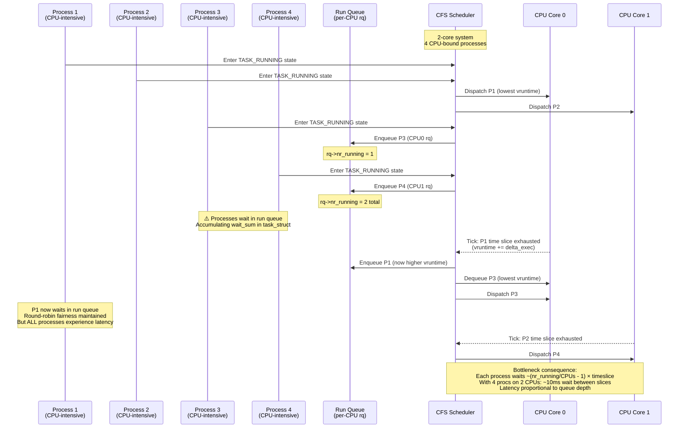
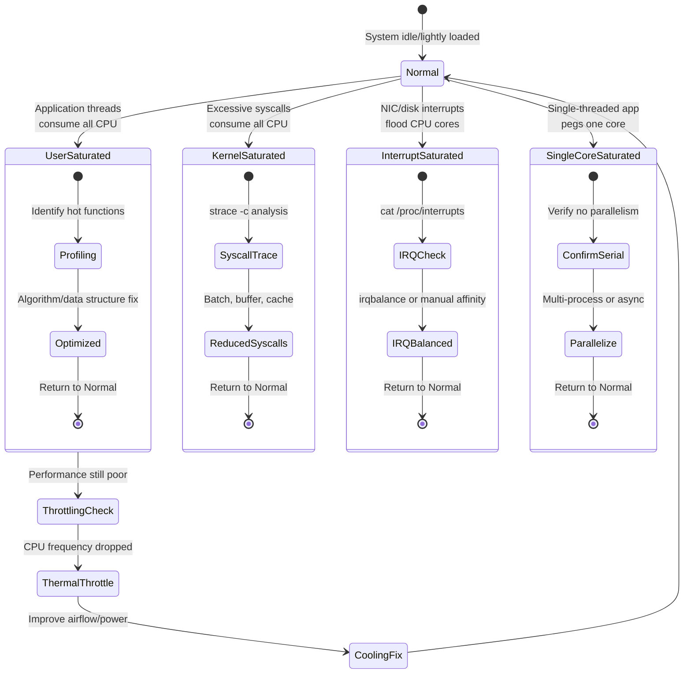
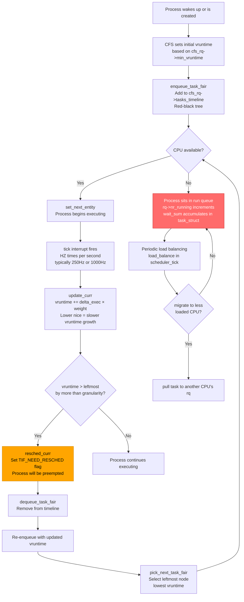
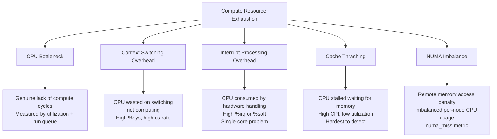
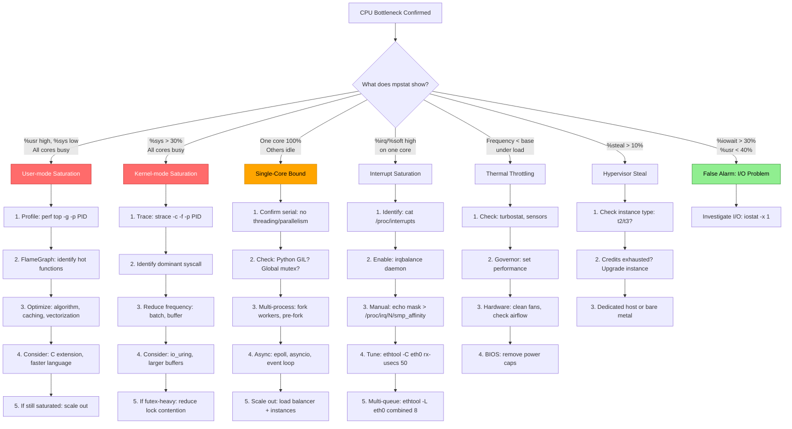

# CPU Bottleneck in Linux

## Overview
A **CPU bottleneck** occurs when the processor reaches its **maximum computational capacity**, becoming the primary constraint on system throughput. 

1. The CPU scheduler cannot keep up with demand—processes accumulate in the run queue, latency spikes
2. The system becomes sluggish despite other resources (memory, disk, network) having available capacity. 

Understanding CPU bottlenecks requires looking beyond simple utilization percentages to examine run queue depth, per-core imbalance, and the distinction between genuine CPU saturation versus I/O-wait masquerading as CPU pressure.



---

## What is a CPU Bottleneck in Linux?

A CPU bottleneck describes the condition where processor cores are **fully saturated** with runnable tasks, and additional work must wait in the scheduler's run queue before receiving CPU time. This is distinct from simply "high CPU usage"—a system running at 100% CPU but with no waiting tasks is not bottlenecked; it's efficiently utilized. The bottleneck emerges when **demand exceeds supply**, creating a backlog of processes contending for processor cycles.

In Linux specifically, the [[Completely Fair Scheduler]] (CFS) manages CPU time allocation using a [[Red-black tree]] ordered by `vruntime`—the amount of CPU time each task has consumed. When CPUs are saturated, the scheduler must preempt running tasks more aggressively, context switch overhead increases, and cache locality degrades as tasks bounce between cores. The kernel's `task_struct` for each process accumulates `wait_sum` in the scheduler statistics, reflecting time spent in the run queue rather than executing.

**Key insight:** A single-threaded application burning 100% of one core on a 64-core machine IS a CPU bottleneck—not because the machine is overloaded, but because that application's throughput is capped by single-core performance. The other 63 idle cores cannot help a serial workload.



---

## How It Works: The Mechanism

### 1. CPU Scheduling and Run Queue Dynamics

The Linux CFS scheduler maintains a **run queue** (`struct rq`) per CPU core. When a process is in the `TASK_RUNNING` state but not currently executing, it sits in this queue waiting for CPU time. The bottleneck emerges when the run queue depth consistently exceeds the number of available cores.



### 2. CPU Bottleneck State Machine



### 3. The Kernel's Perspective: Load Tracking



---

## Similar Mechanisms (Same Level of Abstraction)

CPU bottlenecks are one category of **compute resource exhaustion**. Related concepts at the same abstraction level include:



### Comparison Table

| Mechanism | Key Metric | Dominant CPU Counter | Detection Command | Primary Fix | Misdiagnosis Risk |
|-----------|-----------|---------------------|-------------------|-------------|-------------------|
| **CPU Bottleneck** | Run queue depth, %usr | `r` in vmstat | `mpstat -P ALL`, `vmstat` | Optimize code, add CPUs | Confused with I/O wait |
| **Context Switch Overhead** | `cs` rate > 100k/s | `%sys` elevated | `vmstat`, `pidstat -w` | Reduce threads, CPU pinning | Looks like CPU saturation |
| **Interrupt Overload** | `%irq` + `%soft` > 20% | `%irq`, `%soft` | `/proc/interrupts`, `mpstat` | IRQ balancing, coalescing | Looks like %sys issue |
| **Cache Thrashing** | High LLC miss rate | `%usr` but low IPC | `perf stat -e cache-misses` | Data layout, tiling | Looks like slow CPU |
| **NUMA Imbalance** | `numa_miss` > 10% | `%usr` varies by node | `numastat`, `perf stat` | `numactl --membind` | Looks like memory bottleneck |

**What makes CPU bottleneck unique:** Unlike the other mechanisms, a true CPU bottleneck means the processor is genuinely compute-bound—there is no wasted work, just insufficient capacity. Context switching and interrupt issues waste CPU on overhead rather than useful computation.

---

## Detection Commands

### Quick Diagnostic Flow (Run in Order)

```bash
# Step 1: Check load average and basic CPU utilization
uptime
# Example output: 14:30:00 up 30 days,  5:22,  3 users,  load average: 12.50, 10.20, 8.90
# On an 8-core system: 12.50/8 = 1.56 → potential bottleneck

top -bn1 | head -5
# %Cpu(s): 85.2 us, 10.1 sy,  0.0 ni,  2.5 id,  0.0 wa,  1.2 hi,  1.0 si,  0.0 st
# 85% user + 10% system = 95% busy → investigate further

# Step 2: Per-core analysis (CRITICAL - never skip this)
mpstat -P ALL 1 5
# Look for:
#   - Individual cores at 100% while others idle → single-thread bottleneck
#   - All cores uniformly high → genuine saturation
#   - High %iowait with low %usr → NOT a CPU problem!
#   - High %irq/%soft on one core → interrupt issue

# Example output showing single-core bottleneck:
# CPU    %usr   %nice    %sys %iowait    %irq   %soft  %steal   %idle
# all   25.50    0.00    5.00    0.00    0.00    0.00    0.00   69.50
#   0  100.00    0.00    0.00    0.00    0.00    0.00    0.00    0.00  ← BOTTLENECK!
#   1    1.00    0.00    5.00    0.00    0.00    0.00    0.00   94.00
#   2    0.00    0.00    0.00    0.00    0.00    0.00    0.00  100.00
#   3    1.00    0.00   15.00    0.00    0.00    0.00    0.00   84.00

# Step 3: Run queue depth
vmstat 1 5
# Key columns:
#   r = run queue (processes waiting for CPU) ← PRIMARY METRIC
#   us = user CPU %
#   sy = system CPU %
#   wa = I/O wait (if high, problem is DISK not CPU)
#   id = idle %
# Example:
# procs -----------memory---------- ---swap-- -----io---- -system-- ------cpu-----
#  r  b   swpd   free   buff  cache   si   so    bi    bo   in   cs us sy id wa st
# 12  0      0  12345  67890 987654    0    0     0    10 5000 8000 95  5  0  0  0
#  ^                                                                    ^^
#  |                                                                    ||
#  12 processes waiting! (on 4-core system)                             CPU saturated

# Step 4: Identify CPU-consuming processes
ps aux --sort=-%cpu | head -15
# Look at:
#   %CPU column - high values
#   TIME column - processes accumulating CPU time
#   STAT column - 'R' means currently running

# Step 5: Process-level CPU breakdown (including threads)
pidstat 1 5
pidstat -t -p <PID> 1 5   # Show threads within a process
```

### Advanced Diagnostic Commands

```bash
# === PRESSURE STALL INFORMATION (PSI) ===
# Better than CPU% for detecting bottlenecks
# Tells you if processes are actually WAITING for CPU

cat /proc/pressure/cpu
# Example output:
# some avg10=45.00 avg60=30.00 avg300=15.00 total=9876543210
# full avg10=20.00 avg60=12.00 avg300=5.00  total=1234567890
#
# Interpretation:
#   some avg10=45.00 → 45% of time in last 10s, SOME tasks waited for CPU
#   full avg10=20.00 → 20% of time, ALL non-idle tasks waited for CPU
#   >10% on "some" is concerning; >30% is critical

# === PER-PROCESS SCHEDULER STATISTICS ===
cat /proc/<PID>/sched
# Shows:
#   se.sum_exec_runtime: Total CPU time consumed
#   se.wait_sum: Total time spent waiting for CPU
#   se.nr_migrations: How often moved between cores
# High wait_sum relative to sum_exec_runtime = bottleneck

# === CPU FREQUENCY CHECK (Thermal Throttling Detection) ===
# Current frequency
cat /proc/cpuinfo | grep "cpu MHz" | awk '{print $4}' | sort -rn | head -4

# Watch frequency change under load
watch -n 1 "cat /proc/cpuinfo | grep 'cpu MHz' | awk '{print \$4}' | sort -rn | head -4"
# If frequency drops under load → thermal or power throttling!

# Using turbostat (more accurate)
turbostat --quiet --show Bzy_MHz,PkgWatt,PkgTmp --interval 1

# === PERF PROFILING ===
# Live function profiling
perf top -g -p <PID>

# Record for offline analysis
perf record -F 99 -g -p <PID> -- sleep 30
perf report --stdio --sort=comm,dso,symbol | head -40

# CPU performance counters
perf stat -e cycles,instructions,cache-misses,cache-references,branches,branch-misses \
    -p <PID> -- sleep 10
# Key ratios:
#   instructions/cycles (IPC): <0.5 = memory-bound, >1.5 = compute-bound
#   cache-misses/cache-references: >5% = cache problem
#   branch-misses/branches: >2% = unpredictable branches

# === SYSTEM CALL ANALYSIS (for %sys issues) ===
strace -c -p <PID> -f
# Example output:
# % time     seconds  usecs/call     calls    errors syscall
# ------ ----------- ----------- --------- --------- ----------------
#  85.23    5.234567        5234      1000           read
#   8.12    0.499012         499      1000           write
#   3.45    0.211890         211      1000           futex
# → read/write dominate → I/O bound, not truly CPU bound

# === CHECK KERNEL SCHEDULER CONFIGURATION ===
cat /sys/kernel/debug/sched/preempt
cat /proc/sys/kernel/sched_min_granularity_ns
cat /proc/sys/kernel/sched_latency_ns
```

---

## Common Mistakes, Pitfalls, and Misunderstandings

### Mistake 1: Confusing [[I_O Wait]] with CPU Bottleneck

**The mistake:**
An administrator sees high CPU utilization in `top` and immediately concludes they need more or faster CPUs. They see 70% CPU busy and only 5% idle.

```bash
$ top
%Cpu(s): 15.2 us,  8.1 sy,  0.0 ni,  5.0 id, 70.5 wa,  1.2 hi,  0.0 si,  0.0 st
#                                ^^^^          ^^^^^
# Admin reaction: "CPU is at 95% busy! We need more cores!"
```

**Why it's wrong:**
The `%iowait` (70.5% here) represents time the CPU is **idle waiting for disk I/O to complete**. The CPU literally has nothing to do—it's blocked on storage. Adding CPUs will not help; the bottleneck is the disk subsystem.

**Correct approach:**
```bash
# Check I/O statistics to confirm
iostat -x 1 3
# Look at:
#   %util near 100% → disk saturated
#   await > 50ms → high disk latency
#   r_await / w_await → which direction is slow

# Find the I/O-heavy process
iotop -o

# Check for swapping (common cause of I/O wait)
vmstat 1
# If si (swap in) and so (swap out) > 0 → memory pressure causing I/O
```

**Key rule:** When `%iowait` > 20% AND `%usr` < 40%, the primary bottleneck is **disk I/O, not CPU**.

---

### Mistake 2: Looking Only at Aggregate CPU Usage

**The mistake:**
An engineer checks `top` or a monitoring dashboard and sees 30% overall CPU utilization. They conclude the system is healthy and has plenty of headroom.

```bash
$ top
%Cpu(s): 25.0 us,  5.0 sy,  0.0 ni, 70.0 id,  0.0 wa,  0.0 hi,  0.0 si,  0.0 st
# Engineer: "70% idle, no CPU issues here!"
```

**Why it's wrong:**
Aggregate CPU hides per-core imbalance. A single-threaded application saturating one core shows as only 12.5% on an 8-core machine, yet that application is bottlenecked and cannot go faster.

```bash
$ mpstat -P ALL 1
# Reveals the truth:
CPU    %usr   %nice    %sys %iowait    %irq   %soft  %steal   %idle
all   25.00    0.00    5.00    0.00    0.00    0.00    0.00   70.00
  0  100.00    0.00    0.00    0.00    0.00    0.00    0.00    0.00  ← PEGGED!
  1    0.00    0.00    5.00    0.00    0.00    0.00    0.00   95.00
  2    0.00    0.00    0.00    0.00    0.00    0.00    0.00  100.00
  3    0.00    0.00   15.00    0.00    0.00    0.00    0.00   85.00
  4    0.00    0.00    0.00    0.00    0.00    0.00    0.00  100.00
  5    0.00    0.00    0.00    0.00    0.00    0.00    0.00  100.00
  6    0.00    0.00    0.00    0.00    0.00    0.00    0.00  100.00
  7    0.00    0.00    0.00    0.00    0.00    0.00    0.00  100.00
```

**Correct approach:** Always use `mpstat -P ALL` for per-core visibility. Never rely on aggregate CPU % alone.

---

### Mistake 3: Misinterpreting Load Average as Purely CPU Demand

**The mistake:**
An engineer sees load average of 16 on an 8-core system and declares a severe CPU bottleneck requiring immediate hardware upgrade.

```bash
$ uptime
14:30:00 up 30 days,  5:22,  3 users,  load average: 16.00, 14.50, 12.30
# Engineer: "Load is 2x CPU count! Critical CPU bottleneck!"
```

**Why it's wrong:**
Linux load average includes processes in **uninterruptible sleep (D state)** —processes blocked on I/O that aren't consuming CPU at all. A load of 16 could mean 14 processes waiting for a slow NFS mount and only 2 actually wanting CPU.

```bash
# Breakdown what's behind the load number
ps -eo state,pid,comm,wchan | sort

# Count by state
echo "Running/Runnable (R): $(ps -eo state | grep -c 'R')"
echo "Uninterruptible (D): $(ps -eo state | grep -c 'D')"
echo "Interruptible (S):   $(ps -eo state | grep -c 'S')"

# Example scenario: Load 16 on 8-core system
# R state: 2 (only 2 processes actually want CPU)
# D state: 14 (14 processes blocked on I/O, probably NFS/storage)
# Conclusion: I/O problem, NOT CPU problem!
```

**Correct approach:** Always decompose load average into R-state (genuine CPU demand) and D-state (I/O blocked) counts before concluding it's a CPU bottleneck.

---

### Mistake 4: Ignoring CPU Frequency Throttling

**The mistake:**
An application's performance degrades over time. CPU utilization stays at 100%, but throughput drops. The engineer assumes the application has a memory leak or algorithmic issue.

**Why it's wrong:**
Modern CPUs throttle frequency due to thermal constraints, power limits, or aggressive power-saving governors. The CPU reports 100% utilization, but it's 100% of a **reduced clock speed**—1.2 GHz instead of 3.0 GHz.

```bash
# Check current frequency
$ cat /proc/cpuinfo | grep "MHz"
cpu MHz         : 1199.998    # ← Running at 1.2 GHz!
cpu MHz         : 1200.012
# Base frequency might be 3.0 GHz → losing 60% performance

# Check for thermal throttling evidence
$ dmesg | grep -i "thermal\|throttl"
[12345.678] CPU0: Package temperature above threshold, cpu clock throttled
[12345.890] CPU0: Core temperature/speed normal

# Check current governor
$ cat /sys/devices/system/cpu/cpu0/cpufreq/scaling_governor
powersave    # ← Should be "performance" for servers
```

**Correct approach:**
```bash
# Set performance governor
for cpu in /sys/devices/system/cpu/cpu*/cpufreq/scaling_governor; do
    echo performance | sudo tee $cpu
done

# Verify
cat /sys/devices/system/cpu/cpu*/cpufreq/scaling_governor | sort | uniq -c

# Check for hardware thermal issues
sensors  # or ipmitool sdr for server hardware
```

---

### Mistake 5: Over-Threading a CPU-Bound Workload

**The mistake:**
"CPU usage is at 100% on all cores. Let's increase the thread pool from 8 to 32 to process more work in parallel!"

**Why it's wrong:**
For CPU-bound work, optimal thread count equals available CPU cores. More threads than cores introduces **context switching overhead** without gaining parallelism. The system spends CPU cycles saving and restoring thread state instead of computing.

```bash
# Before (8 threads on 8 cores):
$ vmstat 1
procs -----------memory---------- ---swap-- -----io---- -system-- ------cpu-----
 r  b   swpd   free   buff  cache   si   so    bi    bo   in   cs us sy id wa st
 8  0      0  12345  67890 987654    0    0     0    10 5000 8000 85  5 10  0  0

# After (32 threads on 8 cores):
$ vmstat 1
procs -----------memory---------- ---swap-- -----io---- -system-- ------cpu-----
 r  b   swpd   free   buff  cache   si   so    bi    bo   in   cs us sy id wa st
24  0      0  12345  67890 987654    0    0     0    10 20000 95000 45 40 15  0  0
#  ^^                                                      ^^  ^^^^^  ^^
#  24 waiting!                                            cs skyrockets  %sys up
# Conclusion: MORE threads REDUCED throughput due to overhead
```

**Correct formula:**
- **CPU-bound workload**: threads = CPU cores (or cores − 1 if sharing with other critical processes)
- **I/O-bound workload**: threads can be 2-4× CPU cores
- **Always measure**: run benchmarks at different thread counts

---

### Mistake 6: Overlooking `%steal` in Virtualized Environments

**The mistake:**
On a cloud VM, CPU usage shows 60% but application performance is terrible. The engineer profiles the application extensively looking for inefficiencies.

**Why it's wrong:**
In virtualized environments, `%steal` represents CPU time the hypervisor **took from your VM** to give to another VM on the same physical host. Your VM thinks it has CPU time, but it's being stolen.

```bash
$ top
%Cpu(s): 30.0 us, 10.0 sy,  0.0 ni, 20.0 id,  5.0 wa,  0.0 hi,  5.0 si, 30.0 st
#                                                                    ^^^^^
# 30% of CPU time is being stolen by the hypervisor!

$ mpstat -P ALL 1
CPU    %usr   %nice    %sys %iowait    %irq   %soft  %steal   %idle
all   30.00    0.00   10.00    5.00    0.00    5.00   30.00   20.00
#                                                        ^^^^^
```

**Correct approach:**
- Check `%steal` in `top` or `mpstat` before assuming application issue
- If `%steal` > 10%, investigate:
  - Are you on a burstable instance type (AWS t2/t3) that exhausted credits?
  - Is the physical host overcommitted?
  - Consider dedicated instances or upgrading instance type
- `%steal` is a hypervisor problem, not an application problem

---

### Mistake 7: Assuming High `%sys` Means Kernel Bug

**The mistake:**
An engineer sees `%sys` at 40% and concludes there's a kernel bug or misconfiguration causing excessive system time.

**Why it's wrong:**
High `%sys` is often a **symptom** of the application's behavior, not a kernel problem. Each I/O operation, network call, memory allocation, and context switch contributes to `%sys`. An application making millions of tiny `read()` calls will show high `%sys` because each call traps into the kernel.

```bash
# Application with high %sys
$ mpstat 1
CPU    %usr   %nice    %sys %iowait    %irq   %soft  %steal   %idle
all   30.00    0.00   45.00    0.00    0.00    0.00    0.00   25.00

# Diagnose with strace
$ strace -c -p <PID> -f
% time     seconds  usecs/call     calls    errors syscall
------ ----------- ----------- --------- --------- ----------------
 45.23    2.345678          23    100000           read       ← 100k calls!
 30.12    1.562345          15    100000           write      ← 100k calls!
 15.00    0.778123           7    100000           futex
  5.00    0.259345          25     10000           poll
# App is doing 100k read/write calls → this IS the %sys source
# Fix: use larger buffers to reduce syscall count
```

**Correct approach:** Use `strace -c` to identify which syscalls dominate before blaming the kernel.

---

## How to Fix CPU Bottlenecks

### Decision Tree for Remediation



### Fix Cheat Sheet

| Symptom | Root Cause | Immediate Relief | Long-Term Fix |
|---------|------------|-----------------|---------------|
| All cores >90% `%usr` | Compute-bound application | `renice -n 10 -p PID` (lower priority), `kill -STOP PID` (pause) | Profile with perf, optimize hot functions, cache results, scale out |
| `%sys` > 40% | Excessive syscalls | Reduce thread count, batch operations | Use larger buffers, `io_uring`, reduce futex contention |
| One core 100%, others idle | Single-threaded bottleneck | `taskset -cp ALL PID` (unpin if pinned wrong) | Multi-process architecture, async I/O, remove GIL/global locks |
| Frequency drops under load | Thermal/power throttling | `cpupower frequency-set -g performance` | Improve cooling, remove BIOS power caps, check PSU |
| `%irq`/`%soft` high on CPU0 | NIC interrupt flooding | `irqbalance --oneshot` | IRQ affinity, interrupt coalescing, multi-queue NIC |
| `%steal` > 10% | Hypervisor overcommit | Migrate VM to different host | Upgrade instance type, dedicated tenancy |
| Run queue > 2× CPUs | Insufficient CPU capacity | cgroups to limit noisy neighbors | Add CPUs, horizontal scale, load balance |
| High `%sys` from futex | Lock contention | Reduce thread count temporarily | Lock-free structures, finer-grained locking, RCU |

### Immediate Relief Commands

```bash
# === EMERGENCY ACTIONS (When system is crawling) ===

# 1. Find the worst offender
ps aux --sort=-%cpu | head -5

# 2. Pause it (reversible!)
kill -STOP <PID>    # Process frozen - can resume with kill -CONT

# 3. Lower priority of CPU hogs
renice -n 15 -p <PID>     # Lower priority (higher nice = less CPU)
sudo renice -n -5 -p <PID> # Raise priority for critical process

# 4. Limit CPU with cgroups v2 (contain the blast radius)
echo "+cpu" | sudo tee /sys/fs/cgroup/cgroup.subtree_control
sudo mkdir /sys/fs/cgroup/cpu_limited
echo "50000 100000" | sudo tee /sys/fs/cgroup/cpu_limited/cpu.max
# 50000 = CPU time in microseconds per 100000us period = 50% of one CPU
echo <PID> | sudo tee /sys/fs/cgroup/cpu_limited/cgroup.procs

# 5. Pin noisy process to specific cores (isolate from critical processes)
taskset -cp 4,5,6,7 <PID>  # Pin to cores 4-7
taskset -cp 0,1 <SSH_PID>  # Give SSH dedicated cores

# === QUICK WINS (Less disruptive) ===

# Reduce swappiness to prevent swapping-induced I/O
echo 10 | sudo tee /proc/sys/vm/swappiness

# Drop caches to free memory (temporary, system will re-cache)
echo 3 | sudo tee /proc/sys/vm/drop_caches

# Enable performance governor
for cpu in /sys/devices/system/cpu/cpu*/cpufreq/scaling_governor; do
    echo performance | sudo tee $cpu
done
```

### Long-Term Solutions

```bash
# === PROFILING-DRIVEN OPTIMIZATION ===

# Generate flame graph
perf record -F 99 -g -p <PID> -- sleep 30
perf script | ~/FlameGraph/stackcollapse-perf.pl | \
    ~/FlameGraph/flamegraph.pl > flame.svg
# Open in browser → look for wide plateaus = hot functions

# Cache miss analysis (often the real CPU bottleneck)
perf stat -e cycles,instructions,cache-misses,cache-references,\
    LLC-load-misses,LLC-loads -p <PID> -- sleep 10
# IPC < 0.5 and LLC miss rate > 5% → memory-bound, not compute-bound

# === ARCHITECTURAL CHANGES ===

# Parallelize with GNU parallel
cat tasks.txt | parallel -j $(nproc) 'process {}'

# Use compiled extensions for hot Python paths
# Instead of: slow_python_function()
# Use: Cython, Numba @jit, or rewrite in Rust/Go

# Implement async I/O for network services
# Instead of: thread-per-connection
# Use: epoll, io_uring, or async framework

# === SYSTEM-WIDE TUNING ===

# Kernel scheduler tuning
echo 10000000 | sudo tee /proc/sys/kernel/sched_latency_ns       # 10ms
echo 2000000  | sudo tee /proc/sys/kernel/sched_min_granularity_ns # 2ms

# Disable HyperThreading for CPU-bound (avoids sibling contention)
echo off | sudo tee /sys/devices/system/cpu/smt/control

# NUMA-aware process placement
numactl --cpunodebind=0 --membind=0 <command>
```

---

## 🎯 Interview Quick-Reference

> **One-liner:** A CPU bottleneck is a condition where processor demand exceeds capacity, causing processes to queue in the scheduler's run queue—detected via run queue depth (`vmstat r` column) and per-core saturation (`mpstat -P ALL`), not just aggregate CPU%.

> **3 Must-Know Facts:**
> 1. **Load average includes D-state processes** (uninterruptible sleep), so high load ≠ CPU bottleneck—always decompose into R-state (real CPU demand) vs D-state (I/O blocked).
> 2. **Aggregate CPU% hides single-core bottlenecks**—a single-threaded app at 100% on one core shows only 12.5% on 8-core system. Always check `mpstat -P ALL`.
> 3. **PSI (`/proc/pressure/cpu`) is superior to CPU% for alerting** because it measures time tasks actually waited for CPU, not just utilization.

> **Common Q&A:**
> - **Q:** How do you distinguish a CPU bottleneck from an I/O bottleneck?
>   **A:** Check `%iowait` in `mpstat` or `top`. If `%iowait` > 20% AND `%usr` < 40%, it's I/O-bound. Check run queue: high `r` with low `%iowait` = CPU; high `b` (blocked) = I/O. Use `iostat -x 1` to confirm disk saturation.
>
> - **Q:** What's the difference between load average and CPU utilization?
>   **A:** CPU utilization is instantaneous % busy. Load average is an exponentially-weighted moving average of R-state + D-state processes. Load can be high while CPU is idle (many processes blocked on NFS). Use both together: high load + high %usr = CPU problem; high load + high %iowait = I/O problem.
>
> - **Q:** How many threads should you use for a CPU-bound workload?
>   **A:** Equal to the number of available CPU cores. More threads than cores increases context switching overhead without gaining parallelism. For I/O-bound workloads, threads can be 2-4× CPU cores.
>
> - **Q:** What is `%steal` and why does it matter?
>   **A:** `%steal` is CPU time the hypervisor took from your VM to give to another VM. If >10%, your VM is being throttled—not an application problem. Common on burstable instances (AWS t2/t3) when credits are exhausted.
>
> - **Q:** A process shows 100% CPU but the system has idle cores. Is this a bottleneck?
>   **A:** Yes, for that process—it's single-threaded and cannot utilize other cores. This is a single-core bottleneck. The fix is parallelization (multi-process, async) or horizontal scaling, not adding CPUs.

---

## Real-World Troubleshooting Scenario

### Incident: "The API is Slow and Timing Out"

**Situation:** Production API server experiencing P99 latency spike from 50ms to 5000ms. Monitoring dashboard shows CPU at 98%. On-call engineer is paged.

**Step-by-Step Debug Flow:**

```bash
# 1. Quick assessment - Is it really CPU?
$ uptime
14:30:00 up 100 days, 3:22, 1 user, load average: 24.30, 18.50, 12.10
# System has 8 cores → 24.30/8 = 3.0x → definitely overloaded

$ top -bn1 | head -3
%Cpu(s): 85.2 us, 10.1 sy, 0.0 ni, 2.5 id, 0.0 wa, 1.2 hi, 1.0 si, 0.0 st
# 85% user + 10% system = 95% busy, 0% iowait → genuine CPU bottleneck

# 2. Check per-core distribution
$ mpstat -P ALL 1 3
CPU    %usr   %nice    %sys %iowait    %irq   %soft  %steal   %idle
all   85.00    0.00   10.00    0.00    1.00    1.00    0.00    3.00
  0   95.00    0.00    5.00    0.00    0.00    0.00    0.00    0.00
  1   92.00    0.00    8.00    0.00    0.00    0.00    0.00    0.00
  2   88.00    0.00   12.00    0.00    0.00    0.00    0.00    0.00
  3   90.00    0.00   10.00    0.00    0.00    0.00    0.00    0.00
  4   82.00    0.00   13.00    0.00    2.00    3.00    0.00    0.00
  5   85.00    0.00   10.00    0.00    2.00    3.00    0.00    0.00
  6   78.00    0.00   12.00    0.00    2.00    3.00    0.00    5.00
  7   80.00    0.00   10.00    0.00    2.00    3.00    0.00    5.00
# All cores uniformly high → genuine saturation, not single-core issue

# 3. Check run queue
$ vmstat 1 5
procs -----------memory---------- ---swap-- -----io---- -system-- ------cpu-----
 r  b   swpd   free   buff  cache   si   so    bi    bo   in   cs us sy id wa st
16  0      0  1.2G   500M   8.5G    0    0     0   100  8k  12k 85 10  3  0  0
#  ^^
# Run queue = 16 on 8-core system → 8 processes actively waiting for CPU

# 4. Find the CPU-consuming process(es)
$ ps aux --sort=-%cpu | head -8
USER   PID  %CPU %MEM    VSZ   RSS TTY  STAT  START   TIME COMMAND
app   12345  780  15.2  5.2G  4.8G ?    Sl   10:00  125:30 /opt/app/api-server
app   12346   95   0.5  1.2G  600M ?    Sl   10:00   15:20 /opt/app/worker
#  ^^^^                                    ^^
# 780% CPU on an 8-core = using ~7.8 cores!       Multi-threaded (Sl)
# API server itself is the culprit

# 5. Profile the culprit - what's it doing?
$ sudo perf top -g -p 12345
# Top functions shown:
#   45.23%  json_parse_string         ← JSON parsing!
#   20.12%  memcpy                    ← Memory copying
#   15.00%  sha256_transform          ← Hashing
#    8.00%  malloc/free               ← Allocation overhead

# 6. Confirm with strace
$ sudo strace -c -p 12345 -f
% time     seconds  usecs/call     calls    errors syscall
------ ----------- ----------- --------- --------- ----------------
 35.23    3.456789        3456      1000           read
 30.12    2.967890        2967      1000           write
 15.00    1.478901        1478      1000           futex
  8.00    0.789012        7890       100           brk
# Confirms: lots of read/write + futex (thread synchronization)

# 7. Check for thermal throttling (hidden performance killer)
$ cat /proc/cpuinfo | grep "MHz" | sort -rn | head -4
cpu MHz : 3500.000
cpu MHz : 3500.000
# Frequency at full 3.5 GHz → no throttling (good)

# 8. Root cause identified:
# API server is spending 45% of CPU parsing JSON for every request
# No caching, parsing large payloads repeatedly
# Also doing SHA256 on every request body (unnecessary for all endpoints)
```

**Root Cause:** The API server was parsing and hashing large JSON request bodies on every request without caching. JSON parsing consumed 45% of CPU, SHA256 consumed 15%. Combined with a traffic spike (2× normal requests), the 8-core server saturated.

**Fix Applied:**
1. **Immediate:** Added request body size limits at load balancer, rejecting payloads >1MB
2. **Short-term:** Implemented response caching (Redis) for frequently-accessed data, avoiding re-parsing
3. **Long-term:** Moved SHA256 integrity check to load balancer layer (single check, not per-request); switched JSON library from pure-Python to C-optimized version; added horizontal auto-scaling policy

**Lessons Learned:**
- 45% CPU on JSON parsing is a design problem, not a capacity problem—adding CPUs would have only masked it
- `perf top` pinpointed the exact function within 30 seconds; without it, we'd have guessed for hours
- The 780% CPU in `ps` was the smoking gun—a multi-threaded process using almost all cores
- Run queue of 16 on 8 cores meant 8 processes were permanently waiting; users felt 2× latency

---

## Important Notes

| Concept | Description |
|---------|-------------|
| **Run Queue (`r` in vmstat)** | The single most important CPU bottleneck metric. Counts processes in `TASK_RUNNING` state waiting for a CPU. Sustained `r` > CPU count = bottleneck. |
| **Load Average Decomposition** | Load = R-state processes + D-state processes. Only R-state represents CPU demand. Use `ps -eo state` to separate them. |
| **PSI vs CPU%** | Pressure Stall Information (`/proc/pressure/cpu`) measures time tasks actually waited for CPU. Better for alerting than raw CPU%. |
| **CFS vruntime** | The Completely Fair Scheduler tracks per-task virtual runtime. Lower nice values accumulate vruntime more slowly, getting more CPU time. |
| **Timeslice Granularity** | Default ~1-4ms depending on `sched_min_granularity_ns`. Shorter = more context switches but fairer; longer = better throughput. |
| **Thermal Throttling** | CPU silently reduces frequency when hot. Check `/proc/cpuinfo` MHz under load, not idle. Use `turbostat` for real-time monitoring. |
| **HyperThreading** | 2 logical cores share 1 physical core's execution units. ~30% performance gain, not 100%. CPU-bound workloads may benefit from disabling HT. |
| **%steal in VMs** | Time hypervisor stole from your VM. >5% indicates noisy neighbor or exhausted burst credits. Not fixable from within the VM. |
| **Context Switch Cost** | Each voluntary context switch costs ~1-3µs. Involuntary (preemption) costs more due to cache/TLB invalidation. High `cs` rate wastes CPU. |
| **Nice Values** | Range -20 (highest priority) to +19 (lowest). Affects CFS weight: nice 0 = weight 1024, nice 1 = weight 820 (~20% less CPU). |

---

## Related Notes
- [[Common Bottlenecks in Linux Systems]] — All 10 bottleneck types compared
- [[Linux Performance Bottlenecks - Diagnosis & Debugging]] — USE method and diagnostic tools
- [[Process Lifecycle]] — Understanding TASK_RUNNING and scheduler states
- [[Context Switching Bottleneck]] — When too many threads hurt performance
- [[Interrupt and Softirq Bottleneck]] — When hardware interrupts steal CPU
- [[NUMA Bottleneck]] — Multi-socket CPU performance issues
- [[Thrashing in Linux]] — Memory pressure that looks like CPU pressure
- [[IPC Overview]] — How inter-process communication affects CPU
- [[Linux Signals]] — Signal delivery and CPU overhead

---

*This note is part of the [[Linux Performance Bottlenecks - Diagnosis & Debugging|Linux Performance Analysis]] series. See also the [[Linux Interview Mastery Map]] for structured interview preparation.*