# Common Bottlenecks in Linux Systems

## Overview
A **bottleneck** is any resource that reaches its capacity limit, constraining overall system throughput. Linux systems can experience bottlenecks across multiple layers—from hardware resources to kernel subsystems to application-level synchronization. Understanding each bottleneck's symptoms, causes, and resolution is essential for system performance tuning.

This note catalogs **10 common bottlenecks** with detection methods, diagnostic tools, and mitigation strategies.

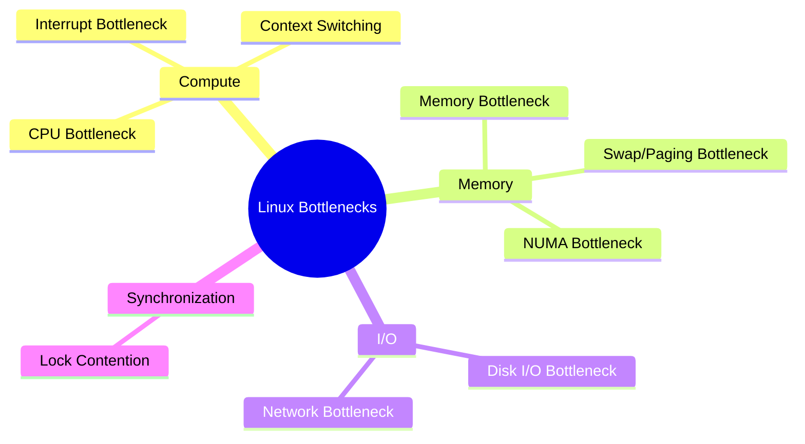

> **Alternative flowchart if mindmap fails:**

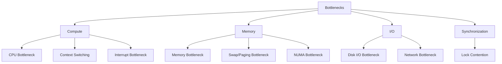

---

## 1. [[CPU Bottleneck]]

### What It Is
The CPU is **fully saturated**—all cores are busy processing work, and new tasks must wait in the run queue. The system cannot process work faster than the CPU's capacity.

### Symptoms
- `%user` or `%system` near 100%
- Run queue length (`r` in vmstat) consistently > number of CPU cores
- Load average significantly higher than CPU count
- Application response times increase linearly

### How It Works

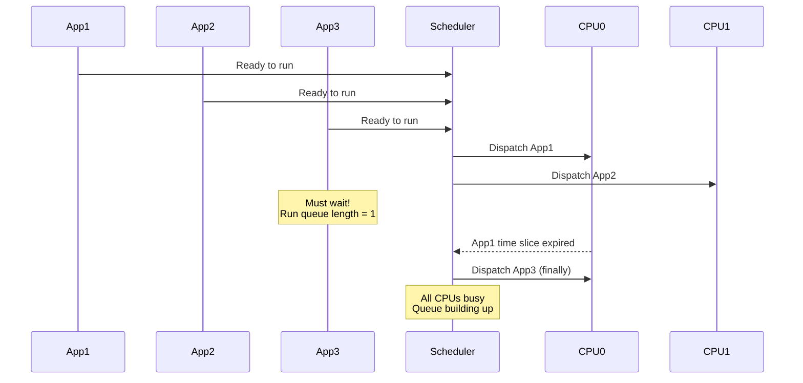

### Detection Commands
```bash
# Check CPU utilization
top -bn1 | grep "Cpu(s)"
mpstat -P ALL 1

# Check run queue
vmstat 1 5
# Watch 'r' column - should be < CPU count

# Find CPU-intensive processes
ps aux --sort=-%cpu | head -10

# Profile CPU usage
perf top -g
```

### Mitigation
- Optimize hot code paths (algorithm improvements)
- Add more CPU cores / scale horizontally
- Use efficient data structures
- Offload work to async/background processing

---

## 2. Memory Bottleneck

### What It Is
Physical RAM is **exhausted**, forcing the kernel to reclaim memory aggressively. The working set of active processes cannot fit comfortably in available RAM.

### Symptoms
- `free` shows very low available memory
- `MemAvailable` in `/proc/meminfo` drops below 10%
- kswapd uses significant CPU
- OOM killer activates
- Applications receive `ENOMEM` errors

### How It Works

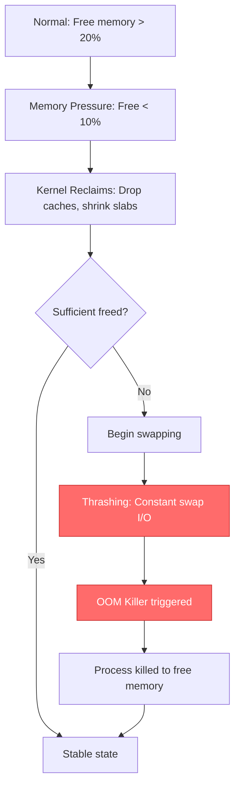

### Detection Commands
```bash
# Memory overview
free -h

# Detailed memory breakdown
cat /proc/meminfo

# Memory pressure (modern kernels)
cat /proc/pressure/memory

# Top memory consumers
ps aux --sort=-%mem | head -10

# Check for OOM events
dmesg | grep -i "out of memory"
```

### Mitigation
- Add physical RAM
- Fix memory leaks (`valgrind`, AddressSanitizer)
- Reduce application memory footprint
- Implement memory limits with cgroups

---

## 3. Swap / Paging Bottleneck

### What It Is
Excessive **swapping** occurs when the system constantly moves memory pages between RAM and swap disk. This is a specific form of memory pressure that becomes an I/O bottleneck.

### Symptoms
- `si` and `so` columns in vmstat consistently > 0
- I/O wait (`%iowait`) very high
- System feels sluggish and unresponsive
- Disk activity indicator constantly on

### How It Works

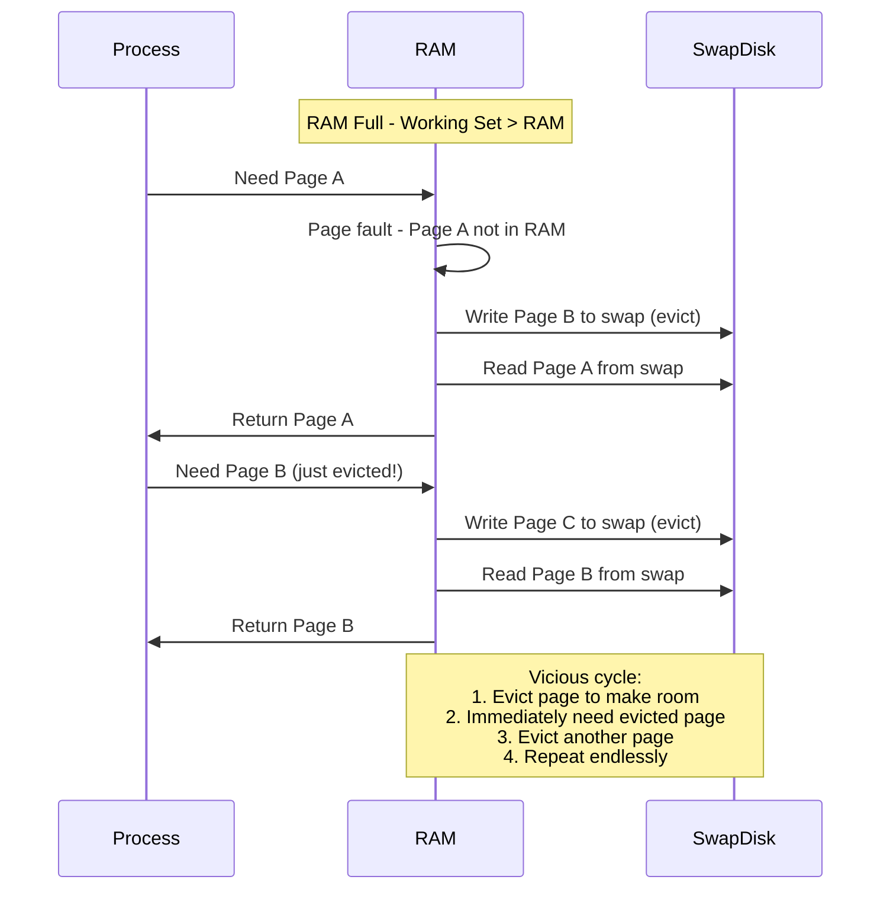

### Detection Commands
```bash
# Watch swap activity (KEY METRICS: si, so)
vmstat 1

# Swap usage overview
free -h
swapon --show

# Process swap usage
for pid in $(ls /proc | grep -E '^[0-9]+$'); do
    swap=$(awk '/VmSwap/ {print $2}' /proc/$pid/status 2>/dev/null)
    [ -n "$swap" ] && echo "PID $pid: ${swap}kB"
done | sort -t: -k2 -rn | head -10

# I/O wait
top -bn1 | grep "Cpu(s)"
```

### Mitigation
- Add physical RAM (primary solution)
- Reduce swappiness: `sysctl vm.swappiness=10`
- Kill memory-hungry processes
- Use cgroups to limit memory per service
- Consider `zswap` (compressed swap cache in RAM)

---

## 4. Disk I/O Bottleneck

### What It Is
The storage subsystem cannot keep up with **read/write requests**. Disk queue builds up, and processes block waiting for I/O completion.

### Symptoms
- `%iowait` in CPU stats exceeds 20-30%
- `await` in iostat > 10-20ms for SSD, > 50ms for HDD
- `%util` in iostat near 100%
- Application logs show slow query/read/write times

### How It Works

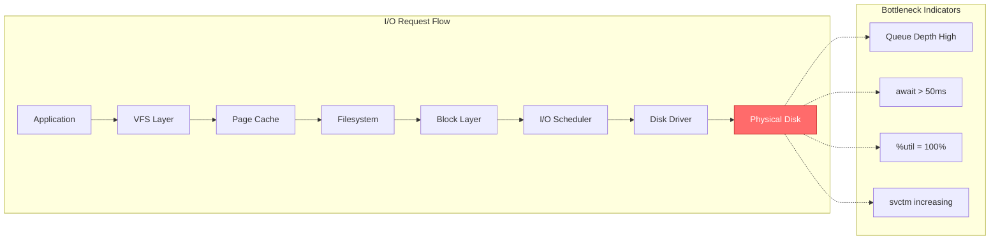

### Detection Commands
```bash
# Disk utilization and latency
iostat -x 1
# Watch: %util, await, r_await, w_await, avgqu-sz

# Per-process I/O
iotop -o

# Files opened by process
lsof -p <PID>

# Trace I/O syscalls
strace -c -e trace=read,write -p <PID>

# Block layer analysis
blktrace -d /dev/sda -o - | blkparse -i -
```

### Mitigation
- Use faster storage (NVMe > SSD > HDD)
- Increase I/O parallelism (more disks, RAID)
- Optimize application I/O patterns (batching, async I/O)
- Increase page cache / use more RAM
- Tune I/O scheduler (`mq-deadline`, `kyber` for NVMe)

---

## 5. Network Bottleneck

### What It Is
Network bandwidth is **saturated** or network stack processing cannot keep up with packet rate. This causes packet loss, retransmissions, and connection timeouts.

### Symptoms
- Network interface throughput near line rate
- TCP retransmissions increasing
- Socket receive/send buffers overflowing
- `rx_dropped` or `tx_dropped` in network stats > 0
- Applications experience timeouts

### How It Works

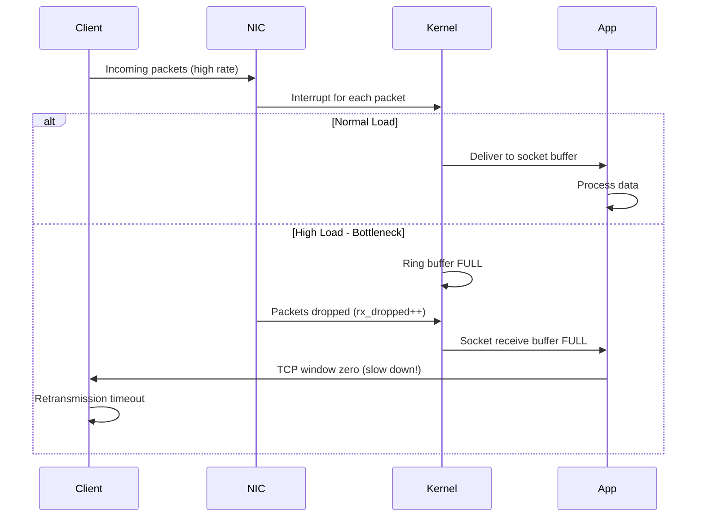

### Detection Commands
```bash
# Interface statistics
ip -s link show eth0
ethtool -S eth0 | grep -i drop

# Socket statistics
ss -s
ss -ti  # TCP info with retransmissions

# Bandwidth usage
nload eth0
iftop -i eth0

# Per-process network
nethogs eth0

# Packet capture
tcpdump -i eth0 -nn -c 1000
```

### Mitigation
- Increase bandwidth (faster NIC, more links)
- Tune kernel network parameters (buffer sizes)
- Enable NIC offloading (TSO, GSO, LRO)
- Use connection pooling / multiplexing
- Implement application-level throttling

---

## 6. Lock Contention

### What It Is
Multiple threads or processes **compete for the same lock** (mutex, spinlock, rwlock), causing threads to spin or sleep while waiting. Throughput degrades as more threads contend.

### Symptoms
- CPU usage not at 100% but throughput not increasing with more threads
- High system CPU time (`%sys`) relative to user time
- `perf lock` shows high contention on specific locks
- Application scaling plateaus or degrades with more cores

### How It Works

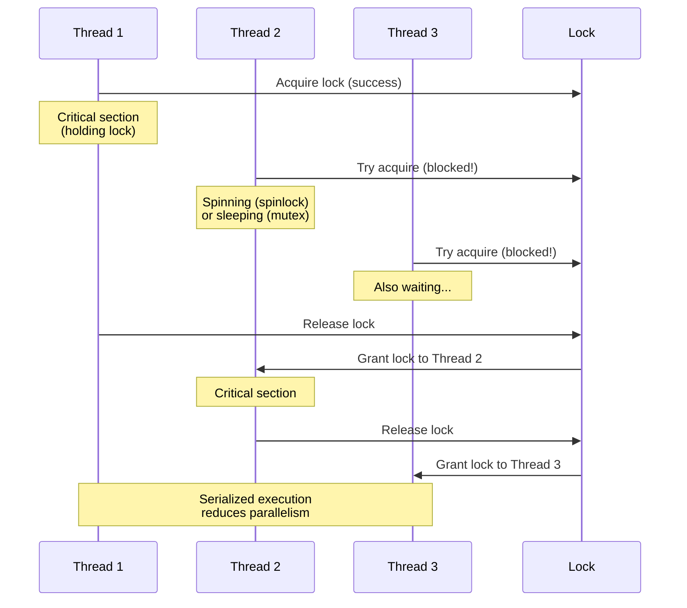

### Detection Commands
```bash
# Analyze lock contention
perf lock record -a -- sleep 10
perf lock report

# Check futex contention
perf record -e syscalls:sys_enter_futex -a -g -- sleep 10

# Check spinlock contention (kernel)
watch -n 1 'cat /proc/lock_stat'

# System-wide context switches due to locking
perf stat -e context-switches -a -- sleep 10
```

### Mitigation
- Reduce lock hold time (move work outside critical sections)
- Use lock-free data structures (RCU, atomic operations)
- Implement fine-grained locking (per-object locks)
- Use read-write locks when appropriate
- Consider sharding / partitioning data

---

## 7. Context Switching Overhead

### What It Is
Excessive **context switching** between processes or threads consumes CPU cycles for saving/restoring state, TLB flushes, and cache invalidation rather than productive work.

### Symptoms
- `cs` (context switches) in vmstat extremely high (>100,000/sec)
- `%sys` CPU time high relative to `%usr`
- Cache miss rate elevated
- Throughput lower than expected for CPU usage

### How It Works

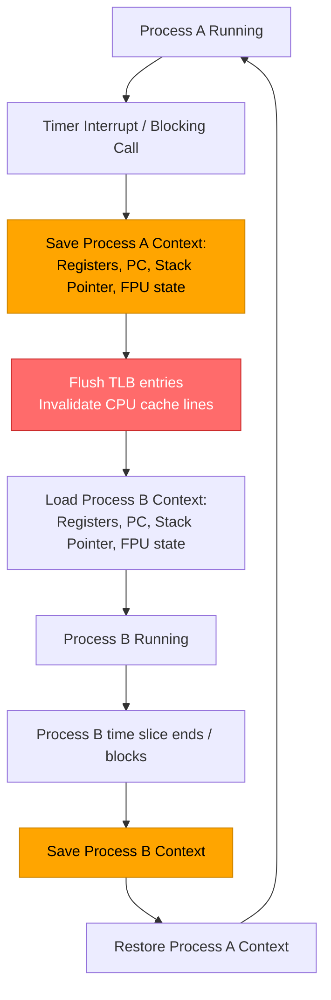

### Detection Commands
```bash
# Context switch rate
vmstat 1
# Watch 'cs' column (context switches/sec)

# System-wide stats
sar -w 1 10

# Per-process context switches
pidstat -w 1

# Voluntary vs involuntary switches
cat /proc/<PID>/status | grep ctxt
```

### Mitigation
- Reduce number of threads (use thread pools)
- Use event-driven architectures (epoll, io_uring)
- Pin processes to specific CPUs (`taskset`, cpusets)
- Use `io_uring` instead of blocking I/O
- Consider `SCHED_FIFO` or `SCHED_RR` for critical tasks

---

## 8. Interrupt Bottleneck

### What It Is
A high rate of **hardware interrupts** overwhelms the CPU, particularly when all interrupts are routed to a single core (CPU 0 by default). This leaves insufficient CPU time for application processing.

### Symptoms
- `%irq` and `%softirq` in CPU stats high (visible in `top`, `mpstat`)
- CPU 0 consistently busier than other cores
- Network packet drops despite low application load
- System feels sluggish even with "idle" CPUs

### How It Works

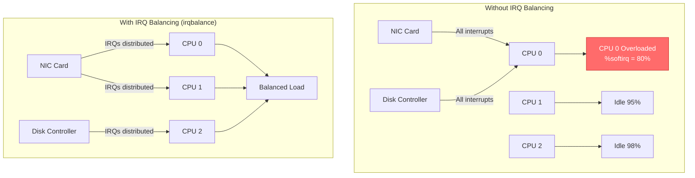

### Detection Commands
```bash
# Interrupt statistics
cat /proc/interrupts
watch -n 1 'cat /proc/interrupts | head -20'

# Per-CPU interrupt distribution
mpstat -P ALL 1
# Watch: %irq (hardware interrupts), %soft (softirqs)

# Softirq statistics
cat /proc/softirqs

# Network interrupt coalescing
ethtool -c eth0
```

### Mitigation
- Enable `irqbalance` daemon (distributes IRQs across CPUs)
- Configure IRQ affinity manually: `echo <mask> > /proc/irq/<N>/smp_affinity`
- Use interrupt coalescing (`ethtool -C eth0 rx-usecs 50`)
- Use multi-queue NICs with RSS (Receive Side Scaling)
- Offload processing to kernel threads (NAPI for networking)

---

## 9. Softirq / Soft Interrupt Bottleneck

### What It Is
**Softirqs** (software interrupts) are kernel mechanisms for deferred interrupt processing. When softirq processing dominates, it steals CPU from user applications and can cause latency spikes.

### Symptoms
- `%soft` in mpstat consistently high (>20%)
- Network softirq (`NET_RX`, `NET_TX`) processing consumes significant CPU
- `ksoftirqd` kernel threads using high CPU
- Application latency spikes under network load

### How It Works

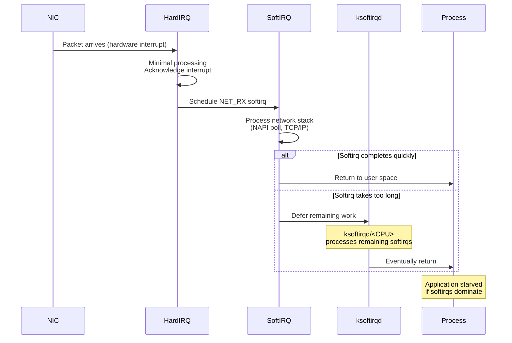

### Detection Commands
```bash
# Softirq statistics
cat /proc/softirqs
watch -n 1 'cat /proc/softirqs'

# ksoftirqd CPU usage
ps aux | grep ksoftirqd
top -H -p $(pgrep ksoftirqd)

# Network softirq budget
sysctl net.core.netdev_budget
```

### Mitigation
- Increase `net.core.netdev_budget` (process more packets per softirq)
- Use NAPI polling instead of interrupt-driven networking
- Distribute network load across queues (RSS/RPS/RFS)
- Offload to hardware (TSO, LRO, checksum offloading)
- Consider DPDK/XDP for extreme cases (kernel bypass)

---

## 10. NUMA Bottleneck (Advanced)

### What It Is
On **NUMA (Non-Uniform Memory Access)** systems, accessing memory attached to a **remote NUMA node** is significantly slower than local memory. When processes access memory on the wrong node, bandwidth suffers and latency increases.

### Symptoms
- `numastat` shows high `numa_foreign` or `numa_miss` counts
- Performance varies depending on which CPU core runs the process
- Throughput lower than expected on multi-socket systems
- Latency spikes when processes migrate across NUMA nodes

### How It Works

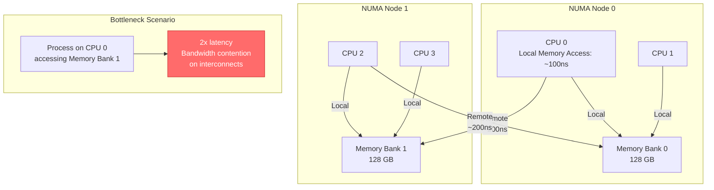

### Detection Commands
```bash
# NUMA hardware topology
numactl --hardware
lscpu | grep NUMA

# NUMA statistics
numastat
numastat -p <PID>

# Per-process NUMA policy
cat /proc/<PID>/numa_maps

# Memory allocation per node
numactl --show

# NUMA balancing statistics
cat /proc/vmstat | grep numa
```

### Mitigation
- Pin processes to specific NUMA nodes: `numactl --cpunodebind=0 --membind=0 <command>`
- Enable automatic NUMA balancing: `echo 1 > /proc/sys/kernel/numa_balancing`
- Use `libnuma` API in applications for explicit memory placement
- Design data structures to be NUMA-aware (per-node data)
- Consider `taskset` with NUMA-aware CPU sets

---

## Quick Diagnostic Matrix

| Bottleneck | Primary Metric | Key Command | Threshold | Severity |
|-----------|---------------|-------------|-----------|----------|
| CPU | `%usr + %sys` | `mpstat -P ALL 1` | > 90% | High |
| Memory | `MemAvailable` | `cat /proc/meminfo` | < 10% RAM | Critical |
| Swap/Paging | `si` + `so` | `vmstat 1` | > 0 sustained | Critical |
| Disk I/O | `%util`, `await` | `iostat -x 1` | util > 90%, await > 50ms | High |
| Network | `rx_dropped` | `ip -s link show` | > 0 | Medium |
| Lock Contention | Lock wait time | `perf lock report` | > 5% CPU | Medium |
| Context Switch | `cs` rate | `vmstat 1` | > 100k/s | Medium |
| Interrupt | `%irq + %soft` | `mpstat -P ALL 1` | > 20% on one CPU | Medium |
| Softirq | `NET_RX` count | `cat /proc/softirqs` | > 100k/s per CPU | Medium |
| NUMA | `numa_miss` | `numastat` | > 10% of accesses | Medium |

---

## Unified Diagnostic Script

```bash
#!/bin/bash
# bottleneck_scan.sh - Comprehensive bottleneck detection

echo "=== Linux Bottleneck Scanner ==="
echo "Time: $(date)"
echo

# 1. CPU Check
echo "--- CPU ---"
LOAD=$(uptime | awk -F'load average:' '{print $2}' | awk '{print $1}' | tr -d ',')
CPUS=$(nproc)
echo "Load Average (1min): $LOAD (CPUs: $CPUS)"
CPU_USAGE=$(top -bn1 | grep "Cpu(s)" | awk '{print 100 - $8}')
echo "CPU Usage: ${CPU_USAGE}%"
[ $(echo "$LOAD > $CPUS * 1.5" | bc) -eq 1 ] && echo "⚠️  CPU bottleneck likely"

# 2. Memory Check
echo
echo "--- Memory ---"
free -h | grep -E "Mem:|Swap:"
MEM_AVAIL=$(awk '/MemAvailable/ {print $2}' /proc/meminfo)
MEM_TOTAL=$(awk '/MemTotal/ {print $2}' /proc/meminfo)
MEM_PCT=$((100 - MEM_AVAIL * 100 / MEM_TOTAL))
echo "Memory Used: ${MEM_PCT}%"
[ $MEM_PCT -gt 90 ] && echo "⚠️  Memory bottleneck likely"

# 3. Swap/Paging Check
echo
echo "--- Swap/Paging ---"
SWAPIN=$(vmstat 1 2 | tail -1 | awk '{print $7}')
SWAPOUT=$(vmstat 1 2 | tail -1 | awk '{print $8}')
echo "Swap In: $SWAPIN pages/sec | Swap Out: $SWAPOUT pages/sec"
[ "$SWAPIN" -gt 0 ] || [ "$SWAPOUT" -gt 0 ] && echo "⚠️  Swapping detected - possible thrashing"

# 4. Disk I/O Check
echo
echo "--- Disk I/O ---"
IOWAIT=$(top -bn1 | grep "Cpu(s)" | awk '{print $10}' | cut -d'%' -f1)
echo "I/O Wait: ${IOWAIT}%"
[ $(echo "$IOWAIT > 20" | bc) -eq 1 ] && echo "⚠️  Disk I/O bottleneck likely"

# 5. Network Check
echo
echo "--- Network ---"
for iface in $(ls /sys/class/net | grep -v lo); do
    DROPS=$(ip -s link show $iface | grep -A1 "RX:" | tail -1 | awk '{print $3}')
    [ "$DROPS" -gt 0 ] 2>/dev/null && echo "⚠️  $iface: $DROPS rx_dropped packets"
done

# 6. Context Switching
echo
echo "--- Context Switching ---"
CS=$(vmstat 1 2 | tail -1 | awk '{print $12}')
echo "Context Switches: ${CS}/sec"
[ "$CS" -gt 100000 ] && echo "⚠️  High context switching rate"

# 7. Interrupts
echo
echo "--- Interrupts ---"
IRQ_PCT=$(mpstat 1 1 | tail -1 | awk '{print $7}')
SOFT_PCT=$(mpstat 1 1 | tail -1 | awk '{print $9}')
echo "%irq: ${IRQ_PCT}% | %soft: ${SOFT_PCT}%"
[ $(echo "$SOFT_PCT > 20" | bc) -eq 1 ] && echo "⚠️  High softirq processing"

echo
echo "=== Scan Complete ==="
```

---

## Related Notes
- [[Linux Performance Bottlenecks - Diagnosis & Debugging]]
- [[Thrashing in Linux]]
- [[Process Lifecycle]]
- [[Linux Signals]]
- [[File Permissions]]
- [[NUMA Deep Dive]]
- [[Kernel Tracing with eBPF]]
