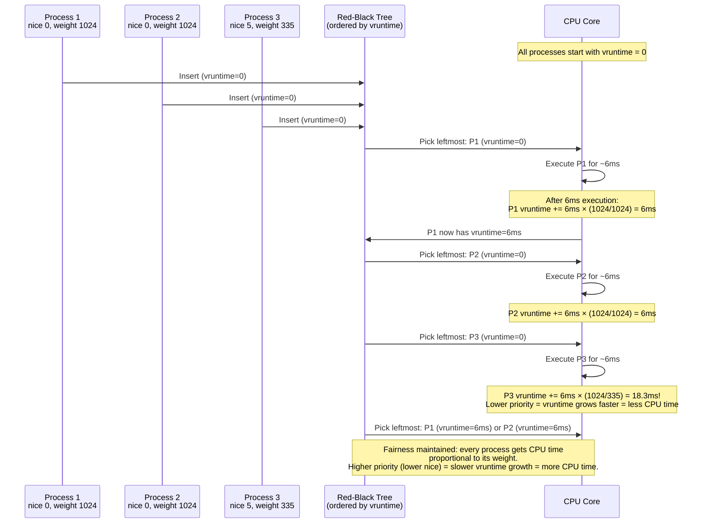

# CPU Bottleneck in Linux: A Technical Deep Dive

## Introduction: When the Processor Becomes the Prison

Every system has a limit. For compute-intensive workloads, that limit is the CPU. A **CPU bottleneck** occurs when the processor cannot execute instructions as fast as they arrive—when the demand for computation outpaces the silicon's ability to deliver it. Unlike memory bottlenecks that masquerade as other problems, CPU bottlenecks announce themselves plainly: fans spin up, load averages soar, and everything feels sluggish.

But "CPU bottleneck" is not a single condition. It's a family of related pathologies: the single-threaded application that pins one core while leaving 63 others idle, the kernel overwhelmed by a storm of system calls, the database server whose carefully tuned thread pool has become a scheduler's nightmare. Each requires different diagnostic approaches and different remedies.

This chapter will teach you to identify, measure, understand, and resolve CPU bottlenecks at every level of the stack—from the hardware performance counters in the silicon to the scheduling algorithms in the kernel to the architecture of your applications.

### Prerequisites

You'll need:
- A Linux system where you have root access (virtual machine is fine)
- Basic familiarity with `top`, `ps`, and process concepts
- A CPU-intensive workload to experiment with (we'll create some)
- Curiosity about what actually happens when your CPU hits 100%

Open a terminal. We'll start with the fundamentals and work our way up to advanced profiling techniques.

---

## Part I: Understanding CPU Architecture and Its Limits

### The Fetch-Decode-Execute Cycle

At its heart, a CPU does one thing repeatedly: it fetches an instruction from memory, decodes what that instruction means, executes it, and writes the result back. Modern processors execute billions of these cycles per second, but the fundamental limitation remains: **a CPU core can only do one thing at a time** (or a few things, with superscalar execution and hyperthreading—but far fewer than you might think).

```
Clock Cycle:  |----1----|----2----|----3----|----4----|----5----|
Core 0:       | Fetch A | Decode A| Exec A  | Write A | Fetch B |
              |         | Fetch B | Decode B| Exec B  | Write B |  (Pipelined)

Time →        0.3ns    0.6ns    0.9ns    1.2ns    1.5ns
              (at 3.0 GHz, one cycle = 0.33 nanoseconds)
```

The CPU's clock speed—3.0 GHz, 4.5 GHz, whatever—determines how many of these cycles happen per second. But clock speed is only part of the story. Modern CPUs can execute multiple instructions per cycle (superscalar), predict branches before they're evaluated, and reorder instructions to keep their execution units busy. When a CPU bottleneck occurs, it means these mechanisms are saturated: every pipeline stage is full, every execution unit is busy, and instructions are backing up waiting for resources.

### Understanding CPU Capacity

Before diagnosing problems, understand what you're working with:

```bash
# How many logical CPUs do you have?
$ nproc
16

# Detailed CPU information
$ lscpu
Architecture:            x86_64
  CPU op-mode(s):        32-bit, 64-bit
  Address sizes:         46 bits physical, 48 bits virtual
  Byte Order:            Little Endian
CPU(s):                  16
  On-line CPU(s) list:   0-15
Vendor ID:               GenuineIntel
  Model name:            Intel(R) Core(TM) i7-10875H CPU @ 2.30GHz
    CPU family:          6
    Model:               165
    Thread(s) per core:  2                    # HyperThreading enabled
    Core(s) per socket:  8                    # 8 physical cores
    Socket(s):           1                    # 1 physical package
    Stepping:            2
    CPU max MHz:         5100.0000            # Can boost to 5.1 GHz
    CPU min MHz:         800.0000             # Idles at 800 MHz
    BogoMIPS:            4608.00
Caches (sum of all):
  L1d:                   256 KiB (8 instances)
  L1i:                   256 KiB (8 instances)
  L2:                    2 MiB (8 instances)
  L3:                    16 MiB (1 instance)
NUMA:
  NUMA node(s):          1
  NUMA node0 CPU(s):     0-15
```

Key insights from this output:
- **16 logical CPUs** but only **8 physical cores**: HyperThreading gives ~30% more throughput, not 100%
- **CPU max MHz of 5.1 GHz** but **base of 2.3 GHz**: The CPU throttles up and down based on thermal headroom
- **L3 cache shared** across all cores: cache contention can create bottlenecks that look like CPU bottlenecks

### What "100% CPU" Actually Means

When `top` reports 100% CPU, it means the CPU was not idle during that sampling interval. But "not idle" can mean several things:

```bash
$ mpstat -P ALL 1 3
CPU    %usr   %nice    %sys %iowait    %irq   %soft  %steal  %guest   %idle
all   45.00    0.00   10.00    5.00    0.00    0.00    0.00    0.00   40.00
  0   95.00    0.00    5.00    0.00    0.00    0.00    0.00    0.00    0.00
  1    5.00    0.00    2.00    0.00    0.00    0.00    0.00    0.00   93.00
```

The columns tell different stories:

| Column | Meaning | Indicates |
|--------|---------|-----------|
| `%usr` | User-space application code | Your application is busy computing |
| `%sys` | Kernel code (system calls, drivers) | Your app is asking the kernel to do things |
| `%iowait` | Idle waiting for I/O to complete | **NOT a CPU problem**—disk is the bottleneck |
| `%irq` | Hardware interrupt handling | A device is interrupting the CPU frequently |
| `%soft` | Software interrupt (deferred work) | Network or storage post-processing |
| `%steal` | Time stolen by hypervisor | Your VM is being throttled |
| `%idle` | Truly doing nothing | CPU has capacity available |

**The critical distinction:** `%iowait` of 70% and `%usr` of 5% is NOT a CPU bottleneck—it's a disk bottleneck that makes the CPU wait. We'll explore this confusion in detail later.

---

## Part II: The Linux Scheduler—How CPU Time Is Allocated

Understanding CPU bottlenecks requires understanding the **Completely Fair Scheduler (CFS)**, the default Linux scheduler since kernel 2.6.23. CFS doesn't allocate fixed time slices. Instead, it maintains a virtual timeline for each process and always runs the process that's furthest behind.

### The vruntime Concept

Every process has a `vruntime` value—the amount of CPU time it has consumed, weighted by its priority. CFS maintains a red-black tree ordered by `vruntime`. The leftmost node (lowest `vruntime`) gets to run next.



### How Nice Values Affect Scheduling

The `nice` value (-20 to +19) maps to a weight that determines how fast `vruntime` accumulates:

```bash
# See the weight mapping
$ cat /sys/kernel/debug/sched/nice_weights
nice   -20:    88761
nice   -10:    11012
nice     0:     1024
nice    10:      110
nice    19:       15

# A nice -20 process gets 88761/1024 ≈ 87× more CPU than nice 0!
# A nice 19 process gets 15/1024 ≈ 0.015× the CPU of nice 0!
```

### Observing the Scheduler in Action

```bash
# See per-process scheduling statistics
$ cat /proc/<PID>/sched
bash (1234, #threads: 1)
-------------------------------------------------------------------
se.exec_start                      :      12345678.900000
se.vruntime                        :         1234.567890
se.sum_exec_runtime                :          567.890000
se.nr_migrations                   :               12
se.statistics.wait_start           :                0.000000
se.statistics.wait_max             :                3.456789
se.statistics.wait_sum             :               45.678901
se.statistics.wait_count           :                 1234
se.statistics.iowait_sum           :                2.345678
se.statistics.iowait_count         :                   56
...

# Key metrics:
# se.vruntime: Current virtual runtime (used for scheduling decisions)
# se.sum_exec_runtime: Total CPU time this process has consumed
# se.wait_sum: Total time spent waiting for CPU (HIGH = bottleneck!)
# se.nr_migrations: Times moved between CPU cores (HIGH = cache problems)
```

---

## Part III: The Four Faces of CPU Bottleneck

CPU bottlenecks manifest in four distinct patterns, each with different root causes and solutions.

### Type 1: User-Mode Saturation (High %usr)

**What it looks like:**
```bash
$ mpstat -P ALL 1
CPU    %usr   %nice    %sys %iowait    %irq   %soft  %steal   %idle
all   95.00    0.00    3.00    0.00    0.00    2.00    0.00    0.00
  0   98.00    0.00    2.00    0.00    0.00    0.00    0.00    0.00
  1   95.00    0.00    3.00    0.00    0.00    2.00    0.00    0.00
  2   92.00    0.00    4.00    0.00    0.00    4.00    0.00    0.00
```

**What's happening:** Your application code is genuinely compute-bound. The CPU is executing your instructions as fast as it can, and there's still more work to do.

**Root causes:**
- Algorithms with high computational complexity (O(n²) on large datasets)
- Tight loops doing mathematical computation
- Repeated parsing/encoding (JSON, XML, compression)
- Cryptographic operations

**How to investigate:**
```bash
# Find the hot process
$ ps aux --sort=-%cpu | head -5

# Profile it: what functions consume the most CPU?
$ sudo perf top -g -p <PID>
# Example output:
#  45.23%  libcrypto.so.3       [.] sha256_block_data_order
#  20.12%  libjson-c.so.5       [.] json_parse_string
#  15.00%  my_app               [.] process_request
#   8.00%  my_app               [.] compute_checksum

# Generate a flame graph for deeper analysis
$ sudo perf record -F 99 -g -p <PID> -- sleep 30
$ sudo perf script | ~/FlameGraph/stackcollapse-perf.pl | \
    ~/FlameGraph/flamegraph.pl > flame.svg
# Open flame.svg in browser - wide plateaus = hot functions
```

### Type 2: Kernel-Mode Saturation (High %sys)

**What it looks like:**
```bash
$ mpstat -P ALL 1
CPU    %usr   %nice    %sys %iowait    %irq   %soft  %steal   %idle
all   20.00    0.00   75.00    0.00    0.00    5.00    0.00    0.00
```

**What's happening:** The CPU is spending most of its time executing kernel code—handling system calls, managing page tables, context switching. Your application is asking the kernel to do too much work.

**Root causes:**
- Millions of small read()/write() calls instead of buffered I/O
- Excessive thread creation/destruction
- Heavy use of futex() for synchronization
- Process creation storms (fork bombs, rapid cron jobs)

**How to investigate:**
```bash
# Trace system calls: which syscalls dominate?
$ sudo strace -c -p <PID> -f
% time     seconds  usecs/call     calls    errors syscall
------ ----------- ----------- --------- --------- ----------------
 45.23    5.234567        5234      1000           read
 30.12    3.456789        3456      1000           write
 15.00    1.723456        1723      1000           futex
  5.00    0.578901         578      1000           clock_gettime
# read/write at 1000 calls each = 2000 syscalls
# If these are for 4KB each, that's only 8MB of data
# Fix: use larger buffers!

# Check context switch rate
$ pidstat -w -p <PID> 1
# cswch/s = voluntary context switches
# nvcswch/s = involuntary (forced) context switches
# If nvcswch/s > 10000, the process is being preempted too often
```

### Type 3: Single-Core Bottleneck (One CPU at 100%, Others Idle)

**What it looks like:**
```bash
$ mpstat -P ALL 1
CPU    %usr   %nice    %sys %iowait    %irq   %soft  %steal   %idle
all   12.50    0.00    2.00    0.00    0.00    0.00    0.00   85.50
  0  100.00    0.00    0.00    0.00    0.00    0.00    0.00    0.00  ← PEGGED!
  1    0.00    0.00    0.00    0.00    0.00    0.00    0.00  100.00
  2    0.00    0.00    5.00    0.00    0.00    0.00    0.00   95.00
  3    0.00    0.00    3.00    0.00    0.00    0.00    0.00   97.00
```

**What's happening:** An application or thread is pinned to a single CPU core (or simply cannot parallelize), and that core is saturated. The aggregate CPU looks fine at 14.5%, but the application is bottlenecked because it can't use the other cores.

**Root causes:**
- Single-threaded application design
- Python's Global Interpreter Lock (GIL)
- A global mutex protecting a critical section
- CPU affinity set too restrictively

**How to investigate:**
```bash
# Check CPU affinity of the process
$ taskset -cp <PID>
pid 1234's current affinity list: 0
# ^^ Pinned to CPU 0 only! If unintentional, this is the problem.

# Check thread count
$ ls /proc/<PID>/task | wc -l
1
# Single-threaded - can only use one core regardless

# Check for Python GIL (if applicable)
# Python processes using >100% CPU on multi-core are fighting the GIL
$ ps aux | grep python
user  1234  99.0  5.0  python app.py   # 99% = ~1 core max with GIL

# Check per-thread CPU usage
$ ps -eLo pid,tid,pcpu,comm --sort=-pcpu | head -10
# If one thread has high CPU and others in same process are idle,
# you have a single-thread bottleneck
```

### Type 4: Interrupt Saturation (High %irq or %soft)

**What it looks like:**
```bash
$ mpstat -P ALL 1
CPU    %usr   %nice    %sys %iowait    %irq   %soft  %steal   %idle
all   30.00    0.00   10.00    0.00   25.00   35.00    0.00    0.00
  0   15.00    0.00    5.00    0.00   40.00   40.00    0.00    0.00  ← Interrupt storm!
  1   40.00    0.00   15.00    0.00    5.00   30.00    0.00   10.00
  2   35.00    0.00   10.00    0.00   10.00   35.00    0.00   10.00
```

**What's happening:** A hardware device (usually network card or storage controller) is generating so many interrupts that the CPU spends most of its time just handling them. Softirqs are deferred interrupt processing that also consumes CPU.

**Root causes:**
- High packet rate network traffic (DDoS, busy load balancer)
- All interrupts routed to CPU 0 (default behavior)
- Interrupt coalescing disabled
- Storage controller with high IOPS

**How to investigate:**
```bash
# Which interrupts are firing?
$ cat /proc/interrupts
           CPU0       CPU1       CPU2       CPU3
  0:         34          0          0          0   IO-APIC   2-edge      timer
 16:  12345678          0          0          0   IO-APIC  16-fasteoi   eth0
# ^^ NIC interrupt ALL on CPU 0!

# Check softirq distribution
$ cat /proc/softirqs
                    CPU0       CPU1       CPU2       CPU3
          HI:          0          0          0          0
       TIMER:    1234567    1000000    1100000     980000
      NET_TX:      50000          0          0          0
      NET_RX:   50000000          0          0          0   ← ALL on CPU 0!
# Network receive processing is overwhelming CPU 0

# Check IRQ affinity
$ cat /proc/irq/16/smp_affinity
1
# Bitmask 1 = CPU 0 only. Should be "f" for 4 CPUs (all cores)
```

---

## Part IV: Diagnostic Toolkit

### The Essential Five-Command Sequence

When someone reports "the system is slow," run these five commands in order. They'll tell you if CPU is the problem and, if so, what kind:

```bash
# 1. Quick overview: is the system loaded?
$ uptime
 14:30:00 up 30 days,  5:22,  3 users,  load average: 12.50, 10.20, 8.90
# On an 8-core system: 12.50 > 8 = potential bottleneck

# 2. Per-core breakdown: the most important CPU command
$ mpstat -P ALL 1 3
# Watch for: single core at 100%, all cores uniformly high, high %iowait

# 3. Run queue: are processes waiting?
$ vmstat 1 5
# r column = run queue. If r > CPU count, bottleneck confirmed.
# wa column = I/O wait. If wa > 20%, problem is DISK not CPU.

# 4. Process identification: who's consuming CPU?
$ ps aux --sort=-%cpu | head -10

# 5. Profiling: what is the process doing?
$ sudo perf top -g -p <PID>
# Shows live function-level CPU consumption
```

### Deep Dive: Using perf Effectively

`perf` is the Swiss Army knife of CPU profiling. Here's a progressive approach:

```bash
# Level 1: What's happening now?
$ sudo perf top -g
# Interactive display of hottest functions system-wide

# Level 2: Record for offline analysis
$ sudo perf record -F 99 -g -p <PID> -- sleep 30
# -F 99: sample at 99 Hz (good balance of detail vs overhead)
# -g: capture call graphs (function call chains)
# -- sleep 30: record for 30 seconds

# Level 3: Analyze the recording
$ sudo perf report --stdio | head -50
$ sudo perf report -g graph  # Interactive TUI

# Level 4: Generate flame graph
$ sudo perf script | ~/FlameGraph/stackcollapse-perf.pl | \
    ~/FlameGraph/flamegraph.pl > flame.svg

# Level 5: CPU performance counters
$ sudo perf stat -e cycles,instructions,cache-misses,cache-references,\
    branches,branch-misses -p <PID> -- sleep 10

 Performance counter stats for process id '1234':

    45,678,901,234      cycles                    #    3.500 GHz
    23,456,789,012      instructions              #    0.51  insn per cycle
     1,234,567,890      cache-misses              #    5.23% of all cache refs
    23,456,789,012      cache-references
     4,567,890,123      branches
       123,456,789      branch-misses             #    2.70% of all branches

# Key ratios:
# IPC (instructions per cycle) = 0.51 → LOW!
#   < 0.5: memory-bound (CPU waiting for data)
#   0.5-1.5: balanced
#   > 1.5: compute-bound (CPU executing efficiently)
# Cache miss rate = 5.23% → HIGH!
#   > 5%: significant time spent waiting for memory
# Branch miss rate = 2.70% → MODERATE
#   > 2%: unpredictable code paths hurting pipeline
```

### Using Pressure Stall Information (PSI)

PSI is a modern kernel feature that tells you if processes are actually **waiting** for CPU, not just that the CPU is busy:

```bash
$ cat /proc/pressure/cpu
some avg10=60.00 avg60=45.00 avg300=30.00 total=9876543210
full avg10=25.00 avg60=18.00 avg300=10.00 total=1234567890
```

**Interpretation:**
- `some avg10=60.00`: In the last 10 seconds, **some** task(s) were stalled waiting for CPU **60% of the time**. That's 6 seconds out of every 10 where at least one process couldn't make progress.
- `full avg10=25.00`: In the last 10 seconds, **all non-idle tasks** were simultaneously stalled **25% of the time**. The entire system was blocked on CPU.

**Why PSI beats CPU% for alerting:**
- 100% CPU but PSI near 0: System is efficiently utilized, no bottleneck
- 60% CPU but PSI high: Something is wrong—check for single-core bottleneck or I/O wait disguised as CPU

```bash
# Monitor PSI in real-time
$ watch -n 1 'cat /proc/pressure/cpu'

# Set up PSI-based monitoring (cgroup v2)
$ cat /sys/fs/cgroup/system.slice/cpu.pressure
```

---

## Part V: Creating and Analyzing CPU Bottlenecks

The best way to learn diagnosis is to create controlled bottlenecks and observe them.

### Experiment 1: Single-Core Bottleneck

```bash
# Create a single-threaded CPU burner
$ cat > /tmp/cpu_burn.py << 'EOF'
import time
import sys

duration = int(sys.argv[1]) if len(sys.argv) > 1 else 60
end = time.time() + duration
print(f"Burning one core for {duration} seconds. PID: {__import__('os').getpid()}")

# Pure Python computation - will saturate one core
n = 0
while time.time() < end:
    n += 1
    # Complex enough to avoid optimization
    _ = sum(i * i for i in range(1000))
print(f"Done. Iterations: {n}")
EOF

$ python3 /tmp/cpu_burn.py 30 &
[1] 12345

# In another terminal, observe:
$ mpstat -P ALL 1
# You'll see one CPU at 100%, others idle
# Aggregate ~6% on 16-core system - looks fine but isn't!

$ cat /proc/pressure/cpu
some avg10=6.25  # 1/16 = 6.25% of CPU capacity stalled
# PSI correctly reflects that SOME tasks are waiting

# Clean up
$ kill 12345
```

### Experiment 2: Full System Saturation

```bash
# Burn ALL cores simultaneously
$ for i in $(seq 1 $(nproc)); do
    python3 /tmp/cpu_burn.py 60 &
done

# Observe the system under full load:
$ vmstat 1
procs -----------memory---------- ---swap-- -----io---- -system-- ------cpu-----
 r  b   swpd   free   buff  cache   si   so    bi    bo   in   cs us sy id wa st
16  0      0  1.2G   500M   8.5G    0    0     0    10  5k   8k 98  2  0  0  0
#  ^^                                                              ^^
#  Run queue = 16 (on 16-core system!)                             CPU saturated

$ cat /proc/pressure/cpu
some avg10=100.00 full avg10=98.00
# 100% of the time, some task is waiting for CPU
# 98% of the time, ALL tasks are waiting for CPU

# Clean up
$ killall python3
```

### Experiment 3: System Call Overload (High %sys)

```bash
# Create a syscall-intensive workload
$ cat > /tmp/syscall_burn.sh << 'EOF'
#!/bin/bash
# Does millions of tiny operations, each requiring a syscall
END=$((SECONDS+30))
echo "Syscall burner starting. PID: $$"
while [ $SECONDS -lt $END ]; do
    # Each loop iteration does multiple syscalls:
    # getpid(), open(), write(), close(), unlink()
    echo "x" > /tmp/syscall_test_$$_$RANDOM
    rm -f /tmp/syscall_test_$$_*
done
echo "Done"
EOF

$ chmod +x /tmp/syscall_burn.sh
$ /tmp/syscall_burn.sh &
[1] 23456

# Observe:
$ mpstat 1
CPU    %usr   %nice    %sys %iowait    %irq   %soft  %steal   %idle
all   15.00    0.00   85.00    0.00    0.00    0.00    0.00    0.00
#                    ^^^^^^
# System time dominates - kernel is doing all the work

$ sudo strace -c -p 23456
% time     seconds  usecs/call     calls    errors syscall
------ ----------- ----------- --------- --------- ----------------
 50.23    2.345678        2345      1000           open
 30.12    1.456789        1456      1000           write
 10.00    0.467890         467      1000           close
  5.00    0.234567         234      1000           unlink
# Confirmed: ~4000 syscalls in sampling period
# Fix: Batch operations, use larger writes
```

---

## Part VI: Fixing CPU Bottlenecks

### Decision Framework

When you've confirmed a CPU bottleneck, choose your strategy based on the type:

```
                    ┌─────────────────────────┐
                    │ CPU Bottleneck Confirmed │
                    └────────────┬────────────┘
                                 │
                    ┌────────────▼────────────┐
                    │   What does mpstat show? │
                    └────────────┬────────────┘
                                 │
          ┌──────────────────────┼──────────────────────┐
          │                      │                      │
    ┌─────▼─────┐         ┌─────▼─────┐         ┌─────▼─────┐
    │ %usr high │         │ %sys high │         │ %iowait   │
    │           │         │           │         │ high      │
    └─────┬─────┘         └─────┬─────┘         └─────┬─────┘
          │                      │                      │
    ┌─────▼─────┐         ┌─────▼─────┐         ┌─────▼─────┐
    │ Optimize  │         │ Reduce    │         │ THIS IS   │
    │ your code │         │ syscalls  │         │ A DISK    │
    │ Profile → │         │ strace -c │         │ PROBLEM   │
    │ FlameGraph│         │ Batch I/O │         │ See I/O   │
    │ Cache     │         │ io_uring  │         │ Chapter   │
    └───────────┘         └───────────┘         └───────────┘
```

### Strategy 1: Code Optimization (High %usr)

```bash
# Step 1: Find the hot function
$ sudo perf record -F 99 -g -p <PID> -- sleep 30
$ sudo perf report --stdio --sort=comm,dso,symbol | head -20

# Step 2: Analyze algorithmic complexity
# Look for:
#   - Nested loops operating on large datasets
#   - Repeated JSON/XML parsing of the same data
#   - Cryptographic operations on every request
#   - Regular expression evaluation in tight loops

# Step 3: Common quick wins
#   - Memoize expensive computations
#   - Pre-compile regular expressions (Python: re.compile())
#   - Use efficient data structures (hash tables, not linear search)
#   - Move work out of hot loops
#   - Use compiled extensions for Python (Cython, Numba)

# Example: Python optimization before/after
# BEFORE (slow):
import json
for request in requests:
    data = json.loads(request.body)  # Parse JSON every time
    result = expensive_computation(data)
    cache[request.id] = result

# AFTER (fast):
import json, functools
@functools.lru_cache(maxsize=1024)
def get_cached_result(request_id, body_hash):
    data = json.loads(body_hash)  # Parse only on cache miss
    return expensive_computation(data)
```

### Strategy 2: Reduce System Calls (High %sys)

```bash
# Step 1: Identify the dominating syscalls
$ sudo strace -c -p <PID> -f
# Focus on the syscalls with highest "seconds" column

# Step 2: Apply fixes based on the dominant syscall:

# PROBLEM: Many small read()/write() calls
# FIX: Use larger buffers
# BEFORE: read(fd, buf, 4096)  in a loop
# AFTER:  read(fd, buf, 65536) in a loop  (16x fewer syscalls)

# PROBLEM: Many open()/close() calls
# FIX: Cache file descriptors
# BEFORE: Open file, write one line, close - every time
# AFTER:  Open file once, write all lines, close once

# PROBLEM: Many stat() calls (checking file existence)
# FIX: Cache file metadata or use inotify
# BEFORE: os.path.exists(path) before every access
# AFTER:  Try to open; handle FileNotFoundError (EAFP pattern)

# PROBLEM: Many futex() calls (lock contention)
# FIX: Reduce lock scope, use lock-free structures
$ sudo perf lock record -a -- sleep 10
$ sudo perf lock report
# Shows which locks are contended
```

### Strategy 3: Parallelization (Single-Core Bottleneck)

```bash
# For command-line tasks: GNU Parallel
# BEFORE (serial):
$ for file in *.log; do
    gzip "$file"
done
# 100 files × 1 second each = 100 seconds

# AFTER (parallel):
$ parallel gzip ::: *.log
# 100 files / 8 cores × 1 second = ~12.5 seconds

# For application code:
# Python: Use multiprocessing (bypasses GIL)
from multiprocessing import Pool
with Pool(processes=8) as pool:
    results = pool.map(process_file, file_list)

# Go: Use goroutines for concurrent processing
var wg sync.WaitGroup
for _, file := range files {
    wg.Add(1)
    go func(f string) {
        defer wg.Done()
        processFile(f)
    }(file)
}
wg.Wait()

# Important: Threads vs Processes
# CPU-bound work: Use processes (bypass GIL, true parallelism)
# I/O-bound work:  Use threads or async (waiting, not computing)
```

### Strategy 4: CPU Affinity and Isolation

```bash
# Pin critical processes to specific cores
# This prevents cache thrashing from migration
$ taskset -cp 0,1,2,3 <CRITICAL_PID>   # Pin to first 4 cores
$ taskset -cp 4,5,6,7 <NOISY_PID>      # Pin noisy process elsewhere

# Isolate CPUs from the scheduler entirely
# Add to kernel command line:
# isolcpus=4,5,6,7
# Then these CPUs are only used if explicitly assigned

# Check current affinity
$ taskset -cp <PID>
pid 1234's current affinity list: 0-15  # Can run on any core

# For NUMA systems: keep process on local node
$ numactl --cpunodebind=0 --membind=0 ./my_app
```

### Strategy 5: Horizontal Scaling

When a single machine can't keep up, distribute the work:

```bash
# Load balancer pattern
# Instead of: one process handling all requests
# Use: Nginx/HAProxy → multiple backend processes

# Queue-based pattern
# Instead of: process request synchronously
# Use: Application → Redis/Kafka queue → Worker pool

# Stateless design
# Ensure each request is independent
# Use external session storage (Redis, DB)
# This allows infinite horizontal scaling
```

---

## Part VII: Common Misdiagnoses and Their Fixes

### False Positive 1: Confusing I/O Wait with CPU Bottleneck

```bash
# The misleading output:
$ top
%Cpu(s): 15.2 us,  8.1 sy,  0.0 ni,  5.0 id, 70.5 wa,  1.2 hi,  0.0 si,  0.0 st
#                                       ^^^^           ^^^^^
# Admin sees 5% idle and thinks "CPU is 95% busy!"

# The correct reading:
# %iowait = 70.5% → CPU is IDLE waiting for disk
# %usr + %sys = 23.3% → Only 23% of CPU is doing real work
# This is a DISK bottleneck, not CPU

# Confirm with:
$ iostat -x 1
# If %util is near 100% and await is high → disk problem
$ vmstat 1
# If b column (blocked processes) is high → I/O problem
```

### False Positive 2: Thermal Throttling Hiding True Capacity

```bash
# Symptoms: CPU reports 100% but throughput is lower than expected
$ cat /proc/cpuinfo | grep "cpu MHz" | sort -rn | head -4
cpu MHz         : 1199.998   # Running at 1.2 GHz!
cpu MHz         : 1199.012   # Should be 3.5 GHz

# The CPU is throttled due to heat or power limits
# 100% of 1.2 GHz = effectively 34% of 3.5 GHz

# Check for thermal events:
$ dmesg | grep -i "thermal\|throttl"
[12345.678] CPU0: Package temperature above threshold, cpu clock throttled

# Fix:
$ sudo cpupower frequency-set -g performance
# Check cooling: clean fans, verify airflow
$ sensors  # Check current temperatures
```

### False Positive 3: %steal in Virtualized Environments

```bash
$ top
%Cpu(s): 30.0 us, 10.0 sy,  0.0 ni, 20.0 id,  5.0 wa,  0.0 hi,  5.0 si, 30.0 st
#                                                                    ^^^^^
# 30% of CPU time stolen by the hypervisor!

# Your VM thinks it's 80% busy, but the hypervisor is taking 30%
# This is NOT an application problem - it's infrastructure

# Check VM instance type:
# AWS t2/t3: burst credits may be exhausted
# Shared hosting: noisy neighbor problem

# Fixes:
# - Upgrade to non-burstable instance type
# - Use dedicated tenancy
# - Check hypervisor host for overcommitment
```

---

## Part VIII: Quick Reference

### Diagnostic Command Summary

| Question | Command | What to Look For |
|----------|---------|-----------------|
| Is CPU the bottleneck? | `vmstat 1` | `r` > CPU count |
| Which type? | `mpstat -P ALL 1` | %usr vs %sys vs %iowait vs %irq |
| Single-core? | `mpstat -P ALL 1` | One core at 100%, others idle |
| Which process? | `ps aux --sort=-%cpu` | Top consumers |
| Which function? | `perf top -g -p <PID>` | Hottest functions |
| Which syscall? | `strace -c -p <PID>` | Most time-consuming syscalls |
| Run queue depth? | `vmstat 1` | `r` column |
| Are tasks waiting? | `cat /proc/pressure/cpu` | PSI `some` > 10 |
| Thermal throttling? | `turbostat --interval 1` | Bzy_MHz dropping under load |
| CPU frequency? | `cat /proc/cpuinfo \| grep MHz` | Current vs max frequency |
| Context switches? | `vmstat 1` or `pidstat -w` | `cs` > 100k/sec |
| Lock contention? | `perf lock report` | Contended locks |

### Thresholds Quick Reference

| Metric | Normal | Warning | Critical |
|--------|--------|---------|----------|
| CPU utilization (%usr + %sys) | < 60% | 60-90% | > 90% |
| Run queue (r in vmstat) | < CPU count | = CPU count | > CPU count × 2 |
| Load average / CPU count | < 1.0 | 1.0-2.0 | > 2.0 |
| PSI some avg10 | < 5 | 5-30 | > 30 |
| PSI full avg10 | < 2 | 2-15 | > 15 |
| %iowait (not CPU!) | < 5% | 5-20% | > 20% |
| Context switches/sec | < 10,000 | 10k-100k | > 100k |
| IPC (instructions/cycle) | > 1.0 | 0.5-1.0 | < 0.5 |

### Tunable Kernel Parameters

```bash
# Scheduler tuning
/proc/sys/kernel/sched_latency_ns          # Scheduling period (default ~24ms)
/proc/sys/kernel/sched_min_granularity_ns  # Minimum timeslice (default ~3ms)
/proc/sys/kernel/sched_migration_cost_ns   # Cache migration penalty

# CPU frequency
/sys/devices/system/cpu/cpu*/cpufreq/scaling_governor  # powersave/performance
/sys/devices/system/cpu/cpu*/cpufreq/scaling_max_freq   # Cap maximum frequency

# IRQ affinity
/proc/irq/*/smp_affinity                   # CPU mask for interrupt handling
/proc/irq/*/smp_affinity_list              # Human-readable CPU list
```

---

## Summary

A CPU bottleneck occurs when computational demand exceeds processing capacity. The key to effective diagnosis and resolution is understanding **which type** of CPU bottleneck you're dealing with:

1. **User-mode saturation** (%usr high): Your code needs optimization. Profile with `perf`, find hot functions, improve algorithms, add caching.

2. **Kernel-mode saturation** (%sys high): Your application makes too many system calls. Trace with `strace`, batch operations, use larger buffers, consider `io_uring`.

3. **Single-core bottleneck** (one CPU pegged): Your application cannot parallelize. Use multiprocessing, async patterns, or horizontal scaling.

4. **Interrupt saturation** (%irq/%soft high): Hardware is overwhelming the CPU. Balance IRQs across cores, enable coalescing, use multi-queue.

The diagnostic flow is always the same: `uptime` → `mpstat -P ALL` → `vmstat` → `ps` → `perf top`. Follow these steps methodically, and the root cause will reveal itself. Most importantly: **don't confuse I/O wait with CPU bottleneck**—the most common misdiagnosis in system performance analysis.