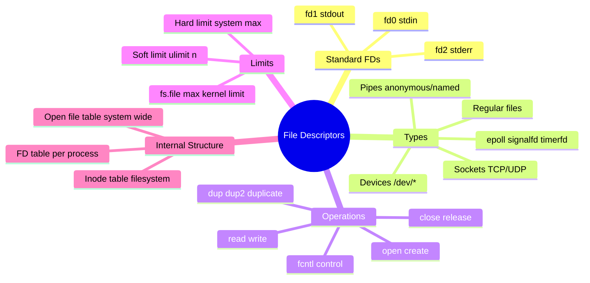
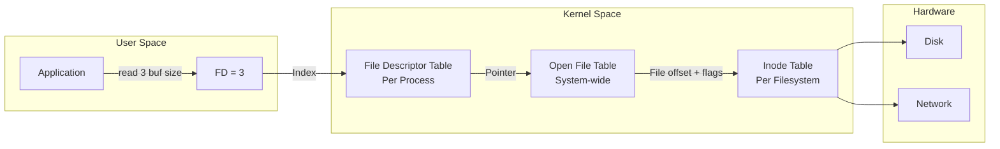
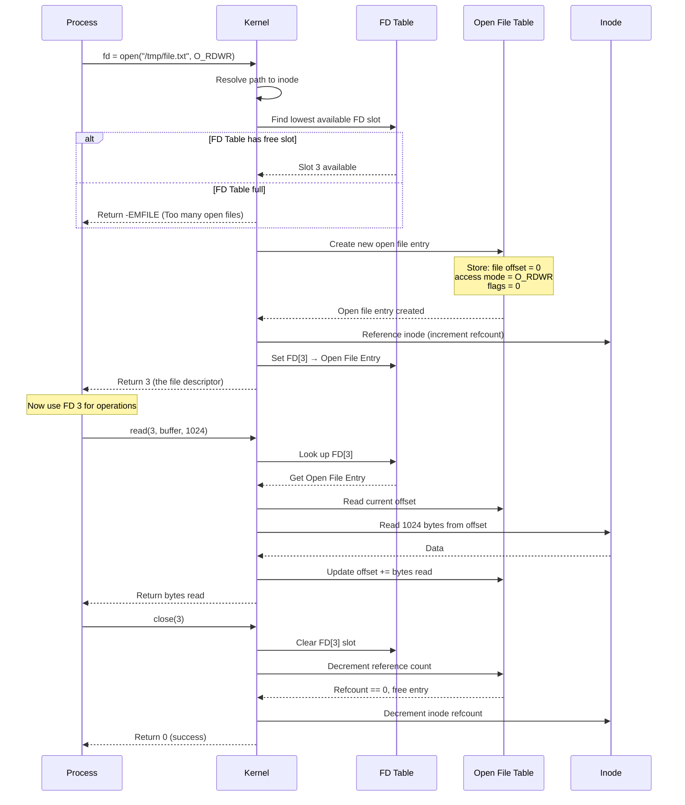
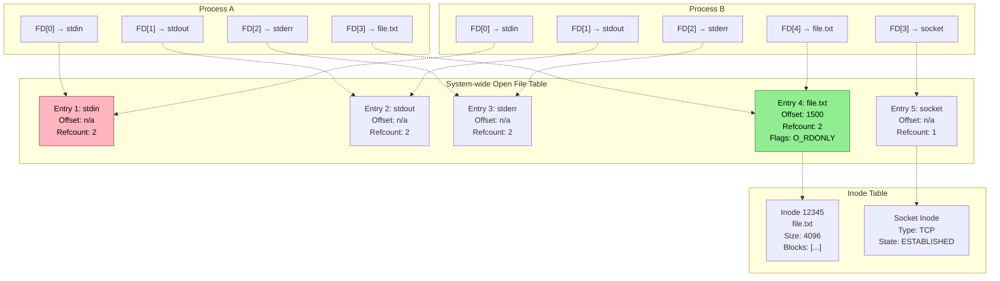
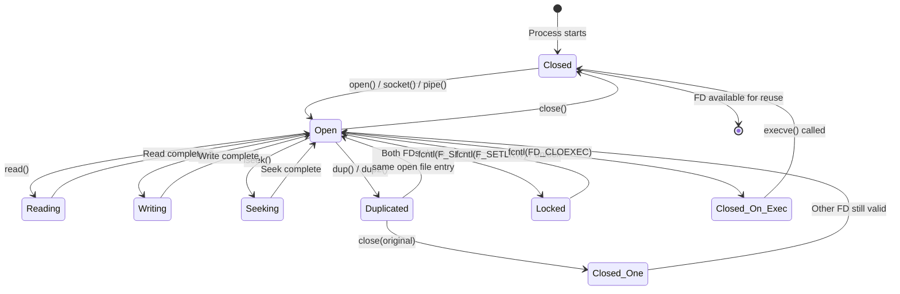
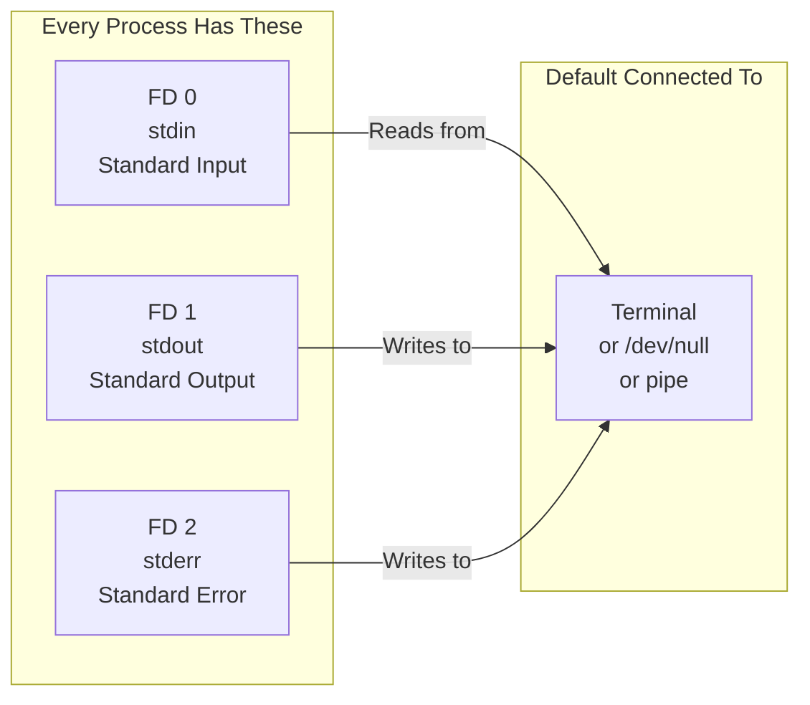
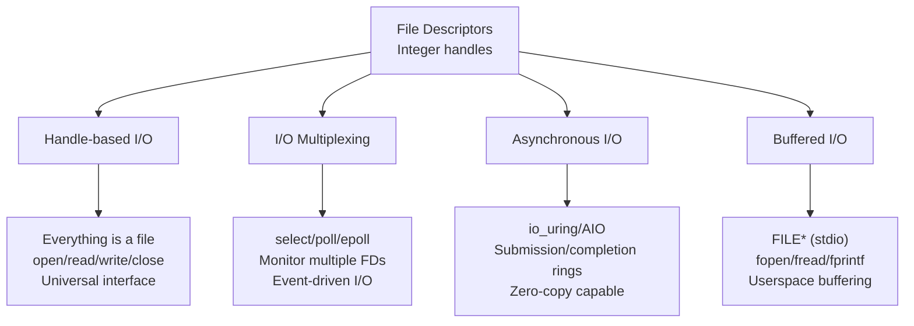

# File Descriptors in Linux

## Overview
A **file descriptor (FD)** is an integer handle that identifies an open file or I/O resource within a process. It serves as the **primary interface** between user-space applications and the kernel's I/O subsystem. Everything in Linux is accessed through file descriptors—files, sockets, pipes, devices, timers, and more.

File descriptors are **per-process**, small non-negative integers, managed by the kernel in a per-process file descriptor table.



> **Alternative flowchart if mindmap fails:**

```mermaid
graph TD
    FD[File Descriptors] --> STD[Standard FDs]
    FD --> TYPES[Resource Types]
    FD --> OPS[Operations]
    FD --> LIMITS[Limits]
    FD --> INTERN[Internal Structure]
    
    STD --> STD1[0 = stdin]
    STD --> STD2[1 = stdout]
    STD --> STD3[2 = stderr]
    
    TYPES --> T1[Regular Files]
    TYPES --> T2[Sockets]
    TYPES --> T3[Pipes]
    TYPES --> T4[Devices]
    TYPES --> T5[epoll/timerfd/signalfd]
    
    OPS --> O1[open]
    OPS --> O2[read/write]
    OPS --> O3[close]
    OPS --> O4[dup/dup2]
    OPS --> O5[fcntl]
    
    LIMITS --> L1[Soft limit ulimit -n]
    LIMITS --> L2[Hard limit]
    LIMITS --> L3[fs.file-max]
    
    INTERN --> I1[FD Table per process]
    INTERN --> I2[Open File Table global]
    INTERN --> I3[Inode Table filesystem]
```



---

## What is a File Descriptor?
A file descriptor is a **small integer** that acts as an index into the process's **file descriptor table**. Each entry points to a kernel structure representing an open I/O resource with its current state (file offset, access mode, flags).

**Key insight:** File descriptors are the **universal I/O abstraction** in Unix/Linux. Whether you're reading a file on disk, sending data over a network, or waiting for a timer—it's all done through file descriptors.



---

## How File Descriptors Work: The Mechanism

### 1. FD Allocation and Lifecycle



### 2. The Three Kernel Data Structures



### 3. File Descriptor Operations State Machine



---

## Standard File Descriptors

### The Big Three



### Redirection Examples

```bash
# Redirect stdout to file
echo "Hello" > output.txt        # echo's FD 1 → output.txt

# Redirect stderr to file
./myapp 2> errors.log            # FD 2 → errors.log

# Redirect both stdout and stderr
./myapp > all.log 2>&1           # FD 1 → all.log, FD 2 → FD 1
./myapp &> all.log               # Same as above (bash shortcut)

# Redirect stdin from file
./myapp < input.txt              # FD 0 ← input.txt

# Pipe: connect stdout of one process to stdin of another
cat file.txt | grep "pattern"    # cat's FD 1 → grep's FD 0

# Here-document
cat << EOF > output.txt          # stdin reads until EOF marker
line 1
line 2
EOF

# Close a file descriptor
./myapp 2>&-                     # Close FD 2

# Open extra file descriptors
exec 3> /tmp/extra.log           # Open FD 3 for writing
echo "log" >&3                   # Write to FD 3
exec 3>&-                        # Close FD 3
```

---

## Similar Mechanisms (Same Level of Abstraction)

File descriptors are the foundation of Unix I/O. Related abstractions include:



### Comparison Table

| Abstraction | Level | Buffering | Blocking | Use Case |
|-------------|-------|-----------|----------|----------|
| **Raw FD (open/read/write)** | Kernel syscalls | None | Default blocking | Direct I/O control |
| **stdio (FILE*)** | Userspace library | Userspace buffer | Can be non-blocking | Standard file operations |
| **epoll** | Kernel event system | N/A | Non-blocking | High-perf event loops |
| **io_uring** | Kernel ring buffer | Shared rings | Async (non-blocking) | Modern async I/O |
| **aio** | Kernel async I/O | Kernel buffer | Async | Legacy async I/O |
| **mmap** | Memory mapping | Page cache | N/A | Zero-copy file access |

---

## File Descriptor Limits

### Checking and Modifying Limits

```bash
# Check current limits
ulimit -n              # Soft limit (default: 1024 on many systems)
ulimit -Hn             # Hard limit
ulimit -Sn             # Soft limit explicitly

# Check system-wide limits
cat /proc/sys/fs/file-max       # System-wide max FDs
cat /proc/sys/fs/file-nr        # Allocated / Free / Max

# Increase soft limit (current shell)
ulimit -n 4096

# Increase hard limit (requires root or limits.conf)
# /etc/security/limits.conf:
# username soft nofile 4096
# username hard nofile 65536

# Check a process's limits
cat /proc/<PID>/limits | grep "open files"

# Count open FDs for a process
ls /proc/<PID>/fd | wc -l
lsof -p <PID> | wc -l
```

### FD Exhaustion Example

```c
/*
 * fd_exhaust.c - Demonstrate file descriptor exhaustion
 * 
 * Compile: gcc -o fd_exhaust fd_exhaust.c
 * Run: ./fd_exhaust
 */

#include <stdio.h>
#include <stdlib.h>
#include <unistd.h>
#include <fcntl.h>
#include <errno.h>
#include <string.h>

int main() {
    int fd;
    int count = 0;
    
    printf("Opening file descriptors until exhaustion...\n");
    printf("PID: %d\n\n", getpid());
    
    while (1) {
        fd = open("/dev/null", O_RDONLY);
        
        if (fd == -1) {
            printf("\n❌ Failed at FD %d: %s\n", count, strerror(errno));
            printf("Check limits: ulimit -n\n");
            printf("Or: cat /proc/%d/limits | grep 'open files'\n", getpid());
            break;
        }
        
        count++;
        if (count % 100 == 0) {
            printf("Opened %d FDs...\r", count);
            fflush(stdout);
        }
    }
    
    printf("\nCleaning up %d file descriptors...\n", count);
    // Close all FDs from 3 to count+3
    for (int i = 3; i < count + 3; i++) {
        close(i);
    }
    
    return 0;
}
```

---

## Code Example: File Descriptor Explorer

```c
/*
 * fd_explorer.c - Comprehensive file descriptor exploration
 * 
 * Compile: gcc -o fd_explorer fd_explorer.c
 * Run: ./fd_explorer
 */

#include <stdio.h>
#include <stdlib.h>
#include <string.h>
#include <unistd.h>
#include <fcntl.h>
#include <sys/types.h>
#include <sys/stat.h>
#include <sys/socket.h>
#include <dirent.h>
#include <errno.h>

void print_fd_info(int fd) {
    char path[256];
    char link_target[256];
    struct stat sb;
    
    snprintf(path, sizeof(path), "/proc/self/fd/%d", fd);
    
    ssize_t len = readlink(path, link_target, sizeof(link_target) - 1);
    if (len == -1) {
        printf("  FD %d: (invalid/closed)\n", fd);
        return;
    }
    link_target[len] = '\0';
    
    if (fstat(fd, &sb) == -1) {
        printf("  FD %d: %s (cannot stat)\n", fd, link_target);
        return;
    }
    
    printf("  FD %d → %s\n", fd, link_target);
    printf("    Type: ");
    
    if (S_ISREG(sb.st_mode))  printf("Regular file");
    else if (S_ISDIR(sb.st_mode))  printf("Directory");
    else if (S_ISCHR(sb.st_mode))  printf("Character device");
    else if (S_ISBLK(sb.st_mode))  printf("Block device");
    else if (S_ISFIFO(sb.st_mode)) printf("FIFO/pipe");
    else if (S_ISSOCK(sb.st_mode)) printf("Socket");
    else if (S_ISLNK(sb.st_mode))  printf("Symbolic link");
    else printf("Unknown");
    
    printf(" | Size: %ld bytes", sb.st_size);
    printf(" | Inode: %lu\n", sb.st_ino);
    
    // Get FD flags
    int flags = fcntl(fd, F_GETFD);
    if (flags != -1) {
        printf("    FD Flags: ");
        if (flags & FD_CLOEXEC) printf("FD_CLOEXEC ");
        if (flags == 0) printf("(none)");
        printf("\n");
    }
    
    // Get file status flags
    int status_flags = fcntl(fd, F_GETFL);
    if (status_flags != -1) {
        printf("    Status Flags: ");
        int access_mode = status_flags & O_ACCMODE;
        if (access_mode == O_RDONLY) printf("O_RDONLY ");
        else if (access_mode == O_WRONLY) printf("O_WRONLY ");
        else if (access_mode == O_RDWR) printf("O_RDWR ");
        
        if (status_flags & O_APPEND) printf("O_APPEND ");
        if (status_flags & O_NONBLOCK) printf("O_NONBLOCK ");
        if (status_flags & O_SYNC) printf("O_SYNC ");
        if (status_flags & O_ASYNC) printf("O_ASYNC ");
        printf("\n");
    }
    
    // Get current offset
    off_t offset = lseek(fd, 0, SEEK_CUR);
    if (offset != -1) {
        printf("    Current Offset: %ld\n", offset);
    }
    
    printf("\n");
}

void demonstrate_fd_operations() {
    int fd;
    int pipe_fds[2];
    int dup_fd;
    
    printf("=== File Descriptor Explorer (PID: %d) ===\n\n", getpid());
    
    // 1. Open a regular file
    printf("--- Opening a Regular File ---\n");
    fd = open("/etc/hostname", O_RDONLY);
    if (fd != -1) {
        printf("open() returned FD: %d\n\n", fd);
        print_fd_info(fd);
    }
    
    // 2. Create a pipe
    printf("--- Creating a Pipe ---\n");
    if (pipe(pipe_fds) == 0) {
        printf("pipe() returned FDs: %d (read), %d (write)\n", 
               pipe_fds[0], pipe_fds[1]);
        print_fd_info(pipe_fds[0]);
        print_fd_info(pipe_fds[1]);
    }
    
    // 3. Duplicate a file descriptor
    printf("--- Duplicating FD with dup() ---\n");
    dup_fd = dup(fd);
    if (dup_fd != -1) {
        printf("dup(%d) returned FD: %d\n", fd, dup_fd);
        printf("Both FDs share the same open file entry\n");
        print_fd_info(fd);
        print_fd_info(dup_fd);
    }
    
    // 4. Set FD_CLOEXEC
    printf("--- Setting FD_CLOEXEC ---\n");
    int old_flags = fcntl(fd, F_GETFD);
    fcntl(fd, F_SETFD, old_flags | FD_CLOEXEC);
    printf("Set FD_CLOEXEC on FD %d (will close on exec)\n\n", fd);
    print_fd_info(fd);
    
    // 5. List all open FDs
    printf("=== All Open File Descriptors ===\n\n");
    DIR *d = opendir("/proc/self/fd");
    if (d) {
        struct dirent *entry;
        while ((entry = readdir(d)) != NULL) {
            if (entry->d_name[0] == '.') continue;
            int fd_num = atoi(entry->d_name);
            print_fd_info(fd_num);
        }
        closedir(d);
    }
    
    // Cleanup
    close(fd);
    close(dup_fd);
    close(pipe_fds[0]);
    close(pipe_fds[1]);
    
    printf("=== Done ===\n");
}

int main() {
    demonstrate_fd_operations();
    return 0;
}
```

### FD Monitor Script

```bash
#!/bin/bash
# fd_monitor.sh - Monitor file descriptor usage

PID=${1:-$$}

echo "=== File Descriptor Monitor for PID $PID ==="
echo

while true; do
    clear
    echo "=== FD Monitor - PID $PID - $(date) ==="
    echo
    
    # Count total FDs
    FD_COUNT=$(ls /proc/$PID/fd 2>/dev/null | wc -l)
    echo "Total Open FDs: $FD_COUNT"
    
    # Show limits
    SOFT_LIMIT=$(cat /proc/$PID/limits 2>/dev/null | grep "open files" | awk '{print $4}')
    HARD_LIMIT=$(cat /proc/$PID/limits 2>/dev/null | grep "open files" | awk '{print $5}')
    echo "Soft Limit: $SOFT_LIMIT | Hard Limit: $HARD_LIMIT"
    
    # Usage percentage
    if [ -n "$SOFT_LIMIT" ] && [ "$SOFT_LIMIT" != "unlimited" ]; then
        USAGE_PCT=$((FD_COUNT * 100 / SOFT_LIMIT))
        echo "Usage: ${USAGE_PCT}%"
        
        if [ $USAGE_PCT -gt 80 ]; then
            echo "⚠️  WARNING: Approaching FD limit!"
        fi
    fi
    
    echo
    echo "--- FD Breakdown by Type ---"
    
    # Count by type
    REGULAR=$(ls -l /proc/$PID/fd 2>/dev/null | grep -c "regular")
    SOCKET=$(ls -l /proc/$PID/fd 2>/dev/null | grep -c "socket")
    PIPE=$(ls -l /proc/$PID/fd 2>/dev/null | grep -c "pipe")
    DEVICE=$(ls -l /proc/$PID/fd 2>/dev/null | grep -c "dev")
    ANON_INODE=$(ls -l /proc/$PID/fd 2>/dev/null | grep -c "anon_inode")
    
    echo "  Regular files: $REGULAR"
    echo "  Sockets:       $SOCKET"
    echo "  Pipes:         $PIPE"
    echo "  Devices:       $DEVICE"
    echo "  Anon inodes:   $ANON_INODE"
    
    echo
    echo "--- Top FD Consumers (if available) ---"
    ls -l /proc/$PID/fd 2>/dev/null | awk '{print $NF}' | sort | uniq -c | sort -rn | head -5
    
    echo
    echo "Press Ctrl+C to exit"
    sleep 2
done
```

---

## Important Notes

| Concept | Description |
|---------|-------------|
| **FD 0,1,2** | Reserved for stdin, stdout, stderr by convention |
| **Lowest Available** | open() always returns the lowest unused FD number |
| **FD_CLOEXEC** | Close-on-exec flag; FD automatically closed after execve() |
| **O_CLOEXEC** | Set FD_CLOEXEC atomically at open time (prevents race conditions) |
| **dup/dup2** | Duplicate FDs sharing the same open file entry (including offset) |
| **FD Passing** | Unix domain sockets can pass FDs between processes (SCM_RIGHTS) |
| **Leaked FDs** | Forgetting to close FDs leads to resource exhaustion |
| **/proc/PID/fd/** | Directory listing all open FDs for a process |

### Common FD-Related Errors

| Error | Code | Cause |
|-------|------|-------|
| **EMFILE** | Too many open files | Per-process FD limit reached |
| **ENFILE** | File table overflow | System-wide open file table full |
| **EBADF** | Bad file descriptor | Using closed or invalid FD |
| **EBADFD** | File descriptor in bad state | Operation not valid for this FD type |

### Best Practices

```c
// ❌ Bad: Potential FD leak on error
int fd = open("file.txt", O_RDONLY);
if (some_operation() == -1) {
    return -1;  // FD leaked!
}
close(fd);

// ✅ Good: Always clean up
int fd = open("file.txt", O_RDONLY);
if (fd == -1) return -1;
if (some_operation() == -1) {
    close(fd);  // Clean up on error
    return -1;
}
close(fd);

// ✅ Better: Use O_CLOEXEC for thread safety
int fd = open("file.txt", O_RDONLY | O_CLOEXEC);

// ✅ Best: Scoped cleanup (GCC/Clang extension)
int fd __attribute__((cleanup(close_fd))) = open("file.txt", O_RDONLY);
```

---

## Related Notes
- [[Process Memory Layout]]
- [[Process Lifecycle]]
- [[Linux Signals]]
- [[Common Bottlenecks in Linux Systems]]
- [[Linux Performance Bottlenecks - Diagnosis & Debugging]]
- [[File Permissions]]
- [[I/O Multiplexing - select poll epoll]]
- [[Socket Programming]]
- [[Pipe and FIFO]]
- [[io_uring Deep Dive]]
