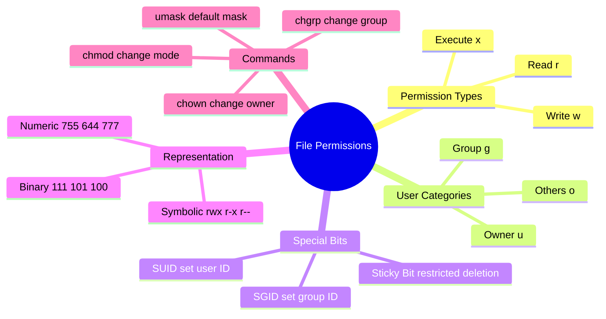
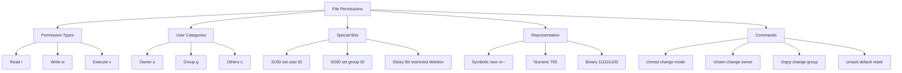
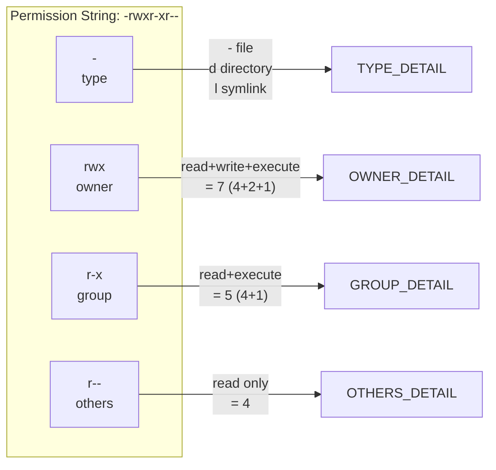
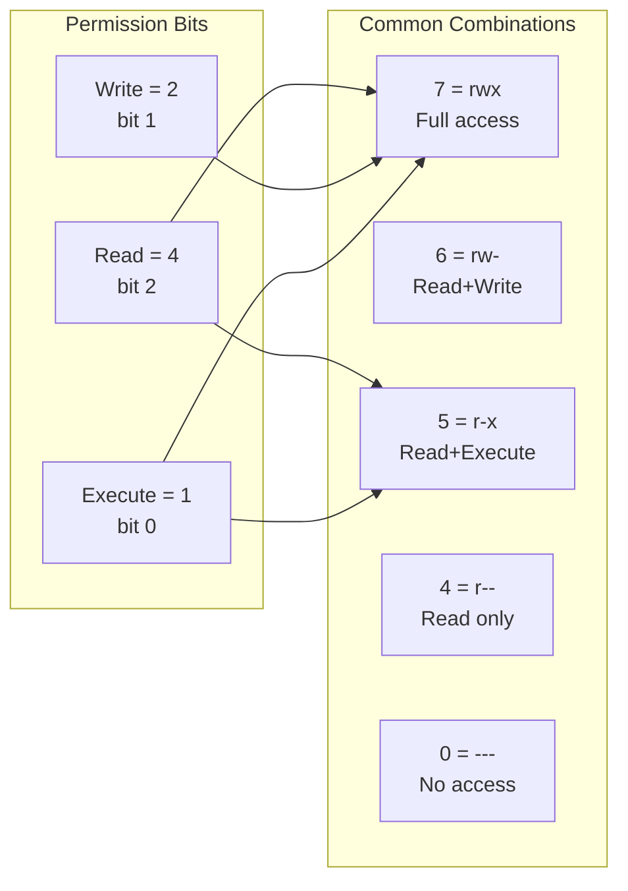
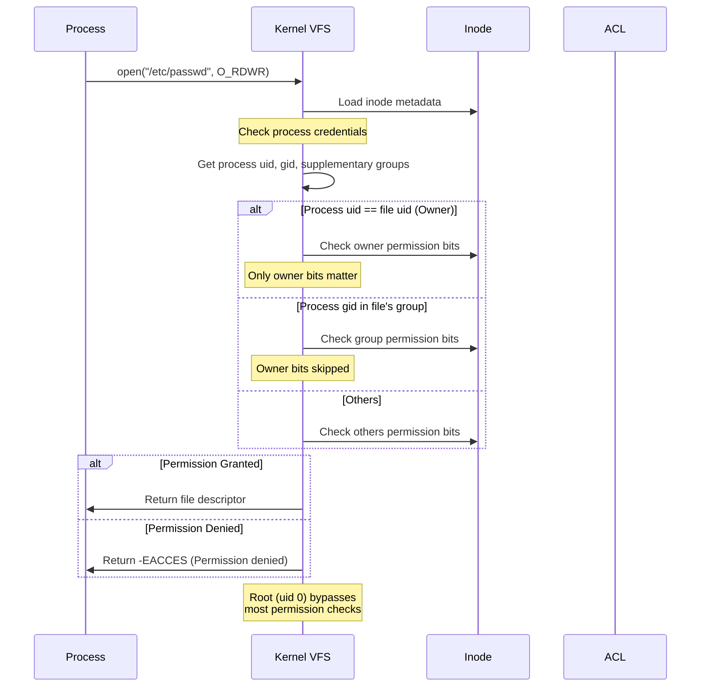
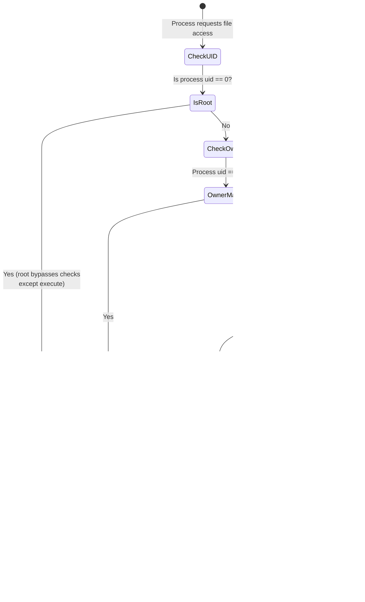
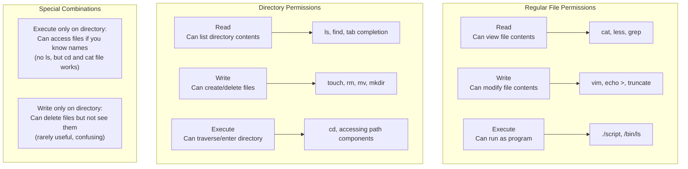
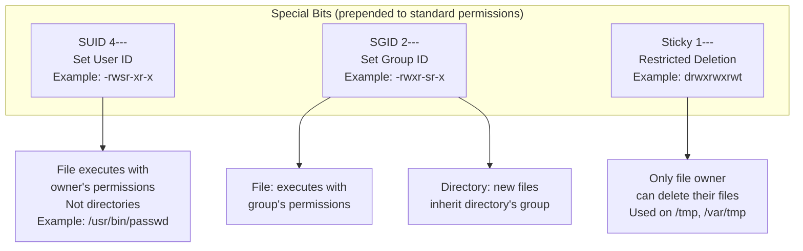
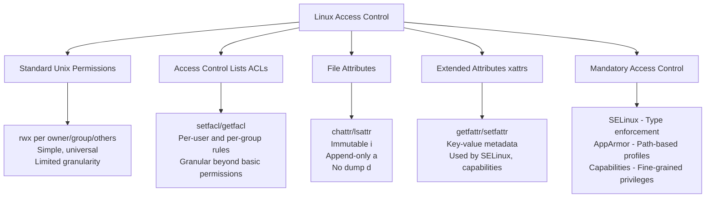

# File Permissions in Linux

## Overview
**File permissions** are the core access control mechanism in Linux that determines **who can do what** with files and directories. Every file and directory has an owner, a group, and a set of permission bits that control read, write, and execute access for three categories of users.

This Unix-style permission model is the **first layer of security** in Linux systems, working alongside ACLs, SELinux, and capabilities.



> **Alternative flowchart if mindmap fails:**



---

## What are File Permissions?
File permissions are **metadata attached to each file and directory** that define access rights. They are stored in the inode and checked by the kernel on every file operation (open, read, write, execute).

### Permission Structure



### Numeric (Octal) Representation



---

## How File Permissions Work: The Mechanism

### 1. Permission Check Flow



### 2. Permission Evaluation Algorithm



### 3. Permission Bits in Detail



---

## Special Permission Bits

### SUID, SGID, and Sticky Bit



### Common Examples

```bash
# SUID: passwd needs root privileges to modify /etc/shadow
ls -l /usr/bin/passwd
# -rwsr-xr-x 1 root root 59976 Jan 15 /usr/bin/passwd

# SGID: Files created in shared directory inherit group
ls -ld /shared/project
# drwxrws--- 2 root developers 4096 Jun 8 /shared/project

# Sticky: Users can only delete their own files in /tmp
ls -ld /tmp
# drwxrwxrwt 20 root root 4096 Jun 8 /tmp
```

---

## Similar Mechanisms (Same Level of Abstraction)

File permissions are part of a broader **access control ecosystem**:



### Comparison Table

| Mechanism | Granularity | Scope | Persistence | Complexity | Use Case |
|-----------|------------|-------|-------------|------------|----------|
| **Standard Permissions** | 3 categories | Per file/dir | In inode | Simple | General file access |
| **POSIX ACLs** | Per user/group | Per file/dir | Extended attributes | Moderate | Complex sharing scenarios |
| **File Attributes** | System-wide flags | Per file | In inode | Simple | Immutability, append-only |
| **SELinux** | Type/label based | System-wide policy | Extended attributes | High | Mandatory access control |
| **AppArmor** | Path-based profiles | Per application | Policy files | Moderate | Application confinement |
| **Capabilities** | Privilege bits | Per process | Runtime | Moderate | Split root privileges |
| **umask** | Default mask | Per process/session | Runtime | Simple | Default permission control |

---

## Commands and Usage

### chmod - Change Mode

```bash
# Symbolic mode
chmod u+x script.sh          # Add execute for owner
chmod g-w file.txt           # Remove write for group
chmod o= file.txt            # Remove all permissions for others
chmod u+rwx,g+rx,o= file    # Set owner rwx, group rx, others nothing
chmod a+x script.sh          # Add execute for all (a = ugo)

# Numeric mode
chmod 755 script.sh          # rwx r-x r-x (standard for executables)
chmod 644 file.txt           # rw- r-- r-- (standard for regular files)
chmod 600 ~/.ssh/id_rsa      # rw- --- --- (private key)
chmod 777 shared_dir         # rwx rwx rwx (dangerous! everyone can modify)
chmod 750 project_dir        # rwx r-x --- (owner full, group read, others nothing)

# Recursive
chmod -R 755 /var/www/html   # Change all files and directories

# Special bits
chmod 4755 /usr/bin/myapp    # SUID (4) + rwx r-x r-x
chmod 2755 /shared/dir       # SGID (2) + rwx r-x r-x
chmod 1777 /tmp              # Sticky (1) + rwx rwx rwx

# Symbolic for special bits
chmod u+s /usr/bin/myapp     # Set SUID
chmod g+s /shared/dir        # Set SGID
chmod +t /tmp                # Set Sticky bit
```

### chown - Change Owner

```bash
# Change owner
chown alice file.txt
chown alice:developers file.txt   # Change owner and group

# Change only group (same as chgrp)
chown :developers file.txt

# Recursive
chown -R alice:developers /home/alice

# Reference (copy from another file)
chown --reference=template.txt newfile.txt
```

### umask - Default Permission Mask

```bash
# View current umask
umask
# Output: 0022 (typical) or 0002

# How umask works:
# Default file permissions:  666 (rw-rw-rw-)
# Default dir permissions:   777 (rwxrwxrwx)
# Subtract umask:            -022
# Resulting file:             644 (rw-r--r--)
# Resulting dir:              755 (rwxr-xr-x)

# Set umask
umask 027  # Owner: all, Group: rx, Others: nothing
umask 077  # Owner: all, Group: nothing, Others: nothing (private)

# Common umask values
# 022: 755 dirs, 644 files (default on many systems)
# 002: 775 dirs, 664 files (shared group access)
# 077: 700 dirs, 600 files (completely private)
```

### getfacl / setfacl - Access Control Lists

```bash
# View ACLs
getfacl file.txt
# file: file.txt
# owner: alice
# group: developers
# user::rw-
# user:bob:r--       # Bob has read access
# group::r--
# mask::r--
# other::---

# Set ACLs
setfacl -m u:bob:rw file.txt       # Give bob read+write
setfacl -m g:qa:rx script.sh       # Give qa group read+execute
setfacl -m o:: file.txt            # Remove others access

# Remove ACLs
setfacl -x u:bob file.txt          # Remove bob's entry
setfacl -b file.txt                # Remove all extended ACLs

# Default ACLs on directory (inherited by new files)
setfacl -m d:u:bob:rw /shared/dir  # New files inherit this
setfacl -m d:g:developers:rwx /shared/dir

# Recursive
setfacl -R -m u:bob:rx /var/www
```

---

## Code Example: Permission Checker

```c
/*
 * permission_checker.c - Analyze file permissions
 * 
 * Compile: gcc -o permcheck permission_checker.c
 * Usage: ./permcheck <file_path>
 */

#include <stdio.h>
#include <stdlib.h>
#include <sys/stat.h>
#include <sys/types.h>
#include <pwd.h>
#include <grp.h>
#include <unistd.h>
#include <string.h>

void print_permissions(mode_t mode) {
    // File type
    if (S_ISREG(mode))  printf("-");
    else if (S_ISDIR(mode))  printf("d");
    else if (S_ISLNK(mode))  printf("l");
    else if (S_ISFIFO(mode)) printf("p");
    else if (S_ISSOCK(mode)) printf("s");
    else if (S_ISBLK(mode))  printf("b");
    else if (S_ISCHR(mode))  printf("c");
    else printf("?");
    
    // Owner permissions
    printf("%c", (mode & S_IRUSR) ? 'r' : '-');
    printf("%c", (mode & S_IWUSR) ? 'w' : '-');
    if (mode & S_ISUID)
        printf("%c", (mode & S_IXUSR) ? 's' : 'S');
    else
        printf("%c", (mode & S_IXUSR) ? 'x' : '-');
    
    // Group permissions
    printf("%c", (mode & S_IRGRP) ? 'r' : '-');
    printf("%c", (mode & S_IWGRP) ? 'w' : '-');
    if (mode & S_ISGID)
        printf("%c", (mode & S_IXGRP) ? 's' : 'S');
    else
        printf("%c", (mode & S_IXGRP) ? 'x' : '-');
    
    // Others permissions
    printf("%c", (mode & S_IROTH) ? 'r' : '-');
    printf("%c", (mode & S_IWOTH) ? 'w' : '-');
    if (mode & S_ISVTX)
        printf("%c", (mode & S_IXOTH) ? 't' : 'T');
    else
        printf("%c", (mode & S_IXOTH) ? 'x' : '-');
}

void print_numeric(mode_t mode) {
    int owner = ((mode & S_IRUSR) ? 4 : 0) + 
                ((mode & S_IWUSR) ? 2 : 0) + 
                ((mode & S_IXUSR) ? 1 : 0);
    int group = ((mode & S_IRGRP) ? 4 : 0) + 
                ((mode & S_IWGRP) ? 2 : 0) + 
                ((mode & S_IXGRP) ? 1 : 0);
    int others = ((mode & S_IROTH) ? 4 : 0) + 
                 ((mode & S_IWOTH) ? 2 : 0) + 
                 ((mode & S_IXOTH) ? 1 : 0);
    
    int special = ((mode & S_ISUID) ? 4 : 0) + 
                  ((mode & S_ISGID) ? 2 : 0) + 
                  ((mode & S_ISVTX) ? 1 : 0);
    
    if (special > 0)
        printf("%d%d%d%d", special, owner, group, others);
    else
        printf("%d%d%d", owner, group, others);
}

void check_access(const char *path) {
    printf("\n=== Access Check for Current Process (PID: %d) ===\n", getpid());
    printf("Current UID: %d, GID: %d\n", getuid(), getgid());
    
    if (access(path, R_OK) == 0) printf("✅ Read access:    GRANTED\n");
    else printf("❌ Read access:    DENIED (%s)\n", strerror(errno));
    
    if (access(path, W_OK) == 0) printf("✅ Write access:   GRANTED\n");
    else printf("❌ Write access:   DENIED (%s)\n", strerror(errno));
    
    if (access(path, X_OK) == 0) printf("✅ Execute access: GRANTED\n");
    else printf("❌ Execute access: DENIED (%s)\n", strerror(errno));
}

int main(int argc, char *argv[]) {
    if (argc != 2) {
        fprintf(stderr, "Usage: %s <file_path>\n", argv[0]);
        return 1;
    }
    
    const char *path = argv[1];
    struct stat sb;
    
    if (stat(path, &sb) == -1) {
        perror("stat failed");
        return 1;
    }
    
    printf("=== File Permission Analysis ===\n");
    printf("File: %s\n", path);
    printf("Type: ");
    if (S_ISREG(sb.st_mode))  printf("Regular file\n");
    else if (S_ISDIR(sb.st_mode))  printf("Directory\n");
    else if (S_ISLNK(sb.st_mode))  printf("Symbolic link\n");
    else printf("Special file\n");
    
    printf("\n--- Permission Representation ---\n");
    printf("Symbolic: ");
    print_permissions(sb.st_mode);
    printf("\n");
    
    printf("Numeric:  ");
    print_numeric(sb.st_mode);
    printf("\n");
    
    printf("Binary:   ");
    for (int i = 11; i >= 0; i--) {
        printf("%d", (sb.st_mode >> i) & 1);
        if (i == 9 || i == 6 || i == 3) printf(" ");
    }
    printf("\n");
    
    // Owner and group info
    struct passwd *pw = getpwuid(sb.st_uid);
    struct group *gr = getgrgid(sb.st_gid);
    
    printf("\n--- Ownership ---\n");
    printf("Owner: %s (UID: %d)\n", 
           pw ? pw->pw_name : "unknown", sb.st_uid);
    printf("Group: %s (GID: %d)\n", 
           gr ? gr->gr_name : "unknown", sb.st_gid);
    
    printf("\n--- Special Bits ---\n");
    if (sb.st_mode & S_ISUID) printf("⚠️  SUID bit set (executes as owner)\n");
    else printf("   SUID: not set\n");
    
    if (sb.st_mode & S_ISGID) printf("⚠️  SGID bit set (executes as group / inherits group)\n");
    else printf("   SGID: not set\n");
    
    if (sb.st_mode & S_ISVTX) printf("⚠️  Sticky bit set (restricted deletion)\n");
    else printf("   Sticky: not set\n");
    
    // Check current process access
    check_access(path);
    
    // Security recommendations
    printf("\n--- Security Assessment ---\n");
    
    if ((sb.st_mode & (S_IWOTH | S_IXOTH)) == (S_IWOTH | S_IXOTH)) {
        printf("⚠️  WARNING: World-writable and executable (0777)\n");
    } else if (sb.st_mode & S_IWOTH) {
        printf("⚠️  WARNING: World-writable file\n");
    }
    
    if (sb.st_mode & S_ISUID && sb.st_uid == 0) {
        printf("⚠️  WARNING: SUID root executable (potential privilege escalation)\n");
    }
    
    if (S_ISDIR(sb.st_mode) && !(sb.st_mode & S_ISVTX) && 
        (sb.st_mode & S_IWOTH)) {
        printf("⚠️  WARNING: World-writable directory without sticky bit\n");
    }
    
    if ((sb.st_mode & 0777) == 0) {
        printf("⚠️  WARNING: No permissions for anyone\n");
    }
    
    printf("\n=== Analysis Complete ===\n");
    
    return 0;
}
```

**Example usage:**
```bash
# Compile and test
gcc -o permcheck permission_checker.c
./permcheck /etc/passwd
./permcheck /tmp
./permcheck ~/.ssh/id_rsa
```

---

## Important Notes

| Concept | Description |
|---------|-------------|
| **Execute on Directories** | Execute (`x`) on a directory means **traverse** permission, not execution |
| **Root Bypass** | Root (UID 0) bypasses permission checks except execute (needs at least one `x`) |
| **Permission Order** | Owner permissions checked first; if owner, group/others ignored |
| **umask Inheritance** | New files inherit umask; child processes inherit parent's umask |
| **ACL Precedence** | ACL mask can override group permissions; check with `getfacl` |
| **Sticky Bit History** | Originally kept frequently-used programs in swap; now prevents deletion |
| **Directory Write** | Write to directory allows file creation/deletion, not necessarily file modification |
| **Symlink Permissions** | Symlinks always show `lrwxrwxrwx`; actual permissions are on the target |

### Permission Debugging Quick Reference

```bash
# Why can't I read this file?
namei -l /path/to/file          # Shows permissions for each path component

# What permissions does this process have?
cat /proc/$$/status | grep -E "Uid|Gid"
id                              # Show current user and groups

# Why did this operation fail?
strace -e trace=file cat /path/to/file 2>&1 | grep EACCES

# What are the effective permissions?
stat -c "%a %n" file.txt        # Numeric
stat -c "%A %n" file.txt        # Symbolic

# Find files with dangerous permissions
find / -type f -perm -o+w 2>/dev/null      # World-writable files
find / -type f -perm -4000 2>/dev/null     # SUID files
find / -type d -perm -o+w ! -perm -1000 2>/dev/null  # World-writable dirs without sticky bit
```

---

## Related Notes
- [[Process Lifecycle]]
- [[SELinux and Mandatory Access Control]]
- [[File System Internals]]
- [[User and Group Management]]
- [[Access Control Lists (ACLs)]]
- [[Linux Security Fundamentals]]
- [[Umask Deep Dive]]
