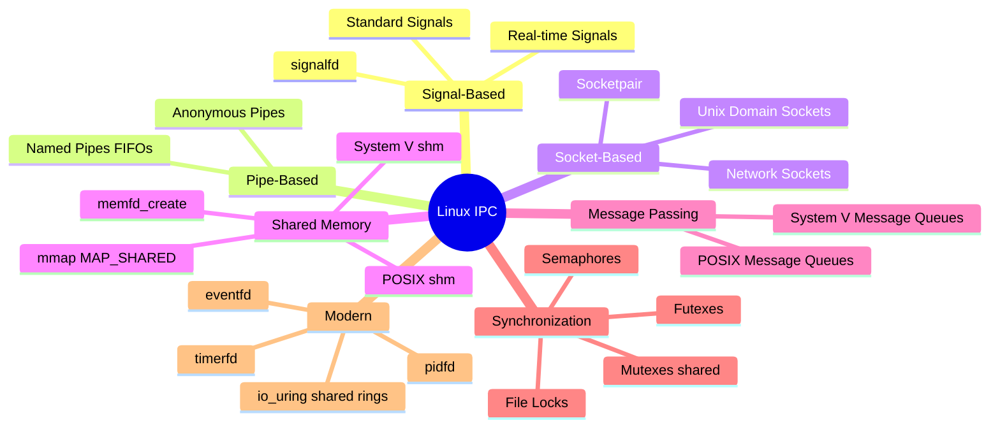
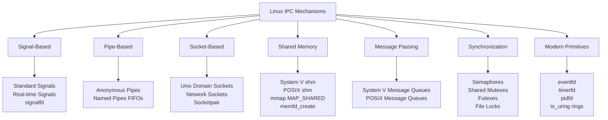
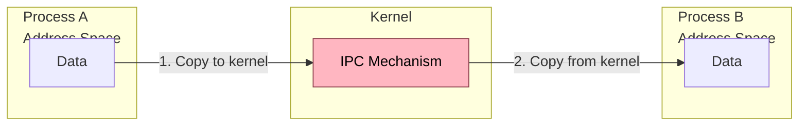
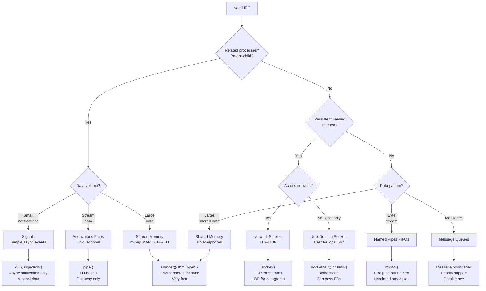
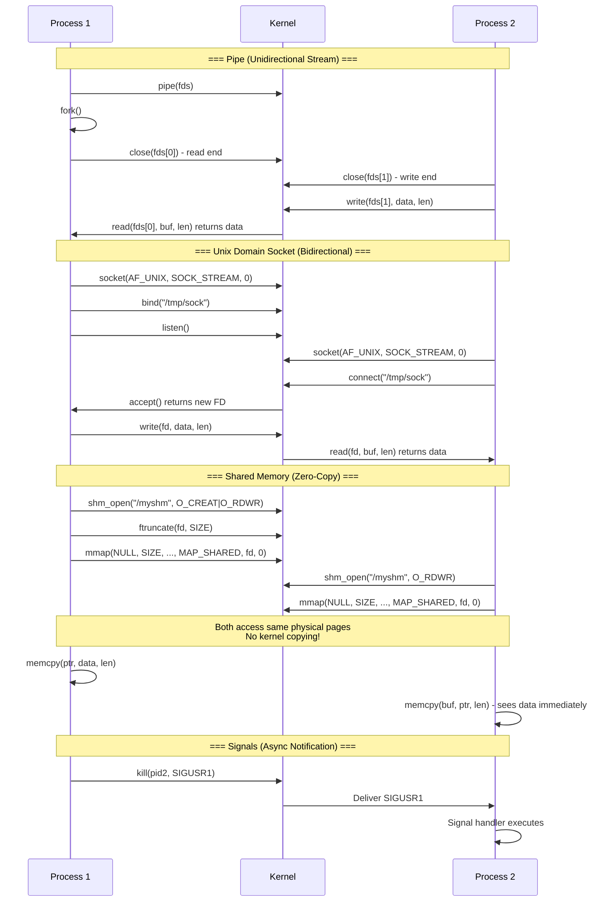
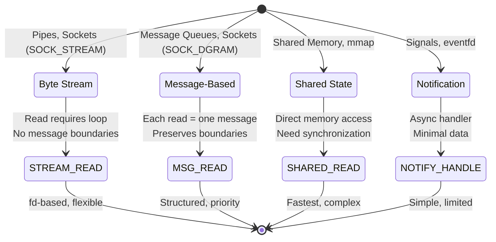
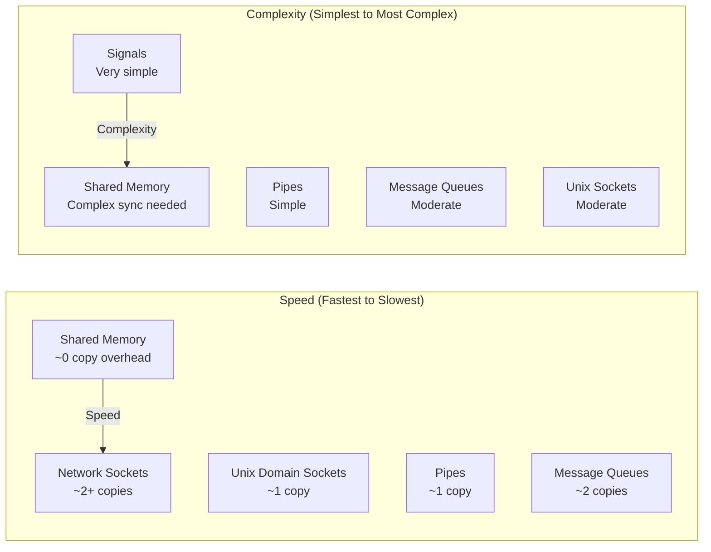

Here's an Obsidian wiki note about **IPC (Inter-Process Communication) Overview** in Linux, following the same format:

---

# IPC Overview in Linux

## Overview
**Inter-Process Communication (IPC)** is a set of mechanisms that allow processes to **exchange data, synchronize actions, and coordinate operations**. Since Linux processes have isolated address spaces, IPC provides the bridges that enable cooperation between processes—from simple signals to complex shared memory systems.

IPC mechanisms range from **simple notifications** (signals) to **high-bandwidth data transfer** (shared memory) to **structured message passing** (Unix domain sockets).



> **Alternative flowchart if mindmap fails:**



---

## What is IPC?
IPC (Inter-Process Communication) refers to the **mechanisms provided by the operating system** that enable separate processes to exchange information and coordinate their activities. Since each process has its own virtual address space, IPC mechanisms must go through the kernel to transfer data between address spaces.

**Key insight:** The choice of IPC mechanism depends on:
- **Data volume** (signals for notifications, shared memory for bulk data)
- **Performance requirements** (shared memory is fastest, sockets most flexible)
- **Relationship between processes** (parent-child, unrelated, network-remote)
- **Synchronization needs** (blocking, non-blocking, asynchronous)



---

## How IPC Works: The Mechanism

### 1. IPC Decision Flowchart



### 2. IPC Mechanism Sequence Comparison



### 3. IPC by Data Flow Pattern



---

## Complete IPC Comparison

### Performance Characteristics



### Comprehensive Comparison Table

| Mechanism | Data Unit | Direction | Scope | Persistence | Speed | FD-Based? | Key Syscalls |
|-----------|-----------|-----------|-------|-------------|-------|-----------|-------------|
| **Signals** | Signal number + minimal data | Unidirectional | Same host | No | Fast | No (signalfd: yes) | `kill()`, `sigaction()` |
| **Anonymous Pipe** | Byte stream | Unidirectional | Related processes | No | Fast | Yes | `pipe()`, `read()`, `write()` |
| **Named Pipe (FIFO)** | Byte stream | Unidirectional | Any local processes | Filesystem entry | Fast | Yes | `mkfifo()`, `open()` |
| **Unix Domain Socket** | Stream/Datagram | Bidirectional | Any local processes | Filesystem entry | Fast | Yes | `socket()`, `bind()`, `connect()` |
| **Network Socket** | Stream/Datagram | Bidirectional | Any host | No | Moderate | Yes | `socket()`, `connect()`, `accept()` |
| **System V Message Queue** | Structured messages | Bidirectional | Any local processes | Kernel (until removal) | Moderate | No | `msgget()`, `msgsnd()`, `msgrcv()` |
| **POSIX Message Queue** | Structured messages | Bidirectional | Any local processes | Kernel (until removal) | Moderate | No (mqd_t) | `mq_open()`, `mq_send()`, `mq_receive()` |
| **System V Shared Memory** | Raw memory | Bidirectional | Any local processes | Kernel (until removal) | Very Fast | No | `shmget()`, `shmat()`, `shmdt()` |
| **POSIX Shared Memory** | Raw memory | Bidirectional | Any local processes | Kernel (until removal) | Very Fast | Yes | `shm_open()`, `mmap()` |
| **mmap MAP_SHARED** | Raw memory | Bidirectional | Related or file-backed | File-backed | Very Fast | Yes | `mmap()`, `msync()` |
| **eventfd** | 64-bit counter | Notification | Any local processes | No | Fast | Yes | `eventfd()`, `read()`, `write()` |
| **File Locks** | Advisory lock | Synchronization | Any local processes | File-backed | N/A | Yes | `flock()`, `fcntl(F_SETLK)` |
| **Futex** | Word in memory | Synchronization | Any local (shared mem) | No | Very Fast | No | `futex()` |
| **Semaphores** | Counter | Synchronization | Any local processes | Kernel (until removal) | Fast | No | `semget()`, `semop()` |

---

## Code Examples by IPC Type

### 1. Anonymous Pipe (Parent-Child)

```c
/*
 * ipc_pipe.c - Anonymous pipe between parent and child
 * Compile: gcc -o ipc_pipe ipc_pipe.c
 */

#include <stdio.h>
#include <stdlib.h>
#include <string.h>
#include <unistd.h>
#include <sys/wait.h>

int main() {
    int pipefd[2];
    pid_t pid;
    char write_msg[] = "Hello from parent!";
    char read_buf[256];
    
    if (pipe(pipefd) == -1) {
        perror("pipe");
        exit(1);
    }
    
    pid = fork();
    
    if (pid == -1) {
        perror("fork");
        exit(1);
    }
    
    if (pid == 0) {
        // Child process: read from pipe
        close(pipefd[1]);  // Close unused write end
        
        ssize_t n = read(pipefd[0], read_buf, sizeof(read_buf));
        printf("Child received: '%s' (%zd bytes)\n", read_buf, n);
        
        close(pipefd[0]);
        exit(0);
    } else {
        // Parent process: write to pipe
        close(pipefd[0]);  // Close unused read end
        
        printf("Parent sending: '%s'\n", write_msg);
        write(pipefd[1], write_msg, strlen(write_msg) + 1);
        
        close(pipefd[1]);
        wait(NULL);
    }
    
    return 0;
}
```

### 2. Unix Domain Socket (Client-Server)

```c
/*
 * ipc_unix_socket.c - Unix domain socket server and client
 * Compile: gcc -o ipc_unix_socket ipc_unix_socket.c
 * Run server: ./ipc_unix_socket server
 * Run client: ./ipc_unix_socket client
 */

#include <stdio.h>
#include <stdlib.h>
#include <string.h>
#include <unistd.h>
#include <sys/socket.h>
#include <sys/un.h>
#include <sys/wait.h>

#define SOCK_PATH "/tmp/ipc_demo.sock"
#define BUFFER_SIZE 256

void run_server() {
    int server_fd, client_fd;
    struct sockaddr_un addr;
    char buffer[BUFFER_SIZE];
    
    // Remove old socket file if exists
    unlink(SOCK_PATH);
    
    // Create socket
    server_fd = socket(AF_UNIX, SOCK_STREAM, 0);
    if (server_fd == -1) {
        perror("socket");
        exit(1);
    }
    
    // Bind
    memset(&addr, 0, sizeof(addr));
    addr.sun_family = AF_UNIX;
    strncpy(addr.sun_path, SOCK_PATH, sizeof(addr.sun_path) - 1);
    
    if (bind(server_fd, (struct sockaddr*)&addr, sizeof(addr)) == -1) {
        perror("bind");
        exit(1);
    }
    
    // Listen
    if (listen(server_fd, 5) == -1) {
        perror("listen");
        exit(1);
    }
    
    printf("Server listening on %s\n", SOCK_PATH);
    
    // Accept
    client_fd = accept(server_fd, NULL, NULL);
    if (client_fd == -1) {
        perror("accept");
        exit(1);
    }
    
    // Receive message
    ssize_t n = read(client_fd, buffer, sizeof(buffer));
    printf("Server received: '%s' (%zd bytes)\n", buffer, n);
    
    // Send response
    char *response = "Message received by server!";
    write(client_fd, response, strlen(response) + 1);
    
    close(client_fd);
    close(server_fd);
    unlink(SOCK_PATH);
}

void run_client() {
    int client_fd;
    struct sockaddr_un addr;
    char buffer[BUFFER_SIZE];
    
    // Create socket
    client_fd = socket(AF_UNIX, SOCK_STREAM, 0);
    if (client_fd == -1) {
        perror("socket");
        exit(1);
    }
    
    // Connect
    memset(&addr, 0, sizeof(addr));
    addr.sun_family = AF_UNIX;
    strncpy(addr.sun_path, SOCK_PATH, sizeof(addr.sun_path) - 1);
    
    if (connect(client_fd, (struct sockaddr*)&addr, sizeof(addr)) == -1) {
        perror("connect");
        exit(1);
    }
    
    // Send message
    char *message = "Hello from client!";
    printf("Client sending: '%s'\n", message);
    write(client_fd, message, strlen(message) + 1);
    
    // Receive response
    ssize_t n = read(client_fd, buffer, sizeof(buffer));
    printf("Client received: '%s' (%zd bytes)\n", buffer, n);
    
    close(client_fd);
}

int main(int argc, char *argv[]) {
    if (argc != 2) {
        fprintf(stderr, "Usage: %s [server|client]\n", argv[0]);
        exit(1);
    }
    
    if (strcmp(argv[1], "server") == 0) {
        run_server();
    } else if (strcmp(argv[1], "client") == 0) {
        run_client();
    } else {
        fprintf(stderr, "Invalid argument: use 'server' or 'client'\n");
        exit(1);
    }
    
    return 0;
}
```

### 3. POSIX Shared Memory

```c
/*
 * ipc_shm.c - POSIX shared memory demo
 * Compile: gcc -o ipc_shm ipc_shm.c -lrt
 * Run writer: ./ipc_shm write
 * Run reader: ./ipc_shm read
 */

#include <stdio.h>
#include <stdlib.h>
#include <string.h>
#include <unistd.h>
#include <sys/mman.h>
#include <sys/stat.h>
#include <fcntl.h>

#define SHM_NAME "/ipc_demo_shm"
#define SHM_SIZE 4096

typedef struct {
    int counter;
    char message[256];
    int ready;  // Simple flag for synchronization
} shared_data_t;

void run_writer() {
    int fd;
    shared_data_t *shared;
    
    // Create shared memory object
    fd = shm_open(SHM_NAME, O_CREAT | O_RDWR, 0666);
    if (fd == -1) {
        perror("shm_open");
        exit(1);
    }
    
    // Set size
    if (ftruncate(fd, SHM_SIZE) == -1) {
        perror("ftruncate");
        exit(1);
    }
    
    // Map to virtual address space
    shared = mmap(NULL, SHM_SIZE, PROT_READ | PROT_WRITE, 
                  MAP_SHARED, fd, 0);
    if (shared == MAP_FAILED) {
        perror("mmap");
        exit(1);
    }
    
    // Write data
    shared->counter = 42;
    strcpy(shared->message, "Hello from shared memory writer!");
    shared->ready = 1;
    
    printf("Writer: Data written to shared memory\n");
    printf("  counter = %d\n", shared->counter);
    printf("  message = '%s'\n", shared->message);
    printf("\nWaiting for reader to finish... (press Enter to cleanup)\n");
    getchar();
    
    // Cleanup
    munmap(shared, SHM_SIZE);
    close(fd);
    shm_unlink(SHM_NAME);
    printf("Writer: Shared memory cleaned up\n");
}

void run_reader() {
    int fd;
    shared_data_t *shared;
    
    // Open existing shared memory
    fd = shm_open(SHM_NAME, O_RDWR, 0666);
    if (fd == -1) {
        perror("shm_open");
        fprintf(stderr, "Run writer first!\n");
        exit(1);
    }
    
    // Map to virtual address space
    shared = mmap(NULL, SHM_SIZE, PROT_READ | PROT_WRITE,
                  MAP_SHARED, fd, 0);
    if (shared == MAP_FAILED) {
        perror("mmap");
        exit(1);
    }
    
    // Wait for writer to signal data is ready
    printf("Reader: Waiting for data...\n");
    while (!shared->ready) {
        usleep(10000);  // 10ms polling (use proper sync in production!)
    }
    
    // Read data
    printf("Reader: Data read from shared memory\n");
    printf("  counter = %d\n", shared->counter);
    printf("  message = '%s'\n", shared->message);
    
    // Cleanup
    munmap(shared, SHM_SIZE);
    close(fd);
    printf("Reader: Done\n");
}

int main(int argc, char *argv[]) {
    if (argc != 2) {
        fprintf(stderr, "Usage: %s [write|read]\n", argv[0]);
        exit(1);
    }
    
    if (strcmp(argv[1], "write") == 0) {
        run_writer();
    } else if (strcmp(argv[1], "read") == 0) {
        run_reader();
    } else {
        fprintf(stderr, "Invalid argument: use 'write' or 'read'\n");
        exit(1);
    }
    
    return 0;
}
```

### 4. Message Queue

```c
/*
 * ipc_msgq.c - POSIX message queue demo
 * Compile: gcc -o ipc_msgq ipc_msgq.c -lrt
 * Run sender: ./ipc_msgq send
 * Run receiver: ./ipc_msgq receive
 */

#include <stdio.h>
#include <stdlib.h>
#include <string.h>
#include <unistd.h>
#include <mqueue.h>
#include <fcntl.h>
#include <sys/stat.h>

#define MQ_NAME "/ipc_demo_mq"
#define MAX_MSG_SIZE 256
#define MAX_MSGS 10

typedef struct {
    int priority;
    char text[MAX_MSG_SIZE];
} message_t;

void run_sender() {
    mqd_t mq;
    struct mq_attr attr;
    
    // Set queue attributes
    attr.mq_flags = 0;
    attr.mq_maxmsg = MAX_MSGS;
    attr.mq_msgsize = sizeof(message_t);
    attr.mq_curmsgs = 0;
    
    // Create message queue
    mq = mq_open(MQ_NAME, O_CREAT | O_WRONLY, 0666, &attr);
    if (mq == (mqd_t)-1) {
        perror("mq_open");
        exit(1);
    }
    
    // Send messages with different priorities
    message_t msgs[] = {
        {1, "Low priority message"},
        {10, "High priority message!"},
        {5, "Medium priority message"},
        {1, "Another low priority message"},
    };
    
    for (int i = 0; i < 4; i++) {
        if (mq_send(mq, (char*)&msgs[i], sizeof(message_t), msgs[i].priority) == -1) {
            perror("mq_send");
            break;
        }
        printf("Sent: [Priority %d] '%s'\n", msgs[i].priority, msgs[i].text);
    }
    
    mq_close(mq);
    printf("Sender done\n");
}

void run_receiver() {
    mqd_t mq;
    message_t msg;
    unsigned int priority;
    struct mq_attr attr;
    
    // Open message queue
    mq = mq_open(MQ_NAME, O_RDONLY);
    if (mq == (mqd_t)-1) {
        perror("mq_open");
        fprintf(stderr, "Run sender first!\n");
        exit(1);
    }
    
    // Get queue attributes
    mq_getattr(mq, &attr);
    printf("Messages in queue: %ld\n", attr.mq_curmsgs);
    
    // Receive messages (highest priority first!)
    printf("\nReceiving messages (highest priority first):\n");
    while (attr.mq_curmsgs > 0) {
        ssize_t n = mq_receive(mq, (char*)&msg, sizeof(message_t), &priority);
        if (n == -1) {
            perror("mq_receive");
            break;
        }
        printf("Received: [Priority %u] '%s'\n", priority, msg.text);
        mq_getattr(mq, &attr);
    }
    
    mq_close(mq);
    mq_unlink(MQ_NAME);
    printf("Receiver done, queue removed\n");
}

int main(int argc, char *argv[]) {
    if (argc != 2) {
        fprintf(stderr, "Usage: %s [send|receive]\n", argv[0]);
        exit(1);
    }
    
    if (strcmp(argv[1], "send") == 0) {
        run_sender();
    } else if (strcmp(argv[1], "receive") == 0) {
        run_receiver();
    } else {
        fprintf(stderr, "Invalid argument: use 'send' or 'receive'\n");
        exit(1);
    }
    
    return 0;
}
```

---

## IPC Usage Dashboard Script

```bash
#!/bin/bash
# ipc_dashboard.sh - Display all IPC resources on the system

echo "========================================="
echo "  Linux IPC Dashboard"
echo "  Time: $(date)"
echo "========================================="

# System V Shared Memory
echo -e "\n--- System V Shared Memory ---"
ipcs -m 2>/dev/null | tail -n +4 || echo "  No System V shared memory segments"

# System V Message Queues
echo -e "\n--- System V Message Queues ---"
ipcs -q 2>/dev/null | tail -n +4 || echo "  No System V message queues"

# System V Semaphores
echo -e "\n--- System V Semaphores ---"
ipcs -s 2>/dev/null | tail -n +4 || echo "  No System V semaphore arrays"

# POSIX Shared Memory
echo -e "\n--- POSIX Shared Memory (/dev/shm) ---"
ls -la /dev/shm/ 2>/dev/null | grep -v "^total" || echo "  No POSIX shared memory objects"

# POSIX Message Queues
echo -e "\n--- POSIX Message Queues (/dev/mqueue) ---"
ls -la /dev/mqueue/ 2>/dev/null | grep -v "^total" || echo "  No POSIX message queues (mount required)"

# Named Pipes (FIFOs)
echo -e "\n--- Named Pipes (FIFOs) ---"
find /tmp /var/tmp -type p 2>/dev/null | head -10 || echo "  No named pipes found in /tmp"

# Unix Domain Sockets
echo -e "\n--- Unix Domain Sockets ---"
ss -xlp 2>/dev/null | head -10 || echo "  No Unix domain sockets"

# Active Pipes (between processes)
echo -e "\n--- Active Anonymous Pipes ---"
lsof -c 2>/dev/null | grep -i "pipe" | head -5 || echo "  Use lsof for pipe details"

echo -e "\n========================================="
echo "  IPC Dashboard Complete"
echo "========================================="
```

---

## Important Notes

| Concept | Description |
|---------|-------------|
| **Persistence** | Some IPC objects outlive the creating process (message queues, shm, FIFOs) |
| **Namespace** | IPC objects can be isolated per container via IPC namespace (`CLONE_NEWIPC`) |
| **Cleanup** | System V IPC must be explicitly removed (`ipcrm`); POSIX IPC uses `unlink` |
| **Permissions** | All IPC objects have ownership and permissions (UID/GID/mode) |
| **FD Passing** | Unix domain sockets can pass file descriptors between processes (`SCM_RIGHTS`) |
| **Synchronization** | Shared memory requires external synchronization (semaphores, futexes, atomics) |
| **Security** | Abstract Unix sockets have no filesystem permissions—rely on Linux capabilities |
| **Resource Limits** | IPC resources limited by kernel parameters (`kernel.msgmax`, `kernel.shmmax`, etc.) |

### Choosing the Right IPC

| Use Case | Recommended IPC |
|----------|----------------|
| Parent-child communication | Anonymous pipes |
| Simple async notification | Signals or eventfd |
| Local client-server | Unix domain sockets |
| Network communication | TCP/UDP sockets |
| High-performance data sharing | Shared memory + semaphores |
| Structured message passing | POSIX message queues |
| Producer-consumer with many consumers | Named pipes (FIFOs) |
| Event loop integration | eventfd, signalfd, timerfd |
| File descriptor passing | Unix domain sockets with `SCM_RIGHTS` |

---

## Related Notes
- [[File Descriptors]]
- [[Linux Signals]]
- [[Process Lifecycle]]
- [[Process Memory Layout]]
- [[Pipe and FIFO Deep Dive]]
- [[Socket Programming]]
- [[Shared Memory Deep Dive]]
- [[Synchronization Primitives]]
- [[I/O Multiplexing - select poll epoll]]
- [[Common Bottlenecks in Linux Systems]]
