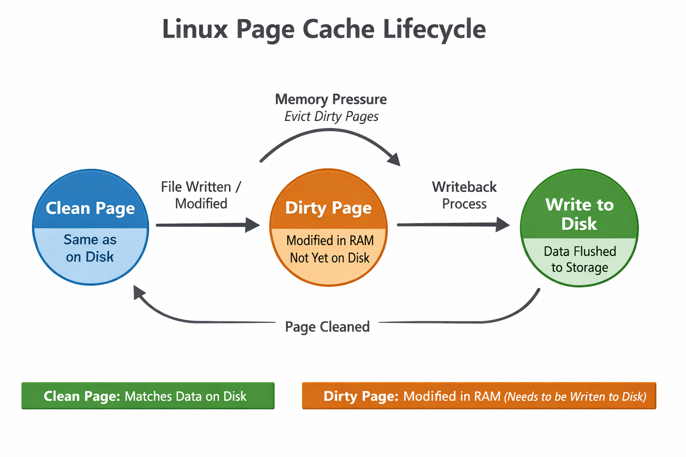

# 🧠 Page Cache in Linux: A Deep Dive


## 📘 Introduction
The **page cache** is one of the most critical components of Linux’s memory management system. It acts as a bridge between **RAM** and **disk storage**, improving performance by reducing the number of direct disk I/O operations. Understanding how it works is essential for anyone dealing with performance tuning, kernel development, or system administration.

---

## ⚙️ What Is the Page Cache?
When a process reads or writes data to a file, Linux doesn’t always go straight to the disk. Instead, it uses a portion of RAM called the **page cache** to temporarily store file data.

- **File-backed pages**: Each page in the cache corresponds to a specific file and offset.
- **Clean pages**: Pages identical to what’s on disk; can be discarded anytime.
- **Dirty pages**: Pages modified in memory; must be written back to disk before being freed.

This caching mechanism drastically speeds up file access because RAM is orders of magnitude faster than disk.

---

## 🔄 Lifecycle of a Page


| Stage | Description | Action |
|-------|--------------|--------|
| **Clean Page** | Matches data on disk | Can be dropped instantly if memory is needed |
| **Dirty Page** | Modified in RAM | Must be written back before eviction |
| **Writeback** | Kernel flushes dirty pages to disk | Converts dirty → clean |

The kernel continuously monitors memory pressure and triggers **writeback** when necessary.

---

## 🧩 Key Kernel Parameters
Located in `/proc/sys/vm/`, these parameters control how Linux handles dirty pages:

| Parameter | Purpose |
|------------|----------|
| **dirty_background_ratio** | Percentage of memory that can be dirty before background writeback starts |
| **dirty_ratio** | Maximum percentage of dirty pages before processes are forced to wait |
| **dirty_expire_centisecs** | Time after which dirty data should be written back |

Tuning these values can help balance performance and data safety.



---

## 🧮 Example Workflow
1. A program writes data to a file → kernel stores it in page cache → marks pages dirty.  
2. The kernel’s flusher thread periodically writes dirty pages to disk.  
3. Once written, pages become clean and can be reclaimed if memory is low.

You can observe this behavior using:
```bash
cat /proc/meminfo | grep -E 'Dirty|Writeback'
```

---

## ⚠️ Risks and Data Integrity
While caching improves speed, it introduces a risk: if the system crashes before dirty pages are written back, data may be lost.  
Applications that require durability (like databases) use **fsync()** or **sync** to force immediate writeback.

---

## 🧠 Summary
The Linux page cache is a smart optimization layer that:
- Speeds up file I/O by using RAM as a buffer.
- Reduces disk wear and latency.
- Requires careful tuning to avoid data loss under heavy load.
