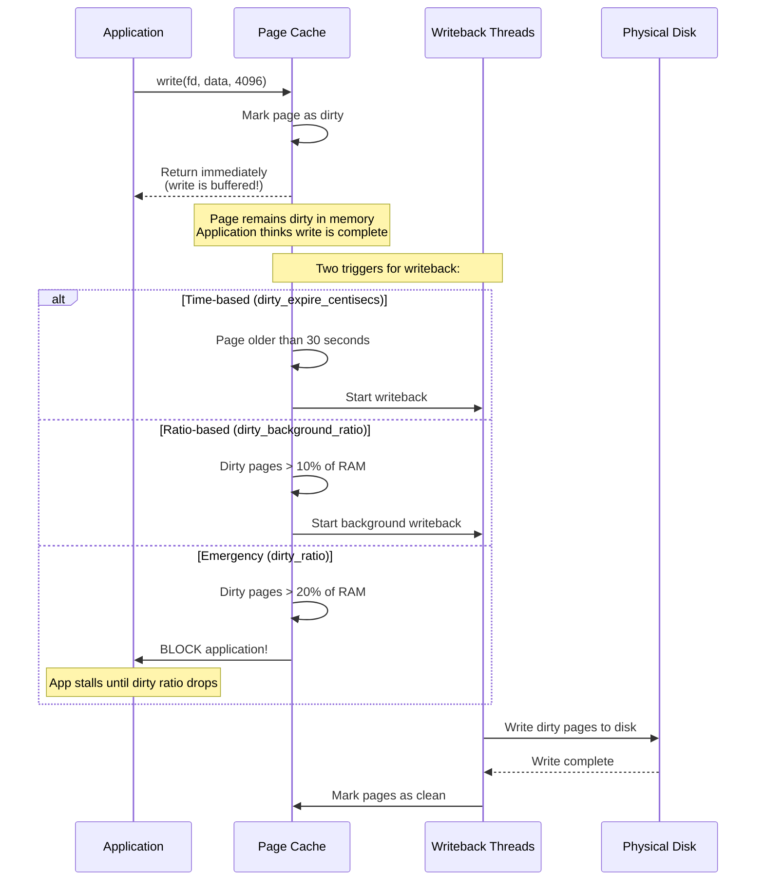
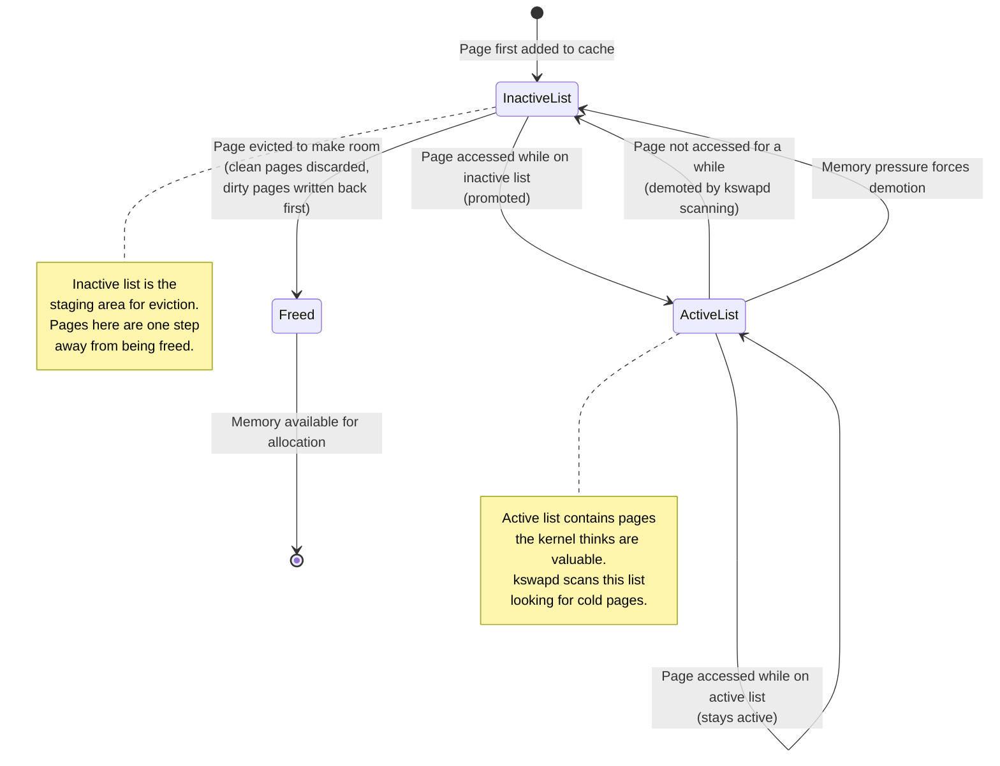

# Linux Memory Cache: A Technical Deep Dive

## Introduction: The Cache That Makes Linux Fast

Imagine reading a book where every time you turned a page, you had to walk to the library to get it. That's what a Linux system without cache would feel like. **Cache** is the reason your system feels responsive even with modest hardware—it's the art of keeping frequently accessed data close to the CPU, trading a small amount of memory for enormous performance gains.

Linux implements a sophisticated multi-layered caching architecture that operates at every level of the storage hierarchy. This chapter explores each layer in detail: what gets cached, how the kernel decides what to keep and what to evict, and how to observe and tune cache behavior for your workloads.

### A Note Before We Begin

This tutorial assumes you have:
- Basic familiarity with Linux command line
- Understanding of filesystems and block devices
- A Linux system where you can run diagnostic commands (virtual machine is fine)
- Curiosity about why `free -h` shows most of your RAM as "used" when you're not running much

Every concept will be demonstrated with commands you can run yourself. Open a terminal and follow along.

---

## Part I: The Big Picture—Why Cache Exists

### The Memory Hierarchy Problem

Computers face a fundamental tension: **fast storage is expensive and small; cheap storage is slow and large**. Consider these approximate access times:

```
CPU Register (4 bytes):        ~0.3 nanoseconds
L1 Cache (32 KB):              ~1 nanosecond
L2 Cache (256 KB):             ~4 nanoseconds
L3 Cache (8 MB):               ~12 nanoseconds
RAM (16 GB):                   ~100 nanoseconds
NVMe SSD:                      ~100,000 nanoseconds  (1,000× slower than RAM)
SATA SSD:                      ~500,000 nanoseconds
Spinning Disk:                 ~10,000,000 nanoseconds  (100,000× slower than RAM)
```

To put this in human terms: if accessing RAM took 1 second, accessing an SSD would take 15 minutes, and accessing a spinning disk would take 2 weeks. Cache exists to bridge these chasms.

### The Fundamental Insight

Linux operates on a simple principle: **the best I/O is the I/O you never do**. Every time the kernel can satisfy a read from memory instead of disk, it saves three orders of magnitude in latency. So Linux uses every byte of "free" memory as cache, and only gives it back when applications genuinely need it.

```bash
# Witness this principle in action:
$ free -h
              total        used        free      shared  buff/cache   available
Mem:           15Gi       2.0Gi       500Mi       300Mi        12Gi        12Gi
Swap:         2.0Gi          0B       2.0Gi

# Your system shows only 500 MB "free" but 12 GB "available."
# The 12 GB in buff/cache is serving your files at RAM speed.
# This is normal. This is desirable. This is Linux working correctly.
```

---

## Part II: The Two Faces of Linux Cache

Linux maintains two conceptually distinct but architecturally intertwined caches:

### Page Cache

The **Page Cache** stores the actual contents of files—every byte you've read from disk, every byte waiting to be written. When you run `cat enormous_file.log`, the kernel reads the file into page cache. The next time anything reads that file, the data comes from RAM.

```bash
# Create a test file and observe caching in action
$ dd if=/dev/urandom of=/tmp/testfile bs=1M count=100
100+0 records in
100+0 records out
104857600 bytes (105 MB) copied

# Clear the cache (we'll explain why and when to do this later)
$ sudo sh -c 'echo 3 > /proc/sys/vm/drop_caches'

# First read: from disk
$ time cat /tmp/testfile > /dev/null
real    0m0.385s    # ~385ms - disk speed
user    0m0.001s
sys     0m0.060s

# Second read: from page cache
$ time cat /tmp/testfile > /dev/null
real    0m0.015s    # ~15ms - RAM speed, 25× faster!
user    0m0.000s
sys     0m0.015s
```

The page cache is **file-backed**: every page in the cache corresponds to a specific file at a specific offset. If the system needs memory, clean pages (those identical to what's on disk) can be instantly discarded. Dirty pages (modified in memory) must be written back first.

### Buffer Cache

The **Buffer Cache** stores filesystem **metadata**—information about files rather than file contents. Directory entries, inode information, block device metadata, and superblock data all live here. When you run `ls -la` in a directory with thousands of files, the buffer cache makes the second listing instantaneous.

```bash
# Create a directory with many files to demonstrate
$ mkdir /tmp/metatest
$ for i in $(seq 1 5000); do touch /tmp/metatest/file_$i; done

# Clear caches
$ sudo sh -c 'echo 3 > /proc/sys/vm/drop_caches'

# First listing: from disk
$ time ls -la /tmp/metatest/ > /dev/null
real    0m1.234s    # Over 1 second!

# Second listing: metadata cached
$ time ls -la /tmp/metatest/ > /dev/null
real    0m0.023s    # ~23ms, 50× faster
```

Historically, the buffer cache was a separate entity. In modern Linux (2.4+), the buffer cache is effectively a specialized view into the page cache—metadata pages are still file-backed and managed through the same LRU mechanisms.

---

## Part III: Anatomy of a Cached Read

Let's trace exactly what happens when a process reads a file. Understanding this flow is essential for diagnosing cache-related performance issues.

### Step-by-Step: Reading a File Through Cache

```
User Process                  Kernel VFS              Page Cache           Disk
    |                             |                       |                  |
    | read(fd, buf, 4096)         |                       |                  |
    |---------------------------->|                       |                  |
    |                             |                       |                  |
    |                    [Calculate file offset]          |                  |
    |                             |                       |                  |
    |                    [Lookup in page cache]           |                  |
    |                    find_get_page()                  |                  |
    |                             |---------------------->|                  |
    |                             |                       |                  |
    |                             |    [Page exists?]     |                  |
    |                             |<----------------------|                  |
    |                             |                       |                  |
    |           [CACHE HIT]       |                       |                  |
    |           [CACHE MISS]      |                       |                  |
    |                             |                       |                  |
    |           [If MISS: allocate page, initiate disk I/O]                 |
    |                             |------------------------------------------>|
    |                             |                       |     [read block]  |
    |                             |<------------------------------------------|
    |                             |                       |                  |
    |                             |    [Insert page into radix tree]         |
    |                             |---------------------->|                  |
    |                             |                       |                  |
    |    [Copy data to user buffer]                       |                  |
    |<----------------------------|                       |                  |
    |                             |                       |                  |
    |    [Process continues]      |                       |                  |
```

### Observing Cache Hits and Misses

The kernel exposes cache hit/miss statistics through several interfaces. Let's instrument a real workload:

```bash
# Install cachestat from perf-tools (or bcc-tools)
# This tool shows cache hit/miss rates in real-time
$ sudo cachestat 1
Counting cache functions... Output every 1 seconds.
    HITS     MISSES  DIRTIES    RATIO   BUFFERS_MB   CACHE_MB
    1204        45       89    96.4%          234       4523
    1156        38       72    96.8%          234       4523
    1100        52       95    95.5%          234       4524
    
# RATIO = HITS / (HITS + MISSES). Above 95% is healthy.
# DIRTIES = pages modified in cache but not yet written to disk.
```

For a more manual approach:

```bash
# Check overall page cache statistics
$ cat /proc/vmstat | grep -E "pgpgin|pgpgout|pgfault|pgmajfault|pgsteal|pgscan"
pgpgin 12345678      # Pages paged IN from disk (cumulative)
pgpgout 8765432      # Pages paged OUT to disk (cumulative)
pgfault 987654321    # Total page faults (minor + major)
pgmajfault 12345     # Major page faults (required disk I/O)
pgsteal_kswapd 50000 # Pages reclaimed by kswapd
pgscan_kswapd 80000  # Pages scanned by kswapd

# Calculate your major fault ratio (lower is better)
# pgmajfault / pgfault = % of faults requiring disk I/O
```

---

## Part IV: Dirty Pages and Writeback

Not all cached pages are equal. **Clean pages** are identical to their on-disk counterparts and can be discarded instantly. **Dirty pages** contain modifications that exist only in memory and must be written to disk before the memory can be reused.

### The Dirty Page Lifecycle



### Tuning Dirty Page Thresholds

The kernel exposes several tuning knobs for controlling writeback behavior. Misconfiguring these can cause either data loss (too aggressive caching) or performance problems (too aggressive writeback).

```bash
# View current dirty page settings
$ sysctl -a | grep dirty
vm.dirty_background_bytes = 0
vm.dirty_background_ratio = 10     # Start background writeback at 10% dirty
vm.dirty_bytes = 0
vm.dirty_expire_centisecs = 3000   # Pages older than 30 seconds get written
vm.dirty_ratio = 20                # Block writes at 20% dirty
vm.dirty_writeback_centisecs = 500 # Writeback thread wakes every 5 seconds
vm.dirtytime_expire_seconds = 43200 # Lazy inode writeback (12 hours)

# For SSD-based servers with lots of memory (64GB+):
# Lower these values to prevent I/O spikes when writeback triggers
$ sudo sysctl -w vm.dirty_background_ratio=5
$ sudo sysctl -w vm.dirty_ratio=10
$ sudo sysctl -w vm.dirty_expire_centisecs=1500

# For desktop/laptop with spinning disk:
# Higher values mean fewer disk spin-ups, better battery life
$ sudo sysctl -w vm.dirty_background_ratio=15
$ sudo sysctl -w vm.dirty_expire_centisecs=6000
```

### Practical: Observing Writeback in Action

```bash
# Watch dirty pages accumulate and flush
$ watch -n 1 'grep -E "Dirty:|Writeback:" /proc/meminfo'
# Run this while doing a large file copy:
$ dd if=/dev/urandom of=/tmp/bigfile bs=1M count=5000

# In another terminal, watch the page cache stats
$ sar -B 1 10
# Watch: pgpgout/s (pages written to disk) and pgsteal_kswapd
```

---

## Part V: Cache Eviction—What Happens When Memory Runs Low

The kernel can't cache forever. When applications demand memory, the kernel must decide which cached pages to sacrifice. This is where the **LRU (Least Recently Used)** mechanism comes in.

### The Two-List LRU

Linux doesn't use a simple single LRU list. Instead, it maintains **two lists per memory zone**:

1. **Active List**: Pages that have been accessed recently and are likely to be accessed again soon
2. **Inactive List**: Pages that haven't been accessed recently; candidates for eviction



### Observing the LRU Lists

```bash
# View active/inactive page counts
$ cat /proc/meminfo | grep -E "Active:|Inactive:|Active\(file\)|Inactive\(file\)|Active\(anon\)|Inactive\(anon\)"
Active:            4194304 kB    # Total active pages
Inactive:          2097152 kB    # Total inactive pages
Active(file):      3145728 kB    # Active file-backed pages (page cache)
Inactive(file):    1048576 kB    # Inactive file-backed pages
Active(anon):      1048576 kB    # Active anonymous pages (process memory)
Inactive(anon):    1048576 kB    # Inactive anonymous pages

# The file/anon split is crucial:
# - file pages can be reclaimed easily (just drop or write back)
# - anon pages require swap to reclaim (expensive)

# Watch LRU scanning in real-time
$ sar -B 1 10
# pgscank/s: Pages scanned by kswapd (background reclaim)
# pgscand/s: Pages scanned directly (urgent reclaim - process blocked!)
# pgsteal/s: Pages successfully reclaimed

# If pgscand/s is non-zero, you have memory pressure!
```

### The `vfs_cache_pressure` Knob

This parameter controls how aggressively the kernel reclaims directory entry and inode caches relative to page cache:

```bash
# Default value
$ cat /proc/sys/vm/vfs_cache_pressure
100

# Lower = retain dentry/inode caches more (good for file servers)
# Higher = reclaim them more aggressively (good for memory-constrained systems)

# For a file server with millions of files:
$ sudo sysctl -w vm.vfs_cache_pressure=50

# For a memory-starved VM running a single app:
$ sudo sysctl -w vm.vfs_cache_pressure=200
```

---

## Part VI: Specialized Caches in the Linux Kernel

Beyond the general page cache, Linux maintains several specialized caches that target specific types of data.

### Dentry Cache (dcache)

The **dentry cache** stores directory entry information—the mapping from filenames to inodes. Every time you open a file, the kernel must resolve the path `/home/user/documents/report.txt` by walking through each directory component. The dentry cache makes this path resolution nearly free after the first access.

```bash
# Observe dentry cache in action
$ mkdir -p /tmp/deep/path/with/many/levels/of/nesting

# First access: path resolution from disk
$ time ls /tmp/deep/path/with/many/levels/of/nesting/
real    0m0.008s

# Second access: dentry cache hit
$ time ls /tmp/deep/path/with/many/levels/of/nesting/
real    0m0.001s

# View dentry cache statistics
$ cat /proc/sys/fs/dentry-state
123456  100000  45  0  0  0
# ^^^^^  ^^^^^^  ^^
# |      |       Average age (seconds)
# |      Unused dentries (can be reclaimed)
# Total dentries allocated

# Watch dentry cache usage in real-time
$ slabtop -s c | grep dentry
```

### Inode Cache

The **inode cache** stores information about file metadata—permissions, size, timestamps, block locations. When you run `stat` on a file, the kernel retrieves its inode. The inode cache makes repeated `stat` calls instantaneous.

```bash
# Observe inode cache
$ echo 3 | sudo tee /proc/sys/vm/drop_caches

# First stat: inode loaded from disk
$ time stat /etc/passwd > /dev/null
real    0m0.004s

# Second stat: inode cache hit
$ time stat /etc/passwd > /dev/null
real    0m0.000s

# Check inode cache size
$ slabtop -s c | grep inode
```

### VFS Inode Cache vs. Filesystem Inode Cache

A subtle but important distinction: the VFS layer maintains a generic inode cache (`inode_cache` in slabtop), while individual filesystems (ext4, xfs, btrfs) maintain their own specific inode caches. The VFS inode is a kernel structure; the filesystem inode contains on-disk format-specific data.

---

## Part VII: Practical Cache Management

### When and How to Drop Caches

The kernel provides a mechanism to manually clear caches through `/proc/sys/vm/drop_caches`. **This should rarely be done in production**—it's primarily useful for benchmarking and testing.

```bash
# The three levels of cache dropping:
echo 1 > /proc/sys/vm/drop_caches  # Drop page cache only
echo 2 > /proc/sys/vm/drop_caches  # Drop dentries and inodes
echo 3 > /proc/sys/vm/drop_caches  # Drop page cache, dentries, and inodes

# Before dropping, check what you're about to lose:
$ free -h
              total        used        free      shared  buff/cache   available
Mem:           15Gi       2.0Gi       500Mi       300Mi        12Gi        12Gi

$ echo 3 | sudo tee /proc/sys/vm/drop_caches

$ free -h
              total        used        free      shared  buff/cache   available
Mem:           15Gi       2.0Gi        12Gi       300Mi       500Mi        12Gi
#                    Cache dropped ^^^^                    ^^^^ Cache rebuilding
```

**Warning signs you should NOT drop caches:**
- System is in production serving traffic
- Applications are latency-sensitive
- You're trying to "fix" memory pressure (caches are already small under pressure)
- You don't have a specific benchmarking need

### Cache Pinning and `mlock`

Sometimes you want to prevent specific data from being evicted from cache. The `mlock()` system call pins pages in memory:

```bash
# vmtouch - tool for checking and pinning file cache
$ vmtouch /var/lib/mysql/ibdata1
           Files: 1
     Directories: 0
  Resident Pages: 524288/1048576  1G/2G  50%
         Elapsed: 0.12345 seconds

# Touch (preload) a file into cache
$ vmtouch -t /var/lib/mysql/ibdata1

# Lock a file in memory (requires root, prevents eviction)
$ vmtouch -l /var/lib/mysql/ibdata1

# Evict a specific file from cache
$ vmtouch -e /var/lib/mysql/ibdata1
```

### Cache-Aware Application Design

Understanding the cache helps you write better applications:

```python
# BAD: Small random reads that thrash the cache
with open('large_file.bin', 'rb') as f:
    for offset in random_positions:
        f.seek(offset)
        data = f.read(4096)  # Each read may evict useful cache entries

# GOOD: Sequential reads that use cache efficiently
with open('large_file.bin', 'rb') as f:
    while True:
        data = f.read(1048576)  # Read 1MB chunks
        if not data:
            break
        process(data)  # Cache works with you, not against you

# BETTER: Use mmap for repeated access patterns
import mmap
with open('large_file.bin', 'rb') as f:
    mm = mmap.mmap(f.fileno(), 0, access=mmap.ACCESS_READ)
    # Pages are loaded on demand and cached automatically
    # Repeated accesses to the same pages hit cache
```

---

## Part VIII: Diagnosing Cache-Related Performance Issues

### The "My Memory is Full" Panic

This is the most common cache-related confusion. Let's diagnose it properly:

```bash
# Step 1: Get the full picture
$ free -h
$ cat /proc/meminfo | grep -E "^MemTotal|^MemAvailable|^Cached|^SwapTotal|^SwapFree"

# Step 2: Is swap being used actively?
$ vmstat 1 5
# If si and so are 0, the system is healthy regardless of "free" memory

# Step 3: Check memory pressure
$ cat /proc/pressure/memory
# If avg10 values are < 5, there is no memory pressure

# Step 4: Identify what's using memory
$ smem -rs pss | head -20
# Look for processes with unexpectedly high PSS

# Step 5: Check if cache is being actively used
$ sar -B 1 10
# High pgpgin/s with low pgmajfault/s = cache is working well
# High pgmajfault/s = cache is too small for the workload
```

### The "Slow Queries After Restart" Problem

After restarting a database or file server, performance is initially terrible because the cache is cold:

```bash
# MySQL example: check buffer pool hit rate
mysql> SHOW GLOBAL STATUS LIKE 'Innodb_buffer_pool_read%';
+---------------------------------------+-----------+
| Variable_name                         | Value     |
+---------------------------------------+-----------+
| Innodb_buffer_pool_read_requests      | 100000000 | # Requests
| Innodb_buffer_pool_reads              | 50        | # Disk reads
+---------------------------------------+-----------+
# Hit rate = (100000000 - 50) / 100000000 = 99.99995% (warm cache)

# After restart:
+---------------------------------------+-----------+
| Innodb_buffer_pool_read_requests      | 1000      |
| Innodb_buffer_pool_reads              | 800       |
+---------------------------------------+-----------+
# Hit rate = (1000 - 800) / 1000 = 20% (cold cache - terrible!)

# Solution: pre-warm the cache after restart
mysql> SELECT COUNT(*) FROM large_table;  # Forces table into buffer pool
```

### The "Writeback Storms" Problem

Systems with lots of RAM can accumulate massive amounts of dirty pages. When writeback finally triggers, the disk subsystem gets overwhelmed:

```bash
# Detect an impending writeback storm
$ watch -n 1 'grep -E "Dirty:|Writeback:" /proc/meminfo'
# If "Dirty" is in the tens of GB and suddenly starts dropping...

# During the storm:
$ iostat -x 1
# You'll see %util at 100%, await spiking to seconds

# Prevention: tune dirty thresholds for your hardware
$ sudo sysctl -w vm.dirty_background_ratio=3   # Start earlier
$ sudo sysctl -w vm.dirty_ratio=5              # Block sooner
$ sudo sysctl -w vm.dirty_expire_centisecs=1000 # Expire faster

# For SSDs: smaller dirty thresholds prevent latency spikes
# For HDDs: larger thresholds allow better write combining
```

---

## Part IX: Advanced Topics

### Huge Pages and Cache

Huge pages (2 MB or 1 GB instead of 4 KB) reduce pressure on the Translation Lookaside Buffer (TLB), a specialized cache for virtual-to-physical address translations:

```bash
# Check TLB miss rate (high = you might benefit from huge pages)
$ perf stat -e dTLB-load-misses,dTLB-loads -a -- sleep 10
 Performance counter stats for 'sleep 10':
    12,345,678      dTLB-load-misses
   987,654,321      dTLB-loads
       1.25%        TLB miss rate

# If miss rate > 1%, huge pages may help

# Configure huge pages
$ echo 1024 | sudo tee /proc/sys/vm/nr_hugepages
$ cat /proc/meminfo | grep Huge
HugePages_Total:    1024
HugePages_Free:     1024
HugePages_Rsvd:        0
HugePages_Surp:        0
Hugepagesize:       2048 kB
```

### CPU Caches (L1/L2/L3)

Beyond the page cache, CPU caches have a dramatic impact on application performance:

```bash
# View your CPU cache topology
$ lscpu | grep -E "L1|L2|L3|cache"
L1d cache:          32 KiB (per core)
L1i cache:          32 KiB (per core)
L2 cache:           256 KiB (per core)
L3 cache:           8 MiB (shared)

# Measure cache misses in your application
$ perf stat -e cache-misses,cache-references,instructions,cycles ./my_app
 Performance counter stats for './my_app':
    45,678,901      cache-misses          # 4.5% miss rate
   987,654,321      cache-references
 2,345,678,901      instructions          # 0.5 IPC (instructions per cycle)
 4,567,890,123      cycles
# Low IPC (< 1.0) + high cache miss rate (> 5%) = memory-bound application
```

### Cache Coherence and NUMA

On multi-socket systems, each CPU socket has its own memory controller and local RAM. Accessing "remote" memory (attached to another socket) is slower:

```bash
# Check NUMA topology
$ numactl --hardware
available: 2 nodes (0-1)
node 0 cpus: 0 1 2 3 4 5 6 7
node 0 size: 32768 MB
node 0 free: 512 MB
node 1 cpus: 8 9 10 11 12 13 14 15
node 1 size: 32768 MB
node 1 free: 8192 MB

# Process is running on node 0 but its memory is on node 1:
$ numastat -p <PID>
Per-node process memory usage (in MBs) for PID 1234 (my_app)
                           Node 0          Node 1           Total
                  --------------- --------------- ---------------
Huge                         0.00            0.00            0.00
Heap                     1024.00         8192.00         9216.00  # Most heap on remote node!
Stack                       2.00            0.00            2.00
Private                    50.00           50.00          100.00
-------                   --------------- --------------- ---------------
Total                    1076.00         8242.00         9318.00

# Fix with NUMA binding
$ numactl --cpunodebind=1 --membind=1 ./my_app
```

---

## Part X: Quick Reference

### Essential Diagnostic Commands

| What You Want to Know | Command |
|----------------------|---------|
| How much cache is in use? | `free -h` (look at `buff/cache`) |
| Is the system swapping? | `vmstat 1` (watch `si` and `so` columns) |
| What's the cache hit rate? | `cachestat 1` (from bcc-tools) |
| How many dirty pages? | `grep Dirty /proc/meminfo` |
| Is there memory pressure? | `cat /proc/pressure/memory` |
| What's in the page cache? | `vmtouch /path/to/file` |
| Per-process cache usage? | `smem -rs pss` |
| Slab cache breakdown? | `slabtop -o -s c` |

### Key Kernel Parameters

```bash
# View all VM tunables
sysctl -a | grep "^vm\."

# Most important for cache tuning:
vm.swappiness = 60              # How aggressively to swap (0-100)
vm.vfs_cache_pressure = 100     # Dentry/inode reclaim pressure
vm.dirty_background_ratio = 10  # Start background writeback at 10% dirty
vm.dirty_ratio = 20             # Block writes at 20% dirty
vm.dirty_expire_centisecs = 3000 # Expire dirty pages after 30s
vm.min_free_kbytes = 67584      # Minimum free memory (kernel reserve)
vm.zone_reclaim_mode = 0        # Whether to reclaim locally on NUMA
```

### Cache-Related /proc Interfaces

```bash
/proc/meminfo           # Complete memory breakdown
/proc/vmstat            # Virtual memory statistics (cumulative counters)
/proc/sys/vm/*          # Tunable kernel parameters
/proc/slabinfo          # Slab allocator statistics
/proc/buddyinfo         # Buddy allocator state (fragmentation)
/proc/pressure/memory   # Pressure Stall Information (PSI)
/proc/zoneinfo          # Per-zone memory statistics with watermarks
/proc/<PID>/smaps       # Per-process memory map with PSS
```

---

## Summary: The Zen of Linux Caching

After this deep dive, you should understand that:

1. **"Free memory is wasted memory."** Linux uses every available byte for caching, and this is correct behavior. Don't panic when `free` shows low values—look at `available` instead.

2. **Cache transforms random I/O into memory access.** A well-cached system can serve thousands of read requests per second from RAM that would otherwise hammer the disk.

3. **Dirty pages are a liability.** They improve write performance but accumulate risk. Tune your dirty thresholds for your hardware: lower for SSDs with many small writes, higher for HDDs with large sequential writes.

4. **The LRU mechanism is adaptive.** The kernel constantly balances between keeping useful pages cached and making room for new allocations. The active/inactive list dance is happening thousands of times per second.

5. **Cache is hierarchical.** From CPU L1 cache through page cache to disk, each layer trades capacity for speed. Understanding these tradeoffs helps you design systems that perform well at every level.

6. **You can observe everything.** Linux exposes cache behavior through /proc, /sys, and tools like cachestat and perf. There's no mystery—if you know where to look, you can see exactly what the cache is doing.

The kernel's caching behavior is not magic; it's a set of well-understood algorithms reacting to observable conditions. With the knowledge from this chapter, you can diagnose cache-related performance issues, tune cache behavior for your workload, and design applications that cooperate with rather than fight against the kernel's memory management.