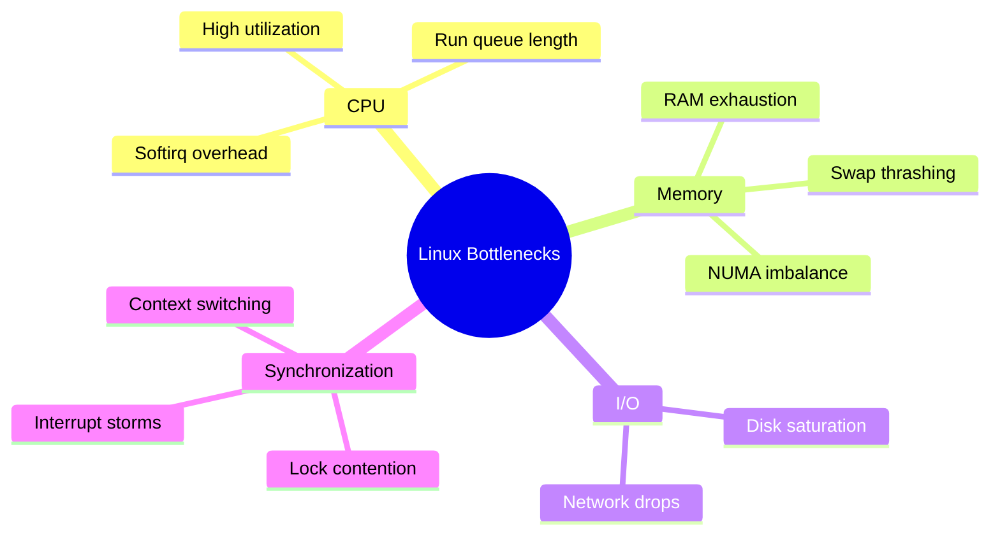
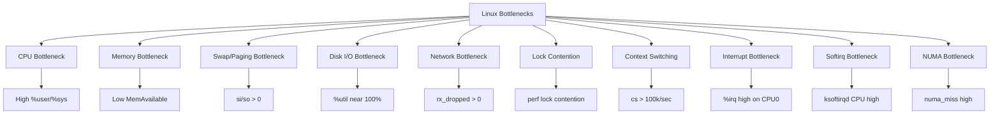
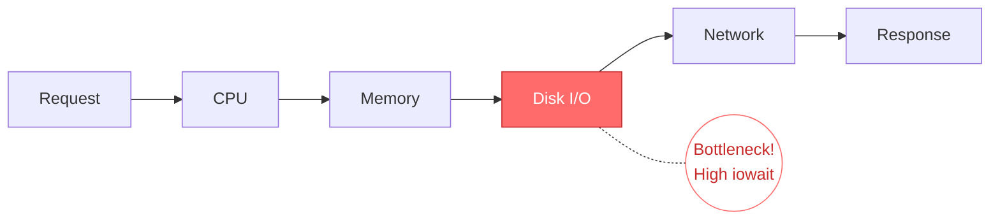
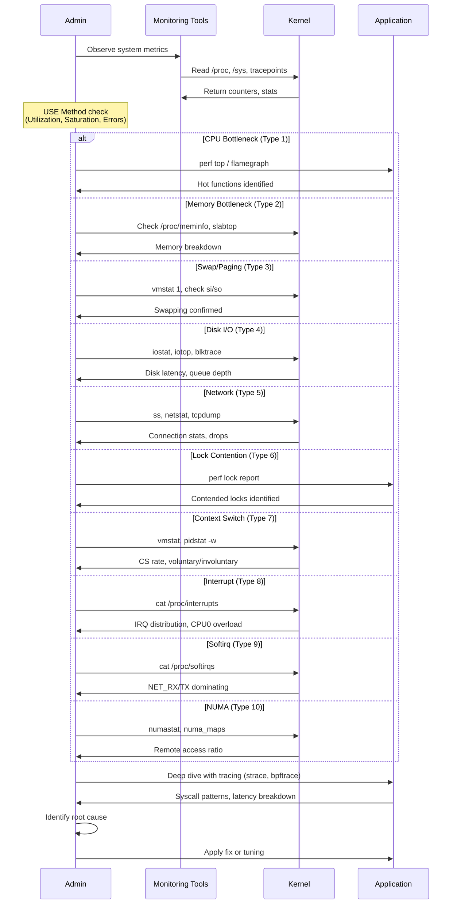
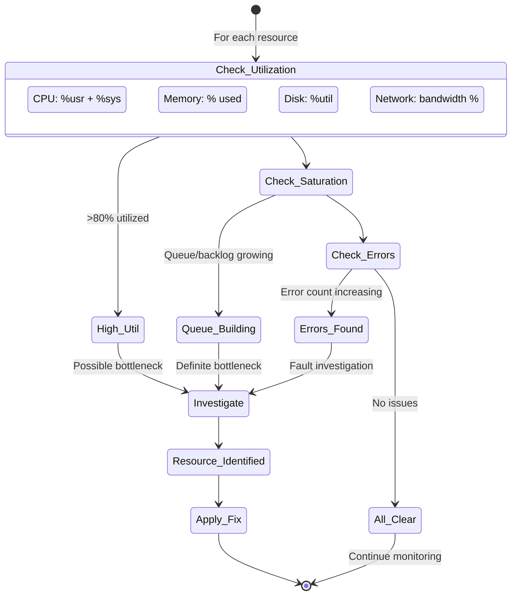
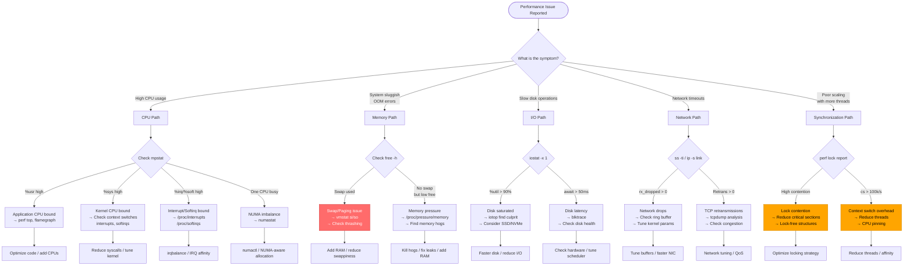
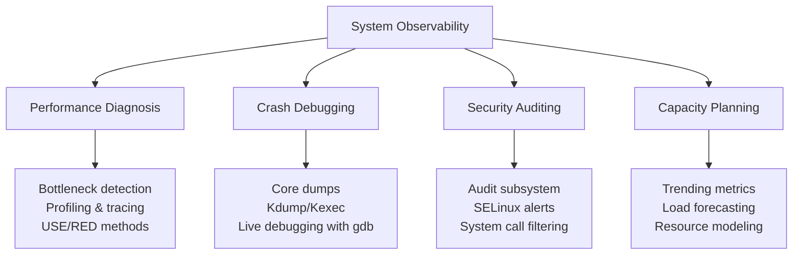

Here's the **complete and corrected** Obsidian wiki note about **Linux Performance Bottlenecks - Diagnosis & Debugging**, now properly updated with all 10 bottleneck types referenced and integrated with the diagnostic methodology:

---

# Linux Performance Bottlenecks: Diagnosis & Debugging

## Overview
A **bottleneck** is a resource constraint that limits overall system performance. In Linux systems, bottlenecks can occur at multiple layers—hardware, kernel, application—and require systematic diagnosis using appropriate tools and methodologies.

Diagnosis follows a structured approach:
1. **Observe** system behavior (monitoring)
2. **Identify** the constrained resource (bottleneck detection)
3. **Analyze** root cause (profiling/tracing)
4. **Resolve** or mitigate (tuning/fixing)



> **Alternative flowchart if mindmap fails:**



---

## What is a Bottleneck?
A bottleneck occurs when a **resource reaches its capacity limit**, causing requests to queue up and response times to increase. It's the **slowest component** in a pipeline that determines overall throughput.

**Key insight:** Optimizing a non-bottleneck resource yields **zero performance improvement**. You must find and address the actual constraint.



---

## The 10 Common Linux Bottlenecks

Before diving into diagnosis, here are the **10 common bottleneck types** you'll encounter:

| # | Bottleneck | Primary Symptom | Key Metric |
|---|-----------|----------------|------------|
| 1 | **CPU Bottleneck** | All cores saturated | `%usr + %sys` > 90% |
| 2 | **Memory Bottleneck** | RAM exhausted | `MemAvailable` < 10% |
| 3 | **Swap/Paging Bottleneck** | Constant disk swapping | `si`/`so` > 0 sustained |
| 4 | **Disk I/O Bottleneck** | Storage can't keep up | `%util` > 90%, `await` high |
| 5 | **Network Bottleneck** | Bandwidth/buffer saturation | `rx_dropped` > 0 |
| 6 | **Lock Contention** | Threads waiting for locks | High `perf lock` contention |
| 7 | **Context Switching** | Excessive task switching | `cs` > 100,000/sec |
| 8 | **Interrupt Bottleneck** | HW interrupts overload CPU | `%irq` high on one CPU |
| 9 | **Softirq Bottleneck** | Deferred processing dominates | `ksoftirqd` using high CPU |
| 10 | **NUMA Bottleneck** | Remote memory access | `numa_miss` > 10% |

> See [[Common Bottlenecks in Linux Systems]] for detailed analysis of each type.

---

## How Diagnosis Works: The Mechanism

### 1. The Diagnostic Methodology



### 2. The USE Method (Utilization, Saturation, Errors)

The **USE method** is a systematic framework for bottleneck detection across all 10 bottleneck types:



### 3. Bottleneck Decision Tree



---

## Diagnostic Tools by Layer


---

## Similar Mechanisms (Same Level of Abstraction)

Diagnosis and debugging in Linux share the same **observability and introspection** level with these mechanisms:



### Comparison Table

| Mechanism | Primary Goal | Key Tools | Data Source | Analysis Type |
|-----------|-------------|-----------|-------------|---------------|
| **Performance Diagnosis** | Find bottlenecks | `perf`, `bcc/bpftrace`, `iostat` | Counters, tracepoints | Real-time, historical |
| **Crash Debugging** | Root cause of failure | `gdb`, `crash`, `kdump` | Core dumps, vmcore | Post-mortem |
| **Security Auditing** | Detect intrusions | `auditd`, `osquery`, `falco` | Audit logs, syscalls | Policy-based, real-time |
| **Capacity Planning** | Predict resource needs | `prometheus`, `grafana`, `sar` | Time-series metrics | Trend analysis |
| **Application Debugging** | Fix logic errors | `gdb`, `strace`, `valgrind` | Process state, memory | Interactive |
| **Tracing/Profiling** | Understand execution flow | `bpftrace`, `perf`, `LTTng` | Events, stack traces | Dynamic, low-overhead |

---

## Key Diagnostic Commands Quick Reference

### CPU Bottleneck (Type 1)
```bash
# Overall CPU usage
top -bn1 | head -20

# Per-CPU usage
mpstat -P ALL 1

# Find hot functions (sampling profiler)
perf top -g

# Generate flamegraph
perf record -F 99 -g -p <PID> -- sleep 30
perf script | FlameGraph/stackcollapse-perf.pl | FlameGraph/flamegraph.pl > flame.svg

# Run queue / load average
uptime
cat /proc/loadavg

# Context switching rate (also Type 7)
vmstat 1 5
```

### Memory Bottleneck (Type 2)
```bash
# Memory overview
free -h

# Memory pressure stats
cat /proc/pressure/memory

# Detailed memory info
cat /proc/meminfo

# Top memory consumers (RSS)
ps aux --sort=-%mem | head -10

# Slab memory (kernel objects)
slabtop -o

# Check for swapping (Type 3)
vmstat 1
# Watch si (swap in) and so (swap out) columns

# OOM killer history
dmesg | grep -i "out of memory"
```

### I/O Bottleneck (Type 4)
```bash
# Disk utilization and latency
iostat -x 1

# Per-process I/O
iotop -o

# Files opened by process
lsof -p <PID>

# Trace syscalls with timing
strace -c -p <PID>  # Summary
strace -T -p <PID>  # With timestamps

# Block layer tracing
btrace /dev/sda

# I/O pressure
cat /proc/pressure/io
```

### Network Bottleneck (Type 5)
```bash
# Socket statistics
ss -s
ss -tlnp  # Listening TCP sockets
ss -tan state time-wait | wc -l  # Count TIME_WAIT

# TCP retransmissions
ss -ti

# Bandwidth per process
nethogs eth0

# Packet capture
tcpdump -i eth0 -nn -c 1000 -w capture.pcap

# Network errors
netstat -i
ip -s link show
```

### Synchronization Bottlenecks (Types 6, 7)
```bash
# Lock contention analysis
perf lock record -a -- sleep 10
perf lock report

# Context switch monitoring
pidstat -w 1
vmstat 1  # Watch 'cs' column

# Voluntary vs involuntary
cat /proc/<PID>/status | grep ctxt
```

### Interrupt Bottlenecks (Types 8, 9)
```bash
# Hardware interrupt distribution
cat /proc/interrupts

# Software interrupt statistics
cat /proc/softirqs

# Per-CPU interrupt load
mpstat -P ALL 1  # Watch %irq and %soft columns

# ksoftirqd CPU usage
ps aux | grep ksoftirqd
```

### NUMA Bottleneck (Type 10)
```bash
# NUMA topology
numactl --hardware
lscpu | grep NUMA

# NUMA statistics
numastat
numastat -p <PID>

# NUMA memory maps
cat /proc/<PID>/numa_maps
```

---

## Step-by-Step Diagnostic Flow for Each Bottleneck Type

### CPU Bottleneck Diagnosis
```bash
# Step 1: Identify CPU saturation
mpstat -P ALL 1
# Look for: %usr > 80%, %sys > 40%, or %irq/%soft > 20%

# Step 2: Find CPU-consuming processes
top -bn1 -o %CPU | head -20

# Step 3: Profile the hot process
perf top -p <PID>

# Step 4: Generate flame graph for deep analysis
perf record -F 99 -g -p <PID> -- sleep 30
```

### Memory Bottleneck Diagnosis
```bash
# Step 1: Check memory usage
free -h

# Step 2: Check memory pressure
cat /proc/pressure/memory

# Step 3: Identify consumers
ps aux --sort=-%mem | head -10

# Step 4: Check for memory leaks
valgrind --leak-check=full ./application

# Step 5: Check swap activity
vmstat 1
```

### Lock Contention Diagnosis
```bash
# Step 1: Record lock events
perf lock record -a -- sleep 10

# Step 2: Analyze contention
perf lock report -k contended

# Step 3: Trace specific lock with bpftrace
bpftrace -e 'kprobe:mutex_lock { @[kstack] = count(); }'
```

---

## Unified Diagnostic Script

```bash
#!/bin/bash
# bottleneck_diagnostic.sh - Complete system bottleneck detection

echo "========================================="
echo "  Linux Bottleneck Diagnostic Scanner"
echo "  Time: $(date)"
echo "========================================="

# Colors
RED='\033[0;31m'
YELLOW='\033[1;33m'
GREEN='\033[0;32m'
NC='\033[0m' # No Color

# 1. CPU Bottleneck Check
echo -e "\n${YELLOW}[1/10] CPU Bottleneck${NC}"
CPUS=$(nproc)
LOAD=$(uptime | awk -F'load average:' '{print $2}' | awk '{print $1}' | tr -d ',')
CPU_USR=$(mpstat 1 1 | tail -1 | awk '{print $4}')
CPU_SYS=$(mpstat 1 1 | tail -1 | awk '{print $6}')
CPU_TOTAL=$(echo "$CPU_USR + $CPU_SYS" | bc)
echo "  CPUs: $CPUS, Load: $LOAD, CPU Usage: ${CPU_TOTAL}%"
[ $(echo "$CPU_TOTAL > 90" | bc) -eq 1 ] && echo -e "  ${RED}⚠ CPU bottleneck likely${NC}"

# 2. Memory Bottleneck Check
echo -e "\n${YELLOW}[2/10] Memory Bottleneck${NC}"
MEM_AVAIL=$(awk '/MemAvailable/ {print $2}' /proc/meminfo)
MEM_TOTAL=$(awk '/MemTotal/ {print $2}' /proc/meminfo)
MEM_PCT=$((100 - MEM_AVAIL * 100 / MEM_TOTAL))
echo "  Memory Used: ${MEM_PCT}%"
[ $MEM_PCT -gt 90 ] && echo -e "  ${RED}⚠ Memory bottleneck likely${NC}"

# 3. Swap/Paging Bottleneck Check
echo -e "\n${YELLOW}[3/10] Swap/Paging Bottleneck${NC}"
SWAPIN=$(vmstat 1 2 | tail -1 | awk '{print $7}')
SWAPOUT=$(vmstat 1 2 | tail -1 | awk '{print $8}')
echo "  Swap In: $SWAPIN, Swap Out: $SWAPOUT (pages/sec)"
[ "$SWAPIN" -gt 10 ] || [ "$SWAPOUT" -gt 10 ] && echo -e "  ${RED}⚠ Swap thrashing likely${NC}"

# 4. Disk I/O Bottleneck Check
echo -e "\n${YELLOW}[4/10] Disk I/O Bottleneck${NC}"
IOWAIT=$(top -bn1 | grep "Cpu(s)" | awk '{print $10}' | cut -d'%' -f1)
echo "  I/O Wait: ${IOWAIT}%"
[ $(echo "$IOWAIT > 20" | bc) -eq 1 ] && echo -e "  ${RED}⚠ Disk I/O bottleneck likely${NC}"

# 5. Network Bottleneck Check
echo -e "\n${YELLOW}[5/10] Network Bottleneck${NC}"
for iface in $(ls /sys/class/net | grep -v lo); do
    DROPS=$(ip -s link show $iface 2>/dev/null | grep -A1 "RX:" | tail -1 | awk '{print $3}')
    [ -n "$DROPS" ] && [ "$DROPS" -gt 0 ] 2>/dev/null && echo -e "  ${RED}⚠ $iface: $DROPS rx_dropped packets${NC}"
done

# 6. Lock Contention Check
echo -e "\n${YELLOW}[6/10] Lock Contention${NC}"
echo "  Use: perf lock record -a -- sleep 10 && perf lock report"

# 7. Context Switching Check
echo -e "\n${YELLOW}[7/10] Context Switching${NC}"
CS=$(vmstat 1 2 | tail -1 | awk '{print $12}')
echo "  Context Switches: ${CS}/sec"
[ "$CS" -gt 100000 ] && echo -e "  ${RED}⚠ High context switching${NC}"

# 8. Interrupt Bottleneck Check
echo -e "\n${YELLOW}[8/10] Interrupt Bottleneck${NC}"
IRQ_PCT=$(mpstat 1 1 | tail -1 | awk '{print $7}')
echo "  Hardware Interrupts: ${IRQ_PCT}%"
[ $(echo "$IRQ_PCT > 20" | bc) -eq 1 ] && echo -e "  ${RED}⚠ High hardware interrupt load${NC}"

# 9. Softirq Bottleneck Check
echo -e "\n${YELLOW}[9/10] Softirq Bottleneck${NC}"
SOFT_PCT=$(mpstat 1 1 | tail -1 | awk '{print $9}')
echo "  Software Interrupts: ${SOFT_PCT}%"
[ $(echo "$SOFT_PCT > 20" | bc) -eq 1 ] && echo -e "  ${RED}⚠ High softirq load${NC}"

# 10. NUMA Bottleneck Check
echo -e "\n${YELLOW}[10/10] NUMA Bottleneck${NC}"
if [ -f /sys/devices/system/node/node1/meminfo ]; then
    NUMA_MISS=$(numastat 2>/dev/null | awk '/numa_miss/ {sum += $2} END {print sum}')
    NUMA_FOREIGN=$(numastat 2>/dev/null | awk '/numa_foreign/ {sum += $2} END {print sum}')
    echo "  NUMA Misses: $NUMA_MISS, Foreign: $NUMA_FOREIGN"
    [ "$NUMA_MISS" -gt 1000000 ] 2>/dev/null && echo -e "  ${RED}⚠ NUMA imbalance likely${NC}"
else
    echo "  Single NUMA node (not applicable)"
fi

echo -e "\n${GREEN}=========================================${NC}"
echo -e "${GREEN}  Diagnostic Scan Complete${NC}"
echo -e "${GREEN}=========================================${NC}"
```

---

## Code Example: Programmatic Bottleneck Detection

```c
#include <stdio.h>
#include <stdlib.h>
#include <string.h>
#include <unistd.h>

typedef struct {
    double cpu_util;
    double iowait_pct;
    long mem_avail_mb;
    long swap_in;
    long swap_out;
    unsigned long ctx_switches;
    double irq_pct;
    double softirq_pct;
} BottleneckReport;

BottleneckReport analyze_system() {
    BottleneckReport report = {0};
    FILE *fp;
    char line[256];
    
    // CPU and I/O wait from /proc/stat
    fp = fopen("/proc/stat", "r");
    if (fp) {
        long user, nice, system, idle, iowait, irq, softirq;
        fgets(line, sizeof(line), fp);
        sscanf(line, "cpu %ld %ld %ld %ld %ld %ld %ld",
               &user, &nice, &system, &idle, &iowait, &irq, &softirq);
        long total = user + nice + system + idle + iowait + irq + softirq;
        report.cpu_util = 100.0 * (total - idle - iowait) / total;
        report.iowait_pct = 100.0 * iowait / total;
        report.irq_pct = 100.0 * (irq + softirq) / total;
        fclose(fp);
    }
    
    // Memory available
    fp = fopen("/proc/meminfo", "r");
    if (fp) {
        while (fgets(line, sizeof(line), fp)) {
            if (strncmp(line, "MemAvailable:", 13) == 0) {
                sscanf(line + 14, "%ld", &report.mem_avail_mb);
                report.mem_avail_mb /= 1024;
                break;
            }
        }
        fclose(fp);
    }
    
    // Swap activity (snapshot)
    fp = fopen("/proc/vmstat", "r");
    if (fp) {
        while (fgets(line, sizeof(line), fp)) {
            if (strncmp(line, "pswpin", 6) == 0)
                sscanf(line + 7, "%ld", &report.swap_in);
            if (strncmp(line, "pswpout", 7) == 0)
                sscanf(line + 8, "%ld", &report.swap_out);
        }
        fclose(fp);
    }
    
    return report;
}

void print_diagnosis(BottleneckReport r) {
    printf("\n=== Bottleneck Diagnosis ===\n");
    
    int found = 0;
    
    if (r.cpu_util > 90) {
        printf("⚠ CPU BOTTLENECK: %.1f%% utilization\n", r.cpu_util);
        found = 1;
    }
    
    if (r.iowait_pct > 20) {
        printf("⚠ DISK I/O BOTTLENECK: %.1f%% iowait\n", r.iowait_pct);
        found = 1;
    }
    
    if (r.mem_avail_mb < 512) {
        printf("⚠ MEMORY BOTTLENECK: Only %ld MB available\n", r.mem_avail_mb);
        found = 1;
    }
    
    if (r.irq_pct > 20) {
        printf("⚠ INTERRUPT OVERHEAD: %.1f%% irq+softirq\n", r.irq_pct);
        found = 1;
    }
    
    if (!found) {
        printf("✅ No obvious resource bottleneck detected\n");
        printf("   Consider application-level profiling\n");
    }
}

int main() {
    BottleneckReport report = analyze_system();
    print_diagnosis(report);
    return 0;
}
```

---

## Important Notes

| Concept | Description |
|---------|-------------|
| **USE Method** | Check Utilization, Saturation, Errors for every resource |
| **RED Method** | Rate, Errors, Duration (for services/endpoints) |
| **90th Percentile** | Focus on P90/P99 latency, not averages |
| **The Tuning Cycle** | Monitor → Analyze → Tune → Monitor again |
| **eBPF Revolution** | Modern tracing without kernel modules (bpftrace, Cilium) |
| **Overhead Awareness** | Tracing tools have overhead; production-safe: perf, eBPF |
| **Baseline First** | Always establish normal metrics before troubleshooting |
| **Bottleneck Migration** | Fixing one bottleneck often reveals the next one |

---

## The Linux Observability Stack

```mermaid
graph TB
    subgraph "Data Sources"
        DS1[/proc filesystem]
        DS2[/sys filesystem]
        DS3[Tracepoints]
        DS4[kprobes/uprobes]
        DS5[perf events]
    end
    
    subgraph "Collection"
        C1[Monitoring Agents<br/>node_exporter, telegraf]
        C2[Tracing Tools<br/>bpftrace, perf]
        C3[Logging<br/>journald, rsyslog]
    end
    
    subgraph "Storage & Visualization"
        V1[Prometheus / InfluxDB]
        V2[Grafana Dashboards]
        V3[FlameGraph / FlameScope]
    end
    
    DS1 --> C1
    DS2 --> C1
    DS3 --> C2
    DS4 --> C2
    DS5 --> C2
    
    C1 --> V1
    C2 --> V3
    C3 --> V2
    
    V1 --> V2
```

---

## Related Notes
- [[Common Bottlenecks in Linux Systems]]
- [[Thrashing in Linux]]
- [[Linux Signals]]
- [[Process Lifecycle]]
- [[File Permissions]]
- [[Kernel Tracing with eBPF]]
- [[Linux Memory Management]]
- [[I/O Scheduler and Block Layer]]
- [[TCP Tuning and Network Stack]]
- [[Flame Graphs and Visualization]]
