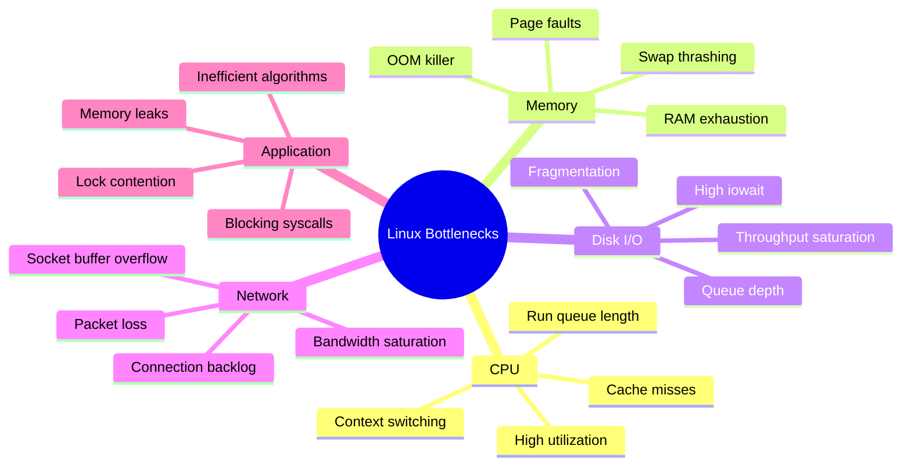
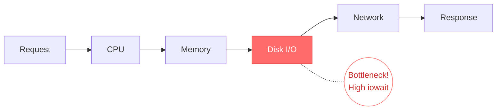
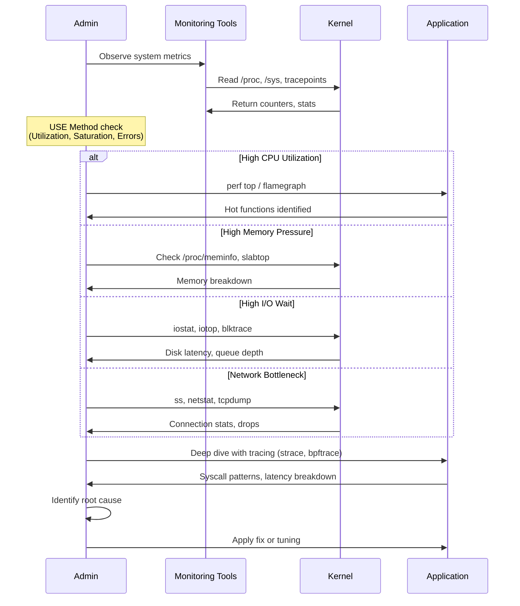
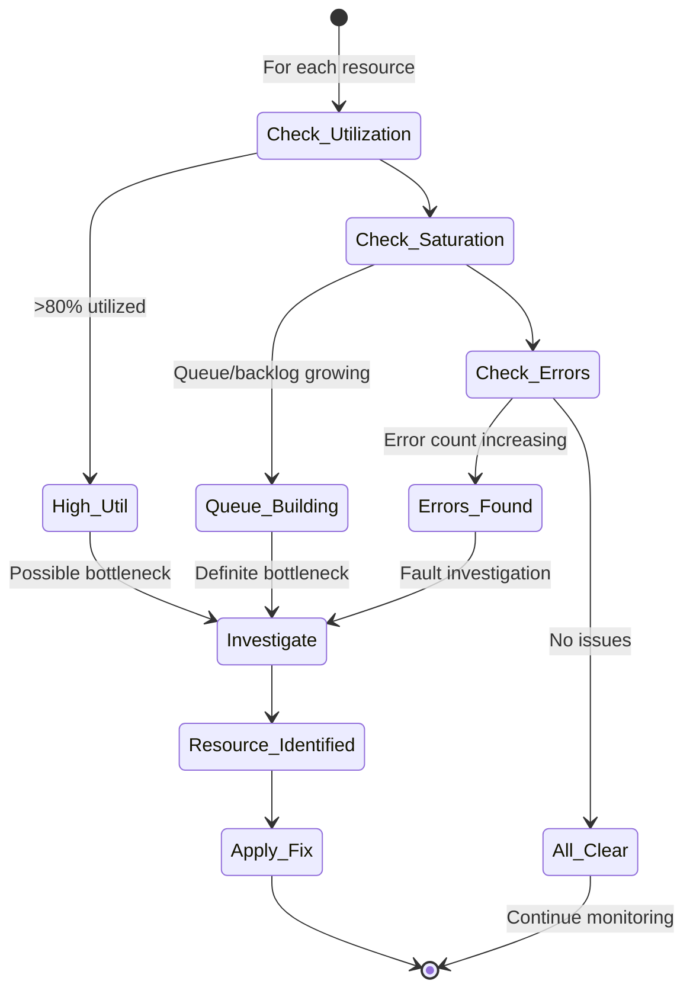
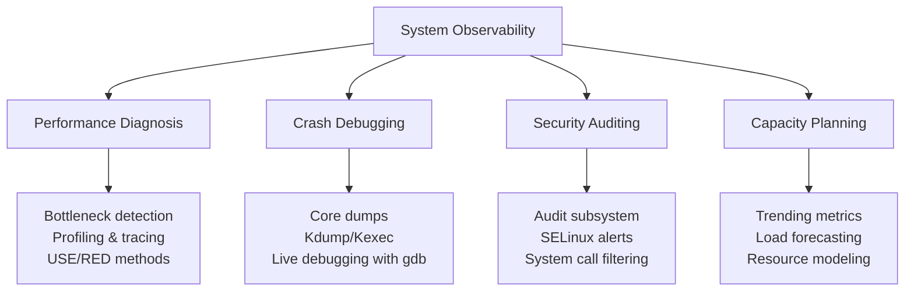
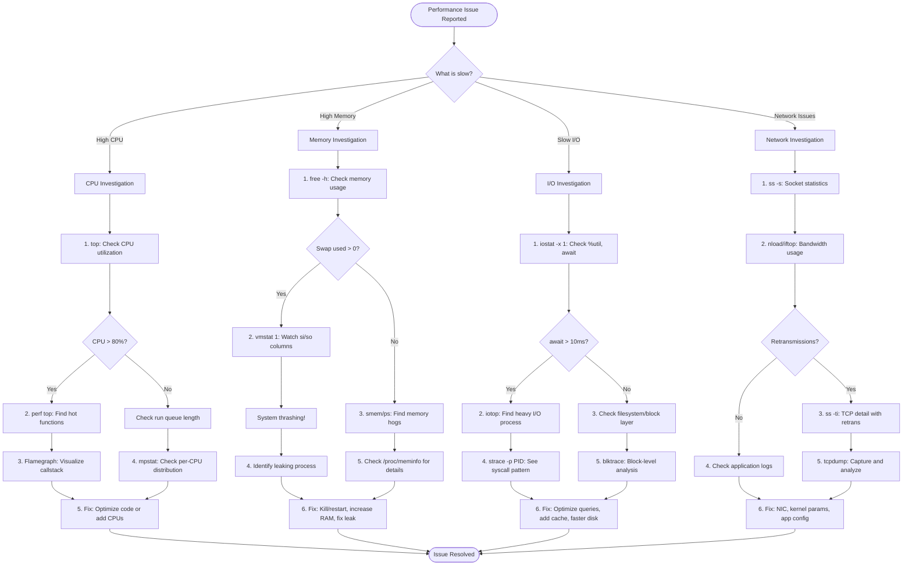
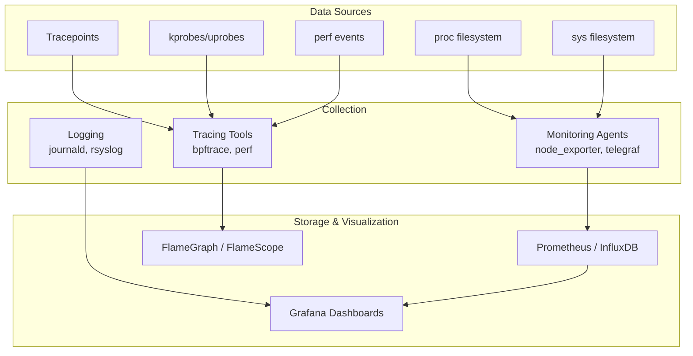

# Linux Performance Bottlenecks: Diagnosis & Debugging

## Overview

A **bottleneck** is a resource constraint that limits overall system performance. In Linux systems, bottlenecks can occur at multiple layers—hardware, kernel, application—and require systematic diagnosis using appropriate tools and methodologies.

Diagnosis follows a structured approach:
1. **Observe** system behavior (monitoring)
2. **Identify** the constrained resource (bottleneck detection)
3. **Analyze** root cause (profiling/tracing)
4. **Resolve** or mitigate (tuning/fixing)



---

## What is a Bottleneck?
A bottleneck occurs when a **resource reaches its capacity limit**, causing requests to queue up and response times to increase. It's the **slowest component** in a pipeline that determines overall throughput.

**Key insight:** Optimizing a non-bottleneck resource yields **zero performance improvement**. You must find and address the actual constraint.



---

## How Diagnosis Works: The Mechanism

### 1. The Diagnostic Methodology



### 2. The USE Method (Utilization, Saturation, Errors)



---

## Diagnostic Tools by Layer

```mermaid
graph TD
    subgraph "Application Layer"
        A1[strace - Syscall tracing]
        A2[ltrace - Library call tracing]
        A3[gdb - Debugger]
        A4[valgrind - Memory profiler]
        A5[perf record - CPU sampling]
    end
    
    subgraph "Kernel Layer"
        K1[ftrace - Function tracer]
        K2[bpftrace - Dynamic tracing]
        K3[eBPF - Programmable tracing]
        K4[SystemTap - Kernel probing]
    end
    
    subgraph "System Layer"
        S1[top/htop - Process monitor]
        S2[vmstat - Virtual memory stats]
        S3[iostat - I/O statistics]
        S4[sar - System activity reporter]
        S5[dstat - Versatile stats]
    end
    
    subgraph "Network Layer"
        N1[ss/netstat - Socket stats]
        N2[tcpdump - Packet capture]
        N3[iperf3 - Bandwidth test]
        N4[ping/traceroute - Connectivity]
    end
    
    A1 --> A2 --> A3 --> A4 --> A5
    K1 --> K2 --> K3 --> K4
    S1 --> S2 --> S3 --> S4 --> S5
    N1 --> N2 --> N3 --> N4
```



---

## Similar Mechanisms (Same Level of Abstraction)

Diagnosis and debugging in Linux share the same **observability and introspection** level with these mechanisms:



### Comparison Table

| Mechanism | Primary Goal | Key Tools | Data Source | Analysis Type |
|-----------|-------------|-----------|-------------|---------------|
| **Performance Diagnosis** | Find bottlenecks | `perf`, `bcc/bpftrace`, `iostat` | Counters, tracepoints | Real-time, historical |
| **Crash Debugging** | Root cause of failure | `gdb`, `crash`, `kdump` | Core dumps, vmcore | Post-mortem |
| **Security Auditing** | Detect intrusions | `auditd`, `osquery`, `falco` | Audit logs, syscalls | Policy-based, real-time |
| **Capacity Planning** | Predict resource needs | `prometheus`, `grafana`, `sar` | Time-series metrics | Trend analysis |
| **Application Debugging** | Fix logic errors | `gdb`, `strace`, `valgrind` | Process state, memory | Interactive |
| **Tracing/Profiling** | Understand execution flow | `bpftrace`, `perf`, `LTTng` | Events, stack traces | Dynamic, low-overhead |

---

## Step-by-Step Debugging Guide

### Common Bottleneck Debugging Steps



---

## Key Diagnostic Commands Quick Reference

### CPU Bottleneck
```bash
# Check overall CPU usage
top -bn1 | head -20

# Per-CPU usage
mpstat -P ALL 1

# Find hot functions (sampling profiler)
perf top -g

# Generate flamegraph
perf record -F 99 -g -p <PID> -- sleep 30
perf script | FlameGraph/stackcollapse-perf.pl | FlameGraph/flamegraph.pl > flame.svg

# Check run queue / load average
uptime
cat /proc/loadavg

# Context switching rate
vmstat 1 5
```

### Memory Bottleneck
```bash
# Memory overview
free -h

# Memory pressure stats
cat /proc/pressure/memory

# Detailed memory info
cat /proc/meminfo

# Top memory consumers (RSS)
ps aux --sort=-%mem | head -10

# Slab memory (kernel objects)
slabtop -o

# Check for swapping
vmstat 1
# Watch si (swap in) and so (swap out) columns

# OOM killer history
dmesg | grep -i "out of memory"
```

### I/O Bottleneck
```bash
# Disk utilization and latency
iostat -x 1

# Per-process I/O
iotop -o

# Files opened by process
lsof -p <PID>

# Trace syscalls with timing
strace -c -p <PID>  # Summary
strace -T -p <PID>  # With timestamps

# Block layer tracing
btrace /dev/sda

# Check I/O pressure
cat /proc/pressure/io
```

### Network Bottleneck
```bash
# Socket statistics
ss -s
ss -tlnp  # Listening TCP sockets
ss -tan state time-wait | wc -l  # Count TIME_WAIT

# TCP retransmissions
ss -ti

# Bandwidth per process
nethogs eth0

# Packet capture
tcpdump -i eth0 -nn -c 1000 -w capture.pcap

# Network errors
netstat -i
ip -s link show
```

---

## Code Example: Programmatic Bottleneck Detection

```c
#include <stdio.h>
#include <stdlib.h>
#include <string.h>
#include <unistd.h>
#include <time.h>

typedef struct {
    double cpu_util;
    long mem_free_mb;
    double load_1min;
    int io_wait_pct;
} SystemHealth;

SystemHealth get_system_health() {
    SystemHealth health = {0};
    FILE *fp;
    char line[256];
    
    // Read load average
    fp = fopen("/proc/loadavg", "r");
    if (fp) {
        fscanf(fp, "%lf", &health.load_1min);
        fclose(fp);
    }
    
    // Read memory info
    fp = fopen("/proc/meminfo", "r");
    if (fp) {
        while (fgets(line, sizeof(line), fp)) {
            if (strncmp(line, "MemAvailable:", 13) == 0) {
                sscanf(line + 14, "%ld", &health.mem_free_mb);
                health.mem_free_mb /= 1024;  // Convert kB to MB
                break;
            }
        }
        fclose(fp);
    }
    
    // Read CPU stats (simplified)
    fp = fopen("/proc/stat", "r");
    if (fp) {
        long user, nice, system, idle, iowait;
        fgets(line, sizeof(line), fp);
        sscanf(line, "cpu %ld %ld %ld %ld %ld", 
               &user, &nice, &system, &idle, &iowait);
        long total = user + nice + system + idle + iowait;
        health.cpu_util = 100.0 * (total - idle) / total;
        health.io_wait_pct = (int)(100.0 * iowait / total);
        fclose(fp);
    }
    
    return health;
}

void diagnose_bottleneck(SystemHealth h) {
    printf("\n=== System Health Diagnostic ===\n");
    printf("Load Average (1min): %.2f\n", h.load_1min);
    printf("CPU Utilization:    %.1f%%\n", h.cpu_util);
    printf("I/O Wait:           %d%%\n", h.io_wait_pct);
    printf("Available Memory:   %ld MB\n", h.mem_free_mb);
    
    printf("\n=== Bottleneck Analysis ===\n");
    
    if (h.io_wait_pct > 20) {
        printf("⚠️  I/O BOTTLENECK: High iowait (%d%%)\n", h.io_wait_pct);
        printf("   → Check: iostat -x 1, iotop\n");
    }
    
    if (h.cpu_util > 90 && h.io_wait_pct < 10) {
        printf("⚠️  CPU BOTTLENECK: High utilization (%.1f%%)\n", h.cpu_util);
        printf("   → Check: perf top, mpstat -P ALL\n");
    }
    
    if (h.mem_free_mb < 512) {
        printf("⚠️  MEMORY PRESSURE: Low available memory (%ld MB)\n", 
               h.mem_free_mb);
        printf("   → Check: ps aux --sort=-%mem, vmstat 1\n");
    }
    
    int cpu_count = sysconf(_SC_NPROCESSORS_ONLN);
    if (h.load_1min > cpu_count * 1.5) {
        printf("⚠️  CPU SATURATION: Load (%.2f) exceeds CPU cores (%d)\n", 
               h.load_1min, cpu_count);
        printf("   → Check: vmstat 1 (watch 'r' column)\n");
    }
    
    if (h.io_wait_pct < 10 && h.cpu_util < 70 && h.mem_free_mb > 1024) {
        printf("✅ No obvious resource bottleneck detected.\n");
        printf("   → Consider application-level profiling: strace, perf\n");
    }
    
    printf("===============================\n");
}

int main() {
    printf("System Bottleneck Detector\n");
    printf("Collecting system health...\n");
    sleep(1);
    
    SystemHealth health = get_system_health();
    diagnose_bottleneck(health);
    
    return 0;
}
```

**Compile and run:**
```bash
gcc -o bottleneck_detect bottleneck_detect.c
./bottleneck_detect
```

---

## Important Notes

| Concept | Description |
|---------|-------------|
| **USE Method** | Check Utilization, Saturation, Errors for every resource |
| **RED Method** | Rate, Errors, Duration (for services/endpoints) |
| **90th Percentile** | Focus on P90/P99 latency, not averages |
| **The Tuning Cycle** | Monitor → Analyze → Tune → Monitor again |
| **eBPF Revolution** | Modern tracing without kernel modules (bpftrace, Cilium) |
| **Overhead Awareness** | Tracing tools have overhead; production-safe: perf, eBPF |
| **Baseline First** | Always establish normal metrics before troubleshooting |

### The Linux Observability Stack



---

## Related Notes
- [[Linux Signals]]
- [[Process Lifecycle]]
- [[Kernel Tracing with eBPF]]
- [[Linux Memory Management]]
- [[I/O Scheduler and Block Layer]]
- [[TCP Tuning and Network Stack]]
- [[Flame Graphs and Visualization]]

---

This note covers the systematic approach to identifying, diagnosing, and resolving Linux performance bottlenecks, with a focus on practical tools and step-by-step debugging flows using structured methodologies like USE and RED.