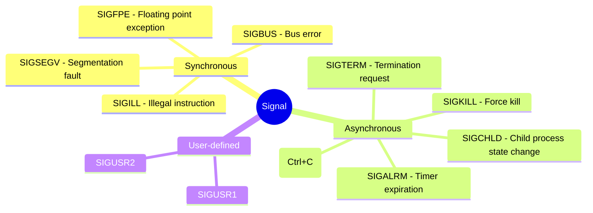
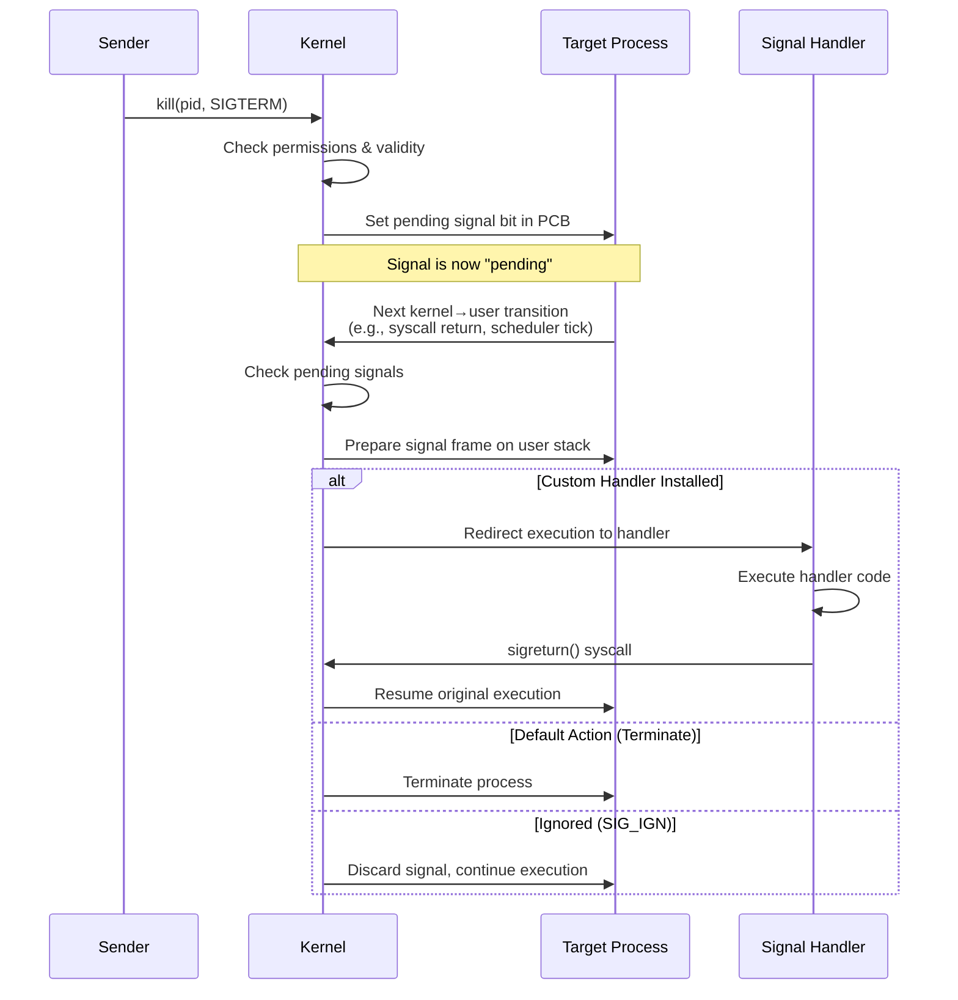
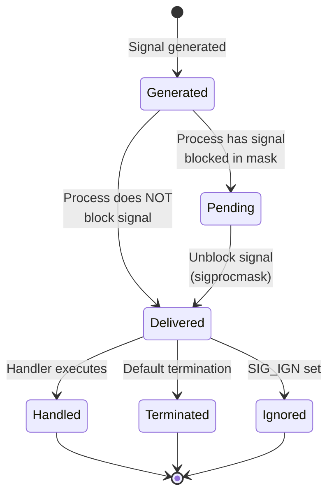
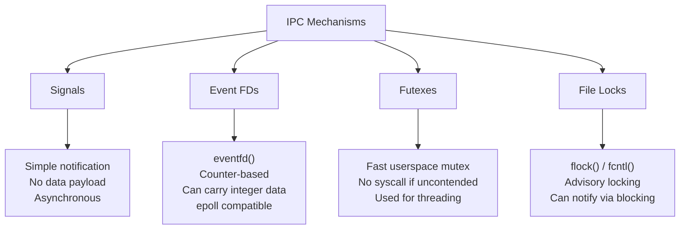

# Linux Signals

## Overview
Signals are **software interrupts** sent to a process to notify it of an event or to trigger a specific behavior. They provide a primitive form of **inter-process communication (IPC)** and **asynchronous event handling** in Unix-like systems.

Signals can be:
- **Sent by the kernel** (e.g., `SIGSEGV` on invalid memory access)
- **Sent by another process** (e.g., `kill` command)
- **Sent by the process itself** (e.g., `SIGABRT` from `abort()`)

---

## What is a Signal?
A signal is a **limited-form notification mechanism** that carries:
- A **signal number** (identifying the signal type)
- No additional data (except for real-time signals)
- Delivery information (sender PID, etc.)

Think of it as a *tap on the shoulder* rather than a full message.



---

## How Signals Work: The Mechanism

### 1. Generation
The kernel or a process raises a signal for a specific process.

### 2. Delivery Lifecycle



### 3. Key System Calls

| System Call | Description |
|-------------|-------------|
| `signal()` | Register a signal handler (legacy, avoid) |
| `sigaction()` | Modern signal handler registration |
| `kill()` | Send signal to a process |
| `raise()` | Send signal to self |
| `pause()` | Wait for any signal |
| `sigsuspend()` | Atomically change mask and pause |
| `sigprocmask()` | Examine/change blocked signal mask |

### 4. Signal Mask and Blocking



---

## Similar IPC Mechanisms (Same Level of Abstraction)

Signals share the same **lightweight, asynchronous notification** level with these mechanisms:



### Comparison Table

| Mechanism | Data Payload? | Blocking? | Use Case |
|-----------|---------------|-----------|----------|
| **Signals** | Signal number only (realtime signals: +1 int) | Can be async or sync | Process-level events, timeouts |
| **Event FD** (`eventfd`) | 64-bit counter | Can block (read) | Thread signaling, epoll integration |
| **Futex** (`futex`) | No (wakes waiter) | Yes | Mutex, semaphore, condvar implementation |
| **File Locks** (`flock`/`fcntl`) | No (lock state) | Yes | Cross-process synchronization |
| **POSIX Message Queues** | Yes (full message) | Yes | Structured IPC with priority |
| **Pipes/FIFOs** | Yes (byte stream) | Yes | Stream-based IPC |
| **Unix Domain Sockets** | Yes (datagram/stream) | Yes | Full-featured local IPC |

---

## Signal Handling Example (C)

```c
#include <stdio.h>
#include <stdlib.h>
#include <signal.h>
#include <unistd.h>

void sigint_handler(int signo) {
    printf("\nCaught SIGINT (%d)! But not exiting...\n", signo);
}

int main() {
    struct sigaction sa;
    
    sa.sa_handler = sigint_handler;
    sigemptyset(&sa.sa_mask);
    sa.sa_flags = SA_RESTART;  // Restart interrupted syscalls
    
    if (sigaction(SIGINT, &sa, NULL) == -1) {
        perror("sigaction");
        exit(1);
    }
    
    printf("PID: %d - Press Ctrl+C to test (kill to quit)\n", getpid());
    
    while (1) {
        printf("Working...\n");
        sleep(2);
    }
    
    return 0;
}
```

---

## Important Notes
- **Signal handlers should be ASYNC-SIGNAL-SAFE** (only call async-signal-safe functions)
- **SIGKILL (9) and SIGSTOP (19) cannot be caught, blocked, or ignored**
- **Realtime signals (SIGRTMIN-SIGRTMAX)**: Queue multiple instances and carry a data word
- **Signals interrupt system calls** by default (use `SA_RESTART` to auto-restart)

---

## Related Notes
- [[IPC Overview]]
- [[Linux Process Lifecycle]]
- [[Kernel Signal Implementation]]
- [[Real-time Signals]]
- [[Event Loop and Signals]]
