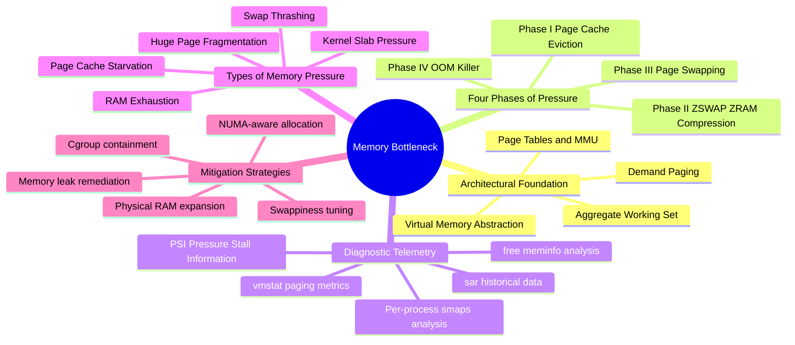
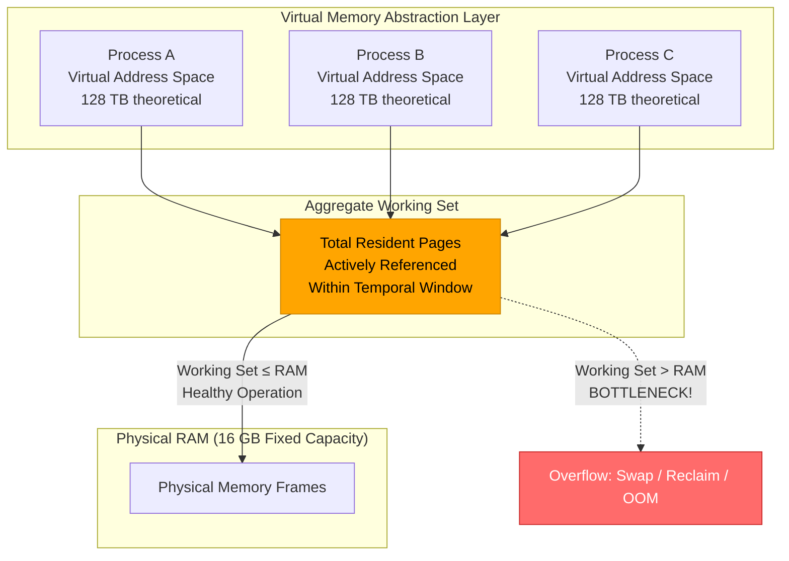
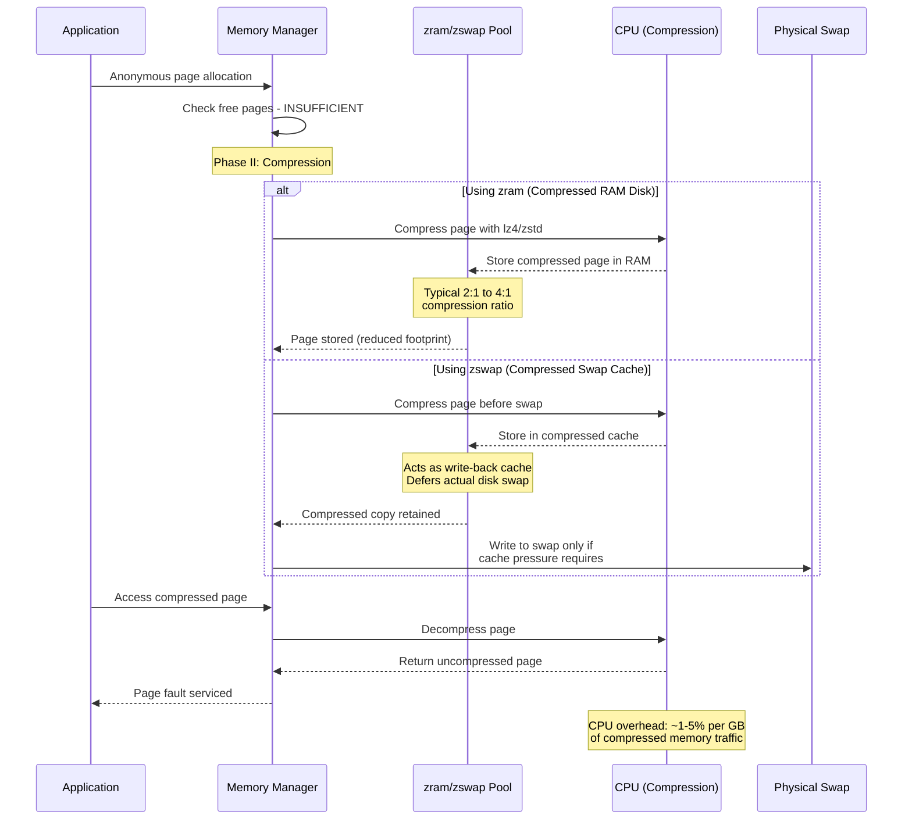
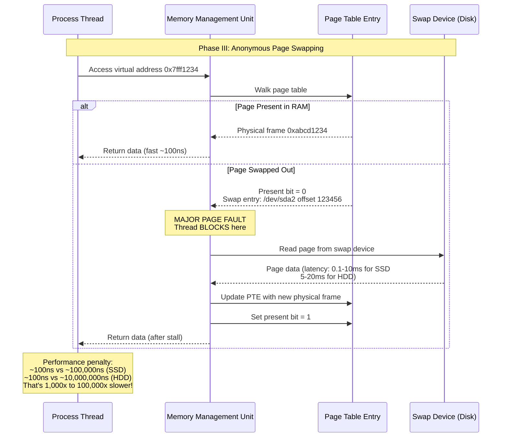
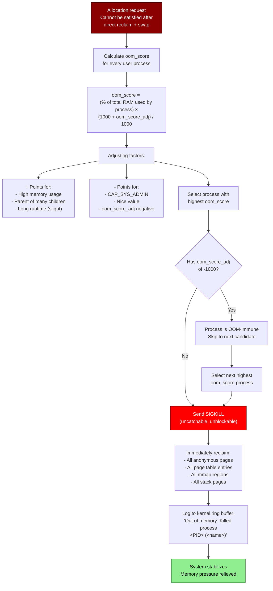
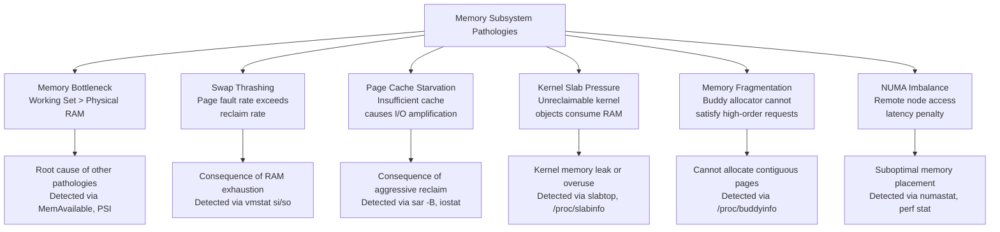

Here's the complete, professional Obsidian wiki note incorporating your Chapter 7 content with the established wiki format, expanded with deep technical detail:

---

# Memory Bottleneck in Linux

## Overview
A **memory bottleneck** occurs when the **Aggregate Working Set**—the total collection of resident memory pages actively and concurrently referenced by all executing processes, kernel threads, and system caches—exceeds the physical RAM capacity. In a monolithic UNIX-like operating system such as Linux, memory management relies on hardware abstraction layers to provide processes with an isolated, linear address space. However, when demand for physical pages outstrips hardware topology, the kernel enters a state of resource contention where the virtual memory abstraction begins to **break down**, forcing progressively aggressive reclamation strategies from cache eviction through to emergency process termination.



**Alternative flowchart if mindmap fails:**

```mermaid
graph TD
    MEM[Memory Bottleneck] --> ARCH[Architectural Foundation]
    MEM --> PHASES[Four Phases of Pressure]
    MEM --> DIAG[Diagnostic Telemetry]
    MEM --> TYPES[Types of Memory Pressure]
    MEM --> FIX[Mitigation Strategies]
    
    ARCH --> A1[Virtual Memory Abstraction]
    ARCH --> A2[Page Tables and MMU]
    ARCH --> A3[Demand Paging Mechanism]
    ARCH --> A4[Aggregate Working Set]
    
    PHASES --> P1[Phase I: Page Cache Eviction]
    PHASES --> P2[Phase II: ZSWAP/ZRAM Compression]
    PHASES --> P3[Phase III: Anonymous Page Swapping]
    PHASES --> P4[Phase IV: OOM Killer Remediation]
    
    DIAG --> D1["free -m / /proc/meminfo"]
    DIAG --> D2["vmstat 1 paging metrics"]
    DIAG --> D3["sar -B -r -S historical"]
    DIAG --> D4["/proc/pressure/memory PSI"]
    DIAG --> D5["Per-process smaps / PSS"]
    
    TYPES --> T1[RAM Exhaustion]
    TYPES --> T2[Swap Thrashing]
    TYPES --> T3[Page Cache Starvation]
    TYPES --> T4[Kernel Slab Pressure]
    TYPES --> T5[Huge Page Fragmentation]
    
    FIX --> F1[Add Physical RAM]
    FIX --> F2[Fix Memory Leaks]
    FIX --> F3[Tune vm.swappiness]
    FIX --> F4[Cgroup Limits]
    FIX --> F5[NUMA-Aware Allocation]
    
    style P3 fill:#ff6b6b,stroke:#c92a2a,color:#fff
    style P4 fill:#8b0000,stroke:#4a0000,color:#fff
    style T2 fill:#ff6b6b,stroke:#c92a2a,color:#fff
```



---

## What is a Memory Bottleneck in Linux?

A memory bottleneck materializes the moment the **Aggregate Working Set** crosses the threshold of available physical RAM. When this occurs, the virtual memory abstraction begins to break down—the kernel can no longer satisfy page allocation requests instantaneously from the free list and is forced into asynchronous sub-routines to harvest memory. This triggers a cascade of performance degradation that can masquerade as CPU saturation, disk I/O bottlenecks, or network latency.

### Architectural Foundation: The Virtual Memory Abstraction

To understand memory bottlenecks, one must first examine the relationship between physical memory (RAM) and **Virtual Memory**. The Linux kernel implements a demand-paged virtual memory system. Every user-space process operates within its own virtual address space, managed via page tables mapped by the Memory Management Unit (MMU) of the CPU.

Memory is allocated in fixed-size blocks called **Pages** (typically 4 KB on `x86_64` architectures, though huge pages of 2 MB or 1 GB are supported). The kernel maintains an abstraction where the total allocated virtual memory can safely exceed physical capacity—this is the principle of **memory overcommit**. This operates seamlessly until the system approaches the boundary of its aggregate working set.



> **Architectural Definition:** The **Aggregate Working Set** is the total collection of resident memory pages actively, frequently, and concurrently referenced by all executing processes, kernel threads, and system caches within a specific temporal window. It is distinct from virtual memory size (which can be arbitrarily large) and from RSS (which includes inactive pages).

**Key insight:** Linux aggressively uses "free" RAM for page cache (buffering disk reads and writes). A system reporting only 200 MB "free" in `free -h` may be perfectly healthy if the "available" column shows several GB—that memory is in use as cache and can be instantly reclaimed for applications. The metric that matters is **available memory**, not free memory. Memory pressure begins not when free memory is low, but when available memory approaches exhaustion.

---

## The Mechanics of a Memory Bottleneck: Four Evolutionary Phases

The kernel's response to sustained memory pressure executes across four distinct evolutionary phases, each more aggressive and performance-impacting than the last.

### Complete Phase Progression Diagram

```mermaid
stateDiagram-v2
    [*] --> Phase0: Normal Operation<br/>Free pages > HIGH watermark
    
    Phase0 --> Phase1: Free pages drop<br/>below HIGH watermark
    
    state Phase1 {
        [*] --> KswapdWake: kswapd daemon activated
        KswapdWake --> LRUScan: Scan active/inactive LRU lists
        LRUScan --> IdentifyClean: Identify clean file-backed pages
        IdentifyClean --> EvictCache: Discard clean page cache pages
        EvictCache --> CheckWatermark1: Free pages > HIGH?
        CheckWatermark1 --> [*]: Yes - kswapd sleeps
        CheckWatermark1 --> MoreReclaim: No - continue scanning
    }
    
    Phase1 --> Phase2: Page cache insufficient<br/>Free pages < LOW watermark
    
    state Phase2 {
        [*] --> CompressAlloc: Intercept anonymous page writes
        CompressAlloc --> ZRAMStore: Compress pages in RAM<br/>(zram block device)
        CompressAlloc --> ZSWAPStore: Compress pages as swap cache<br/>(zswap writeback cache)
        ZRAMStore --> CPUOverhead: CPU consumed by<br/>lz4/zstd compression
        ZSWAPStore --> CPUOverhead
        CPUOverhead --> CheckWatermark2: Sufficient memory freed?
        CheckWatermark2 --> [*]: Yes
        CheckWatermark2 --> Phase3: No - escalate to swap
    }
    
    Phase2 --> Phase3: Compression insufficient<br/>Free pages < MIN watermark
    
    state Phase3 {
        [*] --> SelectAnon: Target anonymous pages<br/>(heap, stack, mmap)
        SelectAnon --> MarkPTE: Mark page table entries<br/>as non-present
        MarkPTE --> WriteSwap: Serialize page content<br/>write to swap device
        WriteSwap --> PageFault: Process accesses swapped page
        PageFault --> MajorFault: Major page fault triggered<br/>Thread BLOCKS
        MajorFault --> ReadSwap: Read page from swap<br/>(orders of magnitude slower)
        ReadSwap --> ThrashingCheck{Swap rate ><br/>reclaim rate?}
        ThrashingCheck --> Thrashing: System thrashing<br/>CPU spends more time<br/>swapping than computing
        ThrashingCheck --> [*]: Reclaim keeping pace
    }
    
    Phase3 --> Phase4: Swap saturated<br/>Allocation demands persist
    
    state Phase4 {
        [*] --> CalcBadness: Calculate oom_score<br/>for all user processes
        CalcBadness --> Factors: Factors: % memory used<br/>× oom_score_adj<br/>× process priority
        Factors --> SelectVictim: Select highest badness score
        SelectVictim --> SIGKILL: Send uncatchable SIGKILL
        SIGKILL --> ReclaimPages: Reclaim victim's<br/>entire memory map
        ReclaimPages --> LogEvent: Log OOM event to<br/>kernel ring buffer
        LogEvent --> [*]: System stabilizes
    }
    
    Phase4 --> Phase0: Memory freed by OOM kill
    Thrashing --> Phase4: Thrashing unresolved
    
    style Phase1 fill:#90EE90,stroke:#2d8a2d,color:#000
    style Phase2 fill:#ffa500,stroke:#cc8400,color:#000
    style Phase3 fill:#ff6b6b,stroke:#c92a2a,color:#fff
    style Phase4 fill:#8b0000,stroke:#4a0000,color:#fff
    style Thrashing fill:#ff0000,stroke:#8b0000,color:#fff
```

### Phase I: Page Cache Eviction (Dropping Clean Pages)

Before disrupting active processes, the kernel looks to its file-backed memory. The **Page Cache** stores copies of data read from disk to accelerate subsequent I/O requests. This cache is the kernel's first line of defense—it represents memory that can be reclaimed with minimal system impact.

**Mechanism:**
1. `kswapd` (kernel swap daemon) wakes when free pages drop below the **HIGH watermark**
2. The daemon scans the **LRU (Least Recently Used) lists** for file-backed pages
3. Pages are categorized as:
   - **Clean pages**: Identical to their on-disk counterparts; can be **instantly discarded**
   - **Dirty pages**: Modified in memory but not yet written to disk; must be **flushed first**
4. Clean pages are immediately reclaimed to the free list
5. Dirty pages trigger writeback to storage before eviction

**Performance impact:** While this frees up immediate physical frames, it introduces a performance tax: subsequent reads to those files will trigger synchronous disk I/O, degrading system responsiveness. The system transitions from memory-speed operations to disk-speed operations.

```bash
# Observe page cache eviction in real-time
$ sar -B 1 10
# pgpgin/s  - Pages paged in from disk (cache refills)
# pgpgout/s - Pages paged out to disk (dirty page writeback)
# fault/s   - Page faults per second
# majflt/s  - Major faults (require disk access)

# Check current page cache size
$ cat /proc/meminfo | grep -E "^Cached:|^Dirty:|^Writeback:"
Cached:    8388608 kB   # 8 GB page cache
Dirty:        1024 kB   # Very little dirty = mostly clean = easily reclaimable
Writeback:       0 kB   # No pages currently being written to disk
```

### Phase II: In-Memory Compression via ZSWAP/ZRAM

If page cache eviction yields insufficient space, modern Linux distributions utilize compressed memory pools. This phase trades CPU cycles for memory capacity—the CPU must continuously compress and decompress pages using algorithms like `lz4`, `zstd`, or `lzo`.



**Two implementations:**

| Feature | `zram` | `zswap` |
|---------|--------|---------|
| **Location** | RAM-based compressed block device | Compressed write-back cache |
| **Backing store** | None (pure RAM) | Physical swap device |
| **Use case** | Systems without swap, embedded devices | Systems with swap, servers |
| **Compression** | Intercepts all writes to zram device | Intercepts pages headed for swap |
| **Failure mode** | OOM when zram fills | Falls through to physical swap |

```bash
# Check zram configuration
$ zramctl
NAME       ALGORITHM DISKSIZE  DATA COMPR TOTAL STREAMS MOUNTPOINT
/dev/zram0 lz4           4G  1.2G  400M  450M       4 [SWAP]

# Check zswap configuration
$ cat /sys/module/zswap/parameters/enabled
Y
$ cat /sys/module/zswap/parameters/compressor
lz4
$ cat /sys/module/zswap/parameters/max_pool_percent
20  # Use up to 20% of RAM for compressed cache
```

### Phase III: Page Swapping (Anonymous Page Invalidation)

When file-backed caches are exhausted and compressed memory pools are saturated, the kernel targets **anonymous memory**—allocated heap, stack, and process data. Because this data does not exist on disk, it cannot be simply dropped. It must be written to designated non-volatile storage (a Swap partition or Swap file).



**The Thrashing Threshold:**

Because non-volatile storage (even NVMe SSDs) is orders of magnitude slower than physical RAM, excessive swapping leads to a catastrophic state known as **Thrashing**, where the CPU spends more time swapping pages than executing application logic.

```bash
# Identify thrashing in real-time
$ vmstat 1
procs -----------memory---------- ---swap-- -----io---- -system-- ------cpu-----
 r  b   swpd   free   buff  cache   si   so    bi    bo   in   cs us sy id wa st
 3  2 1894400 123904  12440 983040  450  820  1200   900 1400 3200 45 25 10 20  0
#  ^^  ^^^^^^^                       ^^  ^^                                  ^^
#  |   Swap used growing             |   |                                  I/O wait
#  Blocked                           Swap In/Out > 0                        high
#  processes                         sustained = THRASHING
```

**Thrashing detection criteria:**
- `si` and `so` columns in `vmstat` are **sustained non-zero** (> 10 pages/sec)
- `%wa` (I/O wait) exceeds **20%**
- `%id` (idle) is near **zero** but `%usr` is also **low** (CPU waiting on I/O, not computing)
- `r` (run queue) is **low** (processes are blocked, not runnable)
- System feels **unresponsive**—even SSH takes seconds to echo keystrokes

### Phase IV: Emergency Remediation via the Out-Of-Memory (OOM) Killer

When all logical remediation mechanisms fail—the swap space is saturated, caches are fully depleted, zram/zswap pools are full, and allocation demands persist—the kernel faces system-wide instability. To protect the integrity of the operating system itself, it invokes the **OOM Killer**.



**OOM Score Calculation:**

```bash
# View a process's OOM score
$ cat /proc/<PID>/oom_score
156  # Higher = more likely to be killed

# View the adjustment value
$ cat /proc/<PID>/oom_score_adj
0    # 0 = default, -1000 = immune, +1000 = first to die

# Make a critical process OOM-immune
$ echo -1000 | sudo tee /proc/<PID>/oom_score_adj

# Make a process the preferred OOM victim
$ echo 1000 | sudo tee /proc/<PID>/oom_score_adj

# Check OOM killer history
$ dmesg | grep -i "out of memory\|killed process"
[12345.678] Out of memory: Killed process 1234 (java) total-vm:8GB, anon-rss:6GB, file-rss:512MB, shmem-rss:0kB
[12345.890] oom_reaper: reaped process 1234 (java), now anon-rss:0kB, file-rss:0kB, shmem-rss:0kB
```

---

## Similar Mechanisms (Same Level of Abstraction)

Memory bottlenecks are one category of **memory subsystem pathology**. Related conditions at the same abstraction level include:



### Comparison Table

| Mechanism | Key Metric | Detection | Symptoms | Root Fix | Often Misdiagnosed As |
|-----------|-----------|-----------|----------|----------|----------------------|
| **Memory Bottleneck** | `MemAvailable` < 10% RAM | `free -h`, PSI | Allocation stalls, OOM warnings | Add RAM, fix leaks | — (root cause) |
| **Swap Thrashing** | `si` + `so` > 0 sustained | `vmstat 1`, `sar -W` | High `%iowait`, system frozen | Add RAM, reduce swappiness | Disk I/O bottleneck |
| **Page Cache Starvation** | `Cached` < 5% RAM | `sar -r`, `/proc/meminfo` | Increased disk read latency | Add RAM, tune `vfs_cache_pressure` | Slow disks |
| **Slab Pressure** | `SUnreclaim` growing unbounded | `slabtop`, `/proc/slabinfo` | Slow `ls`, `find`, file ops | Kernel update, reduce file ops | Filesystem corruption |
| **Fragmentation** | High-order free pages = 0 | `/proc/buddyinfo`, `compact_stall` | `ENOMEM` on large allocations | Enable compaction, hugepages | Memory leak |
| **NUMA Imbalance** | `numa_miss` > 10% | `numastat`, `perf stat -e node-loads` | Uneven performance by core | `numactl --membind` | General memory pressure |

**What makes memory bottleneck unique:** Unlike the other mechanisms which are consequences, RAM exhaustion is the **root cause** that triggers swap thrashing, cache starvation, and eventually OOM killing. Addressing the underlying memory shortage resolves all downstream effects simultaneously.

---

## Diagnostic Telemetry

To identify a memory bottleneck on a live system, a systems engineer must monitor kernel telemetry using low-overhead diagnostic tools.

### 1. Analyzing Subsystem Aggregates with `free`

The `free` utility parses `/proc/meminfo` to display physical and swap memory allocation maps.

```bash
$ free -h
              total        used        free      shared  buff/cache   available
Mem:           7.7G        6.6G        121M        452M        960M        412M
Swap:          2.0G        1.8G        197M
```

**Critical field interpretation:**
- **`available`**: An estimate of how much memory is available for starting new applications without swapping. This is calculated by the kernel considering: free pages + reclaimable page cache + reclaimable slab objects. A value approaching **< 10% of total RAM** indicates a bottleneck.
- **`Swap: used`**: If this value climbs continuously alongside a low `available` physical memory metric, active page swapping is occurring.
- **`buff/cache`**: Memory used for file system buffers and page cache. This is **reclaimable** and included in `available`. High values here are healthy—they indicate the kernel is efficiently using RAM to accelerate I/O.

```bash
# Detailed breakdown via /proc/meminfo (what free parses)
$ cat /proc/meminfo | grep -E "^MemTotal|^MemAvailable|^SwapTotal|^SwapFree|^Cached|^Dirty|^AnonPages|^Slab"
MemTotal:        8123456 kB
MemAvailable:     421888 kB    # ← ONLY 5% AVAILABLE! CRITICAL PRESSURE
SwapTotal:       2097148 kB
SwapFree:         201728 kB    # ← 90% SWAP USED!
Cached:           983040 kB    # ← Cache already evicted to minimum
Dirty:              1024 kB
AnonPages:       6543210 kB    # ← 6.5 GB anonymous (process) memory
Slab:             456789 kB
```

### 2. Identifying Virtual Memory Page Faults with `vmstat`

The `vmstat` (Virtual Memory Statistics) command exposes kernel-level scheduling and paging operations over time. This is the **single most important tool** for identifying active memory pressure.

```bash
$ vmstat 1
procs -----------memory---------- ---swap-- -----io---- -system-- ------cpu-----
 r  b   swpd   free   buff  cache   si   so    bi    bo   in   cs us sy id wa st
 3  2 1894400 123904  12440 983040  450  820  1200   900 1400 3200 45 25 10 20  0
```

**Critical column interpretation:**

| Column | Meaning | Healthy | Warning | Critical |
|--------|---------|---------|---------|----------|
| **`r`** | Run queue (runnable processes) | < CPU count | = CPU count | > CPU count |
| **`b`** | Blocked processes (waiting for I/O, often swap) | 0 | 1-2 | > 2 sustained |
| **`swpd`** | Swap space used (KB) | Stable | Slowly growing | Rapidly growing |
| **`si`** | Swap **in** (pages read FROM swap per second) | **0** | > 0 occasional | > 0 **sustained** |
| **`so`** | Swap **out** (pages written TO swap per second) | **0** | > 0 occasional | > 0 **sustained** |
| **`wa`** | CPU I/O wait percentage | < 5% | 5-20% | > 20% |

**Thrashing confirmation:**
Sustained non-zero values in `si` and `so`, combined with high `%wa` (wait I/O) CPU percentages, confirm the operating system is actively thrashing. When `si` + `so` > 0 for multiple consecutive samples AND `%wa` > 20%, the system has crossed the thrashing threshold.

```bash
# Example: Healthy system
$ vmstat 1 5
procs -----------memory---------- ---swap-- -----io---- -system-- ------cpu-----
 r  b   swpd   free   buff  cache   si   so    bi    bo   in   cs us sy id wa st
 1  0      0 1500000 500000 8000000    0    0     5    50  500 1000  5  3 90  2  0
#                                       ^^  ^^                          ^^
#                                       Zero swap activity             Low I/O wait

# Example: Thrashing system
$ vmstat 1 5
procs -----------memory---------- ---swap-- -----io---- -system-- ------cpu-----
 r  b   swpd   free   buff  cache   si   so    bi    bo   in   cs us sy id wa st
 1  8 2500000  50000  10000 200000  800 1200  3000  2500 5000 8000 10 15  5 70  0
#   ^  ^^^^^^^                       ^^  ^^                            ^^
#   |  Swap full                     Heavy swap I/O              70% I/O wait
#   Blocked processes                                                THRASHING!
```

### 3. Historical Analysis with `sar`

The `sar` (System Activity Reporter) command provides historical data for trend analysis:

```bash
# Memory utilization history
$ sar -r 1 10
# kbmemfree - Free memory
# kbmemused - Used memory  
# %memused  - Percentage used
# kbbuffers - Buffer memory
# kbcached  - Page cache memory
# kbcommit   - Committed (promised) virtual memory
# %commit    - Percentage of RAM+swap committed

# Swap activity history
$ sar -S 1 10
# kbswpfree - Free swap
# kbswpused - Used swap
# %swpused  - Percentage swap used
# kbswpcad  - Cached swap (pages in swap but also in RAM)

# Paging statistics
$ sar -B 1 10
# pgpgin/s  - Kilobytes paged IN from disk per second
# pgpgout/s - Kilobytes paged OUT to disk per second  
# fault/s   - Page faults per second (major + minor)
# majflt/s  - Major page faults (require disk access)
# pgfree/s  - Pages freed per second
# pgscank/s - Pages scanned by kswapd per second
# pgscand/s - Pages scanned directly (direct reclaim) per second
```

### 4. Pressure Stall Information (PSI)

Modern kernels (4.20+) provide **Pressure Stall Information**—the most accurate metric for memory pressure:

```bash
$ cat /proc/pressure/memory
some avg10=60.00 avg60=45.00 avg300=30.00 total=9876543210
full avg10=25.00 avg60=18.00 avg300=10.00 total=1234567890
```

**Interpretation:**
- **`some avg10=60.00`**: Over the last 10 seconds, **some** tasks were stalled waiting for memory **60% of the time**. This means for 6 out of every 10 seconds, at least one process couldn't make progress due to memory pressure.
- **`full avg10=25.00`**: Over the last 10 seconds, **all non-idle** tasks were simultaneously stalled **25% of the time**. This is the more severe metric—the entire system was blocked on memory.

**Thresholds for alerting:**
| PSI Metric | Normal | Warning | Critical |
|-----------|--------|---------|----------|
| `some avg10` | < 5 | 5-20 | > 20 |
| `some avg60` | < 3 | 3-10 | > 10 |
| `full avg10` | < 2 | 2-10 | > 10 |

### 5. Per-Process Memory Analysis

```bash
# Proportional Set Size (PSS) - most accurate per-process metric
# PSS = Private memory + (Shared memory / number of sharers)
$ sudo smem -rs pss | head -15
  PID User     Command                         Swap      USS      PSS      RSS
 1234 app      /opt/app/server                    0    3.2G    4.5G    8.0G
 1235 app      /opt/app/worker                    0    2.0G    3.1G    4.8G

# Check swap usage per process (identify what's been swapped out)
$ for pid in $(ls /proc | grep -E '^[0-9]+$'); do
    swap=$(awk '/VmSwap/ {print $2}' /proc/$pid/status 2>/dev/null)
    [ -n "$swap" ] && [ "$swap" != "0" ] && \
        echo "PID $pid: ${swap}kB $(cat /proc/$pid/comm 2>/dev/null)"
done | sort -t: -k2 -rn | head -10

# Detailed memory map of a process
$ cat /proc/<PID>/smaps | grep -E "^[0-9a-f]|^Pss:|^Swap:|^Private"
# Shows every memory region with PSS, Swap, and Private breakdown
```

---

## Common Mistakes, Pitfalls, and Misunderstandings

### Mistake 1: Worrying About Low "Free" Memory

**The mistake:**
```bash
$ free -h
              total        used        free      shared  buff/cache   available
Mem:           15Gi       3.0Gi       200Mi       500Mi        12Gi        11Gi
# Admin: "Only 200MB free! System is about to crash! Need more RAM immediately!"
```

**Why it's wrong:**
Linux is designed to use memory for caching—unused RAM is wasted RAM. The kernel will instantly reclaim page cache when applications need memory. The "available" column (11 GB here) represents memory that can be used immediately for new allocations without swapping.

**Correct approach:** Monitor `MemAvailable`, not `MemFree`. Only worry when `MemAvailable` < 10% of `MemTotal`.

---

### Mistake 2: Confusing RSS with Actual Memory Usage

**The mistake:** Adding up RSS values from `ps aux` and concluding the system needs more RAM than physically installed.

**Why it's wrong:** RSS double-counts shared memory. If 10 processes each map the same 1 GB shared library, RSS reports 10 GB, but only 1 GB of physical RAM is consumed.

**Correct approach:** Use **PSS (Proportional Set Size)** via `smem` or `/proc/PID/smaps`. PSS divides shared memory by the number of processes sharing it.

---

### Mistake 3: Setting `vm.swappiness=0` to "Prevent Swapping"

**The mistake:** Setting swappiness to 0, believing this disables swap entirely.

**Why it's wrong:** On modern kernels (3.5+), `vm.swappiness=0` does NOT prevent swapping—it only disables proactive swap during normal operation. Under memory pressure, the kernel will still swap aggressively. Worse, it changes reclaim behavior to avoid swap so strongly that the kernel may evict actively-used page cache, causing I/O thrashing.

**Correct approach:** For latency-sensitive servers, use `vm.swappiness=1`. For desktops