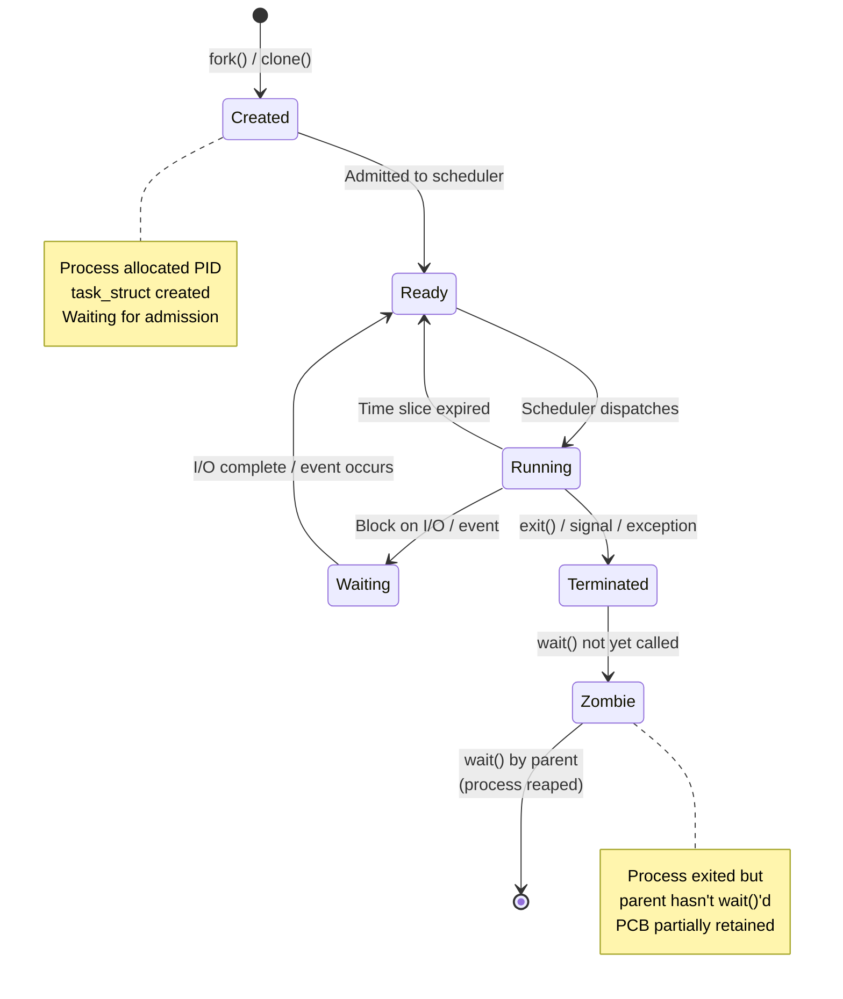
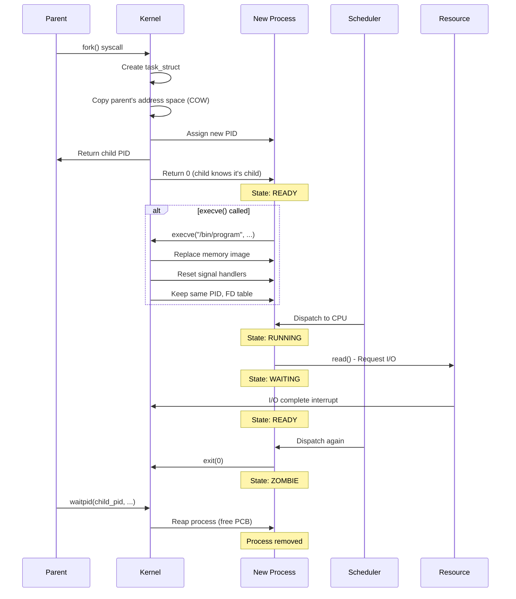
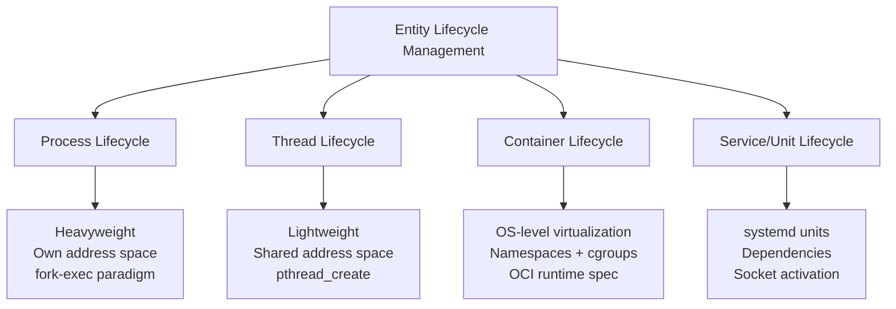
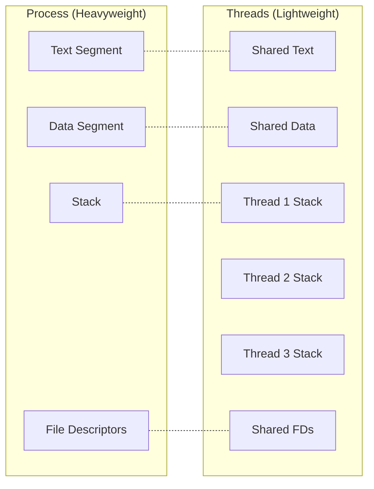

# Process Lifecycle

## Overview
The **process lifecycle** describes the complete journey of a process from its creation to its termination in a Linux system. The kernel manages processes through distinct states, transitions, and metadata structures (Process Control Block - PCB).

A process is **more than just a running program**—it encompasses:
- Executable code (text segment)
- Memory space (stack, heap, data)
- System resources (file descriptors, sockets)
- Execution context (registers, program counter)
- Scheduling attributes (priority, CPU time)

```mermaid
mindmap
  root((Process Lifecycle))
    Creation
      fork() - Clone current process
      execve() - Replace process image
      clone() - Shared resources
    Scheduling
      Ready - Waiting for CPU
      Running - On CPU
      Waiting - Blocked on I/O
    Termination
      Normal exit - exit()
      Abnormal - Signal/Exception
      Zombie - Awaiting wait()
      Orphan - Adopted by init
```

---

## What is a Process?
A process is an **instance of a program in execution**. It's the fundamental unit of work in a Linux system, identified by a unique **PID (Process ID)**.

The kernel represents each process using a **task_struct** (Process Control Block) containing:
- Process state
- PID and parent PID
- Memory mappings
- File descriptor table
- Signal information
- Scheduling parameters

---

## How the Process Lifecycle Works: The Mechanism

### 1. Process States



### 2. Complete Lifecycle Flow



### 3. The Fork-Exec Mechanism

---

## Similar Abstraction Mechanisms (Same Level)

The process lifecycle shares the same **entity management** abstraction level with these mechanisms:



### Comparison Table

| Mechanism | Isolation Level | Creation Cost | Address Space | Linux Primitive |
|-----------|----------------|---------------|---------------|-----------------|
| **Process** | Full (own memory, FDs) | High (fork + COW) | Independent | `fork()` + `execve()` |
| **Thread** | Partial (shared memory) | Low | Shared | `clone()` with `CLONE_THREAD` |
| **Container** | Namespace-level | Medium | Independent | `clone()` + namespaces |
| **vCPU (KVM)** | Hardware VM | Very High | Hypervisor-managed | `KVM_CREATE_VCPU` |
| **Task (kernel)** | Kernel space | Very Low | Kernel address space | `kthread_create()` |
| **systemd Service** | Process group | Medium (exec) | Per-process | `fork()` + cgroups |

### Key Differences from Threads



---

## Code Example: Full Lifecycle Demonstration

```c
#include <stdio.h>
#include <stdlib.h>
#include <unistd.h>
#include <sys/wait.h>
#include <sys/types.h>

void print_state(const char *state) {
    printf("[PID %d] State: %s\n", getpid(), state);
}

int main() {
    pid_t pid;
    int status;
    
    print_state("RUNNING - Parent starting");
    
    pid = fork();  // Child created → READY
    
    if (pid == -1) {
        perror("fork failed");
        exit(1);
    }
    
    if (pid == 0) {
        // ===== CHILD PROCESS =====
        print_state("READY → RUNNING - Child executing");
        
        // Simulate work
        sleep(2);
        
        print_state("WAITING - Child sleeping (blocked on I/O)");
        printf("Child doing work...\n");
        
        print_state("RUNNING - Child completing");
        
        // Replace with new program? No, just exit
        exit(42);  // Child → ZOMBIE
        
    } else {
        // ===== PARENT PROCESS =====
        printf("Parent: Child PID is %d\n", pid);
        
        // Child is RUNNING/WAITING/ZOMBIE during this time
        sleep(1);
        printf("Parent: Waiting for child...\n");
        
        // wait() reaps zombie child
        pid_t waited = waitpid(pid, &status, 0);
        
        if (WIFEXITED(status)) {
            printf("Parent: Child %d exited with status %d\n",
                   waited, WEXITSTATUS(status));
        }
        
        printf("Parent: Child reaped → Process removed from system\n");
    }
    
    return 0;
}
```

**Output trace:**
```
[PID 1234] State: RUNNING - Parent starting
Parent: Child PID is 1235
[PID 1235] State: READY → RUNNING - Child executing
[PID 1235] State: WAITING - Child sleeping (blocked on I/O)
Parent: Waiting for child...
Child doing work...
[PID 1235] State: RUNNING - Child completing
Parent: Child 1235 exited with status 42
Parent: Child reaped → Process removed from system
```

---

## Important Notes

| Concept | Description |
|---------|-------------|
| **Copy-On-Write (COW)** | fork() doesn't immediately copy memory; pages shared until modified |
| **Zombie Prevention** | Parent must `wait()` to reap children; otherwise zombies accumulate |
| **Orphan Processes** | If parent dies first, child reparented to `init` (PID 1) |
| **execve() Preservation** | PID, FD table, process group, and signal mask survive exec |
| **vfork() Legacy** | Historic variant; parent blocked until child exec'd/exited (avoid) |
| **Process Groups** | Related processes grouped for job control (shell pipelines) |
| **Daemonization** | Double-fork pattern to detach from terminal and session |

### Zombie vs Orphan States

```mermaid
flowchart LR
    A[Parent alive?] -->|Yes| B[wait() called?]
    A -->|No| C[Orphan Process]
    B -->|Yes| D[Clean termination]
    B -->|No| E[Zombie Process]
    C --> F[Adopted by init/PID 1]
    F --> G[init calls wait()]
    G --> D
    E --> H[wait() eventually called]
    H --> D
```

---

## Related Notes
- [[Linux Signals]]
- [[Kernel Process Scheduler]]
- [[Copy-On-Write Mechanism]]
- [[Thread vs Process]]
- [[Daemon Processes]]
- [[PID Namespaces]]
- [[Process Memory Layout]]
- [[Process State]]

---

This note covers the complete lifecycle of a Linux process, from creation through scheduling to termination, with the kernel's role visualized through state machines and sequence diagrams.