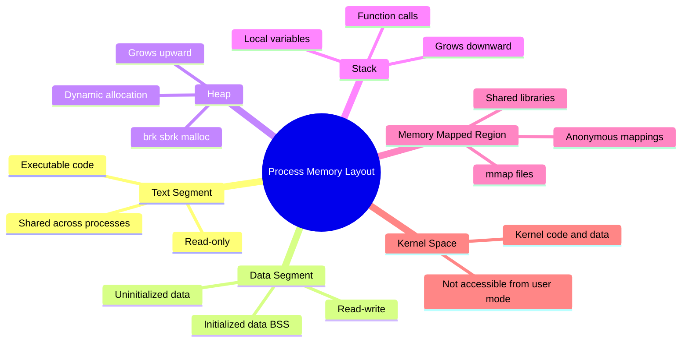
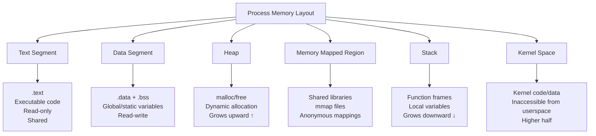
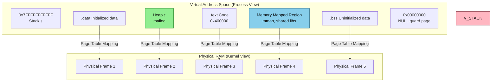
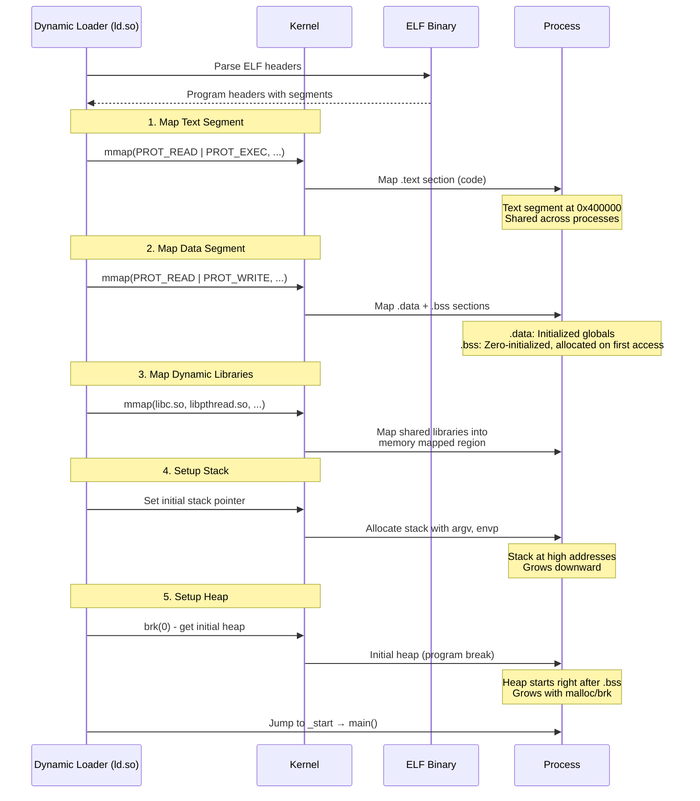
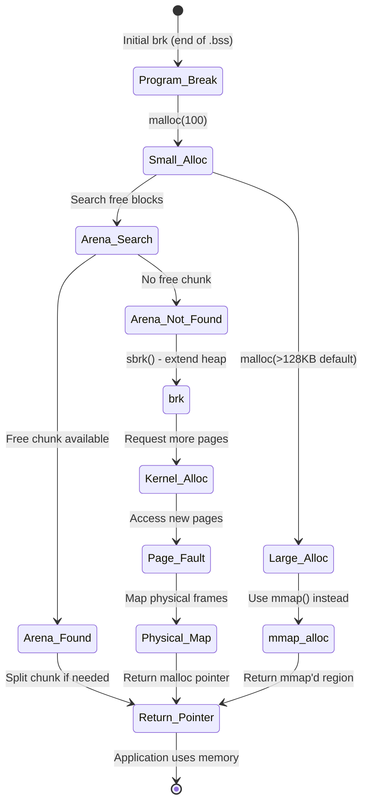
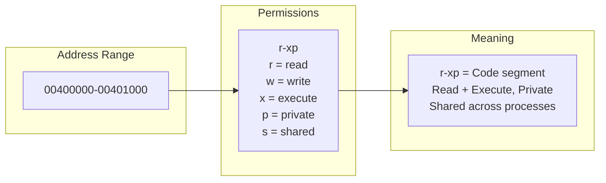
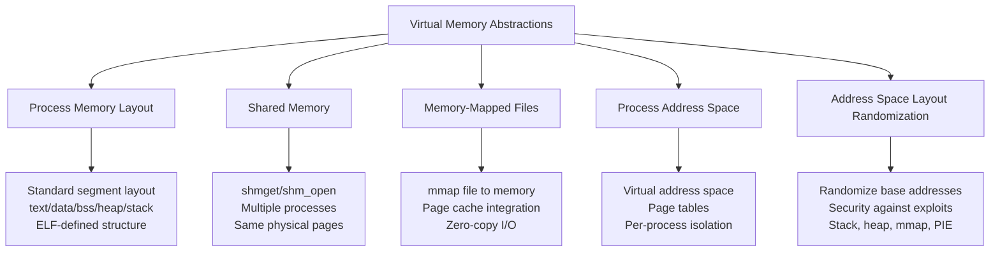

Here's an Obsidian wiki note about **Process Memory Layout** in Linux, following the same format:

---

# Process Memory Layout in Linux

## Overview
The **process memory layout** defines how a process's virtual address space is organized. Each Linux process gets its own **virtual address space** (typically 128TB on x86_64), divided into distinct segments that hold code, data, stack, heap, and memory-mapped regions. Understanding this layout is essential for debugging memory issues, analyzing binaries, and optimizing memory usage.



> **Alternative flowchart if mindmap fails:**



---

## What is Process Memory Layout?
Each Linux process has its own **virtual address space**—a private view of memory that the kernel maps to physical RAM (or swap) through **page tables**. The layout is standardized, with specific segments at predictable addresses.

**Key concept:** Processes see a flat, contiguous address space, but the kernel maps these virtual pages to scattered physical frames using hardware page tables.



---

## How Process Memory Layout Works: The Mechanism

### 1. Complete Memory Layout Diagram

```mermaid
flowchart TD
    subgraph "x86_64 Process Virtual Address Space (0 - 128TB)"
        direction TB
        
        subgraph "Low Addresses"
            NULL[0x0000000000000000<br/>NULL page - unmapped<br/>Catches NULL pointer derefs]
            TEXT[0x0000000000400000<br/>.text - Machine code<br/>Read-only + Execute]
            RODATA[.rodata - Read-only data<br/>String constants, jump tables]
            DATA[.data - Initialized global/static vars<br/>int x = 42;]
            BSS[.bss - Uninitialized global/static vars<br/>int y; Zero-filled on load]
        end
        
        subgraph "Dynamic Growth Area"
            HEAP_START[Heap Start - brk(0)]
            HEAP_GROW[Heap grows upward ↑<br/>malloc → sbrk/brk]
            HEAP_FREE[Free blocks + Allocated chunks]
        end
        
        subgraph "Middle Addresses"
            MMAP[Memory Mapped Region<br/>mmap files, shared libraries<br/>Anonymous mappings]
            LIBS[libc.so, libpthread.so, ld.so<br/>Dynamic linker mappings]
            ANON[Anonymous mmap<br/>Large allocations > MMAP_THRESHOLD]
        end
        
        subgraph "High Addresses"
            STACK_GROW[Stack grows downward ↓<br/>Function calls, local vars]
            STACK_TOP[Stack top - argv, environ]
            GUARD[Guard pages - prevent overflow]
        end
        
        subgraph "Kernel Space (Upper Half)"
            KERNEL[0xFFFF800000000000+<br/>Kernel code, data, drivers<br/>Not accessible from user mode]
        end
    end
    
    HEAP_START --> HEAP_GROW --> HEAP_FREE
    STACK_TOP --> STACK_GROW
    
    style NULL fill:#ff6b6b,stroke:#c92a2a,color:#fff
    style KERNEL fill:#808080,stroke:#4a4a4a,color:#fff
```

### 2. Memory Segments in Detail



### 3. Heap Expansion Mechanism



---

## Reading Process Memory Maps

### /proc/PID/maps - The Memory Map File

```bash
# Example: cat /proc/1234/maps
# Address range           Perms Offset  Dev   Inode   Pathname
00400000-00401000         r-xp  00000000 08:01 123456  /usr/bin/myapp
00600000-00601000         r--p  00000000 08:01 123456  /usr/bin/myapp
00601000-00602000         rw-p  00001000 08:01 123456  /usr/bin/myapp
00602000-00603000         rw-p  00000000 00:00 0       [heap]
7f1234000000-7f1234021000 rw-p  00000000 00:00 0
7f1234021000-7f1238000000 ---p  00000000 00:00 0
7f1238000000-7f1238021000 rw-p  00000000 00:00 0
7f123a000000-7f123a021000 rw-p  00000000 00:00 0
7f123c000000-7f123c021000 rw-p  00000000 00:00 0
7f123dc00000-7f123dc28000 r-xp  00000000 08:01 789012  /lib/x86_64-linux-gnu/libc-2.31.so
7f123dc28000-7f123de27000 ---p  00028000 08:01 789012  /lib/x86_64-linux-gnu/libc-2.31.so
7f123de27000-7f123de2b000 r--p  00027000 08:01 789012  /lib/x86_64-linux-gnu/libc-2.31.so
7f123de2b000-7f123de2d000 rw-p  0002b000 08:01 789012  /lib/x86_64-linux-gnu/libc-2.31.so
7f123de2d000-7f123de35000 rw-p  00000000 00:00 0
7ffd8a3b0000-7ffd8a3d1000 rw-p  00000000 00:00 0       [stack]
7ffd8a3f9000-7ffd8a3fd000 r--p  00000000 00:00 0       [vvar]
7ffd8a3fd000-7ffd8a3ff000 r-xp  00000000 00:00 0       [vdso]
```

### Memory Map Decoder



---

## Similar Mechanisms (Same Level of Abstraction)

The process memory layout shares the same **virtual memory abstraction** level with these mechanisms:



### Comparison Table

| Mechanism | Sharing? | Persistence | Backed By | Use Case |
|-----------|----------|-------------|-----------|----------|
| **Process Memory Layout** | Private | Process lifetime | Physical RAM + Swap | Standard process execution |
| **Shared Memory (shm)** | Multiple processes | Until explicitly removed | tmpfs or physical RAM | IPC between processes |
| **Memory-Mapped Files** | Optional (MAP_SHARED/PRIVATE) | File-backed | Page cache → Disk | Efficient file I/O |
| **Anonymous mmap** | Optional | Process lifetime | Physical RAM + Swap | Large allocations |
| **Huge Pages** | Optional | Process lifetime | Reserved physical RAM | Performance-critical apps |
| **vDSO/vvar** | Kernel-shared | Kernel lifetime | Kernel memory | Fast syscalls (gettimeofday) |

---

## Code Example: Exploring Memory Layout

```c
/*
 * memory_layout_explorer.c - Explore process memory layout
 * 
 * Compile: gcc -o memlayout memory_layout_explorer.c
 * Run: ./memlayout
 * Also run: cat /proc/<PID>/maps while this is running
 */

#include <stdio.h>
#include <stdlib.h>
#include <string.h>
#include <unistd.h>
#include <sys/mman.h>

// Global variables - these go in different sections
int initialized_global = 42;        // .data section
int uninitialized_global;           // .bss section
const char *readonly_string = "This is in .rodata";  // .rodata
static int static_var = 100;        // .data section

void print_maps_line(const char *name, void *addr) {
    printf("  %-25s at %p\n", name, addr);
}

void print_section_info() {
    printf("\n=== Process Memory Layout Explorer (PID: %d) ===\n", getpid());
    
    // Text segment (code)
    printf("\n--- Text Segment (.text) ---\n");
    print_maps_line("main() function", (void*)print_section_info);
    print_maps_line("print_maps_line()", (void*)print_maps_line);
    
    // Data segment
    printf("\n--- Data Segment (.data + .bss) ---\n");
    print_maps_line("initialized_global (=42)", &initialized_global);
    print_maps_line("static_var (=100)", &static_var);
    print_maps_line("readonly_string ptr", &readonly_string);
    
    // BSS (uninitialized)
    print_maps_line("uninitialized_global (=0)", &uninitialized_global);
    
    // Read-only data
    printf("\n--- Read-Only Data (.rodata) ---\n");
    print_maps_line("String constant", readonly_string);
    
    // Heap
    printf("\n--- Heap (malloc) ---\n");
    void *small_heap = malloc(100);
    void *medium_heap = malloc(1024 * 1024);  // 1MB
    void *large_heap = malloc(10 * 1024 * 1024);  // 10MB
    print_maps_line("small heap (100 bytes)", small_heap);
    print_maps_line("medium heap (1MB)", medium_heap);
    print_maps_line("large heap (10MB)", large_heap);
    
    // Memory-mapped region
    printf("\n--- Memory Mapped (mmap) ---\n");
    void *mmap_anon = mmap(NULL, 4096, PROT_READ | PROT_WRITE,
                           MAP_PRIVATE | MAP_ANONYMOUS, -1, 0);
    void *mmap_file = mmap(NULL, 4096, PROT_READ,
                           MAP_PRIVATE, 0, 0);  // Will fail but shows address
    
    print_maps_line("mmap anonymous", mmap_anon);
    
    // Stack
    printf("\n--- Stack ---\n");
    int stack_var = 0;
    print_maps_line("local stack variable", &stack_var);
    
    // Library function (in shared library)
    printf("\n--- Shared Libraries ---\n");
    print_maps_line("printf() from libc", (void*)printf);
    print_maps_line("malloc() from libc", (void*)malloc);
    
    printf("\n========================================\n");
    printf("Read /proc/%d/maps for full layout\n", getpid());
    printf("Press Enter to continue...\n");
    getchar();
    
    // Cleanup
    free(small_heap);
    free(medium_heap);
    free(large_heap);
    munmap(mmap_anon, 4096);
}

int main() {
    print_section_info();
    return 0;
}
```

### Memory Layout Visualizer Script

```bash
#!/bin/bash
# memviz.sh - Visualize process memory layout

PID=${1:-$$}

echo "=== Memory Layout for PID $PID ==="
echo

# Read /proc/PID/maps and categorize
cat /proc/$PID/maps | awk '
{
    # Extract start and end addresses
    split($1, range, "-")
    start = strtonum("0x" range[1])
    end = strtonum("0x" range[2])
    size_kb = (end - start) / 1024
    
    # Categorize by pathname
    if ($6 == "") {
        if ($2 ~ /rw-p/ && start > 0x600000 && end < 0x70000000)
            type = "[heap]"
        else if ($2 ~ /rw-p/ && end > 0x7ff000000000)
            type = "[stack]"
        else
            type = "[anon]"
    } else if ($6 ~ /vdso/) {
        type = "[vdso]"
    } else if ($6 ~ /vvar/) {
        type = "[vvar]"
    } else if ($6 ~ /\.so/) {
        type = "Shared Library"
    } else if ($6 ~ /^\/usr\/bin\/|^\/bin\//) {
        type = "Executable"
    } else {
        type = $6
    }
    
    # Sum up by type
    sizes[type] += size_kb
    perms[$2]++
    
    printf "%-40s %8d KB  %s  %s\n", substr($1,0,40), size_kb, $2, type
}
END {
    print "\n--- Summary by Type ---"
    for (t in sizes)
        printf "  %-25s %8d KB\n", t, sizes[t]
        
    print "\n--- Permissions Summary ---"
    for (p in perms)
        printf "  %-10s %8d regions\n", p, perms[p]
}
' | less
```

---

## Important Notes

| Concept | Description |
|---------|-------------|
| **Virtual vs Physical** | Processes see virtual addresses; kernel maps to physical pages via page tables |
| **Copy-On-Write (COW)** | fork() shares pages until modified; saves memory |
| **ASLR** | Randomizes base addresses of stack, heap, mmap, and PIE executables |
| **Guard Pages** | Unmapped pages between regions to catch overflows |
| **vDSO** | Virtual Dynamic Shared Object - kernel code mapped to userspace for fast syscalls |
| **[vsyscall]** | Legacy fast syscall mechanism (deprecated in favor of vDSO) |
| **Huge Pages** | 2MB or 1GB pages instead of 4KB; reduces TLB misses |
| **Memory Overcommit** | Kernel may allocate more virtual memory than physical RAM available |

### Address Space Size by Architecture

| Architecture | User Space | Kernel Space | Total Virtual |
|-------------|------------|-------------|---------------|
| **x86_64 (48-bit)** | 128 TB | 128 TB | 256 TB |
| **x86_64 (57-bit)** | 64 PB | 64 PB | 128 PB |
| **ARM64 (48-bit)** | 256 TB | 256 TB | 512 TB |
| **i386 (32-bit)** | 3 GB | 1 GB | 4 GB |

### Common /proc/PID/maps Patterns

```bash
# Stack
7ffd8a3b0000-7ffd8a3d1000 rw-p 00000000 00:00 0          [stack]

# Heap
00602000-00603000 rw-p 00000000 00:00 0                   [heap]

# Anonymous mmap
7f1234000000-7f1234021000 rw-p 00000000 00:00 0

# vDSO (Virtual Dynamic Shared Object)
7ffd8a3fd000-7ffd8a3ff000 r-xp 00000000 00:00 0          [vdso]

# Shared library (libc with guard pages)
7f123dc00000-7f123dc28000 r-xp 00000000 08:01 789012     /lib/libc-2.31.so
7f123dc28000-7f123de27000 ---p 00028000 08:01 789012     /lib/libc-2.31.so  # Guard!
7f123de27000-7f123de2b000 r--p 00027000 08:01 789012     /lib/libc-2.31.so
7f123de2b000-7f123de2d000 rw-p 0002b000 08:01 789012     /lib/libc-2.31.so
```

---

## Related Notes
- [[Process Lifecycle]]
- [[Thrashing in Linux]]
- [[Linux Signals]]
- [[Common Bottlenecks in Linux Systems]]
- [[Linux Performance Bottlenecks - Diagnosis & Debugging]]
- [[File Permissions]]
- [[Linux Memory Management]]
- [[Copy-On-Write Mechanism]]
- [[Page Table Internals]]
- [[malloc Internals]]
- [[ELF Binary Format]]

---

This note covers the complete process memory layout in Linux—from the standard ELF segments through dynamic allocation regions, shared library mappings, and kernel space. Understanding this layout is fundamental to debugging memory corruption, analyzing core dumps, and optimizing memory-intensive applications.