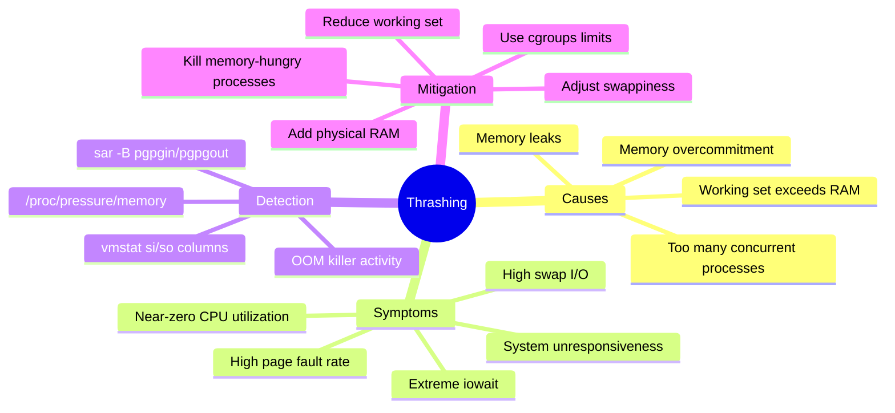
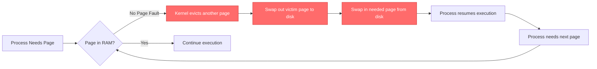
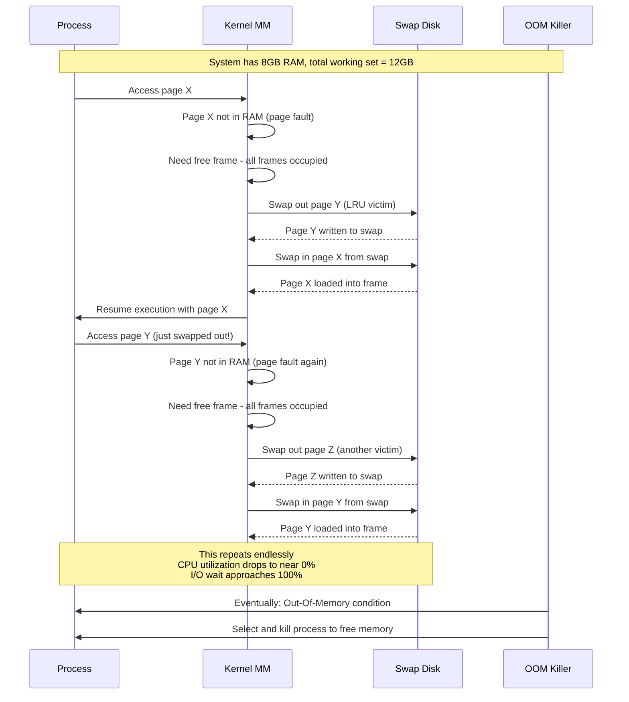
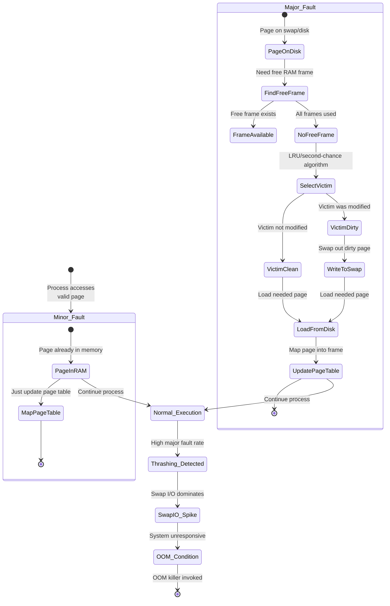
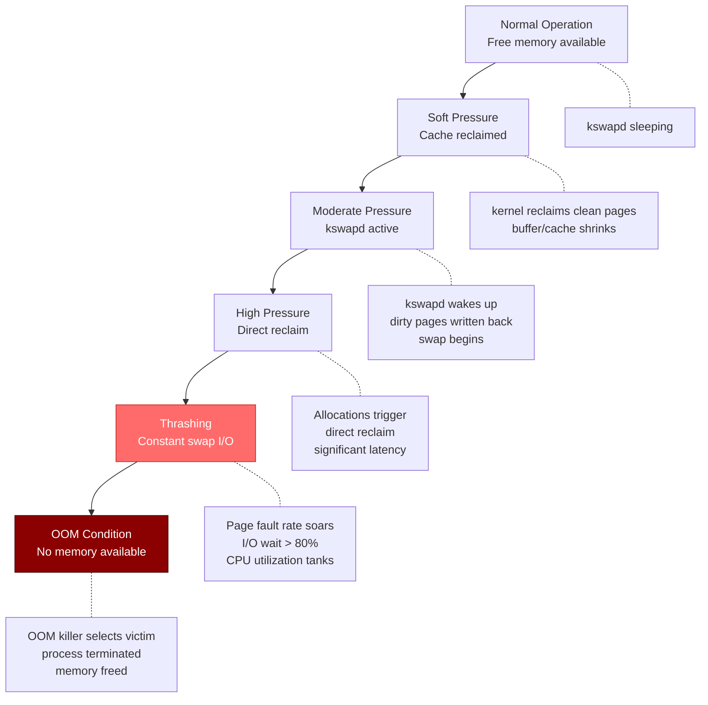
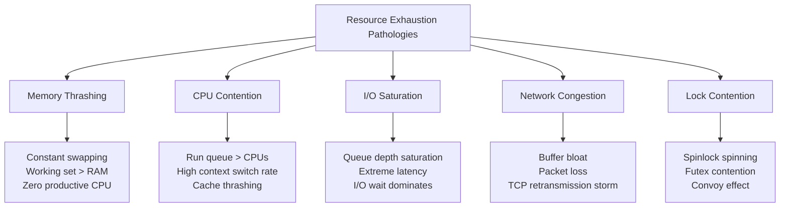

Here's an Obsidian wiki note about Thrashing in Linux, following the same format:

---

# Thrashing in Linux

## Overview
**Thrashing** is a severe performance degradation state where the system spends more time **swapping pages between RAM and disk** than executing actual process code. The system becomes effectively unusable as the kernel frantically moves memory pages in and out, creating a vicious cycle of page faults and I/O operations.

Thrashing occurs when the **working set** (active memory pages needed by running processes) exceeds **available physical RAM**, forcing constant eviction and reloading of pages from swap.



> **Alternative flowchart if mindmap fails:**

```mermaid
graph TD
    T[Thrashing] --> C[Causes]
    T --> S[Symptoms]
    T --> D[Detection]
    T --> M[Mitigation]
    
    C --> C1[Memory overcommitment]
    C --> C2[Working set > RAM]
    C --> C3[Memory leaks]
    C --> C4[Too many processes]
    
    S --> S1[High swap I/O]
    S --> S2[Near-zero CPU utilization]
    S --> S3[Extreme iowait]
    S --> S4[System unresponsiveness]
    S --> S5[High page fault rate]
    
    D --> D1[vmstat si/so columns]
    D --> D2[/proc/pressure/memory]
    D --> D3[sar -B statistics]
    
    M --> M1[Add physical RAM]
    M --> M2[Reduce working set]
    M --> M3[Kill memory-hungry processes]
    M --> M4[Adjust swappiness]
    M --> M5[Use cgroups limits]
```

---

## What is Thrashing?
Thrashing is a **pathological state** in virtual memory systems where the system enters a **paging death spiral**:

- Pages are constantly evicted to make room for new pages
- Evicted pages are immediately needed again (faulted back in)
- Other pages must be evicted to make room for the returning pages
- Those evicted pages are also needed again...

The system spends **>90% of its time on paging I/O** rather than useful computation.



---

## How Thrashing Works: The Mechanism

### 1. The Vicious Cycle



### 2. Page Fault Handling Flow



### 3. Memory Pressure Progression



---

## Similar Mechanisms (Same Level of Abstraction)

Thrashing shares the same **resource exhaustion pathology** level with these mechanisms:



### Comparison Table

| Pathology | Resource Exhausted | Key Metric | Recovery Strategy | Monitoring Tool |
|-----------|-------------------|------------|-------------------|-----------------|
| **Memory Thrashing** | RAM + Swap | `si`/`so` columns in vmstat | Kill processes, add RAM | `vmstat`, `sar -B` |
| **CPU Contention** | CPU cores | Run queue length (`r` in vmstat) | Reduce threads, add CPUs | `vmstat`, `mpstat` |
| **I/O Saturation** | Disk bandwidth/IOPS | `await`, `%util` in iostat | Faster disk, reduce I/O | `iostat -x` |
| **Network Congestion** | Bandwidth/buffer | Retransmissions, drops | Traffic shaping, QoS | `ss -ti`, `netstat -s` |
| **Lock Contention** | Synchronization primitives | Spinning time, futex wait | Lock-free algorithms | `perf lock`, `bpftrace` |
| **File Descriptor Exhaustion** | FD table | `file-nr` in /proc/sys/fs | Increase limit, close leaks | `lsof`, `/proc/sys/fs/file-nr` |

---

## Detection and Diagnosis

### Quick Diagnostic Commands

```bash
# 1. Check swap activity in real-time
vmstat 1
# Watch these columns:
#   si = Swap In (pages read from swap/sec)  ← KEY METRIC
#   so = Swap Out (pages written to swap/sec) ← KEY METRIC
#   r  = Run queue (processes waiting for CPU)
#   wa = I/O wait percentage
# If si and so are consistently > 0, you're likely thrashing!

# 2. Check memory pressure (modern kernels)
cat /proc/pressure/memory
# some avg10=60.00 avg60=50.00 avg300=45.00 total=1234567
# High values (>40) indicate severe pressure

# 3. Check swap usage
free -h
swapon --show

# 4. Find processes causing page faults
ps aux --sort=-%mem | head -10

# 5. Monitor page fault rate
sar -B 1 10
# pgpgin/s  = Pages paged in from disk per second
# pgpgout/s = Pages paged out to disk per second
# fault/s   = Page faults per second
# majflt/s  = Major page faults per second (disk access required)

# 6. Check OOM killer history
dmesg | grep -i "out of memory"
dmesg | grep -i "killed process"

# 7. System-wide memory statistics
cat /proc/meminfo | grep -E "(Active|Inactive|SwapTotal|SwapFree|Dirty|Writeback)"

# 8. Real-time swap monitor
watch -n 1 'cat /proc/swaps && echo "---" && free -h'
```

### Detection Script

```bash
#!/bin/bash
# thrashing_detect.sh - Monitor for thrashing conditions

THRASHING_THRESHOLD=10  # Pages swapped per second threshold
INTERVAL=5

echo "Thrashing Detection Monitor"
echo "Monitoring swap activity every ${INTERVAL}s..."
echo "Thrashing threshold: >${THRASHING_THRESHOLD} pages/sec sustained"
echo "----------------------------------------"

while true; do
    # Get swap activity
    read si so <<< $(vmstat 1 2 | tail -1 | awk '{print $7, $8}')
    
    # Get memory pressure
    pressure=$(cat /proc/pressure/memory 2>/dev/null | grep "some" | awk '{print $2}' | cut -d= -f2)
    
    # Get I/O wait
    iowait=$(top -bn1 | grep "Cpu(s)" | awk '{print $10}' | cut -d'%' -f1)
    
    TIMESTAMP=$(date '+%Y-%m-%d %H:%M:%S')
    
    if [ "$si" -gt "$THRASHING_THRESHOLD" ] || [ "$so" -gt "$THRASHING_THRESHOLD" ]; then
        echo "⚠️  [$TIMESTAMP] THRASHING DETECTED!"
        echo "   Swap In:  ${si} pages/sec"
        echo "   Swap Out: ${so} pages/sec"
        echo "   I/O Wait: ${iowait}%"
        echo "   Memory Pressure: ${pressure}"
        
        echo "   Top memory consumers:"
        ps aux --sort=-%mem | head -4 | tail -3 | awk '{printf "   PID %s: %s%% MEM - %s\n", $2, $4, $11}'
        echo "----------------------------------------"
    else
        echo "[$TIMESTAMP] Normal - si:${si} so:${so} iowait:${iowait}%"
    fi
    
    sleep $INTERVAL
done
```

---

## Code Example: Simulating and Recovering from Thrashing

### Thrashing Simulator (WARNING: May freeze system!)

```c
/*
 * thrashing_simulator.c - Demonstrates thrashing behavior
 * 
 * WARNING: This will consume ALL available memory and may
 * freeze your system. Test in a VM or container with limits!
 * 
 * Compile: gcc -O0 -o thrashing_simulator thrashing_simulator.c
 * Run with caution: ./thrashing_simulator
 */

#include <stdio.h>
#include <stdlib.h>
#include <string.h>
#include <unistd.h>
#include <sys/mman.h>
#include <sys/time.h>
#include <signal.h>

#define PAGE_SIZE 4096
#define WORKING_SET_MB 2048  // 2GB working set

volatile sig_atomic_t running = 1;

void sigint_handler(int sig) {
    running = 0;
    printf("\nShutting down...\n");
}

// Get current memory usage
long get_mem_usage_mb() {
    FILE *fp = fopen("/proc/self/status", "r");
    char line[256];
    long vm_rss = 0;
    
    if (!fp) return -1;
    
    while (fgets(line, sizeof(line), fp)) {
        if (strncmp(line, "VmRSS:", 6) == 0) {
            sscanf(line + 7, "%ld", &vm_rss);
            break;
        }
    }
    fclose(fp);
    return vm_rss / 1024;  // Convert kB to MB
}

int main() {
    signal(SIGINT, sigint_handler);
    
    printf("=== Thrashing Simulator ===\n");
    printf("PID: %d\n", getpid());
    printf("Initial memory usage: %ld MB\n", get_mem_usage_mb());
    
    // Allocate a large working set
    size_t num_pages = (WORKING_SET_MB * 1024 * 1024) / PAGE_SIZE;
    printf("Allocating %lu pages (%d MB) working set...\n", 
           num_pages, WORKING_SET_MB);
    
    char **pages = malloc(num_pages * sizeof(char *));
    if (!pages) {
        perror("malloc failed");
        return 1;
    }
    
    // Allocate individual pages
    for (size_t i = 0; i < num_pages && running; i++) {
        pages[i] = mmap(NULL, PAGE_SIZE, PROT_READ | PROT_WRITE,
                       MAP_PRIVATE | MAP_ANONYMOUS, -1, 0);
        if (pages[i] == MAP_FAILED) {
            printf("mmap failed at page %lu (system likely under pressure)\n", i);
            break;
        }
        // Touch the page to ensure it's actually allocated
        memset(pages[i], (char)(i % 256), PAGE_SIZE);
        
        if (i % 10000 == 0) {
            printf("Allocated %lu pages, RSS: %ld MB\n", 
                   i + 1, get_mem_usage_mb());
        }
    }
    
    printf("Allocation complete. RSS: %ld MB\n", get_mem_usage_mb());
    printf("\nStarting random access pattern to induce thrashing...\n");
    printf("(Monitor 'vmstat 1' in another terminal)\n");
    printf("Press Ctrl+C to stop.\n\n");
    
    // Random access pattern that's larger than likely available RAM
    struct timeval start, now;
    gettimeofday(&start, NULL);
    
    long accesses = 0;
    while (running) {
        // Random page access - will cause constant page faults
        size_t page_idx = rand() % num_pages;
        volatile char val = pages[page_idx][0];
        (void)val;  // Prevent optimization
        
        // Also write to random pages to create dirty pages
        if (accesses % 10 == 0) {
            size_t write_idx = rand() % num_pages;
            pages[write_idx][PAGE_SIZE - 1] = (char)(accesses % 256);
        }
        
        accesses++;
        
        if (accesses % 1000000 == 0) {
            gettimeofday(&now, NULL);
            double elapsed = (now.tv_sec - start.tv_sec) + 
                           (now.tv_usec - start.tv_usec) / 1000000.0;
            printf("Accesses: %ld | Time: %.1fs | RSS: %ld MB | "
                   "Rate: %.0f acc/sec\n",
                   accesses, elapsed, get_mem_usage_mb(),
                   accesses / elapsed);
        }
    }
    
    // Cleanup
    printf("\nCleaning up...\n");
    for (size_t i = 0; i < num_pages; i++) {
        if (pages[i] != MAP_FAILED) {
            munmap(pages[i], PAGE_SIZE);
        }
    }
    free(pages);
    
    printf("Done. Final RSS: %ld MB\n", get_mem_usage_mb());
    return 0;
}
```

### Recovery Strategies by Scenario

```bash
# Scenario 1: System is thrashing but still responsive enough to type commands

# Find the memory hogs
ps aux --sort=-%mem | head -10

# Kill the worst offender (choose appropriate PID)
kill -9 <PID>

# Or reduce memory pressure by dropping caches (temporary relief)
echo 3 | sudo tee /proc/sys/vm/drop_caches

# Adjust swappiness temporarily (reduce tendency to swap)
echo 10 | sudo tee /proc/sys/vm/swappiness


# Scenario 2: System completely unresponsive - use Magic SysRq

# Alt+SysRq+f - Invoke OOM killer manually
echo f > /proc/sysrq-trigger

# Alt+SysRq+REISUB - Safe reboot sequence:
# R: Unraw keyboard
# E: Send SIGTERM to all processes
# I: Send SIGKILL to all processes  
# S: Sync all filesystems
# U: Remount all filesystems read-only
# B: Reboot


# Scenario 3: Prevent thrashing before it starts

# Set memory limits with cgroups v2
sudo mkdir -p /sys/fs/cgroup/memory_limit
echo "2G" | sudo tee /sys/fs/cgroup/memory_limit/memory.max
echo "<PID>" | sudo tee /sys/fs/cgroup/memory_limit/cgroup.procs

# Or use systemd service limits
# In service file:
# [Service]
# MemoryMax=2G
# MemorySwapMax=0  # Disable swap for this service
```

---

## Important Notes

| Concept | Description |
|---------|-------------|
| **Working Set** | Set of pages a process actively needs; thrashing when working sets > RAM |
| **kswapd** | Kernel daemon that reclaims memory; constant activity indicates pressure |
| **Direct Reclaim** | When allocation cannot be satisfied, process blocks while kernel reclaims |
| **swappiness** | Kernel parameter (0-100) controlling swap vs. cache reclaim tendency |
| **OOM Score** | Heuristic kernel uses to select which process to kill when out of memory |
| **Page Fault Types** | Minor (page in RAM) vs Major (requires disk I/O); majors cause thrashing |
| **Swap Tokens** | Kernel mechanism giving thrashing processes a "token" to reduce contention |
| **Memory Pressure Stall Information (PSI)** | `/proc/pressure/memory` - modern metric for memory pressure |

### Kernel Parameters for Thrashing Control

```bash
# View current settings
sysctl -a | grep -E "(swappiness|min_free_kbytes|watermark|overcommit)"

# Key parameters:
# vm.swappiness = 60 (default)
#   0  = Avoid swap as much as possible
#   60 = Default balanced behavior
#   100 = Aggressively swap

# vm.min_free_kbytes - Minimum free memory (kernel reserve)
# Increase to give kernel more breathing room
echo 131072 > /proc/sys/vm/min_free_kbytes  # 128MB reserve

# vm.overcommit_memory
#   0 = Heuristic overcommit (default)
#   1 = Always overcommit
#   2 = Never overcommit (strict accounting)

# vm.overcommit_ratio - % of RAM for overcommit (when overcommit_memory=2)

# vm.watermark_scale_factor - Finer control over watermark levels
```

---

## Related Notes
- [[Linux Performance Bottlenecks]]
- [[Linux Process Lifecycle]]
- [[Linux Memory Management]]
- [[OOM Killer Deep Dive]]
- [[Swap Management in Linux]]
- [[Page Replacement Algorithms]]
- [[cgroups v2 Resource Control]]

---

This note covers the thrashing phenomenon in Linux—what causes it, how to detect it, and strategies for recovery and prevention. The key takeaway: thrashing occurs when the aggregate working set exceeds physical RAM, and recovery requires either reducing memory demand or increasing supply.