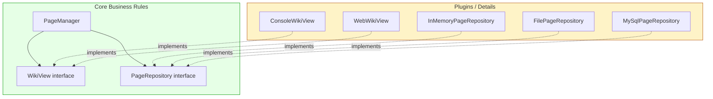

# Tutorial: Boundaries – Drawing Lines in Software Architecture

## 1. What Are Boundaries and Why Do We Draw Them?

A **boundary** is a line that separates software elements. On one side, the code knows nothing about the other side. The goal is to:

- **Minimise coupling** – especially to premature decisions.
- **Keep options open** – delay choices about databases, frameworks, and delivery mechanisms.
- **Protect business rules** – make them immune to changes in details.

The chapter gives two cautionary tales:

- **Company P** prematurely committed to a three‑tier architecture with serialized objects between GUI, middleware, and database layers. Even when deployed on a single machine, they paid the cost of marshalling, socket communication, and message parsing for every feature. That architecture multiplied development effort enormously.
- **Company W** blindly adopted an enterprise‑scale service‑oriented architecture (SoA) with dozens of services and messages for a simple fleet management system. Adding a contact person to a sales record required orchestrating multiple services, faking data, and navigating queues. The premature adoption of heavy tools flushed person‑hours down the drain.

The common thread: **decisions that have nothing to do with business requirements (use cases) should be deferred.** A good architecture makes those decisions *ancillary* and *deferrable*.

---

## 2. The FitNesse Success Story – Deferring the Database

FitNesse is a wiki that wraps a testing tool. When the author and his son started building it, they made two crucial boundary decisions:

1. They wrote their own tiny web server to avoid committing to any web framework early.
2. They put an **interface** between all data access and the actual storage.

For **eighteen months** they developed features using an in‑memory hash table, without ever setting up a database. When persistence was needed, they first moved to flat files. Later, when a customer wanted MySQL, he simply wrote a new implementation of that interface and plugged it in. The business rules never changed.

This is the power of drawing a boundary between **business rules** and **details**.

---

## 3. Building a Flexible Wiki System in Python

Let’s recreate the essence of that architecture in Python. We’ll build a tiny wiki page manager where the core logic never knows whether pages are stored in memory, on disk, or in a database.

### Step 1: Define the Core Business Rule

The central use case is simple: save a page and retrieve it. Our business rule class, `PageManager`, orchestrates this.

```python
# wiki/business.py
from typing import Optional

class Page:
    """A simple data object representing a wiki page."""
    def __init__(self, name: str, content: str = ""):
        self.name = name
        self.content = content

class PageManager:
    """
    Core business logic for managing wiki pages.
    It knows NOTHING about how pages are stored.
    """
    def __init__(self, repository: 'PageRepository'):
        self.repo = repository

    def get_page(self, name: str) -> Optional[Page]:
        return self.repo.find_by_name(name)

    def save_page(self, page: Page) -> None:
        # Maybe some validation or formatting logic here
        page.content = page.content.strip()
        self.repo.save(page)
```

Notice that `PageManager` depends only on an abstraction called `PageRepository`. We haven’t defined it yet, but the business rule doesn’t care about the implementation.

### Step 2: Draw the Boundary – The Repository Interface

We define an abstract interface for data access. This is the **boundary line**.

```python
# wiki/repository.py
from abc import ABC, abstractmethod
from typing import Optional
from wiki.business import Page

class PageRepository(ABC):
    """Boundary interface for page persistence."""
    @abstractmethod
    def find_by_name(self, name: str) -> Optional[Page]:
        pass

    @abstractmethod
    def save(self, page: Page) -> None:
        pass
```

All concrete storage implementations will inherit from this interface. The business rules (like `PageManager`) only import this abstract class, never any concrete storage class.

### Step 3: Provide a Mock/Stub for Testing

While we develop features, we can use a mock repository that does nothing—just like the `MockWikiPage` in FitNesse. This allows us to test business rules without any real storage.

```python
# wiki/mock_repo.py
from wiki.repository import PageRepository
from wiki.business import Page

class MockPageRepository(PageRepository):
    """A stub that can be used for testing or development."""
    def find_by_name(self, name: str):
        # Return a dummy page for testing
        return Page(name, "mock content")

    def save(self, page: Page) -> None:
        pass  # Do nothing
```

Now we can write and test the `PageManager` without any database:

```python
# test/test_business.py
from wiki.business import Page, PageManager
from wiki.mock_repo import MockPageRepository

def test_save_and_retrieve():
    repo = MockPageRepository()
    manager = PageManager(repo)
    page = manager.get_page("test")
    assert page.name == "test"
    assert page.content == "mock content"
```

### Step 4: Implement In‑Memory Storage for Real Use

Once we need real storage, we simply write another implementation—still behind the same interface. This is exactly what FitNesse did with `InMemoryPage` (a hash table in RAM).

```python
# wiki/inmemory_repo.py
from wiki.repository import PageRepository
from wiki.business import Page
from typing import Optional

class InMemoryPageRepository(PageRepository):
    """Stores pages in a dictionary (RAM)."""
    def __init__(self):
        self._pages: dict[str, Page] = {}

    def find_by_name(self, name: str) -> Optional[Page]:
        return self._pages.get(name)

    def save(self, page: Page) -> None:
        self._pages[page.name] = page
```

With this, we can build the entire application, test it, and even release a first version without ever touching a file system or database. The `PageManager` doesn’t change at all.

```python
# main.py (using in-memory repo)
from wiki.business import Page, PageManager
from wiki.inmemory_repo import InMemoryPageRepository

repo = InMemoryPageRepository()
manager = PageManager(repo)
manager.save_page(Page("Home", "Welcome to the wiki!"))
print(manager.get_page("Home").content)  # 'Welcome to the wiki!'
```

### Step 5: Add File‑System Storage Without Changing Business Rules

Later, we decide we need persistence across restarts. We can write a flat‑file implementation—again, without touching `PageManager`.

```python
# wiki/file_repo.py
import os
import json
from wiki.repository import PageRepository
from wiki.business import Page
from typing import Optional

class FilePageRepository(PageRepository):
    """Stores each page as a JSON file in a directory."""
    def __init__(self, directory: str):
        self.dir = directory
        os.makedirs(directory, exist_ok=True)

    def _path(self, name: str) -> str:
        safe_name = "".join(c for c in name if c.isalnum() or c in (' ', '_')).rstrip()
        return os.path.join(self.dir, safe_name + ".json")

    def find_by_name(self, name: str) -> Optional[Page]:
        path = self._path(name)
        if not os.path.exists(path):
            return None
        with open(path, 'r') as f:
            data = json.load(f)
            return Page(data['name'], data['content'])

    def save(self, page: Page) -> None:
        path = self._path(page.name)
        with open(path, 'w') as f:
            json.dump({'name': page.name, 'content': page.content}, f)
```

Now we can switch from in‑memory to file storage by changing a single line in our composition root (the place where we wire everything up). The core logic remains pristine.

```python
# main.py – switching to file storage
from wiki.business import Page, PageManager
from wiki.file_repo import FilePageRepository

repo = FilePageRepository("wiki_data")
manager = PageManager(repo)
# ... rest unchanged
```

**This is the magic:** the database became a plugin. As the chapter says, *“the database is a tool that the business rules can use indirectly. The business rules don’t need to know about the schema, or the query language, or any of the other details.”*

### Step 6: The Database as a Plugin – MySQL (Optional)

The chapter mentions that a customer later wanted MySQL. He simply wrote a `MySqlWikiPage` derivative. In Python, we’d do the same:

```python
# wiki/mysql_repo.py (conceptual)
import mysql.connector
from wiki.repository import PageRepository
from wiki.business import Page

class MySqlPageRepository(PageRepository):
    def __init__(self, host, user, password, database):
        self.conn = mysql.connector.connect(
            host=host, user=user, password=password, database=database
        )

    def find_by_name(self, name: str):
        cursor = self.conn.cursor()
        cursor.execute("SELECT name, content FROM pages WHERE name = %s", (name,))
        row = cursor.fetchone()
        if row:
            return Page(row[0], row[1])
        return None

    def save(self, page: Page):
        cursor = self.conn.cursor()
        cursor.execute(
            "REPLACE INTO pages (name, content) VALUES (%s, %s)",
            (page.name, page.content)
        )
        self.conn.commit()
```

The `PageManager` never imported `mysql.connector`. The boundary kept the dependency inverted.

---

## 4. Expanding Boundaries: The GUI as a Plugin

The same principle applies to the user interface. **The IO is irrelevant.** The system is the business rules, not the GUI. So we draw another boundary line.

### Step 7: Define a UI Boundary

We’ll create an abstract interface for displaying pages and getting input. The business rules don’t care if the UI is a console, a web page, or a voice assistant.

```python
# wiki/view.py
from abc import ABC, abstractmethod
from wiki.business import Page

class WikiView(ABC):
    """Boundary interface for user interaction."""
    @abstractmethod
    def display_page(self, page: Page) -> None:
        pass

    @abstractmethod
    def get_user_input(self, prompt: str) -> str:
        pass
```

Now we can write a simple use‑case interactor that uses this view, without knowing its concrete type.

```python
# wiki/app.py
from wiki.business import PageManager, Page
from wiki.view import WikiView

class WikiApp:
    """Coordinates use cases with the UI plugin."""
    def __init__(self, manager: PageManager, view: WikiView):
        self.manager = manager
        self.view = view

    def show_page(self, name: str):
        page = self.manager.get_page(name)
        if page:
            self.view.display_page(page)
        else:
            self.view.display_page(Page("Error", "Page not found"))

    def create_page(self):
        name = self.view.get_user_input("Page name: ")
        content = self.view.get_user_input("Content: ")
        self.manager.save_page(Page(name, content))
```

Again, `WikiApp` depends only on the abstractions `PageManager` (which itself depends on `PageRepository`) and `WikiView`.

### Step 8: Implement a Console UI Plugin

```python
# wiki/console_ui.py
from wiki.view import WikiView
from wiki.business import Page

class ConsoleWikiView(WikiView):
    def display_page(self, page: Page) -> None:
        print(f"\n--- {page.name} ---")
        print(page.content)
        print("------------------\n")

    def get_user_input(self, prompt: str) -> str:
        return input(prompt)
```

### Step 9: Implement a Web UI Plugin (Conceptual)

Using Flask, for example, we can create another adapter that implements the same `WikiView` interface. The core application stays identical.

```python
# wiki/web_ui.py (conceptual)
from wiki.view import WikiView
from wiki.business import Page
from flask import Flask, request

class WebWikiView(WikiView):
    def __init__(self):
        self._last_response = None

    def display_page(self, page: Page) -> None:
        self._last_response = f"<h1>{page.name}</h1><p>{page.content}</p>"

    def get_user_input(self, prompt: str) -> str:
        # In a real web app, this would be driven by a form submission.
        # For simplicity, we could use request.args or a global.
        return request.form.get('input', '')
```

The direction of dependencies is always **inward**: `ConsoleWikiView` depends on `WikiView` (the abstraction), which lives in the same component as the business rules. The business rules never know about `ConsoleWikiView`.

---

## 5. Visualising the Plugin Architecture

The dependencies all point toward the core. The outer layers (UI, database) are plugins that depend on the inner abstractions.



**Key takeaway:** The arrows point from details to abstractions. The core never knows what plugins exist. This is the **Dependency Inversion Principle** in action.

---

## 6. Key Principles in Action

This tutorial has applied several fundamental principles from the chapter:

| Principle                                 | How We Applied It                                                                                                                                  |
| ----------------------------------------- | -------------------------------------------------------------------------------------------------------------------------------------------------- |
| **Single Responsibility Principle (SRP)** | Each component changes for only one reason. UI changes for aesthetics, business rules for policy, storage for persistence technology.              |
| **Dependency Inversion Principle (DIP)**  | High‑level policy (`PageManager`) does not depend on low‑level details (`InMemoryPageRepository`). Both depend on abstractions (`PageRepository`). |
| **Stable Abstractions Principle**         | The interfaces (`PageRepository`, `WikiView`) are abstract and stable; concrete implementations are volatile and depend on them.                   |
| **Plugin Architecture**                   | The entire system is designed so that every major detail (GUI, database) is a plugin that can be swapped independently.                            |

**Where to draw lines?** Between things that matter (business rules) and things that don’t (details). **When to draw them?** As early as possible—even before any code is written—to prevent premature decisions from polluting the core logic.

---

## 7. Conclusion

You’ve just built a miniature version of the Fitness architecture in Python. The central lesson:

> **A good architecture does not depend on frameworks, databases, or UIs. It draws boundaries that allow those decisions to be deferred, experimented with, and swapped at will, keeping the business rules clean and independent.**

Remember:

- Boundaries are drawn where there is an **axis of change** – components change at different rates and for different reasons.
- The direction of dependency always points **inward**, toward the high‑level policy.
- Start with the simplest implementation (in‑memory, console) and let real needs drive you toward more complex plugins (database, web). Never build a server farm until you need one.

By drawing these lines early, you protect the precious business logic from the churn of technology. You keep the system *soft*, maintainable, and adaptable for years to come.