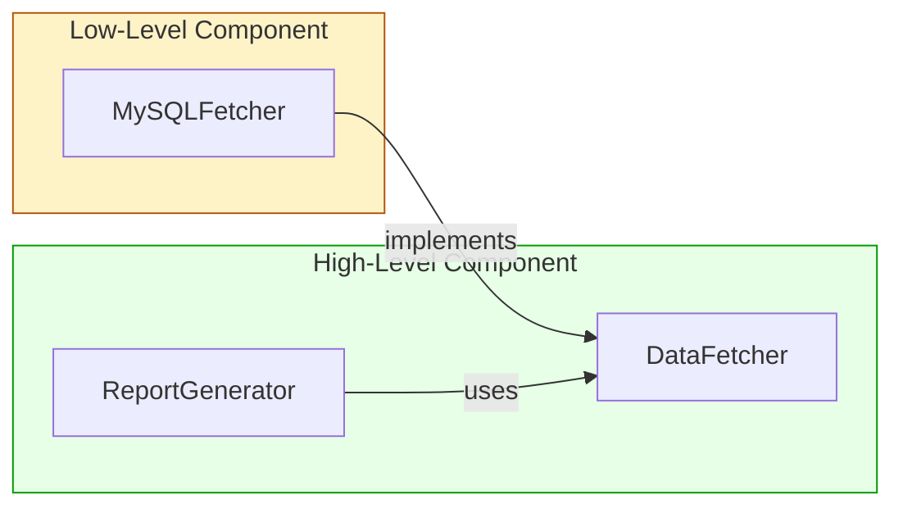
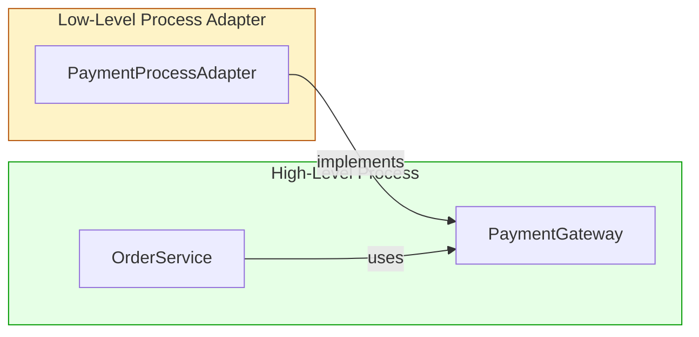
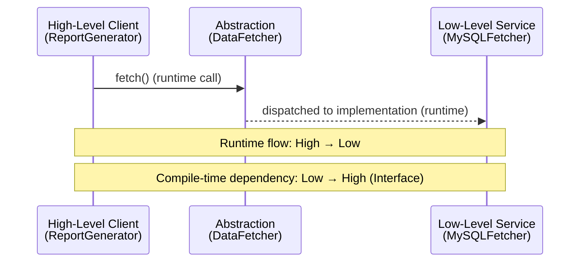

# Tutorial: Boundary Anatomy – From Monoliths to Services
---

## 1. What a Boundary Really Is

A boundary separates two components. At runtime, crossing it is just a function call with data. The **architectural trick** is managing the *source code dependencies*:

- When module A changes, will module B need to be changed or recompiled?
- We want firewalls: changes in low‑level details (UI, database, frameworks) should **not** propagate into core business rules.

Boundaries come in different physical forms, but the dependency rule is always the same:

> **Source code dependencies must point toward the higher‑level component.**

---

## 2. The Simplest Boundary: Monolith with OOP Interfaces

Even in a single executable, boundaries can be enforced through **dynamic polymorphism** (abstract classes/interfaces). This is the *source‑level decoupling mode*.

### Scenario: A high‑level `ReportGenerator` needs to fetch data.

**Naïve approach (violates the rule):**
```python
# report.py
class ReportGenerator:
    def generate(self):
        # Directly imports and uses low-level MySQL fetcher
        from mysql_fetcher import MySQLFetcher
        fetcher = MySQLFetcher()
        data = fetcher.fetch()
        # format report...
```
Here, `ReportGenerator` depends on `MySQLFetcher`. If the database changes, the high‑level report logic must change. The dependency points **downward**.

**Correct approach: Invert the dependency with an interface.**

Define an abstract fetcher in the high‑level component:

```python
# report/rules.py  (high-level component)
from abc import ABC, abstractmethod

class DataFetcher(ABC):
    @abstractmethod
    def fetch(self) -> list[dict]:
        pass

class ReportGenerator:
    def __init__(self, fetcher: DataFetcher):
        self.fetcher = fetcher

    def generate(self) -> str:
        data = self.fetcher.fetch()
        return f"Report for {len(data)} records"
```

Now the low‑level MySQL implementation lives in a separate component that **depends on the interface**:

```python
# report/adapters/mysql_fetcher.py
from report.rules import DataFetcher

class MySQLFetcher(DataFetcher):
    def fetch(self):
        # low-level MySQL queries
        return [{"name": "Alice"}, {"name": "Bob"}]
```

The dependency graph looks like this:



**Key points:**
- The flow of control at runtime goes from `ReportGenerator` → `MySQLFetcher.fetch()`.
- The compile‑time dependency goes from `MySQLFetcher` → `DataFetcher` (pointing **upward**).
- The definition of the data structure (`list[dict]`) is owned by the interface on the calling side.

This is the **Dependency Inversion Principle**: both sides depend on the abstraction, and the abstraction is owned by the higher‑level component.

---

## 3. Deployment Components: Python Packages as Boundaries

A boundary can also be a **deployment component**: a separate `.jar`, `.dll`, or in Python, an installable package (e.g., a `.whl` or just a separate directory). The source code is compiled/imported separately, but everything still runs in the same process.

### Example: A plugin system for report formatting.

We define an abstract interface in the **core** package:

```python
# core/plugin.py
from abc import ABC, abstractmethod

class ReportFormatter(ABC):
    @abstractmethod
    def format(self, data: list[dict]) -> str:
        pass
```

The core application loads formatters without knowing which ones exist. It uses Python’s entry points or a simple import of a registry.

```python
# core/app.py
from core.plugin import ReportFormatter

class ReportApp:
    def __init__(self, formatter: ReportFormatter):
        self.formatter = formatter

    def produce_report(self, data):
        return self.formatter.format(data)
```

Now we create a separate **plugin package** (e.g., `html_formatter`) that depends on `core`:

```python
# html_formatter/plugin.py
from core.plugin import ReportFormatter

class HtmlFormatter(ReportFormatter):
    def format(self, data):
        html = "<html><body><ul>"
        for row in data:
            html += f"<li>{row}</li>"
        html += "</ul></body></html>"
        return html
```

You can distribute `html_formatter` as a pip-installable package. The core never knows about `HtmlFormatter`. The dependency arrow points from the plugin **to** the core.

**Physical boundary:** The plugin can be developed, tested, and deployed independently. Yet at runtime, it’s just a function call. Communication is cheap.

---

## 4. Threads – A Note

Threads are **not architectural boundaries**. They are a way to schedule execution. You can use threads inside a monolith, but the same dependency rules apply. A thread doesn’t create a source‑code decoupling wall; the interface and dependency inversion still do the heavy lifting.

---

## 5. Local Processes: Stronger Physical Separation

A local process runs in its own address space. Communication goes through sockets, pipes, or message queues. This is a **deployment‑level** or **execution‑unit** boundary.

However, from a source‑code perspective, the **same dependency rule holds**: the higher‑level process must not depend on the names or addresses of the lower‑level process. The lower‑level process is a **plugin**.

### Example: A high‑level `OrderService` that uses a `PaymentProcessor` in a separate process.

**High‑level process** (`order_app/main.py`):

```python
from order_app.payment_interface import PaymentGateway

class OrderService:
    def __init__(self, gateway: PaymentGateway):
        self.gateway = gateway

    def checkout(self, amount: float):
        self.gateway.charge(amount)
```

The `PaymentGateway` is an interface defined in the high‑level component:

```python
# order_app/payment_interface.py
from abc import ABC, abstractmethod

class PaymentGateway(ABC):
    @abstractmethod
    def charge(self, amount: float) -> bool:
        pass
```

We implement a **local process adapter** that talks to a separate payment process via a Unix socket or subprocess stdin/stdout. This adapter still lives in a **lower‑level component** and depends on the high‑level interface.

```python
# payment_process_adapter/adapter.py
import subprocess
from order_app.payment_interface import PaymentGateway

class PaymentProcessAdapter(PaymentGateway):
    def __init__(self, cmd: list[str]):
        self.cmd = cmd

    def charge(self, amount: float) -> bool:
        proc = subprocess.run(
            [*self.cmd, str(amount)],
            capture_output=True, text=True
        )
        return "OK" in proc.stdout
```

The payment process itself (maybe a compiled Go binary or another Python script) is completely independent. The high‑level `OrderService` never sees the subprocess command or socket details.

**Dependency diagram:**



Even though runtime communication is expensive (context switches, marshalling), the source code dependency still points **upward**. The high‑level process contains no physical address of the low‑level process.

---

## 6. Services: The Strongest Boundary

A service is a process that communicates over the network. The physical location doesn’t matter. The dependency rule remains: **the higher‑level service must not contain specific URIs or connection details of lower‑level services**. The lower‑level service is a plugin.

### Example: A cloud‑based reporting system using an HTTP service.

**High‑level service** (`report_service/reporting.py`):

```python
from abc import ABC, abstractmethod

class DataService(ABC):
    @abstractmethod
    def fetch_data(self) -> list[dict]:
        pass

class ReportGenerator:
    def __init__(self, data_service: DataService):
        self.data_service = data_service

    def generate(self):
        data = self.data_service.fetch_data()
        return f"Report: {len(data)} items"
```

**Low‑level HTTP adapter** (could be in a separate micro‑service repository):

```python
# data_service_client/adapter.py
import requests
from report_service.reporting import DataService

class HttpDataService(DataService):
    def __init__(self, base_url: str):
        self.base_url = base_url

    def fetch_data(self):
        resp = requests.get(f"{self.base_url}/data")
        return resp.json()
```

The `ReportGenerator` only knows about `DataService`. The concrete `HttpDataService` is injected at startup (e.g., from configuration). The high‑level service never imports `requests` or the URL directly.

**Note:** Communication across service boundaries is **slow** (milliseconds to seconds). Avoid chatty calls; batch data where possible. But the source code firewall remains intact.

---

## 7. Crossing Boundaries Against the Flow of Control

The chapter highlights a critical distinction: when a high‑level client calls a lower‑level service, the **runtime dependency** goes from high to low, but the **compile‑time dependency** must go from low to high. That’s what we’ve been doing with interfaces.

Let’s visualize both cases with a Mermaid diagram.

**Case 1: Both dependencies point same direction (lower to higher)**  
(High‑level Service, Low‑level Client – not common in our examples, but shows the simple case.)

**Case 2: Dependency inversion against flow of control** (our examples):



The diagram shows that while the call goes downward, the source code dependency (imports) goes upward. This is the trick that keeps high‑level components immune to changes in low‑level details.

---

## 8. Mixing Boundaries in a Real System

Real systems combine boundaries. A service might internally be a monolith with source‑level decoupled components. Or it might consist of several local processes. The key is that at every boundary, you apply the same rule:

- Abstractions are defined by the higher‑level component.
- Lower‑level components implement those abstractions.
- The higher‑level component never directly imports a concrete lower‑level class.

---

## 9. Practical Summary Table

| Boundary Type | Communication Cost | Physical Separation | Dependency Rule |
|---------------|-------------------|---------------------|-----------------|
| Monolith (source‑level) | Very cheap (function call) | Same process, address space | Interface & polymorphism |
| Deployment component | Cheap (function call, possibly dynamic linking) | Same process, separate deployable unit | Same as monolith |
| Local process | Moderate (IPC, context switches) | Separate address spaces | High‑level process defines interface; adapter in low‑level process depends on it |
| Service | Expensive (network latency) | Separate processes, possibly separate machines | Same as local process; avoid physical URIs in high‑level code |

---

## 10. Conclusion

Boundaries are not about physical separation alone—they are about **managing dependency directions**. By using abstract classes/interfaces owned by the higher‑level component, you can create firewalls that protect your core business rules from changes in databases, frameworks, UIs, and communication mechanisms.

Whether you are building a monolith, a deployment component, a local process, or a network service, the same strategy applies:

1. **Define the interface in the component that uses it.**
2. **Implement that interface in the component that provides the detail.**
3. **Inject the implementation so the high‑level code never depends on the concrete low‑level code.**
