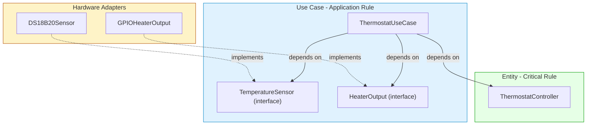

# Tutorial: Entity vs. Use Case in Embedded Systems

So far we’ve explored Entities and Use Cases in the context of business applications (banking, loans). But Clean Architecture applies just as powerfully to **embedded software**—the world of microcontrollers, sensors, and actuators. In this tutorial we’ll take a classic embedded example (a thermostat) and draw the boundary between the Entity (the pure temperature‑control logic) and the Use Case (the application‑specific orchestration that ties the logic to hardware).

All examples use Python‑like pseudocode, but the same design can be implemented in C, C++, or Rust using function pointers, abstract interfaces, or traits.

---

## 1. The Thermostat Domain

Imagine a simple thermostat that controls a heating system. It must:

- Read the current temperature from a sensor.
- Compare it to a user‑defined setpoint.
- Turn the heater on or off depending on whether the temperature is too low.
- Apply **hysteresis** to avoid rapid cycling (a classic embedded control rule).

Now, what part of this is a **Critical Business Rule** and what part is an **Application‑Specific Use Case**?

---

## 2. The Entity: `ThermostatController`

The core business rule is the **decision logic**: given a current temperature and a desired setpoint, should the heater be on or off? This rule would exist even if the thermostat were a bimetallic strip—it’s a physical, timeless rule. It has nothing to do with how the temperature is measured or how the heater is switched. It only depends on temperature values and the setpoint.

This is our **Entity**.

```python
# entity/thermostat_controller.py
from dataclasses import dataclass

@dataclass(frozen=True)
class HysteresisConfig:
    on_threshold_below: float
    off_threshold_above: float

class ThermostatController:
    """
    Entity: Pure critical rule – decides heater state based on temperature and setpoint.
    Knows nothing about sensors, relays, or timers.
    """
    def __init__(self, setpoint: float, hysteresis: HysteresisConfig):
        self.setpoint = setpoint
        self.hysteresis = hysteresis
        self._heater_on = False   # current state

    def update(self, current_temp: float) -> bool:
        """Returns True if heater should be ON, False otherwise."""
        if self._heater_on:
            # If we are already heating, turn off only when we exceed setpoint + off_threshold
            if current_temp >= self.setpoint + self.hysteresis.off_threshold_above:
                self._heater_on = False
        else:
            # If we are not heating, turn on when temperature drops below setpoint - on_threshold
            if current_temp <= self.setpoint - self.hysteresis.on_threshold_below:
                self._heater_on = True
        return self._heater_on

    def get_setpoint(self) -> float:
        return self.setpoint
```

This Entity is **pure**: it imports nothing but standard language features. It can be unit‑tested in complete isolation, without any hardware or even a mock of a sensor.

```python
def test_thermostat_controller():
    hysteresis = HysteresisConfig(on_threshold_below=1.0, off_threshold_above=0.5)
    controller = ThermostatController(setpoint=20.0, hysteresis=hysteresis)

    assert controller.update(19.0) == True   # too cold, heater on
    assert controller.update(20.0) == True   # still heating (above off threshold)
    assert controller.update(20.5) == True   # exactly at off threshold? Still on (off condition is >=)
    # Let's say off_threshold_above=0.5, so off when temp >= 20.5
    assert controller.update(20.6) == False  # turned off
```

No hardware, no operating system—just the business rule.

---

## 3. The Use Case: `ThermostatUseCase`

Now we need to *use* this Entity in a real embedded system. The application‑specific rule is: **every 500 milliseconds, read the temperature sensor, feed it to the `ThermostatController`, and set the heater output accordingly**. Additionally, we might want to update the setpoint from a user button or a remote command, but we’ll keep it simple.

This orchestration is a **Use Case**. It depends on the Entity and on **abstractions** for the hardware it needs (sensor, heater output). It does not depend on concrete GPIO or ADC drivers.

We *first define the interfaces that the Use Case* needs (these are owned by the Use Case layer):

```python
# use_case/interfaces.py
from abc import ABC, abstractmethod

class TemperatureSensor(ABC):
    """Abstraction for reading the current temperature."""
    @abstractmethod
    def read_celsius(self) -> float:
        pass

class HeaterOutput(ABC):
    """Abstraction for controlling the heater relay."""
    @abstractmethod
    def set_on(self, on: bool) -> None:
        pass
```

Now the Use Case:

```python
# use_case/thermostat_use_case.py
import time
from entity.thermostat_controller import ThermostatController
from use_case.interfaces import TemperatureSensor, HeaterOutput

class ThermostatUseCase:
    """
    Application‑specific rule: periodic temperature control loop.
    Knows about the Entities and the control flow, but NOT about concrete hardware.
    """
    def __init__(self,
                 controller: ThermostatController,
                 sensor: TemperatureSensor,
                 heater: HeaterOutput):
        self.controller = controller
        self.sensor = sensor
        self.heater = heater

    def run_cycle(self) -> None:
        """One cycle of the control loop."""
        current_temp = self.sensor.read_celsius()
        heater_should_be_on = self.controller.update(current_temp)
        self.heater.set_on(heater_should_be_on)

    # In a real RTOS or bare-metal loop, you'd call run_cycle periodically.
    # For demonstration, we simulate a loop.
    def run_periodic(self, interval_seconds: float):
        while True:
            self.run_cycle()
            time.sleep(interval_seconds)
```

This Use Case is still **hardware‑agnostic**; it depends only on the interfaces. It can be tested with fake sensors and heaters.

---

## 4. The Adapters: Hardware‑Specific Implementations

Finally, the concrete hardware drivers are **adapters** that implement the interfaces. They live in the outermost layer and are swapped in for the real system.

```python
# adapters/hardware.py
from use_case.interfaces import TemperatureSensor, HeaterOutput

class DS18B20Sensor(TemperatureSensor):
    def read_celsius(self) -> float:
        # Code to talk to a 1‑Wire sensor (e.g., via MicroPython machine.Pin)
        pass

class GPIOHeaterOutput(HeaterOutput):
    def set_on(self, on: bool) -> None:
        # Code to set a GPIO pin high/low
        pass
```

The dependency direction is clear:

- `ThermostatController` (Entity) → no dependencies.
- `ThermostatUseCase` → depends on Entity and on abstract interfaces.
- `DS18B20Sensor` and `GPIOHeaterOutput` → depend on the abstract interfaces.

All arrows point inward.

---

## 5. Visual Summary: Entity vs. Use Case in Embedded



The Entity knows nothing about sensors or relays. The Use Case knows about the Entity but only through interfaces that keep it decoupled from the real world. The hardware details are plugins.

---

## 6. Key Differences Summarized

| Aspect | Entity (ThermostatController) | Use Case (ThermostatUseCase) |
|--------|-------------------------------|------------------------------|
| **What it contains** | Pure hysteresis logic, setpoint management | Control loop timing, orchestration of sensor read → entity update → output write |
| **Depends on** | Nothing but standard language features | The Entity, abstract sensor/heater interfaces |
| **Would it exist in a manual system?** | Yes—a person could use a thermometer and manually apply hysteresis. | No—the periodic automatic reading and control is specific to this automated system. |
| **Hardware knowledge** | None | None (only abstractions) |
| **Testability** | Fully isolated, no mocks needed | Testable with fake sensor/heater implementations |

---

## 7. Embedded‑Specific Best Practices

1. **Keep the Entity algorithm pure and deterministic** – No hardware calls, no non‑deterministic delays. This makes it easy to test with a large set of temperature inputs and verify the hysteresis behavior.

2. **Use abstract interfaces for all I/O** – Even if your language doesn’t have classes (C), you can use structs of function pointers to achieve polymorphism.

   ```c
   // C equivalent of the sensor abstraction
   struct temperature_sensor {
       float (*read_celsius)(void* self);
   };
   ```

3. **Decouple timing from logic** – The Use Case decides *when* to run the control loop, but the Entity decides *what* to do. This allows you to easily change the control frequency without touching the control algorithm.

4. **Test the Entity on a host machine** – Since the Entity has no hardware dependencies, you can run thousands of unit tests on your development PC, not on the target microcontroller. This dramatically speeds up development.

5. **Keep ISRs (Interrupt Service Routines) out of the Use Case and Entity** – ISRs belong in the adapter layer. The Use Case’s `run_cycle` can be called from a main loop or a low‑priority task after the ISR has buffered the data.

6. **Avoid hard‑coded sensor addresses or pin numbers in the Use Case** – Those are provided via dependency injection (e.g., constructor parameters) or a configuration adapter.

---

## 8. Common Pitfalls

- **Mixing Entity logic with hardware access** – e.g., putting the hysteresis rule directly in the ADC interrupt handler. That makes the rule untestable and hardware‑bound.
- **Fat Use Cases** – Making the Use Case do temperature averaging, sensor calibration, and control simultaneously. Calibration should be a separate Entity (or value object); the Use Case should orchestrate them, not contain their algorithms.
- **Skipping the abstraction for outputs** – Calling `digitalWrite(pin, HIGH)` directly from the Use Case ties it to a specific pin and platform. Always abstract the output.

---

## 9. Conclusion

Entities and Use Cases are not limited to enterprise software. In embedded systems, they cleanly separate the **essential control algorithm** (the Entity) from the **application‑specific orchestration and I/O management** (the Use Case). This separation keeps the core logic independent of hardware, making it reusable across different microcontrollers, testable on a host, and immune to changes in sensor types or actuator circuitry.

The result is an embedded architecture that is soft, maintainable, and ready to evolve as hardware requirements change.