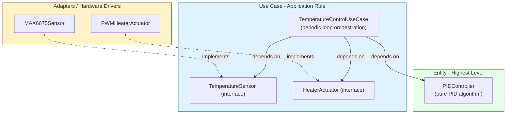

# Tutorial: Entity vs. Use Case in an Embedded PID Temperature Controller

In the previous thermostat example we used a simple hysteresis control. Now we’ll tackle a more advanced scenario: a **closed‑loop PID (Proportional‑Integral‑Derivative) temperature controller**. In many embedded systems—industrial ovens, 3D printer heated beds, laboratory hotplates—a PID algorithm is the core control strategy.

We’ll see how to split this into a **pure PID Entity** (the critical control rule) and a **Use Case** (the application‑specific orchestration that connects the PID to the real hardware). All examples use Python‑like pseudocode, but the same separation can be implemented in C, C++, or Rust.

---

## 1. Why PID? The Core Algorithm

A PID controller continuously calculates an error \( e(t) \) as the difference between a desired setpoint and a measured process variable. It then applies a correction based on three terms:

- **P** (proportional) – responds to current error.
- **I** (integral) – accounts for past accumulated error.
- **D** (derivative) – anticipates future error based on rate of change.

The output is a control signal (e.g., heater power from 0% to 100%). This algorithm is a **timeless mathematical rule**—it would be the same whether implemented with an op‑amp circuit, a mechanical linkage, or a digital microcontroller. Therefore, it’s a perfect **Entity**: pure business rule, no hardware dependencies.

---

## 2. The Entity: `PIDController`

The PID Entity encapsulates:

- The PID gains (Kp, Ki, Kd).
- The integral and derivative calculation state.
- A method `update(setpoint, measurement, dt)` that returns a control output.

It knows nothing about sensors, actuators, or time sources. It only knows about numbers.

```python
# entity/pid_controller.py

class PIDController:
    """
    Pure Entity: PID control algorithm.
    No hardware or I/O dependencies.
    """
    def __init__(self, kp: float, ki: float, kd: float,
                 output_min: float = 0.0, output_max: float = 100.0):
        self.kp = kp
        self.ki = ki
        self.kd = kd
        self.output_min = output_min
        self.output_max = output_max

        # Internal state – no hardware, just numbers
        self._integral = 0.0
        self._prev_error = 0.0

    def update(self, setpoint: float, measurement: float, dt: float) -> float:
        """
        Calculate PID output.
        :param setpoint: Desired temperature (°C)
        :param measurement: Current temperature (°C)
        :param dt: Time since last update in seconds
        :return: Control output (clamped to output_min..output_max)
        """
        error = setpoint - measurement

        # Proportional
        p = self.kp * error

        # Integral (with anti‑windup by clamping before integration)
        self._integral += error * dt
        i = self.ki * self._integral

        # Derivative (on measurement to avoid derivative kick)
        d = self.kd * (measurement - self._prev_error) / dt if dt > 0 else 0.0
        self._prev_error = measurement

        output = p + i + d

        # Clamp output and implement back‑calculation anti‑windup
        if output > self.output_max:
            output = self.output_max
            self._integral -= error * dt   # prevent windup
        elif output < self.output_min:
            output = self.output_min
            self._integral -= error * dt

        return output
```

**Why is this an Entity?**
- It implements a critical rule (PID) that would exist in any temperature control, regardless of automation.
- It has **zero** imports from hardware libraries, frameworks, or operating systems.
- It can be fully tested with simple unit tests, without any mock hardware.

```python
def test_pid_proportional_only():
    pid = PIDController(kp=2.0, ki=0.0, kd=0.0, output_min=0, output_max=100)
    # setpoint=100, measurement=90 => error=10, output=20
    assert pid.update(100.0, 90.0, 1.0) == 20.0
```

---

## 3. The Use Case: `TemperatureControlUseCase`

The Use Case adds the **application‑specific** behavior: we need to periodically read the actual temperature from a sensor, feed it to the PID, and write the resulting power to a heater actuator (e.g., a PWM pin or a solid‑state relay). This is the automation‑specific part—it would not be done in a manual process.

The Use Case depends on:
- The `PIDController` Entity.
- Abstract interfaces for the temperature sensor and heater actuator (which we define in the use‑case layer).

```python
# use_case/interfaces.py
from abc import ABC, abstractmethod

class TemperatureSensor(ABC):
    @abstractmethod
    def read_celsius(self) -> float:
        """Return the current temperature in degrees Celsius."""
        pass

class HeaterActuator(ABC):
    @abstractmethod
    def set_power(self, power_percent: float) -> None:
        """
        Set heater output power.
        :param power_percent: 0.0 (off) to 100.0 (full power)
        """
        pass
```

Now the Use Case itself:

```python
# use_case/temperature_control_use_case.py
from entity.pid_controller import PIDController
from use_case.interfaces import TemperatureSensor, HeaterActuator

class TemperatureControlUseCase:
    """
    Application‑specific rule: periodic temperature control loop.
    Orchestrates the PID Entity and the I/O abstractions.
    """
    def __init__(self,
                 pid: PIDController,
                 sensor: TemperatureSensor,
                 heater: HeaterActuator):
        self.pid = pid
        self.sensor = sensor
        self.heater = heater

    def run_cycle(self, setpoint: float, dt: float) -> None:
        """Execute one control cycle."""
        current_temp = self.sensor.read_celsius()
        power = self.pid.update(setpoint, current_temp, dt)
        self.heater.set_power(power)

    # In a real system this loop might be called from a timer interrupt or RTOS task.
    # For demonstration, a simple blocking loop:
    def run_loop(self, setpoint: float, interval_seconds: float) -> None:
        import time
        while True:
            loop_start = time.time()
            self.run_cycle(setpoint, interval_seconds)
            elapsed = time.time() - loop_start
            sleep_time = interval_seconds - elapsed
            if sleep_time > 0:
                time.sleep(sleep_time)
```

The Use Case still does **not** import any concrete hardware drivers. It only uses the interfaces it owns. This makes it fully testable with fake sensors and actuators.

```python
def test_use_case_with_fakes():
    class FakeSensor(TemperatureSensor):
        def read_celsius(self):
            return 90.0
    class FakeHeater(HeaterActuator):
        def __init__(self):
            self.last_power = 0.0
        def set_power(self, power):
            self.last_power = power

    pid = PIDController(2.0, 0.1, 0.0, output_min=0, output_max=100)
    uc = TemperatureControlUseCase(pid, FakeSensor(), FakeHeater())
    uc.run_cycle(setpoint=100.0, dt=1.0)
    # With setpoint 100, measurement 90 => error 10 => p=20, i=0.1*10*1=1.0, output=21
    assert FakeHeater().last_power == 21.0
```

---

## 4. The Hardware Adapters (Plugins)

The concrete hardware implementations live in the outermost layer and **depend** on the use‑case interfaces.

```python
# adapters/hardware.py
from use_case.interfaces import TemperatureSensor, HeaterActuator

class MAX6675Sensor(TemperatureSensor):
    """Adapter for a MAX6675 thermocouple sensor via SPI."""
    def __init__(self, spi_bus, cs_pin):
        self.spi = spi_bus
        self.cs = cs_pin

    def read_celsius(self) -> float:
        # Bit‑banging or hardware SPI read, data conversion
        # ...
        return temp

class PWMHeaterActuator(HeaterActuator):
    """Adapter for a heater driven by a PWM pin (0‑100% duty cycle)."""
    def __init__(self, pwm_pin):
        self.pwm = pwm_pin

    def set_power(self, power_percent: float) -> None:
        duty_cycle = int(power_percent * 65535 / 100)
        self.pwm.duty_u16(duty_cycle)
```

These adapters are pure infrastructure. The Entity and Use Case never need to know about SPI, PWM registers, or specific chip models. To change sensor types (e.g., a thermistor with an ADC), you just write a new adapter and inject it.

---

## 5. Visualizing the Dependency Flow



The dependency arrows point **inward**. The high‑level PID algorithm stays unchanged regardless of whether you’re controlling a heater, a motor, or a hydraulic valve. The Use Case stays unchanged if you swap a thermocouple for an RTD.

---

## 6. Embedded‑Specific Best Practices for PID

1. **Separate sample‑time management from the PID Entity.**  
   The PID algorithm itself should not call `sleep()` or depend on a hardware timer. It simply receives `dt`. The Use Case (or an adapter timer) provides the real‑time scheduling. This makes the PID testable with arbitrary time steps.

2. **Keep the PID state clean.**  
   The integral and previous error are held in the Entity. They should not be stored in global variables or mixed with I/O flags. If you need to persist state across power cycles, the Use Case can call a method to retrieve/set the state through a repository interface, but the Entity remains pure.

3. **Use anti‑windup and clamping as part of the Entity.**  
   Anti‑windup is a critical business rule; it’s not an I/O detail. The Entity should handle it so that any actuator saturation is correctly managed.

4. **Isolate sensor calibration in the adapter or a separate service.**  
   The raw ADC value to Celsius conversion belongs in the sensor adapter (or a calibration value object). The Use Case sees only `read_celsius()`. The PID Entity sees only a float temperature.

5. **Make the control interval configurable without changing the Entity.**  
   The interval at which the PID is called is an application concern. By passing `dt` from the Use Case, you can easily adjust the loop rate without touching the PID logic.

6. **Test the PID exhaustively on a host machine.**  
   With no hardware dependencies, you can run thousands of simulations with different gain parameters, step responses, and noise profiles in seconds. This is invaluable for tuning.

---

## 7. Common Pitfalls

- **Embedding PID inside the timer ISR.**  
  Placing the PID logic directly in an interrupt service routine couples it to the hardware and makes it nearly impossible to test or reuse. Instead, call the Use Case from the ISR or have the ISR set a flag for a main loop.

- **Putting sensor filtering or actuator logic in the PID Entity.**  
  Averaging a noisy sensor reading is a data‑processing concern, not part of the control law. Keep it in the sensor adapter or a separate filter module. The Entity just receives a clean temperature value.

- **Hard‑coding PID gains in the Entity.**  
  The gains are parameters of the control algorithm, but they are not fixed. They should be provided via the constructor or a configuration object so the same PID class can be used in many contexts without modification.

- **Mixing multiple control modes in one Entity.**  
  If you later add a manual mode or a ramp‑soak profile, that’s an application‑specific orchestration, not a new PID rule. Keep the Entity focused on the single control law; add a Use Case that switches between modes.

- **Assuming a specific `dt` inside the PID.**  
  Some developers bake the loop time into the PID constants, making the Entity fragile to timing changes. Always pass `dt` explicitly.

---

## 8. Conclusion

In a closed‑loop PID temperature controller, the **Entity** is the PID algorithm itself—a pure, timeless mathematical rule that can be tested and tuned in complete isolation. The **Use Case** is the surrounding orchestration: periodically reading the sensor, feeding data to the PID, and driving the actuator. This separation yields:

- **Hardware independence** – swap sensors or actuators without touching the control algorithm.
- **Testability** – test the PID on your PC with simulated inputs; test the Use Case with fake drivers.
- **Reusability** – the same PID Entity can be used in a completely different project (e.g., motor speed control) just by changing the Use Case.
- **Maintainability** – when requirements change (e.g., a different sensor or a web interface), the core control logic never breaks.

This is Clean Architecture applied to the embedded world—keeping the precious control algorithms safe from the chaos of hardware details.