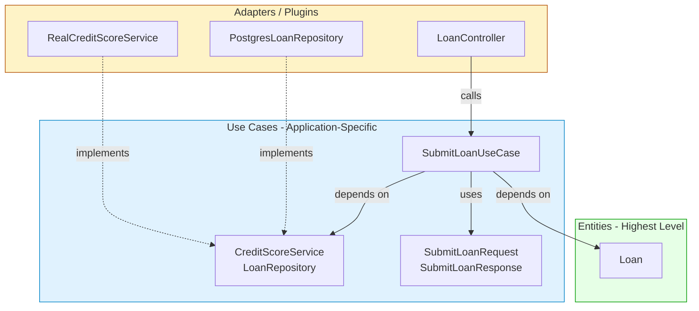

# Deep Dive: Use Cases – The Application‑Specific Business Rules

We’ve already explored **Entities**—the pure, critical business rules that live at the very heart of your system. Now we turn to the next ring out: **Use Cases**. These are the application‑specific business rules that orchestrate the Entities and define *how* an automated system behaves.

This deep dive will teach you exactly what a Use Case is, how to design one that stays clean, how to evaluate its quality, best practices for implementation, and the traps that can turn your Use Cases into a tangled mess. All examples are in Python.

---

## 1. What Is a Use Case?

In Clean Architecture, a **Use Case** is an object that implements **application‑specific business rules**. It describes the way an automated system is used. It specifies:

- The **input** from the user (or another system)
- The **output** to be returned
- The **processing steps** that coordinate the Entities and enforce application flow

Crucially, a Use Case **does not describe the user interface**. You cannot tell if it’s a web page, a CLI, or a pure REST API by looking at the Use Case. It only defines the data that enters and leaves, and the rules that govern the process.

### Use Cases vs. Entities

| Entity | Use Case |
|--------|----------|
| Pure business rules that would exist in a manual process | Application‑specific rules that only exist because of the automation |
| Highest‑level; farthest from I/O | Lower‑level than Entities; closer to the system boundary |
| Know nothing of use cases, UI, or databases | Know about Entities, and depend on interfaces for external services |
| Example: `Loan` with `apply_payment()` | Example: `EvaluateLoanApplication` that checks credit score, validates contact info, and then delegates to `Loan` for calculation |

The relationship is a one‑way dependency: **Use Cases depend on Entities; Entities never depend on Use Cases**. This preserves the ability to reuse Entities in different applications or contexts.

---

## 2. Anatomy of a Well‑Designed Use Case

A Use Case is usually a single class with a primary method (often named `execute` or something descriptive). It has three parts:

1. **Request/Response Models** – Simple, dependency‑free data structures.
2. **Dependencies** – Interfaces for things the Use Case needs but that are not business rules (e.g., a credit score service, a repository).
3. **The Orchestration Logic** – The application‑specific steps that enforce the use case’s flow.

### Example: `SubmitLoanApplication` Use Case

Let’s continue with the banking domain. The bank requires that before a loan application can be submitted, the applicant’s contact information must be complete and their credit score must be checked. Then a `Loan` entity is created and saved.

First, define the request and response models:

```python
# use_cases/submit_loan_application.py
from dataclasses import dataclass
from decimal import Decimal
from typing import Optional

@dataclass(frozen=True)
class SubmitLoanRequest:
    applicant_name: str
    applicant_email: str
    credit_score: int
    requested_amount: Decimal
    term_months: int

@dataclass(frozen=True)
class SubmitLoanResponse:
    success: bool
    loan_id: Optional[str] = None
    rejection_reason: Optional[str] = None
```

These models are plain data classes. They do **not** inherit from any framework class. They know nothing about HTTP, JSON, or databases.

---

Now, the Use Case itself. It needs two external resources:
- A way to check the credit score (an abstraction)
- A way to save the `Loan` Entity (a repository abstraction)

We define these interfaces in the use‑case layer. They are **owned** by the Use Case, not by the infrastructure.

```python
# use_cases/interfaces.py
from abc import ABC, abstractmethod
from entities.loan import Loan

class CreditScoreService(ABC):
    @abstractmethod
    def is_credit_score_acceptable(self, score: int) -> bool:
        pass

class LoanRepository(ABC):
    @abstractmethod
    def save(self, loan: Loan) -> str:  # returns loan ID
        pass
```

Now the Use Case class:

```python
# use_cases/submit_loan_use_case.py
from use_cases.submit_loan_application import SubmitLoanRequest, SubmitLoanResponse
from use_cases.interfaces import CreditScoreService, LoanRepository
from entities.loan import Loan
from datetime import date
from decimal import Decimal

class SubmitLoanUseCase:
    def __init__(self, credit_service: CreditScoreService, loan_repo: LoanRepository):
        self.credit_service = credit_service
        self.loan_repo = loan_repo

    def execute(self, request: SubmitLoanRequest) -> SubmitLoanResponse:
        # 1. Application‑specific validation: contact info required
        if not request.applicant_name or not request.applicant_email:
            return SubmitLoanResponse(success=False, rejection_reason="Contact info incomplete")

        # 2. Application‑specific rule: credit score threshold
        if not self.credit_service.is_credit_score_acceptable(request.credit_score):
            return SubmitLoanResponse(success=False, rejection_reason="Credit score below 500")

        # 3. Use the pure Entity to model the loan
        loan = Loan(
            principal=request.requested_amount,
            annual_rate=Decimal('0.06'),
            start_date=date.today()
        )

        # 4. Persist using the repository abstraction
        loan_id = self.loan_repo.save(loan)

        return SubmitLoanResponse(success=True, loan_id=loan_id)
```

Everything that touches infrastructure—the credit score check and the database—is behind an interface. The Use Case only knows about the abstractions it defines. This makes it fully testable with stubs.

---

## 3. How to Evaluate a Use Case

Ask these questions:

- **Is the Use Case completely decoupled from delivery mechanisms?**  
  Check imports: no `Flask`, `Django`, `tkinter`, `requests`, `sqlite3`, or ORM classes inside the Use Case file. If there are, the boundary is broken.

- **Does it only orchestrate Entities and call interfaces?**  
  The Use Case should not contain complex business algorithms (those belong in Entities). It should be a thin coordinator.

- **Are request/response models plain and independent?**  
  They must not derive from `HttpRequest` or any framework base. They are simple data carriers.

- **Does the Use Case depend on abstractions it owns?**  
  The interfaces (`CreditScoreService`, `LoanRepository`) are defined in the Use Case’s module, not imported from an infrastructure package. Dependencies point inward.

- **Is it testable in isolation?**  
  You should be able to write a unit test that mocks the interfaces and verifies the logic without any database or network.

- **Does it communicate the intent of the application?**  
  The name `SubmitLoanUseCase` and the method `execute` (or `submit`) should clearly express what the user does. The use case should *scream* the application’s purpose.

---

## 4. Best Practices

### 4.1. One Use Case per Class
Each class represents a single user action (e.g., `SubmitLoanApplication`, `CancelLoan`, `GenerateMonthlyReport`). This keeps the Single Responsibility Principle intact: each has exactly one reason to change.

### 4.2. Keep Use Cases Thin
All heavy logic that would exist in a manual system belongs in Entities. The Use Case is the director, the Entities are the actors. If you find yourself putting interest calculations or order validation logic in the Use Case, it’s time to refactor.

### 4.3. Use Request/Response Models Without Entity References
Even though a request model may look a lot like an Entity, do **not** embed Entity objects in the request. They change for different reasons (SRP). Over time, the request may add UI‑specific fields that don’t belong in the Entity. Keep them separate and map explicitly.

```python
# Bad: request contains an Entity
@dataclass
class SubmitLoanRequest:
    loan: Loan  # Don't do this

# Good: flat data that maps to Entity later
@dataclass
class SubmitLoanRequest:
    requested_amount: Decimal
    term_months: int
    ...
```

### 4.4. Define Output Boundaries (Interactors/Use Cases)
In some variants, you might see a **boundary interface** for the use case itself, so that the UI can call it without knowing the concrete class. This is optional but can be useful if you have multiple implementations of the same use case.

```python
class SubmitLoanBoundary(ABC):
    @abstractmethod
    def execute(self, request: SubmitLoanRequest) -> SubmitLoanResponse:
        pass
```

### 4.5. Test First
Write a test that sets up the Use Case with fake implementations of its interfaces. This ensures the Use Case is truly decoupled and that its contract (input → output) is verified.

```python
def test_submit_loan_success():
    repo = FakeLoanRepository()
    credit = FakeCreditService(always_acceptable=True)
    use_case = SubmitLoanUseCase(credit, repo)
    response = use_case.execute(SubmitLoanRequest("Jane", "j@m.com", 520, 10000, 36))
    assert response.success
    assert response.loan_id is not None
```

### 4.6. Keep the Use Case Focused on the Happy Path and Validations
The Use Case handles the application‑specific rules (missing contact info, insufficient credit). Business rule violations (e.g., negative principal) are caught by the Entity itself. The Use Case should not try to duplicate those internal guards.

---

## 5. Common Pitfalls (and How to Avoid Them)

### Pitfall 1: Fat Use Cases (The “Service” Anti‑pattern)
- **Symptom:** The Use Case class is 500 lines long and does everything: validation, calculation, database queries, sending emails.
- **Why it’s bad:** It becomes the classic anaemic domain “Service” that steals logic from Entities. Violates SRP and makes testing a nightmare.
- **Fix:** Move business algorithms into Entities and value objects. Split the Use Case into smaller, focused Use Cases if it’s doing too many things.

### Pitfall 2: Leaking Delivery Details
- **Symptom:** The Use Case imports `HttpRequest`, reads `request.args`, formats HTML strings, or logs into a specific database.
- **Why it’s bad:** The application becomes tied to one delivery mechanism and is impossible to reuse in another context.
- **Fix:** Use abstract interfaces for any external communication. The actual HTTP adapter lives outside the Use Case.

### Pitfall 3: Mixing Use Cases with Entities
- **Symptom:** The `Loan` Entity has a method `can_submit_application()` that checks if the user filled out a web form.
- **Why it’s bad:** Entities become polluted with application‑specific rules and lose their reusability.
- **Fix:** Keep Entities free of use‑case logic. The Use Case knows about the Entity, not the other way around.

### Pitfall 4: Request/Response Models with Framework Dependencies
- **Symptom:** `class SubmitLoanRequest(forms.Form):` (Django), or `@dataclass` that imports a JSON serializer library.
- **Why it’s bad:** The Use Case becomes indirectly dependent on the framework, making testing harder and coupling stronger.
- **Fix:** Keep request/response models as pure dataclasses or plain classes. Serialization is done in the adapter layer.

### Pitfall 5: Over‑Abstraction of Use Cases
- **Symptom:** Creating an `IUseCase<TRequest, TResponse>` generic interface and forcing every use case to implement it. This adds indirection with little benefit when the use cases have completely different contracts.
- **Why it’s bad:** It obscures the unique purpose of each use case and makes the code harder to read.
- **Fix:** Use explicit methods and classes. A common base class is okay, but don’t hide the specific request/response behind generics unless there’s a real need.

### Pitfall 6: Skipping the Output Model
- **Symptom:** The Use Case directly returns an Entity or raises an exception to communicate failure.
- **Why it’s bad:** The caller (the UI) now knows about internal domain objects. If the Entity changes, the UI might break. Exceptions for expected failure paths (like “invalid credit score”) are a misuse of exceptions.
- **Fix:** Always return a response object that clearly indicates success/failure and contains only the data needed by the caller. Use result types or a `success` flag.

### Pitfall 7: Not Handling Edge Cases
- **Symptom:** The Use Case assumes all data is valid and doesn’t handle missing or malformed input gracefully.
- **Why it’s bad:** The application crashes or behaves unpredictably at the boundaries.
- **Fix:** Explicitly validate input at the beginning of the Use Case (or even better, let the request model validate itself). Return a `rejection_reason` or similar.

---

## 6. Use Case Evaluation Scorecard

| Criterion | Yes/No |
|-----------|--------|
| Does the class have no imports from web, database, or UI frameworks? | |
| Are all external services accessed through abstractions defined in the use‑case layer? | |
| Does the class name represent a single user action (verb phrase)? | |
| Is the use case thin (mostly orchestration, not deep business logic)? | |
| Are request/response models plain data objects with no framework dependencies? | |
| Does the response include explicit success/failure information without throwing exceptions for expected outcomes? | |
| Can the use case be fully unit‑tested with fake implementations of its dependencies? | |
| Does it have zero references to Entity objects in its request/response models? | |

A score of 8/8 means your Use Case is clean and maintainable.

---

## 7. Visual Summary: Where Use Cases Fit



All source code dependencies point inward. The Use Case coordinates the dance, but the music is written by the Entities.

---

## 8. Conclusion

Use Cases are the bridge between the pure business world of Entities and the messy outside world of delivery mechanisms. When designed correctly, they:

- Enforce application‑specific flows and validations.
- Keep the core business rules (Entities) pristine.
- Are completely independent of UI, database, or framework details.
- Allow you to test the entire application logic without slow, brittle infrastructure.

By keeping Use Cases thin, using plain request/response models, and depending only on interfaces you own, you create a system where changes to the web or database never force you to rewrite the core logic. This is the heart of a maintainable, flexible architecture.