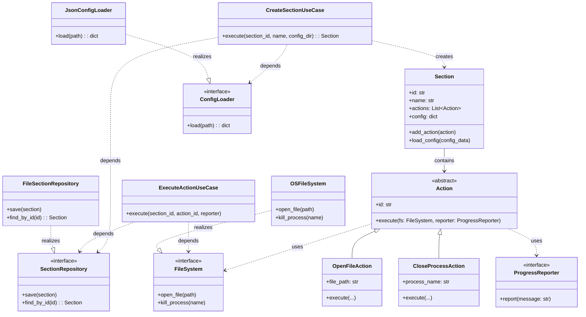
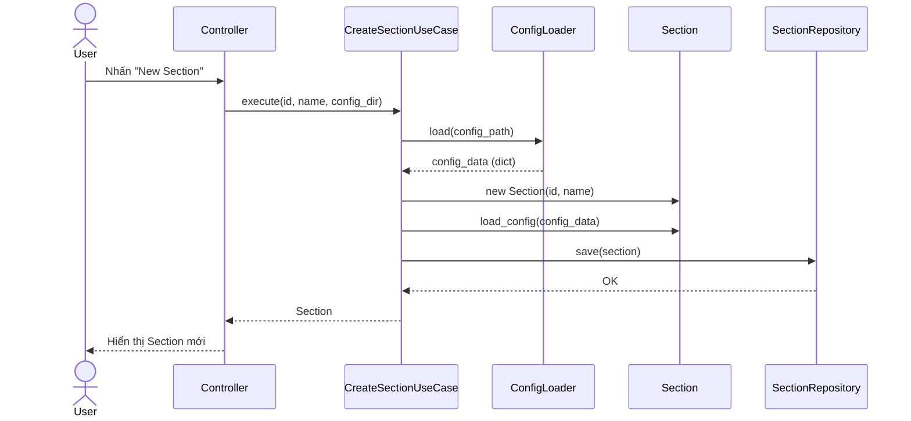
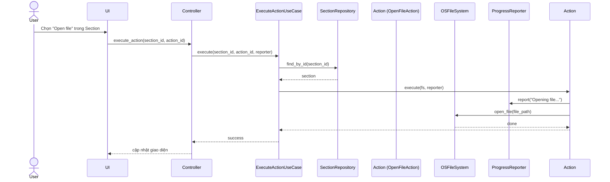

# Thiết kế Clean Architecture cho ứng dụng Automation – “Section”

Dưới đây là thiết kế chi tiết cho ứng dụng automation với khái niệm **Section** (một nhóm thao tác tự động hóa, như mở file, đóng tiến trình…). Thiết kế tuân thủ Clean Architecture: **Entity** (thực thể nghiệp vụ thuần túy), **Use Case** (ca sử dụng), **Interface Adapter** (bộ chuyển đổi), **Infrastructure** (hạ tầng).

---

## 1. Mô tả yêu cầu

- Người dùng nhấn nút **New Section** → hệ thống tạo một Section mới.
- Section sẽ **load cấu hình từ file JSON** trong một thư mục.
- Trong quá trình làm việc, Section có thể **lưu dữ liệu** (tiến trình, trạng thái) vào database hoặc file JSON.
- Các thực thể bên trong Section bao gồm các hành động (Action) như `OpenFileAction`, `CloseProcessAction`...

---

## 2. Tổ chức thư mục (Package by Component)

```
automation_app/
├── entities/
│   ├── section.py              # Thực thể Section
│   ├── action.py               # Interface Action, các action cụ thể
│   └── progress_reporter.py    # Giao diện ProgressReporter
├── use_cases/
│   ├── ports.py                # Các interface: SectionRepository, ConfigLoader, FileSystem
│   ├── create_section.py       # Use Case: Tạo Section mới
│   ├── execute_action.py       # Use Case: Thực thi một hành động
│   └── save_section.py         # Use Case: Lưu dữ liệu Section
├── adapters/
│   ├── json_config_loader.py
│   ├── file_section_repo.py    # Lưu Section vào file JSON
│   ├── db_section_repo.py      # Lưu Section vào SQLite (ví dụ)
│   └── os_file_system.py       # Triển khai FileSystem thực tế
└── main.py                     # Composition root
```

---

## 3. Các thành phần chính

### Entity

```python
# entities/section.py
class Section:
    def __init__(self, section_id: str, name: str):
        self.id = section_id
        self.name = name
        self.actions = []        # Danh sách các Action
        self.config = {}         # Dict chứa cấu hình đã nạp

    def add_action(self, action):
        self.actions.append(action)

    def load_config(self, config_data: dict):
        self.config = config_data

# entities/action.py
from abc import ABC, abstractmethod

class Action(ABC):
    def __init__(self, action_id: str):
        self.id = action_id

    @abstractmethod
    def execute(self, fs: 'FileSystem', reporter: 'ProgressReporter') -> None:
        pass

class OpenFileAction(Action):
    def __init__(self, action_id: str, file_path: str):
        super().__init__(action_id)
        self.file_path = file_path

    def execute(self, fs, reporter):
        reporter.report(f"Opening file: {self.file_path}")
        fs.open_file(self.file_path)

class CloseProcessAction(Action):
    def __init__(self, action_id: str, process_name: str):
        super().__init__(action_id)
        self.process_name = process_name

    def execute(self, fs, reporter):
        reporter.report(f"Closing process: {self.process_name}")
        fs.kill_process(self.process_name)
```

### Giao diện (Port) – Use Cases layer

```python
# use_cases/ports.py
from abc import ABC, abstractmethod

class SectionRepository(ABC):
    @abstractmethod
    def save(self, section) -> None: pass
    @abstractmethod
    def find_by_id(self, section_id: str): pass

class ConfigLoader(ABC):
    @abstractmethod
    def load(self, path: str) -> dict: pass

class FileSystem(ABC):
    @abstractmethod
    def open_file(self, path: str) -> None: pass
    @abstractmethod
    def kill_process(self, name: str) -> None: pass
```

### Use Cases

```python
# use_cases/create_section.py
from entities.section import Section
from use_cases.ports import SectionRepository, ConfigLoader

class CreateSectionUseCase:
    def __init__(self, repo: SectionRepository, config_loader: ConfigLoader):
        self.repo = repo
        self.config_loader = config_loader

    def execute(self, section_id: str, name: str, config_dir: str) -> Section:
        # 1. Load cấu hình từ JSON
        config_data = self.config_loader.load(f"{config_dir}/config.json")
        # 2. Tạo thực thể Section
        section = Section(section_id, name)
        section.load_config(config_data)
        # 3. Thêm các action mẫu (có thể từ config)
        # ...
        # 4. Lưu Section qua repository
        self.repo.save(section)
        return section
```

```python
# use_cases/execute_action.py
from use_cases.ports import SectionRepository, FileSystem
from entities.progress_reporter import ProgressReporter

class ExecuteActionUseCase:
    def __init__(self, repo: SectionRepository, fs: FileSystem):
        self.repo = repo
        self.fs = fs

    def execute(self, section_id: str, action_id: str, reporter: ProgressReporter):
        section = self.repo.find_by_id(section_id)
        action = next(a for a in section.actions if a.id == action_id)
        action.execute(self.fs, reporter)
```

### Adapters

```python
# adapters/json_config_loader.py
import json
from use_cases.ports import ConfigLoader

class JsonConfigLoader(ConfigLoader):
    def load(self, path: str) -> dict:
        with open(path, 'r') as f:
            return json.load(f)
```

```python
# adapters/os_file_system.py
import os, subprocess
from use_cases.ports import FileSystem

class OSFileSystem(FileSystem):
    def open_file(self, path: str):
        os.startfile(path)   # Windows
    def kill_process(self, name: str):
        subprocess.call(['taskkill', '/IM', name, '/F'])
```

```python
# adapters/file_section_repo.py
import json, os
from use_cases.ports import SectionRepository
from entities.section import Section

class FileSectionRepository(SectionRepository):
    def __init__(self, storage_dir: str):
        self.storage_dir = storage_dir
        os.makedirs(storage_dir, exist_ok=True)

    def save(self, section: Section):
        data = {
            'id': section.id,
            'name': section.name,
            'config': section.config,
            'actions': [{'type': a.__class__.__name__, 'id': a.id} for a in section.actions]
        }
        with open(f"{self.storage_dir}/{section.id}.json", 'w') as f:
            json.dump(data, f)

    def find_by_id(self, section_id: str):
        # ... đọc file, tái tạo Section và các Action (đơn giản hóa)
        pass
```

---

## 4. Sơ đồ lớp (Class Diagram) – Clean Architecture



**Lưu ý:**  
- Các mũi tên phụ thuộc (nét đứt) luôn hướng từ Adapter vào Use Case/Entity.  
- Entity **Action** phụ thuộc vào `FileSystem` và `ProgressReporter` là các interface thuộc tầng Use Cases – đây là phụ thuộc vào abstraction nên không vi phạm Dependency Rule.

---

## 5. Sequence Diagram cho Use Case “Tạo Section mới”



---

## 6. Sequence Diagram cho Use Case “Execute Action” (ví dụ mở file)



---

## 7. Lưu ý khi lưu dữ liệu (database, file JSON)

- Use case `SaveSectionUseCase` có thể gọi `SectionRepository.save(section)` để đồng bộ trạng thái hiện tại của Section (gồm config và danh sách action) xuống ổ đĩa hoặc DB.  
- Entity `Section` không hề biết repository; chỉ Use Case mới có quyền lưu.  
- Adapter `FileSectionRepository` hoặc `DatabaseSectionRepository` đều triển khai chung interface `SectionRepository`.

Như vậy, toàn bộ thiết kế đảm bảo **tính độc lập công nghệ**: bạn có thể đổi cách lưu trữ (file, SQLite, cloud) hay cách mở file (Windows, Linux) mà không phải sửa bất kỳ dòng code nghiệp vụ nào.