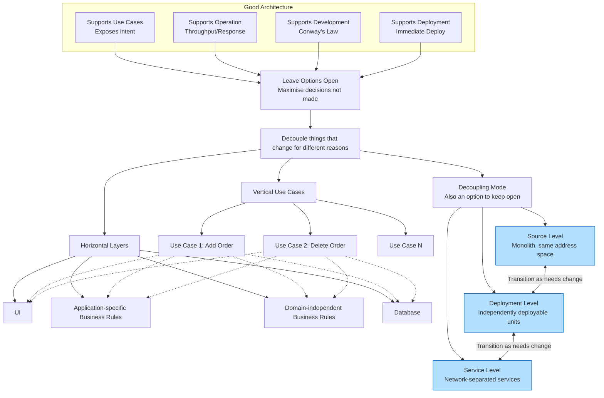

### 📘 Chapter Summary: “”

#### 1. The Four Things a Good Architecture Must Support
1. **[[Software Architecture/Screaming Architecture]]** – the intent of the system must be plainly visible in the structure.
2. **[[Operation]]** – throughput, response time, and processing needs must be supported.
3. **Development** – team structure and independent work must be facilitated (Conway’s law).
4. **Deployment** – the system should be **immediately deployable** after build.

All of these are balanced by **leaving as many options open as possible, for as long as possible**.

---
#### 2. [[Software Architecture/Screaming Architecture]]: Expose, Don’t Just Support
- Architecture can’t force correct behavior, but it can **clarify and expose** the system’s intent.
- A shopping cart app with good architecture **looks like a shopping cart app** – use cases are first‑class, top‑level entities with descriptive names.
- This is the “Screaming Architecture” idea: the structure screams the intent.

---
#### 3. [[Operation]]: Support, But Keep the Structure Option Open
- Architecture must handle operational constraints (100k customers/sec, millisecond cube queries).
- The **processing arrangement** (threads, processes, services) is an option a good architect **leaves open**.
- If components are properly isolated and **don’t assume the means of communication**, the system can easily move along the spectrum:
  ```
  monolithic → multiple threads → multiple processes → micro‑services
  ```
  …and **back again** if operational needs change.

---
#### 4. [[Development]]: Conway’s Law in Action
> *“Any organization that designs a system will produce a design whose structure is a copy of the organization’s communication structure.”*

- Partition the system into **well‑isolated, independently developable components** that can be assigned to different teams.
- Decoupling by layers and use cases lets teams work without interfering with each other, regardless of team organization (feature teams, component teams, etc.).

---
#### 5. Deployment: Aim for “Immediate Deployment”
- No manual tweaks, configuration scripts, or directory creation.
- Achieved through proper **partitioning and isolation**, including a master component that starts, integrates, and supervises everything.
- Well‑decoupled use cases and layers enable **hot‑swapping** and adding new use cases as simple as dropping in new jar files or services.

---
#### 6. Leaving Options Open – The Decoupling Strategy
Because use cases, operational constraints, team structures, and deployment needs are **indistinct and inconstant**, the architect must decouple elements that change for different reasons. This is done on two axes:

---
#### 7. [[Decoupling]] Layers (Horizontal)
- Separate **UI**, **application‑specific business rules**, **domain‑independent business rules**, **database**, etc.
- Each layer changes for different reasons and at different rates (SRP + CCP).
- The database is a detail; business rules should not know it.

---
#### 8. Decoupling Use Cases (Vertical)
- Use cases themselves change at different rates (e.g., *add order* vs. *delete order*).
- Slice the system vertically: each use case has its own UI, business rules, and database aspects, all kept separate from other use cases.
- Adding new use cases then doesn’t interfere with existing ones.

The result: a **grid of decoupled components** – horizontal layers intersected by vertical use‑case slices.

---
#### 9. Decoupling Mode – The Third Option
The **mode** of decoupling can be chosen independently of the logical separation:

| Mode | Characteristics |
|------|-----------------|
| **Source level** | Modules in same address space, function calls, single executable (monolith). |
| **Deployment level** | Independently deployable units (jar, DLL, Gem). Some may still share address space; others communicate via IPC. |
| **Service level** | Network communication; completely independent executables (services/micro‑services). |

**Key principle:**  
A good architecture **keeps the decoupling mode open** as an option.  
- Start with source‑level decoupling (monolith) even if you suspect services may be needed later.
- Decouple to the point where a service **could** be formed, but keep components in the same address space as long as possible.
- Transition gradually to deployment or service levels only when needed, and **allow sliding back** if operational demands drop.

This prevents premature, costly, and coarse‑grained micro‑service architectures, while preserving future flexibility.

---
#### 10. The Duplication Trap
- **True duplication**: every change to one must be made to all copies.
- **Accidental (false) duplication**: two pieces of code look similar now but will evolve differently.

**Beware:**
- Similar screens across different use cases – don’t unify them; they will diverge.
- Similar database records and view models – create a separate view model to keep layers decoupled.

Resist knee‑jerk elimination of duplication. Make sure the duplication is real before you couple things together.

---

### 🧠 Visual Summary in Mermaid



**Diagram explanation:**  
- The top box shows the four supports that architecture must provide.  
- They all drive the central strategy: **decouple things that change for different reasons**.  
- This decoupling happens horizontally (layers) and vertically (use cases) – creating a flexible grid.  
- Independently, the **decoupling mode** (how components communicate) is itself an option that can be changed over time, shifting between source, deployment, and service levels as needed.  
- All of this keeps options open and protects the system from premature, constraining decisions.