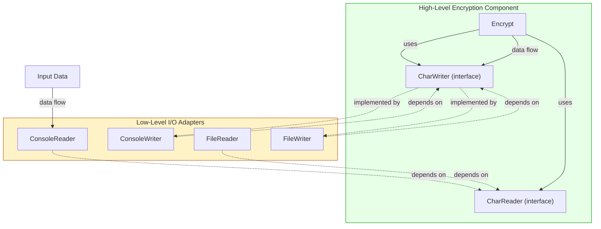

# Tutorial: Policy and Level – Building Hierarchies of Change

Software systems are, at their heart, **statements of policy**—detailed descriptions of how inputs become outputs. In any nontrivial system, this overall policy is composed of many smaller policies: business rules, validation rules, report formatting rules, and so on. The art of architecture is to **separate** these policies and **arrange** them so that the ones most immune to change sit at the top, and the ones most volatile sit at the bottom, with dependencies always pointing upward.

This tutorial will teach you the concept of **level**, how to recognize it, and how to structure your code so that high‑level policy never depends on low‑level detail. We’ll use a classic encryption example and implement everything in Python.

---

## 1. What Is “Level”?

> **Level** is the distance from the inputs and outputs.

The farther a policy is from the system’s I/O, the higher its level. Think of a computer program as a pipeline: data comes in (input), gets transformed (core logic), and goes out (output). The transformations that happen in the middle—the *central transform*—are the highest‑level policies. They are *the reason the system exists*. The code that reads from a keyboard or writes to a screen is a low‑level detail that serves the high‑level policy.

**High‑level policies** change less frequently and for more important reasons (e.g., a new encryption standard).  
**Low‑level policies** change more frequently and for less important reasons (e.g., switching from console I/O to a file).

In a well‑designed architecture, **source code dependencies point from low‑level to high‑level components**. This means a change in a low‑level device driver never forces a change in the core encryption algorithm.

---

## 2. The Encryption Example – Understanding the Problem

The chapter presents a simple encryption program:

1. Read a character from an input device.
2. Translate (encrypt) that character using a lookup table.
3. Write the encrypted character to an output device.

The core policy is the **translation algorithm**—it’s the farthest from I/O and thus the highest level. The I/O operations are the lowest level.

---

## 3. The Wrong Way: High‑Level Depends on Low‑Level

A naive implementation often looks like this (pseudo‑code from the chapter):

```python
def encrypt():
    while True:
        ch = read_char()        # low-level input
        encrypted = translate(ch)  # high-level policy
        write_char(encrypted)    # low-level output
```

Here, the `encrypt` function directly calls `read_char()` and `write_char()`. The high‑level encryption policy depends on the low‑level I/O details. If you ever want to reuse the encryption logic with a different input source (network, file, test stub), you must modify or duplicate the code. The architecture is **inflexible** and violates the Dependency Inversion Principle.

### Python Version of the Bad Design

```python
# bad_encrypt.py
import sys

# Low-level I/O functions (details)
def read_char() -> str:
    """Reads a single character from standard input."""
    return sys.stdin.read(1)

def write_char(ch: str) -> None:
    """Writes a single character to standard output."""
    sys.stdout.write(ch)

# High-level encryption policy (tied to low-level details)
def translate(ch: str) -> str:
    # Simple Caesar cipher shift by 1
    if 'a' <= ch <= 'z':
        return chr((ord(ch) - ord('a') + 1) % 26 + ord('a'))
    if 'A' <= ch <= 'Z':
        return chr((ord(ch) - ord('A') + 1) % 26 + ord('A'))
    return ch

def encrypt() -> None:
    """Incorrect architecture: high-level depends on low-level."""
    while True:
        ch = read_char()          # low-level detail
        encrypted = translate(ch) # high-level policy
        write_char(encrypted)     # low-level detail
```

If we later want to read from a file or a socket, we have to rewrite `encrypt`. The high‑level policy is **coupled** to the concrete I/O mechanism.

---

## 4. The Right Way: Dependencies Point Inward

To fix this, we draw a boundary around the high‑level encryption policy. We define abstract interfaces (`CharReader`, `CharWriter`) that the encryption algorithm uses. The low‑level I/O implementations depend on these interfaces.

Now the source code dependencies are **inverted** against the flow of control: the low‑level console reader and writer point **up** to the high‑level abstraction. The high‑level `Encrypt` class knows nothing about the console.

### Step 1: Define the High‑Level Abstractions

```python
# encryption/abc_io.py
from abc import ABC, abstractmethod

class CharReader(ABC):
    @abstractmethod
    def read_char(self) -> str:
        """Read a single character. Returns empty string on EOF."""
        pass

class CharWriter(ABC):
    @abstractmethod
    def write_char(self, ch: str) -> None:
        pass
```

These interfaces live in the high‑level component—they are part of the encryption policy’s world.

### Step 2: Write the High‑Level Encryption Policy

```python
# encryption/encrypt.py
from encryption.abc_io import CharReader, CharWriter

class Encrypt:
    """High-level encryption policy. Knows nothing about concrete I/O."""
    def __init__(self, reader: CharReader, writer: CharWriter):
        self.reader = reader
        self.writer = writer

    def translate(self, ch: str) -> str:
        """The core policy: Caesar cipher shift by 1."""
        if 'a' <= ch <= 'z':
            return chr((ord(ch) - ord('a') + 1) % 26 + ord('a'))
        if 'A' <= ch <= 'Z':
            return chr((ord(ch) - ord('A') + 1) % 26 + ord('A'))
        return ch

    def run(self) -> None:
        """Main loop: read, translate, write."""
        while True:
            ch = self.reader.read_char()
            if ch == '':  # end of input
                break
            encrypted = self.translate(ch)
            self.writer.write_char(encrypted)
```

The `Encrypt` class depends only on `CharReader` and `CharWriter`—abstractions. It does not import `sys` or any concrete I/O class.

### Step 3: Implement the Low‑Level I/O Plugins

```python
# adapters/console_io.py
import sys
from encryption.abc_io import CharReader, CharWriter

class ConsoleReader(CharReader):
    def read_char(self) -> str:
        return sys.stdin.read(1)

class ConsoleWriter(CharWriter):
    def write_char(self, ch: str) -> None:
        sys.stdout.write(ch)
```

These classes are in a separate package (`adapters`). They **depend on** the abstraction (`abc_io`), not the other way around.

### Step 4: Assemble the Application

```python
# main.py
from adapters.console_io import ConsoleReader, ConsoleWriter
from encryption.encrypt import Encrypt

reader = ConsoleReader()
writer = ConsoleWriter()
encryptor = Encrypt(reader, writer)
encryptor.run()
```

Now, if we want to read from a file instead of the console, we simply write a new adapter:

```python
# adapters/file_io.py
from encryption.abc_io import CharReader, CharWriter

class FileReader(CharReader):
    def __init__(self, filepath: str):
        self.file = open(filepath, 'r')
    def read_char(self) -> str:
        return self.file.read(1)
    def __del__(self):
        self.file.close()

class FileWriter(CharWriter):
    def __init__(self, filepath: str):
        self.file = open(filepath, 'w')
    def write_char(self, ch: str):
        self.file.write(ch)
    def __del__(self):
        self.file.close()
```

Then swap in `main.py`:

```python
reader = FileReader("input.txt")
writer = FileWriter("output.txt")
```

The `Encrypt` class never changed. The high‑level policy is completely **immune** to the low‑level I/O decision.

---

## 5. Visualizing the Dependencies

The following Mermaid diagram shows the data flow (solid arrows) and the source code dependencies (dashed arrows). Note how data flows from input to output, but the **compile‑time dependencies point inward** toward the high‑level `Encrypt` component.



The dashed lines are **source code dependencies**. They all point away from the low‑level details toward the high‑level abstractions. This is the essence of **level**: the arrows go from low to high.

---

## 6. Grouping Policies by Change: SRP and CCP

Policies that change for the **same reasons** and at the **same times** belong together in the same component. In our example:

- All I/O‑related classes (`ConsoleReader`, `FileReader`, `ConsoleWriter`, `FileWriter`) are likely to change when I/O requirements shift. They belong in the `adapters` package.
- The encryption algorithm is a distinct policy that changes for different reasons (e.g., a new cryptographic standard). It stays in the `encryption` package.

This is the **Single Responsibility Principle (SRP)** and the **Common Closure Principle (CCP)** at work: classes that change together are packaged together. The dependencies are then arranged so that the more stable, high‑level component (encryption) does not depend on the more volatile, low‑level component (I/O adapters).

---

## 7. The Directed Acyclic Graph (DAG)

When you build a larger system, you end up with many components, each containing policies at a certain level. These components form a **directed acyclic graph** where edges are compile‑time dependencies. Lower‑level components depend on higher‑level ones, never the reverse. This graph has no cycles—if you follow the arrows, you always go “upward” toward the core policies that are farthest from I/O.

Our encryption example is a tiny graph:

```
[adapters]  -->  [encryption]
   (low)           (high)
```

In a real system you might have:

```
[UI] --> [Application] --> [Domain] <-- [Infrastructure]
```

All arrows point toward `Domain`, the highest‑level policy.

---

## 8. Lower‑Level Components Are Plugins

The chapter emphasizes that lower‑level components should be **pluggable** into higher‑level components. Just like the `ConsoleReader` and `FileReader` both implement the same `CharReader` interface, we can swap them without touching the encryption logic. The higher‑level component defines the *interface*, and the lower‑level component provides the *implementation*. This is the **plugin architecture** we’ve been working toward.

---

## 9. How This Embodies SOLID Principles

At the chapter’s conclusion, Uncle Bob challenges us to identify which principles were used. Let’s review:

| Principle | How It Appears |
|-----------|----------------|
| **Single Responsibility Principle (SRP)** | The `Encrypt` class has one reason to change: the encryption algorithm. The `ConsoleReader` changes only if the console input method changes. They are separated. |
| **Open‑Closed Principle (OCP)** | The `Encrypt` class is open for extension (you can use it with any `CharReader`/`CharWriter`) but closed for modification (you don’t alter its code to support a new I/O device). |
| **Common Closure Principle (CCP)** | All I/O adapters that change for the same reason are grouped into the `adapters` package. The encryption logic is grouped into `encryption`. |
| **Dependency Inversion Principle (DIP)** | High‑level `Encrypt` does not depend on low‑level `ConsoleReader`. Both depend on abstractions (`CharReader`, `CharWriter`). Furthermore, the abstractions are *owned* by the high‑level component. |
| **Stable Dependencies Principle (SDP)** | The `encryption` component is stable (it should be hard to change because so many things depend on it). The `adapters` component is volatile. Dependencies point from volatile to stable. |
| **Stable Abstractions Principle (SAP)** | The stable component (`encryption`) is highly abstract (it contains interfaces `CharReader`, `CharWriter`). The volatile component (`adapters`) is concrete. This matches the desired relationship: abstractness increases with stability. |

All these principles work together to create a system where **the direction of source code dependencies aligns with the level of policy**.

---

## 10. Conclusion

Policy and level give you a powerful mental model for arranging code:

- **Level** measures distance from I/O; the further inside, the higher the level.
- **High‑level policy** (business rules, core algorithms) should never depend on **low‑level details** (consoles, databases, frameworks).
- **Invert dependencies** using interfaces owned by the high‑level component.
- **Group policies** that change together, and separate those that change for different reasons.
- The resulting dependency graph flows **upward** from volatile details to stable abstractions.

By applying these ideas, you create architectures where trivial but urgent changes to input/output mechanisms have zero impact on the precious business logic. That’s the mark of a truly *soft* system—one that stays easy to change, for all the right reasons.