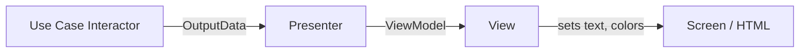

# Tutorial: Presenters and Humble Objects

Every architectural boundary in Clean Architecture is a place where we want to **isolate hard‑to‑test code** from **easy‑to‑test code**. The **Humble Object pattern** is the tool we use to achieve that separation. In this tutorial, we’ll explore how the pattern manifests in:

- **Presenters and Views** (the UI boundary)
- **Database Gateways** (the persistence boundary)
- **Data Mappers** (ORMs)
- **Service Listeners** (the network boundary)

All examples are in Python, but the same principles apply in any language.

---

## 1. The Humble Object Pattern

The idea is simple: split a module into two parts.

- **Humble Object** – contains the **hard‑to‑test** behaviour, stripped to its bare minimum. It does almost nothing except move data to/from a difficult external interface (GUI, database, network).
- **Testable Object** – contains all the **easy‑to‑test** behaviour that was removed from the humble part. This object has no knowledge of the difficult external world.

By separating the two, we can write fast, reliable unit tests for the testable part, and the humble part is so simple that we trust it by inspection.

---

## 2. Presenters and Views (The UI Boundary)

Graphical user interfaces are notoriously hard to test—you can’t easily write a test that checks what pixels appear on screen. The Humble Object pattern solves this with a **Presenter** and a **View**.

- **View** – the humble object. It receives a **ViewModel** (a simple data structure of strings, booleans, and enums) and blindly transfers that data to the screen. It contains no logic.
- **Presenter** – the testable object. It receives domain data (e.g., `Date`, `Currency` objects) from the use case and formats it into the ViewModel. All decisions about formatting, which buttons to enable, which colours to use, are made here.

The flow:

```
Controller → Use Case (output) → Presenter → ViewModel → View
```

The dependency rule is maintained: the Presenter depends on the use case output interface, the View depends on the ViewModel, but nothing inward knows about the View.

### Example: An Order Summary Page

**Use Case Output Data (from the Interactor)**

```python
from dataclasses import dataclass
from decimal import Decimal
from datetime import date

@dataclass
class OrderSummaryData:
    order_id: str
    total: Decimal
    customer_name: str
    order_date: date
    is_delayed: bool
```

**Presenter (testable)**

The presenter converts this domain data into a **ViewModel**—a plain data structure containing only display‑ready primitives.

```python
from dataclasses import dataclass

@dataclass
class OrderSummaryViewModel:
    title: str
    total_display: str
    customer_display: str
    date_display: str
    status_message: str
    status_color: str       # "green" or "red"
    show_warning: bool

class OrderSummaryPresenter:
    def present(self, data: OrderSummaryData) -> OrderSummaryViewModel:
        # Formatting logic – all testable
        total_str = f"${data.total:,.2f}"
        date_str = data.order_date.strftime("%B %d, %Y")

        if data.is_delayed:
            status_message = "⚠️ Delayed"
            status_color = "red"
            show_warning = True
        else:
            status_message = "On Time"
            status_color = "green"
            show_warning = False

        return OrderSummaryViewModel(
            title=f"Order #{data.order_id}",
            total_display=total_str,
            customer_display=data.customer_name,
            date_display=date_str,
            status_message=status_message,
            status_color=status_color,
            show_warning=show_warning,
        )
```

**View (humble)**

The view accepts the ViewModel and puts its contents onto the screen. It contains **zero logic** beyond simple assignment. In a web app, this might be a template; in a GUI, direct widget updates. Here’s a minimal console example:

```python
class ConsoleOrderView:
    def display(self, vm: OrderSummaryViewModel):
        # No decisions, just moving data to the output
        print(vm.title)
        print(f"Customer: {vm.customer_display}")
        print(f"Date: {vm.date_display}")
        print(f"Total: {vm.total_display}")
        print(f"Status: {vm.status_message}")
        if vm.show_warning:
            print("!!! ACTION REQUIRED !!!")
```

**Testing the Presenter (fast, no GUI needed)**

```python
def test_presenter_delayed_order():
    data = OrderSummaryData(
        order_id="123",
        total=Decimal("49.99"),
        customer_name="Alice",
        order_date=date(2025, 5, 20),
        is_delayed=True
    )
    presenter = OrderSummaryPresenter()
    vm = presenter.present(data)

    assert vm.status_color == "red"
    assert vm.show_warning is True
    assert "$49.99" in vm.total_display
```

The view can be tested in integration with a real UI, but all the formatting logic is already verified.

### Visualising the Presenter‑View Boundary



The `ViewModel` crosses the boundary from the presenter (in the Interface Adapters layer) to the view (in Frameworks & Drivers). The view is the humble object.

---

## 3. Database Gateways

Between the use case interactors and the actual database sits a **Database Gateway** interface. This interface is owned by the use case layer and contains methods for every create/read/update/delete operation the application needs.

- **Gateway Interface** – testable (the use case depends on it, and we can mock it).
- **Gateway Implementation** – the humble object. It contains the SQL (or ORM calls) and nothing else. It simply fetches data and maps it into the simple data structures that the use case expects.

### Example: User Gateway

**Use Case Port (in the use cases layer)**

```python
from abc import ABC, abstractmethod
from dataclasses import dataclass
from datetime import date

@dataclass
class UserLastLogin:
    last_name: str
    login_count: int

class UserGateway(ABC):
    @abstractmethod
    def get_last_names_of_users_who_logged_in_after(self, after_date: date) -> list[UserLastLogin]:
        pass
```

**Humble Implementation (in the adapters layer)**

This class contains SQL. It’s tested only by integration tests against a real database. It has no business logic.

```python
import sqlite3

class SqliteUserGateway(UserGateway):
    def __init__(self, connection: sqlite3.Connection):
        self.conn = connection

    def get_last_names_of_users_who_logged_in_after(self, after_date: date) -> list[UserLastLogin]:
        cursor = self.conn.cursor()
        cursor.execute(
            "SELECT last_name, login_count FROM users WHERE last_login > ?",
            (after_date.isoformat(),)
        )
        rows = cursor.fetchall()
        return [UserLastLogin(last_name=row[0], login_count=row[1]) for row in rows]
```

The use case only knows about the `UserGateway` interface. It never sees the `sqlite3` module or SQL strings. Testing the use case is trivial with a stub:

```python
class FakeUserGateway(UserGateway):
    def get_last_names_of_users_who_logged_in_after(self, after_date: date):
        return [UserLastLogin("Doe", 5)]
```

The gateway pattern creates another Humble Object boundary. The testable part (the use case) is isolated from the hard‑to‑test SQL.

---

## 4. Data Mappers (ORMs)

The chapter makes a critical observation: there’s no such thing as an Object Relational Mapper, because objects hide their data behind behaviour, while relational databases store exposed data. ORMs actually map between database tables and **data structures**, not true objects. They are better called **Data Mappers**.

Where do they belong? **In the database layer**, as another Humble Object. The ORM is used by the gateway implementation to load/save data. The gateway translates between the ORM’s data structures and the domain‑friendly structures used by the use cases.

For example, a SQLAlchemy model:

```python
# adapter layer only
from sqlalchemy import Column, String, Integer, Date
from sqlalchemy.ext.declarative import declarative_base

Base = declarative_base()

class UserRecord(Base):
    __tablename__ = 'users'
    id = Column(Integer, primary_key=True)
    last_name = Column(String)
    last_login = Column(Date)
    login_count = Column(Integer)
```

The gateway implementation uses `UserRecord` internally, but the interface returns the plain `UserLastLogin` dataclass. The ORM is kept in the outer circle, and the inner circles never see it.

---

## 5. Service Listeners (The Network Boundary)

When your application communicates with external services, the same Humble Object pattern appears:

- A **Service Listener** (or client) in the outer layer receives raw network data (JSON, protobuf, etc.) and converts it into a simple data structure.
- That data structure is passed across the boundary to the use cases.
- For outgoing requests, the use case creates a simple request structure; an outer‑layer adapter formats it and sends it over the network.

The use case neither knows nor cares that the data came from an HTTP call.

**Example:** A use case that needs the current weather.

```python
# use case ports
@dataclass
class WeatherInfo:
    temperature_celsius: float
    conditions: str

class WeatherService(ABC):
    @abstractmethod
    def get_current_weather(self, city: str) -> WeatherInfo:
        pass
```

The humble implementation calls an API and translates the JSON response:

```python
import requests

class OpenWeatherMapAdapter(WeatherService):
    def __init__(self, api_key: str):
        self.api_key = api_key

    def get_current_weather(self, city: str) -> WeatherInfo:
        response = requests.get(f"https://api.openweathermap.org/...&q={city}")
        data = response.json()
        return WeatherInfo(
            temperature_celsius=data['main']['temp'] - 273.15,
            conditions=data['weather'][0]['description']
        )
```

Again, all the ugly details (HTTP, JSON parsing, unit conversion) live in the adapter. The use case only deals with the simple `WeatherInfo` dataclass.

---

## 6. The Pattern Repeats Everywhere

Every time you cross an architectural boundary, the Humble Object pattern is nearby. The boundary divides something that is hard to test from something that is easy to test, using a simple data structure.

| Boundary | Testable Side | Humble Side |
|----------|---------------|-------------|
| UI | Presenter | View |
| Database | Use Case (via Gateway) | Gateway Implementation (SQL) |
| ORM | (Gateway uses it as tool) | ORM itself (data mapper) |
| External Services | Use Case (via Service Interface) | Service Listener/Client |

All these boundaries follow the same rule: the humble part is stripped to the bone, and the testable part can be verified with fast unit tests.

---

## 7. Conclusion

The Humble Object pattern is not just a testing trick—it’s a fundamental architectural principle. By creating these humble/testable splits at every boundary:

- **You can unit‑test your entire application logic** without a GUI, database, or network.
- **Your core business rules remain clean** and unaware of peripheral details.
- **Replacing an external component** (UI framework, database, service) requires changing only the humble objects, leaving the testable core untouched.

When you design your system with presenters, gateways, and service listeners, you’re building a truly testable and maintainable architecture. The humble objects do the dirty work; the testable objects carry the intelligence. That’s a winning combination.