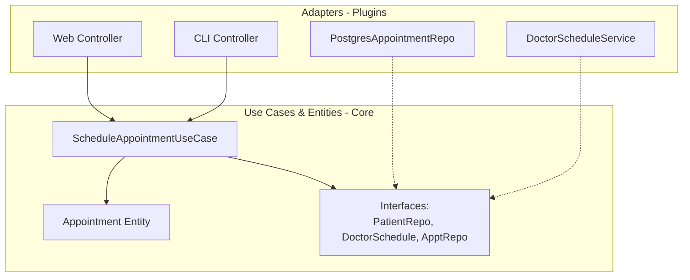

# Tutorial: Screaming Architecture

Imagine you’re looking at the blueprints of a building. If those plans show a front entrance, a foyer, a living room, a kitchen, and a dining room, you know instantly: **this is a home**. If they show a grand entrance, reading areas, and gallery after gallery of bookshelves, you know: **this is a library**. The architecture screams its purpose.

Now ask yourself: when you look at the top‑level directory of your software project, what does it scream? Does it scream “Health Care System” or “Inventory Management”? Or does it scream “Django”, “Spring”, or “ASP.NET”?

**Screaming Architecture** is the principle that your system’s structure should **scream the intent of the application**—its use cases—not the frameworks you happen to use. The web is a delivery mechanism, the database is a detail, and frameworks are just tools. A good architecture defers decisions about those tools and keeps the core use cases front and centre.

This tutorial will teach you how to design a **use‑case‑centric architecture** that screams its purpose, using Python. We’ll contrast a framework‑first structure with a screaming one, and build a tiny “Health Care System” that stays clean and testable.

---

## 1. The Problem: Framework‑First Architecture

Most projects start from the framework. In a typical Django or Flask project, you’ll see:

```
healthcare/
├── controllers/
│   ├── appointment_controller.py
│   └── patient_controller.py
├── models/
│   ├── appointment.py
│   └── patient.py
├── views/
│   ├── appointment_form.html
│   └── patient_detail.html
├── services/
│   └── appointment_service.py
└── settings.py
```

When you look at this structure, what does it scream? **It screams “Web MVC Framework.”** You can’t tell that this is a health care system; you have to dig into the files to find the use cases. The framework has taken over; the architecture is defined by technology, not by the problem domain.

This structure also makes it hard to:
- Change the delivery mechanism (e.g., add a CLI or a REST API)
- Defer decisions about the database or web server
- Test use cases independently of the framework

---

## 2. Screaming Architecture: Organize by Use Cases

The solution is to **put the use cases at the top level**. Your package names should be verbs or verb phrases that describe what the system does. Inside each use‑case package, you’ll have the domain entities, the use case logic, and the abstract interfaces that the outer layers will implement. The web and database are just **plugins**.

For a simple Health Care System, the use cases might be:

- **Schedule Appointment**
- **Cancel Appointment**
- **Register Patient**

A screaming architecture would organise the code like this:

```
healthcare/
├── schedule_appointment/
│   ├── entity/
│   │   └── appointment.py          # Appointment Entity
│   ├── use_case/
│   │   ├── schedule_appointment.py # Use Case class
│   │   └── interfaces.py           # Abstract ports
│   └── adapters/
│       ├── web_controller.py        # Web delivery adapter
│       └── appointment_repository.py# Database adapter
├── cancel_appointment/
│   └── ...
├── register_patient/
│   └── ...
└── shared/                          # Shared value objects, etc.
```

Now, when a new developer opens the repository, their first thought is: **“Oh, this is a health care system. I can see its main use cases right at the top.”** They haven’t seen a single mention of a web framework or database yet. Those are details that will be plugged in later.

---

## 3. Example: Scheduling an Appointment

Let’s implement the **Schedule Appointment** use case with a screaming architecture in Python.

### 3.1 The Entity – Pure Business Rule

An `Appointment` is a critical business entity. It knows nothing about the use case that creates it, and definitely nothing about databases or HTTP.

```python
# healthcare/schedule_appointment/entity/appointment.py
from datetime import datetime

class Appointment:
    def __init__(self, patient_id: str, doctor_id: str, time: datetime):
        if time < datetime.now():
            raise ValueError("Cannot schedule in the past")
        self.patient_id = patient_id
        self.doctor_id = doctor_id
        self.time = time
        self.cancelled = False

    def cancel(self):
        self.cancelled = True
```

This is a plain Python object. No ORM, no web imports, just business rules.

### 3.2 The Use Case – Application‑Specific Orchestration

The use case defines **what the system does**: scheduling an appointment means checking the patient exists, verifying the doctor’s availability, and then saving the appointment. It depends on abstractions (interfaces) that it owns.

First, we define the interfaces the use case needs:

```python
# healthcare/schedule_appointment/use_case/interfaces.py
from abc import ABC, abstractmethod
from healthcare.schedule_appointment.entity.appointment import Appointment

class PatientRepository(ABC):
    @abstractmethod
    def exists(self, patient_id: str) -> bool:
        pass

class DoctorSchedule(ABC):
    @abstractmethod
    def is_available(self, doctor_id: str, time) -> bool:
        pass

class AppointmentRepository(ABC):
    @abstractmethod
    def save(self, appointment: Appointment) -> None:
        pass
```

Now the use case object:

```python
# healthcare/schedule_appointment/use_case/schedule_appointment.py
from datetime import datetime
from healthcare.schedule_appointment.entity.appointment import Appointment
from healthcare.schedule_appointment.use_case.interfaces import (
    PatientRepository,
    DoctorSchedule,
    AppointmentRepository,
)

class ScheduleAppointmentUseCase:
    def __init__(self, patient_repo: PatientRepository,
                 doctor_schedule: DoctorSchedule,
                 appointment_repo: AppointmentRepository):
        self.patient_repo = patient_repo
        self.doctor_schedule = doctor_schedule
        self.appointment_repo = appointment_repo

    def execute(self, patient_id: str, doctor_id: str, time: datetime) -> Appointment:
        # Application‑specific validations
        if not self.patient_repo.exists(patient_id):
            raise ValueError("Patient not found")
        if not self.doctor_schedule.is_available(doctor_id, time):
            raise ValueError("Doctor not available at that time")

        appointment = Appointment(patient_id, doctor_id, time)
        self.appointment_repo.save(appointment)
        return appointment
```

Notice that the use case knows nothing about the web, the database, or any framework. It can be tested completely in isolation.

### 3.3 The Delivery Mechanism – Web Adapter (Plugin)

The web is a **detail**. It is just one possible delivery mechanism for the use case. We can create a lightweight Flask‑based controller that calls the use case.

```python
# healthcare/schedule_appointment/adapters/web_controller.py
from flask import Flask, request, jsonify
from healthcare.schedule_appointment.use_case.schedule_appointment import ScheduleAppointmentUseCase
# ... inject real repositories ...

app = Flask(__name__)

@app.route('/appointments', methods=['POST'])
def schedule_appointment_controller():
    data = request.json
    try:
        # Use case is injected via a dependency injection container
        appointment = schedule_use_case.execute(
            patient_id=data['patient_id'],
            doctor_id=data['doctor_id'],
            time=datetime.fromisoformat(data['time'])
        )
        return jsonify({"msg": "Appointment scheduled", "time": appointment.time.isoformat()}), 201
    except ValueError as e:
        return jsonify({"error": str(e)}), 400
```

The web controller is an **adapter**. It depends on the use case, not the other way around. We could just as easily build a CLI adapter:

```python
# healthcare/schedule_appointment/adapters/cli_controller.py
import sys
from datetime import datetime
from use_case.schedule_appointment import ScheduleAppointmentUseCase

def main():
    if len(sys.argv) != 4:
        print("Usage: schedule <patient_id> <doctor_id> <time>")
        return
    patient_id, doctor_id, time_str = sys.argv[1], sys.argv[2], sys.argv[3]
    try:
        schedule_use_case.execute(patient_id, doctor_id, datetime.fromisoformat(time_str))
        print("Appointment scheduled successfully.")
    except ValueError as e:
        print(f"Error: {e}")
```

The core use case remained untouched. The architecture screamed “health care system” from the start, and the delivery mechanism was a decision deferred.

---

## 4. Testability Without Frameworks

Because the use cases depend only on abstractions, we can test them with fake implementations—no web server, no database.

```python
# test_schedule_appointment.py
from datetime import datetime, timedelta
from healthcare.schedule_appointment.use_case.schedule_appointment import ScheduleAppointmentUseCase

class FakePatientRepo:
    def exists(self, patient_id): return True

class FakeDoctorSchedule:
    def is_available(self, doctor_id, time): return True

class FakeAppointmentRepo:
    def __init__(self): self.saved = None
    def save(self, appointment): self.saved = appointment

def test_schedule_appointment_use_case():
    repo = FakeAppointmentRepo()
    uc = ScheduleAppointmentUseCase(FakePatientRepo(), FakeDoctorSchedule(), repo)
    tomorrow = datetime.now() + timedelta(days=1)
    result = uc.execute("P1", "D2", tomorrow)
    assert result.patient_id == "P1"
    assert repo.saved == result
```

The test runs in milliseconds, needs no setup, and verifies the actual application rules. This is the power of keeping frameworks at arm’s length.

---

## 5. Visualising the Dependency Rule

The dependency diagram below shows how the screaming architecture is organised. Every arrow points inward, toward the use cases and entities. The web and database are plugins.



The outer circle depends on the inner circle; the inner circle knows nothing about the outer one. This is the plugin architecture that allows you to **defer decisions** about frameworks, databases, and delivery mechanisms.

---

## 6. Frameworks Are Tools, Not a Way of Life

The chapter warns that framework authors (and their tutorials) often present the framework as the universe. They assume you’ll let it pervade your entire application. Don’t.

- Use frameworks in the **adapter layer** only.
- Keep your core business logic (entities, use cases) free of framework imports.
- Treat the framework as a tool you can swap. If you decided tomorrow to move from Flask to FastAPI, only the adapters would change; the core remains untouched.

---

## 7. Conclusion

Screaming Architecture is a mindset, not a fixed recipe. The goal is to make your system’s intent **instantly visible**:

- **Top‑level packages** should be use cases (verbs), not technology layers.
- **Entities** and **use cases** should be framework‑agnostic, relying only on abstract interfaces they own.
- **The web, database, and frameworks** are peripheral details, plugged into the use cases.

When you do this, your architecture **screams** the real problem you’re solving. New team members see the use cases first, understand the system, and can change the delivery mechanism without ever touching the precious business rules. That is the hallmark of a maintainable, soft, and truly clean architecture.