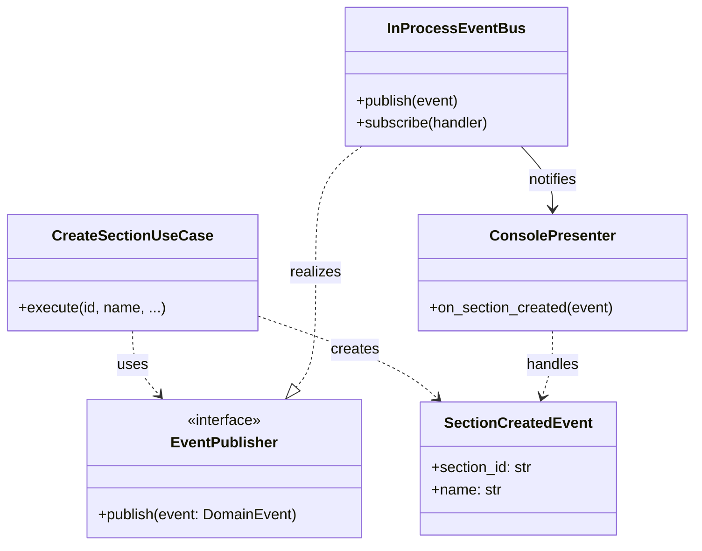

Trong Clean Architecture, **Message Bus** (hoặc Event Bus) dùng để use case thông báo sự kiện cho Presenter hoặc các thành phần UI khác là một **chi tiết hạ tầng**. Nó thuộc về **tầng Interface Adapters** hoặc **Frameworks & Drivers**, không được phép nằm trong tầng Use Cases hay Domain.

Tuy nhiên, use case chỉ nên phụ thuộc vào một **abstraction (Port)** do chính nó định nghĩa, ví dụ `EventPublisher`. Adapter sẽ triển khai abstraction đó bằng một công nghệ cụ thể (in‑process queue, RabbitMQ, Redis pub/sub…). Presenter cũng có thể đăng ký lắng nghe thông qua cùng abstraction đó, nhưng việc kết nối vật lý do Adapter và Composition Root đảm nhận.

---

## 1. Vị trí các thành phần

| Thành phần | Lớp (Layer) | Vai trò |
|------------|-------------|--------|
| `EventPublisher` (interface) | **Use Cases** (hoặc Domain) | Cổng ra trừu tượng để use case phát sự kiện mà không biết ai nhận. |
| `EventBus` (triển khai cụ thể) | **Interface Adapters** | Triển khai cơ chế gửi/nhận thực tế (dùng `queue.Queue`, `asyncio`, thư viện message queue…). |
| `Presenter` (implement Output Port) | **Interface Adapters** | Nhận sự kiện và cập nhật UI; có thể được gọi trực tiếp qua Output Port hoặc đăng ký vào EventBus. |

---

## 2. Sơ đồ lớp (Class Diagram) – Event Bus trong Clean Architecture



- `EventPublisher` nằm trong `use_cases/ports.py` – nơi use case định nghĩa nhu cầu của mình.
- `InProcessEventBus` nằm trong `adapters/` – triển khai cụ thể, phụ thuộc vào Port.
- `ConsolePresenter` cũng nằm trong `adapters/` và được `InProcessEventBus` gọi khi có sự kiện.

---

## 3. Ví dụ mã nguồn Python

### Port (Use Cases sở hữu)
```python
# use_cases/ports.py
from abc import ABC, abstractmethod

class EventPublisher(ABC):
    @abstractmethod
    def publish(self, event: 'DomainEvent') -> None:
        pass

class DomainEvent:
    """Lớp cơ sở cho các sự kiện miền."""
    pass

class SectionCreatedEvent(DomainEvent):
    def __init__(self, section_id: str, name: str):
        self.section_id = section_id
        self.name = name
```

### Use Case – phát sự kiện qua Port
```python
# use_cases/create_section.py
from use_cases.ports import EventPublisher, SectionCreatedEvent
from use_cases.ports import SectionRepository
from entities.section import Section

class CreateSectionUseCase:
    def __init__(self, repo: SectionRepository, event_pub: EventPublisher):
        self.repo = repo
        self.event_pub = event_pub

    def execute(self, section_id: str, name: str) -> Section:
        section = Section(section_id, name)
        self.repo.save(section)
        # Phát sự kiện qua Port mà không biết ai lắng nghe
        self.event_pub.publish(SectionCreatedEvent(section_id, name))
        return section
```

### Adapter – Event Bus triển khai (dùng queue đơn giản)
```python
# adapters/in_process_event_bus.py
from collections import defaultdict
from use_cases.ports import EventPublisher, DomainEvent

class InProcessEventBus(EventPublisher):
    def __init__(self):
        self._handlers = defaultdict(list)

    def subscribe(self, event_type: type, handler):
        self._handlers[event_type].append(handler)

    def publish(self, event: DomainEvent):
        for handler in self._handlers.get(type(event), []):
            handler(event)
```

### Adapter – Presenter đăng ký lắng nghe sự kiện
```python
# adapters/console_presenter.py
from use_cases.ports import SectionCreatedEvent

class ConsolePresenter:
    def on_section_created(self, event: SectionCreatedEvent):
        print(f"[UI] New section created: {event.name} ({event.section_id})")
```

### Composition Root – nối dây
```python
# main.py
from adapters.in_process_event_bus import InProcessEventBus
from adapters.console_presenter import ConsolePresenter
from use_cases.ports import SectionCreatedEvent
from use_cases.create_section import CreateSectionUseCase
# ... khởi tạo repository, config loader

event_bus = InProcessEventBus()
presenter = ConsolePresenter()
# Đăng ký presenter lắng nghe sự kiện
event_bus.subscribe(SectionCreatedEvent, presenter.on_section_created)

create_uc = CreateSectionUseCase(repo, event_bus)
create_uc.execute("sec-1", "Automation")
```

---

## 4. Tại sao Message Bus là chi tiết hạ tầng?

- Bản thân cơ chế truyền thông điệp (queue, socket, thư viện pub/sub) là **công nghệ** thuộc vòng ngoài.
- Nếu đặt trực tiếp `import rabbitmq` hoặc `import asyncio.Queue` vào Use Case, bạn sẽ vi phạm Dependency Rule.
- Giải pháp: Use Case chỉ dùng **Port `EventPublisher`**; mọi thứ liên quan đến vận chuyển sự kiện được đóng gói trong Adapter.

Do đó, **Message Bus** (cụ thể) thuộc về **Interface Adapters** hoặc **Frameworks & Drivers**, trong khi **interface `EventPublisher`** thuộc về **Use Cases**.

---

## 5. Các hiểu lầm thường gặp

1. **“Message Bus là một phần của Use Cases”** – Sai, vì Use Cases không nên biết về kỹ thuật truyền thông điệp. Chỉ có interface trừu tượng mới ở đó.
2. **“Event phải được lưu vào database để đảm bảo SSOT”** – Sai, database là bản sao; sự kiện là kết quả của thay đổi trong Domain (SSOT), có thể được lưu tạm trong bus, không cần lưu vĩnh viễn trừ khi cần audit.
3. **“Cần một module EventBus toàn cục cho cả hệ thống”** – Có thể, nhưng mỗi Bounded Context nên có EventBus riêng nếu dùng in-process; với hệ thống phân tán, message broker là hạ tầng dùng chung nhưng vẫn là chi tiết.

Vậy, module message bus (cụ thể) nằm ở **`adapters/in_process_event_bus.py`** (nếu tự viết) hoặc được wrap lại trong một adapter để triển khai `EventPublisher`. Use case không hề biết đến sự tồn tại của nó.


=============


