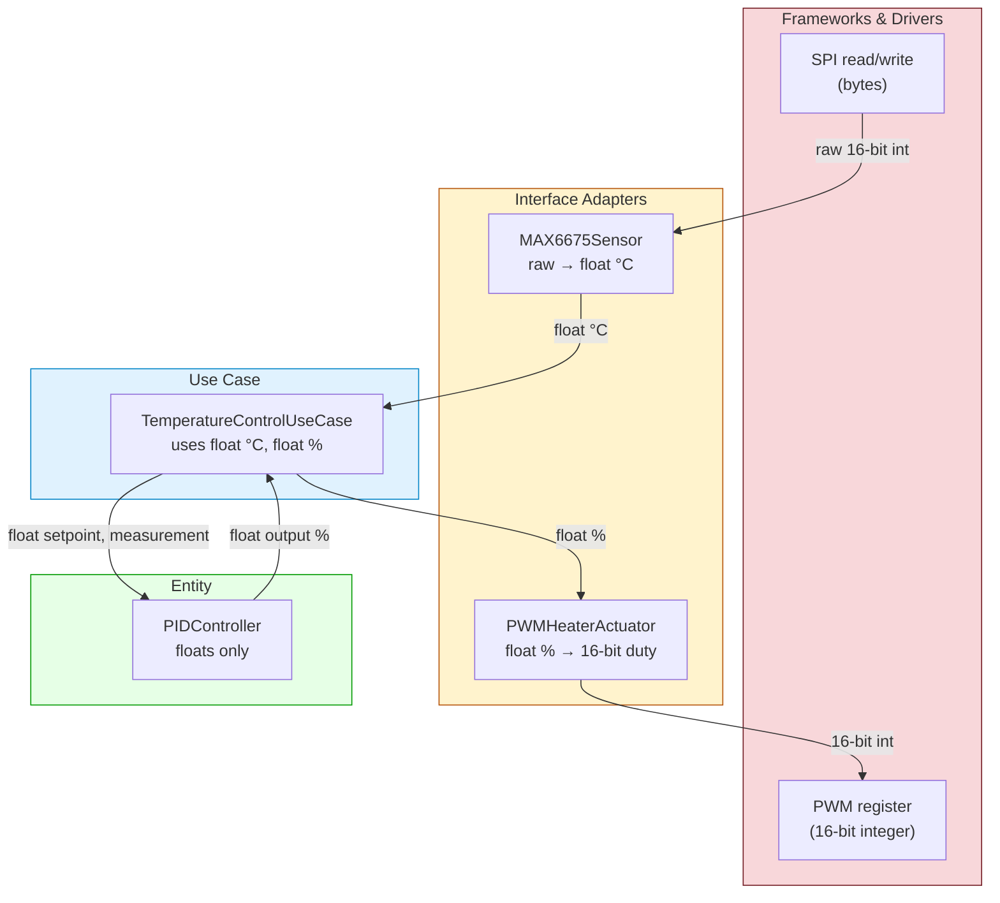

# Deep Dive: Data Crossing Boundaries in an Embedded PID Controller

The Clean Architecture’s **Dependency Rule** states that source code dependencies point inward, toward higher‑level policies. But what about the data that flows across those boundaries at runtime? The chapter gives a clear rule:

> **Data that crosses boundaries should be simple, isolated data structures—plain objects or dataclasses. We do not pass framework objects, ORM entity rows, or database query results directly. Data is always in the format most convenient for the inner circle.**

This tutorial elaborates that principle with a concrete embedded example: a **PID temperature controller** that reads a thermocouple sensor and drives a PWM heater. We will trace the data through every layer, showing exactly what format it takes at each boundary and why we never let low‑level, hardware‑specific values leak into the core.

---

## 1. The System in a Nutshell

We want to maintain a set temperature. The hardware consists of:

- A **MAX6675 thermocouple‑to‑digital converter** connected via SPI. It returns a 12‑bit reading representing temperature in 0.25°C increments.
- A **heater** driven by a **PWM output** with 16‑bit resolution (0 = off, 65535 = full power).
- A **PID controller** that runs the control algorithm.

The Clean Architecture layers for this system are:

| Layer | Responsibility | Example |
|-------|----------------|---------|
| **Entities** | Pure control algorithm | `PIDController` (knows only temperature and duty‑cycle as floats) |
| **Use Cases** | Application‑specific orchestration | `TemperatureControlUseCase` (reads temp, calls PID, commands heater) |
| **Interface Adapters** | Convert between domain types and hardware details | `MAX6675Sensor`, `PWMHeaterActuator` |
| **Frameworks & Drivers** | Actual register I/O, SPI library, RTOS calls | `machine.SPI`, `machine.PWM` |

---

## 2. Data Formats at Each Layer

Let’s examine what “temperature” looks like as it crosses each boundary, from hardware to core and back.

```
Hardware                Adapter                Use Case / Entity
────────                ───────                ─────────────────
SPI register → 12-bit   → Temperature (float)  → temperature: float
                integer       in °C                 (Celsius)
                
PWM register ← 16-bit   ← DutyCycle (float)   ← duty_cycle: float
                integer       in % (0‑100)         (percent)
```

**Key Insight:** The inner circles work with domain‑meaningful types (`float` representing Celsius and percent). The outer adapters translate the raw hardware values. The inner circles never see an SPI register, an ADC count, or a PWM timer value.

---

## 3. The Domain Core: Entities and Use Cases

The **Entity** is the PID algorithm. It only knows about `float` values for setpoint, measurement, and output. It is completely hardware‑agnostic.

```python
# entity/pid_controller.py
class PIDController:
    def __init__(self, kp: float, ki: float, kd: float,
                 out_min: float = 0.0, out_max: float = 100.0):
        self.kp = kp
        self.ki = ki
        self.kd = kd
        self.out_min = out_min
        self.out_max = out_max
        self._integral = 0.0
        self._prev_error = 0.0

    def update(self, setpoint: float, measurement: float, dt: float) -> float:
        """
        :param setpoint: Desired temperature in °C (float)
        :param measurement: Current temperature in °C (float)
        :param dt: Time step in seconds
        :return: Control output in percent (float, 0‑100)
        """
        error = setpoint - measurement
        p = self.kp * error
        self._integral += error * dt
        i = self.ki * self._integral
        d = self.kd * (measurement - self._prev_error) / dt if dt > 0 else 0.0
        self._prev_error = measurement
        output = p + i + d
        if output > self.out_max:
            output = self.out_max
            self._integral -= error * dt
        elif output < self.out_min:
            output = self.out_min
            self._integral -= error * dt
        return output
```

The **Use Case** orchestrates the control loop. It depends on two abstractions (ports) for sensor and actuator. These interfaces are defined in the use‑case layer and only use simple data types.

```python
# use_case/ports.py
from abc import ABC, abstractmethod

class TemperatureSensor(ABC):
    @abstractmethod
    def read_celsius(self) -> float:
        """Returns current temperature in °C."""
        pass

class HeaterActuator(ABC):
    @abstractmethod
    def set_power(self, power_percent: float) -> None:
        """
        Sets heater output power.
        :param power_percent: 0.0 (off) to 100.0 (full power)
        """
        pass
```

The use case itself uses these ports. It never sees anything but `float` Celsius and `float` percent.

```python
# use_case/temperature_control.py
from entity.pid_controller import PIDController
from use_case.ports import TemperatureSensor, HeaterActuator

class TemperatureControlUseCase:
    def __init__(self, pid: PIDController,
                 sensor: TemperatureSensor,
                 heater: HeaterActuator):
        self.pid = pid
        self.sensor = sensor
        self.heater = heater

    def run_cycle(self, setpoint_celsius: float, dt: float):
        current_temp = self.sensor.read_celsius()      # float °C
        power = self.pid.update(setpoint_celsius, current_temp, dt)  # float %
        self.heater.set_power(power)                   # float %
```

**No raw integer values anywhere in the inner circles.** This is the essence of the rule.

---

## 4. The Interface Adapters: Translating Hardware to Domain Types

The adapters implement the ports and handle the conversion between raw I/O and the domain‑friendly types. This is where the hardware‑specific knowledge lives.

### 4.1 Sensor Adapter: MAX6675

The MAX6675 returns a 16‑bit value over SPI. The lower 12 bits are the temperature reading in units of 0.25°C. The adapter reads those bits and returns a `float` Celsius.

```python
# adapters/max6675_sensor.py
from use_case.ports import TemperatureSensor

class MAX6675Sensor(TemperatureSensor):
    def __init__(self, spi_bus, cs_pin):
        self.spi = spi_bus
        self.cs = cs_pin

    def _read_raw(self) -> int:
        # Bit‑banging or hardware SPI to read 16 bits
        # Returns raw 16‑bit register value
        self.cs.value(0)
        data = self.spi.read(2)   # returns bytes
        self.cs.value(1)
        raw = (data[0] << 8) | data[1]
        return raw

    def read_celsius(self) -> float:
        raw = self._read_raw()
        # Extract 12 bits and convert
        temp_12bit = (raw >> 3) & 0xFFF
        celsius = temp_12bit * 0.25
        return celsius
```

**Boundary crossing:** The call `read_celsius()` returns a plain `float`. The inner use case has no knowledge of SPI, bit shifting, or the 0.25 multiplier. If we later replace the sensor with an RTD + ADC, only this adapter changes.

### 4.2 Actuator Adapter: PWM Heater

The heater is driven by a PWM pin. The domain expects a percentage (0‑100), but the hardware PWM unit uses a 16‑bit duty register (0‑65535). The adapter performs the mapping.

```python
# adapters/pwm_heater.py
from use_case.ports import HeaterActuator

class PWMHeaterActuator(HeaterActuator):
    def __init__(self, pwm_pin):
        self.pwm = pwm_pin
        self.pwm.freq(100)  # e.g., 100 Hz
        self.pwm.duty_u16(0)

    def set_power(self, power_percent: float) -> None:
        # Clamp to valid range
        power_percent = max(0.0, min(100.0, power_percent))
        # Convert domain value to hardware register value
        duty = int(power_percent * 65535 / 100.0)
        self.pwm.duty_u16(duty)
```

Again, the adapter’s public method takes a `float` from the inner circle. The conversion to a hardware register value is entirely encapsulated.

---

## 5. Visualizing the Data Transformations

The following diagram shows the data crossing each boundary, with the raw hardware types on the outside and the simple domain types on the inside.



**At every boundary** (the dashed horizontal lines), the data format changes. The rule is: the inner circle dictates the format, and the outer adapter does the work to provide it.

---

## 6. Common Anti‑Patterns to Avoid

1. **Passing raw ADC values into the use case**  
   `current_temp = sensor.read_raw()` (returns an integer) and then having the PID entity do the conversion. This leaks hardware detail inward; changing sensor resolution or type would force the PID to change.

2. **Using hardware‑specific types in core interfaces**  
   A port like `class Sensor { int read_adc(); }` ties the abstraction to a particular measurement technology. The inner circle should not even know that an ADC exists.

3. **Passing ORM/DB‑row objects (in non‑embedded context)**  
   If we later add data logging, we would not pass a SQLAlchemy `TemperatureLog` object into the use case. Instead, the adapter would convert the row to a simple domain object.

4. **Letting the use case calculate PWM duty from percent**  
   `duty_cycle = int(percent * 65535 / 100)` inside the use case would couple it to a specific PWM resolution. If we move to a 10‑bit PWM, the use case must change.

---

## 7. Benefits of This Approach

- **Testability:** The `PIDController` can be tested with any `float` values. The `TemperatureControlUseCase` can be tested with a fake sensor that returns a hard‑coded `float`—no SPI emulation needed.  
- **Swappable hardware:** You can replace the MAX6675 with a thermistor and an ADC by writing a new adapter that still returns `float` Celsius. The core never knows.  
- **Platform independence:** The entire PID logic and use case can be compiled and tested on a development PC, because they don’t reference any embedded I/O. Only the adapters need a microcontroller.  
- **Clear contracts:** The port interfaces explicitly state the data type (`float °C`, `float %`). No ambiguity about units or scaling factors.

---

## 8. Conclusion

Data crossing Clean Architecture boundaries must always be in the format that is most convenient for the **inner circle**. In an embedded PID controller, that means:

- **Inner circles** work with simple, meaningful types: `float` for Celsius, `float` for percent.
- **Outer adapters** own the ugly, hardware‑specific transformations: bit shifting, scaling by 0.25, converting percent to PWM register counts.
- **No raw hardware values** ever appear in entities or use cases.

This discipline keeps your core control logic pristine, portable, and testable. It’s the same principle whether you’re passing a DTO from a web controller to a use case, or a temperature reading from a thermocouple to a PID algorithm—the dependency rule applies to data too.