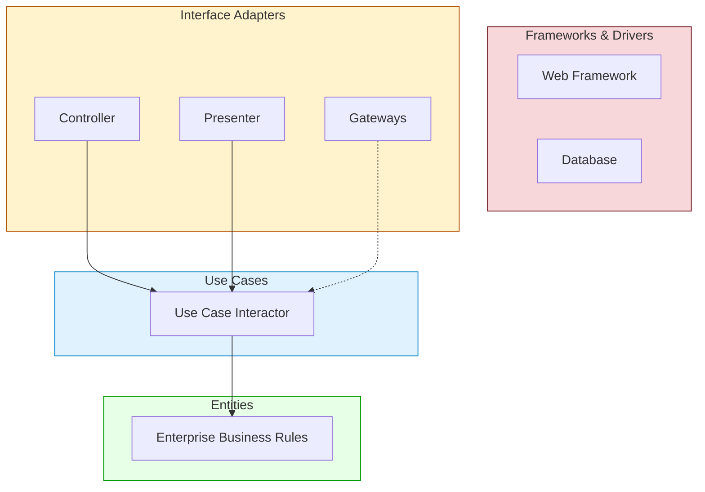
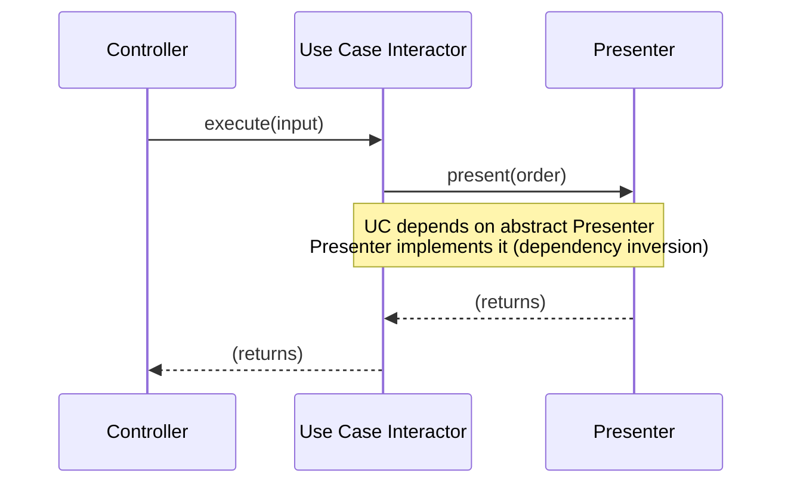
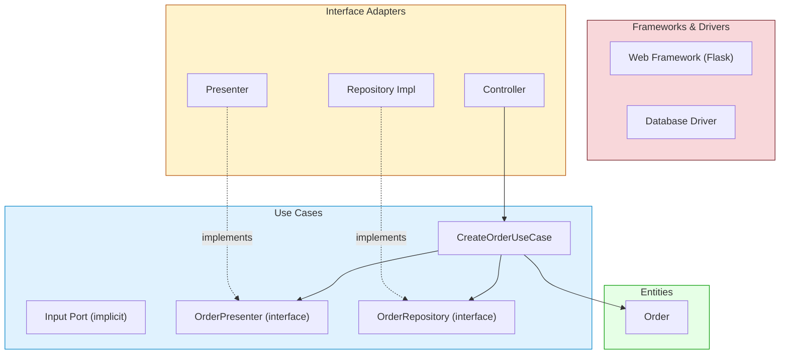

# Tutorial: The Clean Architecture

Over the decades, several architectural styles have emerged—[[Hexagonal Architecture]] (Ports and Adapters), [[DCI]], and [[BCE]] (Boundary‑Control‑Entity). They share a common goal: **separation of concerns** through layering, with business rules at the core and external details at the periphery. The Clean Architecture, proposed by Robert C. Martin, integrates these ideas into a single, actionable diagram of concentric circles bound by one overriding rule.

This tutorial will walk you through the Clean Architecture, its layers, the Dependency Rule, and how to implement it in Python with a concrete web application example.

---

## 1. The Circles and the Dependency Rule

The Clean Architecture is often drawn as a set of concentric circles:

```
Frameworks & Drivers  (outermost)
 └─ Interface Adapters
     └─ Use Cases (Application)
         └─ Entities (Enterprise Business Rules)
```

![[Pasted image 20260519212142.png]]
The **Dependency Rule** is absolute:

> **Source code dependencies must point only inward, toward higher‑level policies.**

Nothing in an inner circle can know anything about something in an outer circle. No name of a class, function, or variable from an outer circle may appear in inner circle code. Data formats declared in an outer circle must not be used by inner circles.

Inward → higher level, more abstract, more stable.  
Outward → lower level, more concrete, more volatile.



Arrows represent compile‑time dependencies, all pointing inward. The inner circles never see the outer ones.

---

## 2. The Four Layers

### 2.1 Entities (Enterprise‑Wide Critical Business Rules)

Entities encapsulate the most general and high‑level rules. They are the business objects that could be used by many different applications in the enterprise. Changes to external details (UI, database) should never affect them.

Example: An `Order` entity with rules for adding items and calculating totals, completely independent of any framework.

```python
# entities/order.py
from decimal import Decimal

class OrderItem:
    def __init__(self, product_id: str, price: Decimal, quantity: int):
        self.product_id = product_id
        self.price = price
        self.quantity = quantity

class Order:
    def __init__(self, order_id: str):
        self.order_id = order_id
        self.items: list[OrderItem] = []

    def add_item(self, item: OrderItem):
        if item.quantity <= 0:
            raise ValueError("Quantity must be positive")
        self.items.append(item)

    def total(self) -> Decimal:
        return sum(item.price * item.quantity for item in self.items)
```

No imports from web, database, or any framework. Pure business logic.

### 2.2 Use Cases (Application‑Specific Business Rules)

The Use Cases layer orchestrates the flow of data to and from entities, implementing the application’s specific use cases. It depends on entities and on abstract interfaces (ports) it defines for things it needs but does not implement—like data access or output presentation.

Example: `CreateOrderUseCase` that validates input, creates an `Order`, saves it, and produces a result.

We first define the interfaces (ports) that the use case requires. These are **owned by the use case layer**.

```python
# use_cases/ports.py
from abc import ABC, abstractmethod
from entities.order import Order

class OrderRepository(ABC):
    @abstractmethod
    def save(self, order: Order) -> None:
        pass

class OrderPresenter(ABC):
    @abstractmethod
    def present(self, order: Order) -> None:
        pass
```

Now the use case:

```python
# use_cases/create_order.py
from dataclasses import dataclass
from decimal import Decimal
from entities.order import Order, OrderItem
from use_cases.ports import OrderRepository, OrderPresenter

@dataclass
class CreateOrderRequest:
    order_id: str
    items: list[tuple[str, Decimal, int]]  # product_id, price, quantity

class CreateOrderUseCase:
    def __init__(self, repository: OrderRepository, presenter: OrderPresenter):
        self.repo = repository
        self.presenter = presenter

    def execute(self, request: CreateOrderRequest):
        order = Order(request.order_id)
        for prod_id, price, qty in request.items:
            item = OrderItem(prod_id, price, qty)
            order.add_item(item)
        self.repo.save(order)
        self.presenter.present(order)
```

The use case knows nothing about how the order is stored or displayed. It depends only on the ports it defined.

### 2.3 Interface Adapters

This layer translates data between the format most convenient for the inner circles and the format required by external agencies like databases, web frameworks, or external services. It contains:

- **Controllers** that convert HTTP requests into use‑case input.
- **Presenters** that format use‑case output into view‑models for the UI.
- **Gateways** that implement repository interfaces using a specific database.

All framework‑specific code lives here. For example, a REST controller with Flask:

```python
# adapters/web_controller.py
from flask import Flask, request, jsonify
from use_cases.create_order import CreateOrderUseCase, CreateOrderRequest
from use_cases.ports import OrderPresenter
from entities.order import Order

class JsonOrderPresenter(OrderPresenter):
    """Adapter: presents the order as a JSON-serializable dict."""
    def __init__(self):
        self.result = None

    def present(self, order: Order):
        self.result = {
            "order_id": order.order_id,
            "total": str(order.total())
        }

# In a real app, dependencies would be injected via a container.
def create_app(order_repo):
    app = Flask(__name__)

    @app.route('/orders', methods=['POST'])
    def create_order_endpoint():
        data = request.json
        items = [(it['product_id'], Decimal(it['price']), it['quantity'])
                 for it in data['items']]
        req = CreateOrderRequest(order_id=data['order_id'], items=items)

        presenter = JsonOrderPresenter()
        uc = CreateOrderUseCase(order_repo, presenter)
        uc.execute(req)

        return jsonify(presenter.result), 201

    return app
```

The web framework (`Flask`) is kept entirely in this adapter. The use case never sees `request` or `jsonify`.

Similarly, a database gateway implements `OrderRepository`:

```python
# adapters/db_gateway.py
from use_cases.ports import OrderRepository
from entities.order import Order

class InMemoryOrderRepository(OrderRepository):
    def __init__(self):
        self.storage = {}

    def save(self, order: Order):
        self.storage[order.order_id] = order
```

### 2.4 Frameworks and Drivers

The outermost layer contains the actual frameworks and drivers: Flask, Django, SQLAlchemy, etc. We usually write only glue code here. In our example, the Flask application instance and the database engine wiring live here.

---

## 3. Crossing Boundaries with Dependency Inversion

When the flow of control goes from an inner circle to an outer one (e.g., a use case calls a presenter), we must invert the dependency to obey the Dependency Rule. The use case defines an **output port** interface (e.g., `OrderPresenter`) and calls it. The adapter in the outer circle implements that interface.



All dependencies point inward: Controller → Use Case (input port), Presenter → Use Case (output port interface).

---

## 4. What Data [[Crosses the Boundaries]]?

Data that crosses boundaries should be **simple, isolated data structures**—plain objects or data classes. We do **not** pass:

- Framework objects (e.g., HTTP request/response objects)
- ORM entity rows
- Database query results directly

Instead, we map them to simple DTOs (Data Transfer Objects) at the boundary. For example, the controller converts the JSON body into a `CreateOrderRequest` dataclass before calling the use case. The presenter converts the `Order` entity into a plain dict for the view.

**Rule of thumb:** Data is always in the format most convenient for the inner circle.

---

## 5. A Typical Web Scenario – Full Python Example

Let’s tie everything together with a complete minimal application. We’ll simulate a request to create an order and show how the Clean Architecture makes it testable.

**Directory structure:**
```
project/
├── entities/
│   └── order.py
├── use_cases/
│   ├── ports.py
│   ├── create_order.py
├── adapters/
│   ├── web_controller.py
│   ├── db_gateway.py
└── main.py          (composition root)
```

**main.py** (wires everything):

```python
from adapters.db_gateway import InMemoryOrderRepository
from adapters.web_controller import create_app

repo = InMemoryOrderRepository()
app = create_app(repo)

if __name__ == '__main__':
    app.run(debug=True)
```

Now you can start the Flask server and POST to `/orders`:

```json
{
    "order_id": "123",
    "items": [
        {"product_id": "A1", "price": "9.99", "quantity": 2}
    ]
}
```

The response is:
```json
{"order_id": "123", "total": "19.98"}
```

The core (`entities` and `use_cases`) have no idea that Flask or an in‑memory dict was used. We could swap the web framework for FastAPI or a CLI by adding a different adapter, without touching the use case.

---

## 6. Testability

Because the inner layers depend only on abstractions, we can test the use case in isolation with fakes:

```python
def test_create_order_use_case():
    class FakeRepo(OrderRepository):
        def save(self, order): pass
    class FakePresenter(OrderPresenter):
        def present(self, order): self.presented = order

    presenter = FakePresenter()
    uc = CreateOrderUseCase(FakeRepo(), presenter)
    request = CreateOrderRequest("1", [("A", Decimal("10"), 1)])
    uc.execute(request)

    assert presenter.presented.total() == Decimal("10")
```

No database, no web server. Tests run in milliseconds.

---

## 7. The Clean Architecture Diagram



All dependencies cross the circles pointing inward. The `Presenter` and `RepoImpl` depend on interfaces that live in the `Use Cases` circle, not the other way around.

![[Pasted image 20260519214929.png]]

---

## 8. Conclusion

The Clean Architecture is a distillation of decades of wisdom. By adhering to the Dependency Rule:

- **Business rules are completely independent** of frameworks, UIs, and databases.
- **Tests run fast and without infrastructure**, giving you confidence.
- **You can swap out any outer component** (web framework, database, messaging) without touching the core logic.
- **The system screams its intent** – the use cases and entities are the heart, everything else is a plugin.

Implementing it is not about following a strict set of four circles; you can have more layers as needed. The key is that source code dependencies always point inward, toward higher‑level policy. When they do, your application becomes a robust, long‑lived asset that can evolve gracefully.