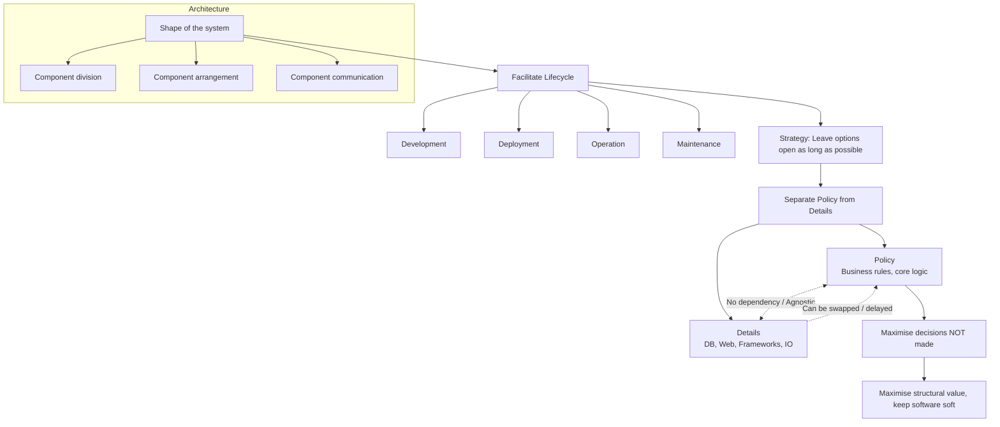

### 📘 Chapter Summary: “What Is Architecture?”

#### 1. What a Software Architect Really Is
- A software architect is **a programmer first** and continues to code.
- They guide the team toward a productive design but remain hands‑on to feel the pain their decisions cause.

#### 2. Definition of Architecture
> **Architecture** = the *shape* of a system, defined by:
> - Division into **components**
> - **Arrangement** of those components
> - **Communication** between them

The **purpose** of that shape:
> To facilitate **development**, **deployment**, **operation**, and **maintenance**.

The **strategy** behind it:
> **Leave as many options open as possible, for as long as possible.**

#### 3. The Real Goal: Support the System Lifecycle, Not Just Behavior
- A system can **work** perfectly with terrible architecture.
- The pain of bad architecture appears in **development, deployment, and maintenance**—not during normal operation.
- Architecture’s role in behavior is *passive/cosmetic*; its real value is in *lifecycle support* and **minimizing lifetime cost / maximizing programmer productivity**.

---

#### 4. The Four Lifecycle Forces

| Force | Key Insight |
|-------|-------------|
| **Development** | Small teams may succeed with a monolith; large multi‑team efforts **must** have well‑defined components with stable interfaces. Architecture should match team structure. |
| **Deployment** | Aim for **single‑action deployment**. Over‑complicating early (e.g., too many micro‑services) makes deployment error‑prone. Consider deployment trade‑offs early. |
| **Operation** | Impact is less critical – hardware is cheap. But good architecture **reveals operation**: it makes use cases, features, and required behaviours **visible landmarks** for developers. |
| **Maintenance** | The **most costly** activity. Costs come from *spelunking* (digging through code to find where to change) and *risk* (inadvertent breakage). A careful component separation with stable interfaces drastically reduces both. |

---

#### 5. Keeping Options Open – Policy vs Details
- Software has two values: **behavior** and **structure** (the latter is greater because it makes software *soft*).
- The way to keep software soft is to **defer decisions** about the details.

**System decomposition:**
- **Policy** = business rules & procedures (the true value).
- **Details** = IO devices, databases, web frameworks, servers, protocols, DI frameworks – things that let humans/systems talk to the policy but don’t change the policy itself.

**Architect’s job:**  
Create a shape where **policy is central and details are irrelevant** to it. This allows you to:
- Delay database choice
- Delay web framework choice
- Delay REST / micro‑service / SOA decisions
- Delay DI framework choice
- Run experiments with different implementations before committing

> **“A good architect maximizes the number of decisions *not* made.”**

Even if the company has already chosen a technology, the architect *pretends* it hasn’t and keeps the system decoupled long enough to still change it.

---

#### 6. Historical Proofs (Device Independence & Physical Addressing)
- **1960s – Device Independence:** Early code hard‑wired to card readers/punches had to be completely rewritten when magnetic tape arrived. The solution was an OS abstraction layer – the same program could read/write “abstract unit‑record devices” without change. This was the birth of the Open–Closed Principle.
- **1970s – Physical Addressing:** Hard‑coding cylinder/head/sector numbers made a system brittle when the disk drive changed. Switching to **relative addressing** (a linear sector array translated by a conversion routine) decoupled policy from physical disk structure.

Both stories illustrate the same principle: **separate policy from detail, and decouple them completely.**

---

### 🧠 Visual Summary in Mermaid

