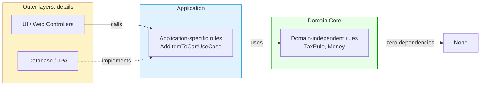
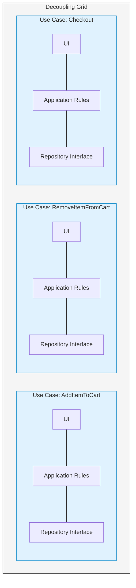
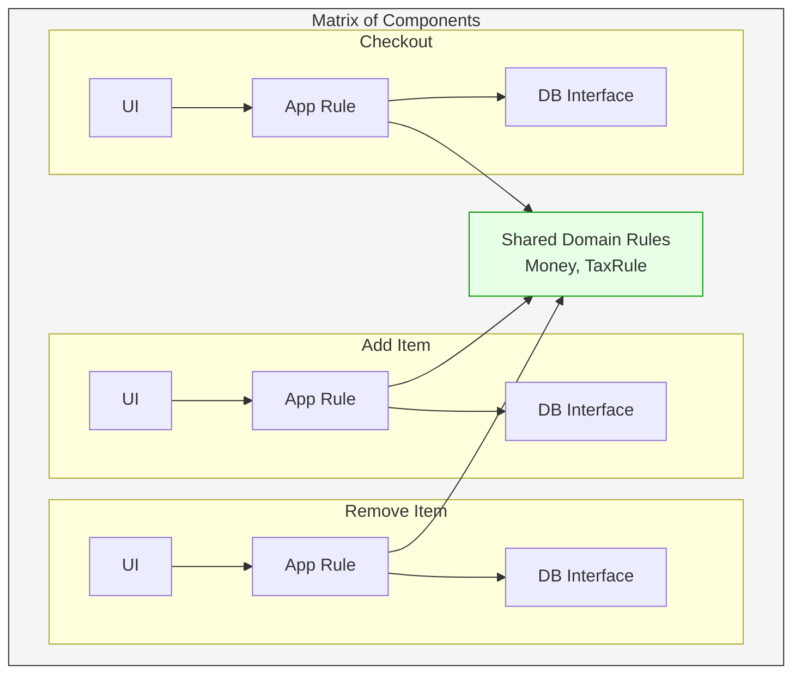
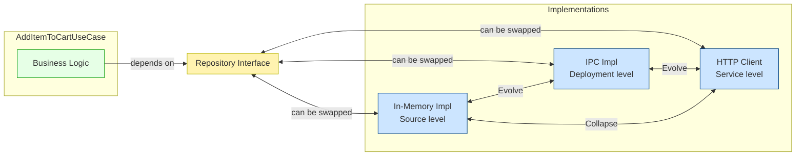
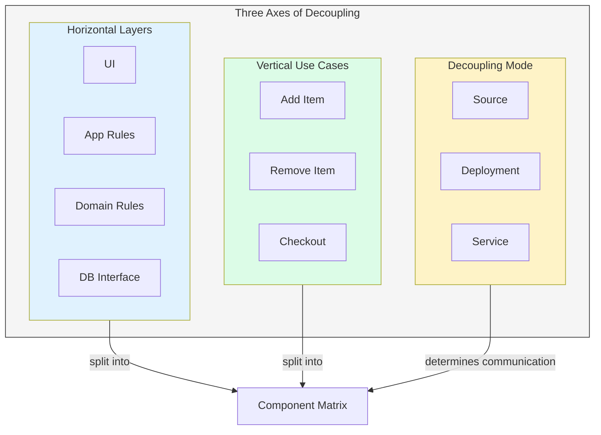

# The Decoupling Grid: Layers × Use Cases × Mode

Three interdependent forms of decoupling:

| Axis                     | What you separate                                                  | Why                                          |
| ------------------------ | ------------------------------------------------------------------ | -------------------------------------------- |
| **Horizontal** (layers)  | UI, application‑specific rules, domain‑independent rules, database | They change for different reasons (SRP, CCP) |
| **Vertical** (use cases) | Each use case gets its own slice through all layers                | Use cases evolve independently               |
| **Mode** (the *how*)     | Source, deployment, or service‑level separation                    | Keep the physical deployment flexible        |

When you combine horizontal and vertical, you get a **matrix** of tiny, well‑isolated components. The decoupling mode then decides how those components talk to each other.

---

## 1. Horizontal Decoupling: Layers

The classic horizontal layering:

```
UI  →  Application‑specific business rules  →  Domain‑independent business rules  →  Database
```

Each layer is a detail to the one inside it. *The inner layers must not know about the outer layers*. This allows you to change the database without touching business rules, or replace the UI framework without changing domain logic.

### Example: A Shopping Cart

**Domain‑independent rule** (pure business logic, no framework or application knowledge):
```java
// domain/Money.java
public class Money {
    private final BigDecimal amount;
    private final Currency currency;
    // arithmetic methods...
}

// domain/TaxRule.java – a pure function
public class TaxRule {
    public Money apply(Money subtotal, Country country) {
        // calculates VAT etc. – no I/O, no Spring, no JPA
    }
}
```

**Application‑specific rule** (orchestrates the use case, still knows nothing about the UI or database *implementations*):
```java
// usecases/AddItemToCart/AddItemToCartUseCase.java
public class AddItemToCartUseCase {
    private final CartRepository cartRepository; // interface!
    private final ProductCatalog productCatalog; // interface!
    private final TaxRule taxRule;              // domain rule

    public AddItemToCartResponse execute(AddItemToCartRequest request) {
        Cart cart = cartRepository.findByCustomerId(request.getCustomerId());
        Product product = productCatalog.findById(request.getProductId());
        cart.addItem(product, request.getQuantity());
        Money tax = taxRule.apply(cart.getSubtotal(), request.getCountry());
        cart.setTax(tax);
        cartRepository.save(cart);
        return new AddItemToCartResponse(cart.getTotal());
    }
}
```

**Repository interface** (defined by the use case, implemented in the outer layer):
```java
// usecases/AddItemToCart/CartRepository.java
public interface CartRepository {
    Cart findByCustomerId(CustomerId id);
    void save(Cart cart);
}
```

**UI / Controller** (adapts HTTP to the use case):
```java
// adapters/web/AddItemToCartController.java
@RestController
@RequestMapping("/cart")
public class AddItemToCartController {
    private final AddItemToCartUseCase useCase;

    public AddItemToCartController(AddItemToCartUseCase useCase) {
        this.useCase = useCase;
    }

    @PostMapping("/items")
    public AddItemToCartResponse addItem(@RequestBody AddItemToCartRequest request) {
        return useCase.execute(request);
    }
}
```

**Database implementation** (actual JPA/JDBC, plugs into the interface):
```java
// adapters/db/JpaCartRepository.java
@Repository
public class JpaCartRepository implements CartRepository {
    // uses Spring Data JPA or JDBC
}
```

> **Key principle:** The use case depends on interfaces (`CartRepository`, `ProductCatalog`). The database and web adapters depend on those interfaces. The arrow of dependency points inward. The database is a detail.

### Horizontal Layers Diagram



The flow of control: UI → Use Case → Domain Rules.  
The flow of dependencies: outer layers point inward. The domain knows nothing.

---

## 2. Vertical Decoupling: Use Cases

Each use case is a self‑contained vertical slice. `AddItemToCart` and `RemoveItemFromCart` are separate packages, each with its own UI, business rules, and data interface definitions.

**Package structure that screams intent:**
```
com.example.shop/
  additemtocart/
    AddItemToCartUseCase.java
    AddItemToCartRequest.java
    AddItemToCartResponse.java
    AddItemToCartController.java      (UI adapter)
    CartRepository.java               (interface)
  removeitemfromcart/
    RemoveItemFromCartUseCase.java
    RemoveItemFromCartController.java
    CartRepository.java               (a different interface! only delete methods)
  checkout/
    CheckoutUseCase.java
    ...
  domain/
    Money.java, TaxRule.java          (shared domain rules)
```

Notice:
- Each use case may define its own repository interface, tailored to its needs (Interface Segregation Principle).
- Changes to `RemoveItemFromCart` won’t affect `AddItemToCart`, even though both touch carts, because they depend on different interfaces and have separate code paths.
- Adding a new use case (`ApplyDiscount`) means adding a new package; old ones stay untouched.

### Vertical Slices Diagram



Each rectangle is a full vertical slice. Horizontally, there are layers (UI, app rules, DB interface), but they’re duplicated *per use case*. This is intentional; it prevents one use case from coupling to another.

### Why Not Share Code? The Duplication Warning
Two use cases might have similar screens. The architect is tempted to share a single UI component. This is often **accidental duplication**—they will diverge later. Resist the urge; keep them separate. If you must share something (e.g., a `MoneyFormatter`), make it a small, focused utility in the domain, not a combined screen object.

---

## 3. The Complete Grid: Layers × Use Cases

When you overlay horizontal layers and vertical slices, you get a **grid of small, independent components**:



Each component (cell) is a potential independent deployable. The shared domain rules are the only truly common code; they are stable and abstract.

---

## 4. The Third Dimension: Decoupling Mode

The **decoupling mode** is the physical deployment choice:

| Mode | Communication | Deployment unit | Advantages | Cost |
|------|---------------|-----------------|------------|------|
| **Source level** | Function calls (same process) | Monolithic executable | Simplest, fastest | Can’t scale components independently |
| **Deployment level** | IPC, sockets, shared memory, or still in‑process calls, but components in separate JARs/DLLs | Independently deployable libraries | Partial independent deployment & scaling | Still shares same OS resources; orchestration overhead |
| **Service level** | Network (HTTP, gRPC, queues) | Separate processes/containers | Maximum independence, independent scaling & technology choice | Network latency, serialization, complex operations |

**A good architect keeps the decoupling mode open.** You design the components so that *they don’t know* which mode is used.

### How Code Stays Mode‑Agnostic

The same `AddItemToCartUseCase` works whether `CartRepository` is:
- A local class (source level)
- A call across a process boundary (deployment level)
- A network service (service level)

The only thing that changes is the **implementation** injected into the use case.

**Source‑level setup (monolith):**
```java
// All components in one application context
@Configuration
public class AppConfig {
    @Bean
    public CartRepository cartRepository() {
        return new InMemoryCartRepository(); // same process
    }
}
```

**Service‑level setup (micro‑service):**
```java
@Configuration
public class AppConfig {
    @Bean
    public CartRepository cartRepository() {
        return new CartServiceClient("http://cart-service:8080"); // network call
    }
}
```

The `AddItemToCartUseCase` code doesn’t change a single line. The architecture left the option open.

### Transitioning Through Modes – Diagram



The business logic never knows how its repository is implemented. That’s the key: **decouple at the source level first, then move outward only when operational need is proven**.

### Practical Advice from the Chapter
- Start with source‑level decoupling. Keep all components in the same process.
- Structure them as if they *could* be separate services, by using stable interfaces.
- When deployment or scaling forces it, extract some components into separate deployment units or services.
- You can even slide back (e.g., merge micro‑services back into a monolith if the complexity isn’t worth it) because the business logic never depended on the network boundary.

---

## 5. Code vs Diagram – The Unified Picture

**In code:**
- A package per use case, containing its own interfaces and application rule.
- Outer layers (web, database) implement those interfaces.
- A configuration file wires everything together; swapping modes is just changing the wiring.

**In diagram:**
The combined grid with mode overlay:



All three axes are independent choices. The matrix of components (the grid) is fixed by the business decomposition. The mode can be adjusted over time without rewriting the business logic.

---

## 6. Key Takeaways

- **Horizontal layers** isolate UI, app rules, domain rules, and database. They change for different reasons. The database is a detail.
- **Vertical use‑case slices** isolate each feature. They prevent changes to one feature from breaking another.
- **The grid** combines both: small, single‑purpose components that are easy to understand, test, and maintain.
- **Decoupling mode** is a *deployment decision*, not a design decision. Keep it open by depending on interfaces.
- **Start with source‑level separation.** Only add deployment or service complexity when you have hard data proving it’s necessary.
- **Always be able to go back.** A well‑architected system allows you to collapse services back into a monolith if operational needs change.
