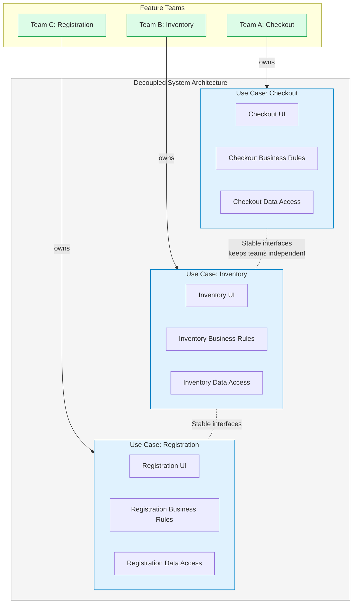

Let’s dive deep into how **Conway’s Law** shapes architecture, and how a well‑designed system can turn this law from a threat into a tool for independent, high‑velocity development.

---

## 1. Conway’s Law – The Unavoidable Mirror

Melvin Conway’s original observation (1967) is brutally simple:

> *“Organizations which design systems … are constrained to produce designs which are copies of the communication structures of these organizations.”*

If your company has four separate teams—UI, back‑end, database, and operations—the system will naturally evolve into four large components: a front‑end app, a back‑end service, a database layer, and deployment scripts. The interfaces between these components will mirror the communication paths (and gaps) between those teams.

**The law is descriptive, not prescriptive.** It doesn’t say you *should* do this; it says you *will*, unless you consciously fight it. Great architects accept this reality and **design the architecture to make the inevitable team‑structure mirror a beneficial one**.

---

## 2. The Architecture Must Enable Independent Development

The development goal is clear: multiple teams must be able to work on the same system **without constantly stepping on each other’s toes**. If every change requires cross‑team coordination, the project will grind to a halt.

To achieve this, you need:
- **Well‑isolated components** – each with a clear public interface and no internal entanglement with others.
- **Components that are independently developable** – a team can build, test, and even deploy its component in isolation, using test doubles for its dependencies.
- **Minimal inter‑team dependencies** – changes in one team’s component don’t force changes in another’s, except at well‑defined, stable interface points.

This is precisely the decoupling described earlier in the chapter—horizontal layers (UI, business rules, database) and vertical slices (use cases). Now we see them through the lens of **team organisation**.

---

## 3. Mapping Teams to Architecture: Three Common Patterns

Conway’s Law works in both directions. If you already have a team structure, the architecture will drift to match it. But if you can shape the architecture first, it will influence how teams can be formed.

### Pattern A: Layer Teams (common anti‑pattern)
```
UI Team → frontend code
Service Team → backend “business logic” code
Database Team → schema, stored procedures
```
- **Problem**: Almost any feature change touches all three layers, forcing coordination between three teams. The architecture screams the technology stack, not the product.
- **Result**: Slow, high‑friction development. The use cases are hidden, spread across silos.

### Pattern B: Feature Teams (aligned with use cases)
```
Checkout Team → owns Checkout use case (UI, business rules, data access)
Inventory Team → owns Inventory use case
User Management Team → owns Registration, Login use cases
```
- **Architecture requirement**: The system must be **vertically decoupled**—each use case is a self‑contained component with its own slice of UI, business logic, and data. Only then can a single team own it end‑to‑end.
- **Result**: Teams can develop, test, and deploy their features independently. Conway’s Law works *for* you: the organisation now mirrors the use‑case architecture, and both scream the same thing.

### Pattern C: Mixed (Feature teams + shared infrastructure)
Sometimes a shared layer is unavoidable (e.g., a core payment gateway, a central user authentication service). This is fine as long as the shared component is treated as a product with its own team and its own stable API. The feature teams depend on that API, not on the internal workings of the shared component.

---

## 4. The Decoupling Recipe for Independent Development

To support any of these team patterns—especially feature teams—the architecture must apply two kinds of decoupling simultaneously:

| Decoupling Axis | What it separates | Team benefit |
|-----------------|-------------------|--------------|
| **Horizontal** (layers) | UI from business rules from database | A UI specialist can change the UI without touching business rules; a DB specialist can optimise queries without breaking use‑case logic. |
| **Vertical** (use cases) | AddOrder from DeleteOrder from Checkout | Different feature teams can work on different use cases simultaneously, even modifying their own UI and DB parts, without merge hell. |

**Critical rule:** The decoupling must be *real*, not superficial. Each component must have its own source files, its own test suite, and—ideally—its own deployable artifact (even if initially all deployed together). The interfaces between components must be stable enough that teams can mock them and test in isolation.

---

## 5. How This Enables Any Team Structure

The chapter says: *“So long as the layers and use cases are decoupled, the architecture of the system will support the organization of the teams, irrespective of whether they are organized as feature teams, component teams, layer teams, or some other variation.”*

This is a powerful claim. Let’s verify it:

- **Feature teams** → directly map to vertical use‑case slices. The architecture already has those slices as first‑class components. Perfect.
- **Component teams** (each team owns a particular component, say the “Inventory Service”) → works because the system is split into well‑defined components, each with a clear boundary.
- **Layer teams** → workable because horizontal layers are decoupled. The UI team can work on all UI code across use cases without affecting the business rules. However, this pattern is less efficient for feature delivery, but the architecture doesn’t prevent it.
- **Even a single team of five** → can happily work within a monolith as long as the internal decoupling is respected (source‑level decoupling). They get speed without the overhead of distributed systems.

The architecture is **team‑organisation agnostic** because the decomposition is based on the natural axes of change (SRP, CCP), not on a particular org chart.

---

## 6. Independent Develop‑ability Beyond Code

True independence goes beyond just avoiding code conflicts. It includes:

- **Independent testing:** A team can run all tests for their component without setting up the entire system. They use fakes/stubs for external interfaces.
- **Independent building:** A change in one component doesn’t force a full system rebuild; only that component’s deployable unit is rebuilt.
- **Independent deployment** (the next step): If deployment issues arise, the same decoupling allows extracting that component into its own service later without ripping apart dependencies.

All of this is possible **because the architecture never assumed a shared address space or a monolithic deployment**. The components were built as if they could be separated, even if they aren’t yet.

---

## 7. The Trap: Organisation Dictating Architecture vs. Architecture Guiding Organisation

Conway’s Law can be a self‑fulfilling prison. If the company has a rigid UI‑vs‑Backend team split, and you let that dictate a layered monolith, you lose the ability to form feature teams later. The architecture becomes a blocker.

The architect’s job is to **invert the relationship**: design the architecture around use cases and proper decoupling, then advocate for team structures that align with it. Even if the organisation can’t change immediately, the clean architecture will at least allow teams to work within their layers without breaking each other, and—crucially—will allow a gradual re‑org later without rewriting the system.

---

## 8. Visualising Conway’s Law and Independent Development

The following diagram shows how a decoupled architecture (use‑case verticals + horizontal layers) maps cleanly onto feature teams, making Conway’s Law a positive force.



**How to read this:**  
- The system is split vertically into independent use‑case components, each containing its own layers.  
- Teams are aligned one‑to‑one with these components.  
- Dependencies between use cases are limited to stable interfaces (e.g., a shared `ProductCatalog` interface used by both Inventory and Checkout), preventing cascading changes.  
- Conway’s Law is now an ally: the organisation structure (feature teams) naturally reinforces the clean architecture, and vice versa.

---

## 9. Key Takeaways

- **Conway’s Law is inevitable** – don’t fight it, design with it.
- **Architecture must enable independent team work** by partitioning the system into well‑isolated, independently developable components.
- **Decouple both horizontally and vertically** – this makes the architecture resilient to different team structures and allows you to re‑organise teams without rewriting the system.
- **Aim for “team‑organisation agnostic” components** – the same codebase can support feature teams, component teams, or even a small single team, all because the decoupling is based on stable principles (SRP, CCP) rather than on today’s org chart.
- **Independent develop‑ability is the foundation** for independent deployability and scalability later – keeping options open here pays off across the entire system lifecycle.

When architecture faithfully reflects the product’s use cases and isolates those cases from each other, it becomes a platform for team autonomy, faster delivery, and long‑term adaptability.