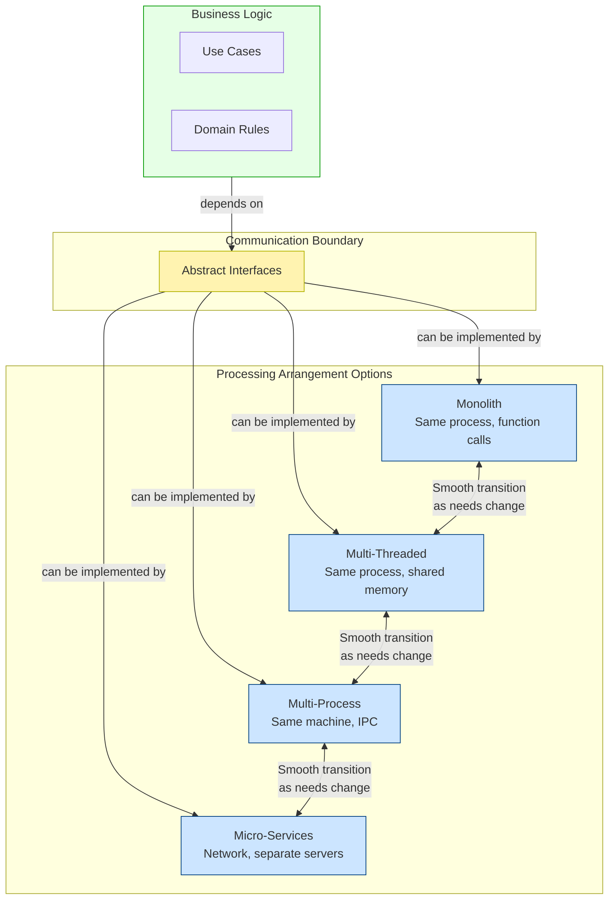

## 1. What “Support Operation” Actually Means

Operational requirements are the non‑functional constraints that determine how the system performs under load:

- **Throughput** – e.g., handle 100,000 customer requests per second.
- **Latency** – query a big data cube and return results in milliseconds.
- **Concurrency** – many simultaneous sessions interacting with shared state.
- **Resource utilization** – memory, CPU, I/O bandwidth.

Architecture cannot invent performance where none exists, but it can **enable** it. If the system needs massive parallelism, the architecture must allow you to multiply processing units without rewriting core logic. If it needs extreme isolation (e.g., for security or fault tolerance), it must let you physically separate components.

### The Architect’s Dilemma
At the start of a project, you rarely know the exact operational profile. You might guess, but guesses change. The true skill of the architect is to build a structure that **works well enough today** while **remaining open to radical restructuring tomorrow** without discarding the existing business logic.

---

## 2. The Spectrum of Processing Arrangements

All executable software ends up as some combination of:

| Arrangement | Communication | Isolation | Typical Use |
|-------------|---------------|-----------|-------------|
| **Monolith** (single process, single thread) | Direct function calls | None – everything shares one address space | Simple desktop app, batch job |
| **Multiple threads** (single process, many threads) | Shared memory, locks, events | Low – threads share heap | GUI apps, server handling many requests with shared cache |
| **Multiple processes** (same machine, separate address spaces) | IPC, sockets, shared memory, pipes | High – separate address spaces | Legacy server partitioning, OS‑level isolation |
| **Services / Micro‑services** (separate machines/containers) | Network protocols (HTTP, gRPC, message queues) | Maximum – independent lifecycle, scaling, technology | Large‑scale distributed systems, independent deployment |

Each step to the right introduces **more flexibility** for independent scaling, deployment, and technology choice, but also **more cost**: serialisation, network latency, complex error handling, deployment orchestration.

---

## 3. The Core Insight: Don’t Assume the Means of Communication

A monolith becomes hard to split because its components are coupled by their *assumptions* about communication:

- Business rule objects call each other via direct method calls, assuming they exist in the same memory space.
- They might share mutable state directly, assuming a single thread of execution or careful locking.
- They may rely on the call stack for context propagation (transactions, user identity).

If you later need to move one component to a separate process or service, you must **rip apart these assumptions** – a painful rewrite.

**The solution:** Design components so that their interaction is through **abstract boundaries** that hide the communication mechanism. A component should depend on an interface, not on a concrete implementation that assumes a local call. If the interface can be implemented by an in‑memory stub *or* by a network proxy, you’ve preserved the option.

Example (conceptual):
```java
// Use case interactor – knows nothing about how the repository works
public class CheckoutUseCase {
    private final OrderRepository orderRepo; // interface
    private final PaymentGateway paymentGateway; // interface

    public void execute(CheckoutRequest request) {
        Order order = orderRepo.findById(request.getOrderId());
        paymentGateway.charge(order.getTotal());
        order.markPaid();
        orderRepo.save(order);
    }
}
```

`OrderRepository` could be backed by a local database call, a micro‑service call over HTTP, or even an in‑memory test fake. The use case does not care. This is **dependency inversion** applied to communication.

---

## 4. Enabling Smooth Movement Along the Spectrum

With properly isolated components and abstracted communication, the system can **evolve** its processing arrangement without major refactoring:

```
Monolith
  → Split into threads for CPU‑bound tasks, using same interfaces
  → Extract high‑throughput components into separate processes (still same interfaces)
  → Move those processes to separate servers, turning them into services
  …and later, if traffic drops or simplicity is needed, **merge back** into a monolith.
```

This is not a one‑way street. Because the business rules never depended on the transport, you can collapse services back into a single deployment when operational demands change. A good architecture protects the **majority of the source code** from these structural shifts.

---

## 5. How Use‑Case and Layer Decoupling Helps Operation

The same vertical (use‑case) and horizontal (layer) decoupling that supports development and deployment directly benefits operations:

- **High‑throughput use cases** (e.g., real‑time bidding) can be isolated and scaled independently from low‑throughput ones (e.g., monthly report generation).
- **Read‑heavy queries** can be separated from write‑heavy commands (CQRS pattern) to optimise hardware and caching.
- **The UI and database** can be run on separate servers because they are decoupled from business rules.
- **Critical business rules** can be kept on secure, high‑availability clusters while less critical parts run on commodity hardware.

All of this is only possible if the components were **decoupled from the start**—otherwise, scaling one part forces scaling everything, leading to massive inefficiency and cost.

---

## 6. The Pragmatic Approach: Decouple to the Point Where a Service *Could* Form

The book advocates a middle path:

1. **Logically decouple** components at the source level (separate packages/modules, clean interfaces).
2. **Keep them in the same address space** (monolith) as long as it meets operational needs.
3. **Design the boundaries** such that they could become deployment‑level (separate JARs/DLLs) or service‑level (network endpoints) with minimal effort.
4. When operational metrics (latency, throughput, deployment friction) justify the cost, **gradually extract** specific components into services.

This avoids premature micro‑service overhead (network latency, serialisation, complex orchestration) while retaining the ability to scale when needed. It also keeps the door open to reverse the decision—something that is nearly impossible if you start with a fully distributed architecture from day one.

---

## 7. Visualising the Open Option: A Mermaid Diagram

The following diagram illustrates how decoupled components can migrate between modes while keeping business logic intact.



- The business logic (use cases + domain rules) only depends on abstract interfaces.
- The same interfaces can be backed by any of the four processing modes.
- Because the logic is decoupled from the communication mechanism, you can freely **slide back and forth** as operational demands evolve.

---

## 8. Conclusion

**Supporting operation is not about pre‑building a distributed system.** It’s about building a system that *can* be distributed when necessary. The key is:

- **Isolate components** by use case and by layer.
- **Abstract the communication** so that components don’t assume local calls.
- **Keep the processing arrangement an open option** by not hard‑wiring threads, processes, or network boundaries into the core logic.
- **Scale only what needs scaling**, when you have real data to justify it.

A good architect treats the operational deployment model as a **detail**—one that can be deferred, experimented with, and even reversed—while the core value (the business rules) remains untouched. This is the ultimate expression of “leaving options open.”