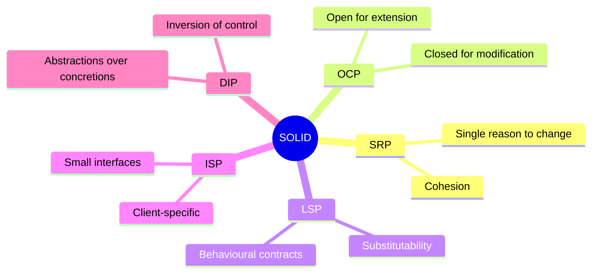

# SOLID Principles Overview

**SOLID** is an acronym introduced by Robert C. Martin that represents five fundamental design principles for writing maintainable, scalable, and robust object‑oriented software. Together, they help developers create systems that are easy to understand, test, and refactor.

The five principles are:

| Letter | Principle | Core Idea |
|--------|-----------|------------|
| **S** | [[Single Responsibility Principle (SRP)]] | A class should have only one reason to change. |
| **O** | [[Open-Closed Principle (OCP)]] | Classes should be open for extension, but closed for modification. |
| **L** | [[Liskov Substitution Principle (LSP)]] | Subtypes must be substitutable for their base types. |
| **I** | [[Interface Segregation Principle (ISP)]] | Many client‑specific interfaces are better than one general‑purpose interface. |
| **D** | [[Dependency Inversion Principle (DIP)]] | Depend upon abstractions, not concretions. |

---

## 🎯 Why SOLID?

Applying SOLID leads to code that is:

- **Maintainable** – changes are localised and less likely to break unrelated functionality.
- **Testable** – small, focused classes are easy to mock and unit test.
- **Reusable** – loosely coupled components can be reused in different contexts.
- **Understandable** – clear responsibilities and interfaces reduce cognitive load.

> [!tip]  
> Think of SOLID as a compass, not a strict rulebook. Use it to guide design decisions, but don't over‑engineer.

---

## 🧩 The Five Principles – At a Glance

### 1. Single Responsibility Principle (SRP)

> A class should have one, and only one, reason to change.

**Violation example:**
```python
class Report:
    def generate(self): ...
    def save_to_file(self): ...
    def send_email(self): ...
# Too many responsibilities: content, persistence, notification
```

**Refactored:**
```python
class Report:
    def generate(self): ...

class ReportSaver:
    def save(self, report): ...

class ReportMailer:
    def send(self, report): ...
```

🔗 See full details: [[Single Responsibility Principle (SRP)]]

---

### 2. Open‑Closed Principle (OCP)

> Software entities should be open for extension, but closed for modification.

Rather than modifying existing code, add new behaviour by extending it.

```python
class Shape(ABC):
    @abstractmethod
    def area(self) -> float: ...

class Circle(Shape):
    def area(self): ...

class Rectangle(Shape):
    def area(self): ...

def total_area(shapes: list[Shape]) -> float:
    return sum(s.area() for s in shapes)
# New shapes can be added without changing total_area()
```

🔗 See full details: [[Open-Closed Principle (OCP)]]

---

### 3. Liskov Substitution Principle (LSP)

> Objects of a superclass should be replaceable with objects of its subclasses without affecting correctness.

A subclass should not violate the expectations set by the base class.

```python
class Bird(ABC):
    @abstractmethod
    def fly(self): ...

class Sparrow(Bird):
    def fly(self): ...

class Ostrich(Bird):      # Violates LSP! Ostriches can't fly.
    def fly(self):
        raise NotImplementedError
```

A better design separates flying and non‑flying birds.

🔗 See full details: [[Liskov Substitution Principle (LSP)]]

---

### 4. Interface Segregation Principle (ISP)

> No client should be forced to depend on methods it does not use.

Prefer many small, focused interfaces over a single large one.

```python
class Printer(ABC):
    @abstractmethod
    def print_document(self): ...

class Scanner(ABC):
    @abstractmethod
    def scan_document(self): ...

class MultiFunctionMachine(Printer, Scanner): ...
# Simple printers only implement Printer, not unused scanning methods
```

🔗 See full details: [[Interface Segregation Principle (ISP)]]

---

### 5. Dependency Inversion Principle (DIP)

> High‑level modules should not depend on low‑level modules. Both should depend on abstractions.

Details should depend on abstractions, not the other way around.

```python
class NotificationService:
    def __init__(self, sender: MessageSender):  # depends on abstraction
        self.sender = sender

    def notify(self, message):
        self.sender.send(message)

class EmailSender(MessageSender): ...
class SMSSender(MessageSender): ...
```

🔗 See full details: [[Dependency Inversion Principle (DIP)]]

---

## 🧠 Visualising SOLID



---

## ⚠️ Common Pitfalls

- **Over‑engineering** – Applying SOLID too rigidly can lead to unnecessary abstractions. Start simple, then refactor when real needs arise.
- **Misinterpreting “single responsibility”** – It doesn’t mean a class does only one tiny thing; it means all its methods serve the same stakeholder/actor.
- **Ignoring the principles in small projects** – Even small codebases benefit from clarity and ease of testing.
- **Confusing DIP with Dependency Injection** – Dependency Injection is a technique that helps achieve DIP, but they are not the same.

---

## 🏁 Summary

SOLID principles are the foundation of clean object‑oriented design. They help you:

- **Manage complexity** by separating concerns.
- **Adapt to change** with minimal risk.
- **Write code** that is understandable to your future self and teammates.

> [!quote]  
> “Any fool can write code that a computer can understand. Good programmers write code that humans can understand.” – Martin Fowler

For a deeper dive, explore each principle’s dedicated page:

- [[Single Responsibility Principle (SRP)]]
- [[Open-Closed Principle (OCP)]]
- [[Liskov Substitution Principle (LSP)]]
- [[Interface Segregation Principle (ISP)]]
- [[Dependency Inversion Principle (DIP)]]

---

## 📚 Further Reading

- *Clean Architecture* – Robert C. Martin
- *Agile Software Development, Principles, Patterns, and Practices* – Robert C. Martin
- [[Cohesion and Coupling]]
- [[Design Patterns vs Architecture Patterns]]

---
  #solid
  #oop
  #design-principles
  #software-engineering