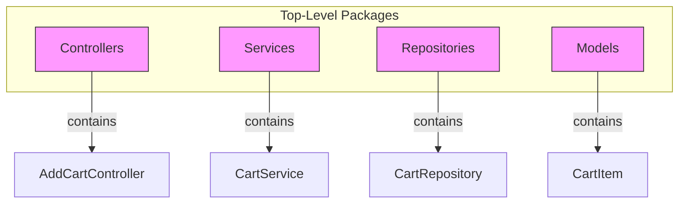
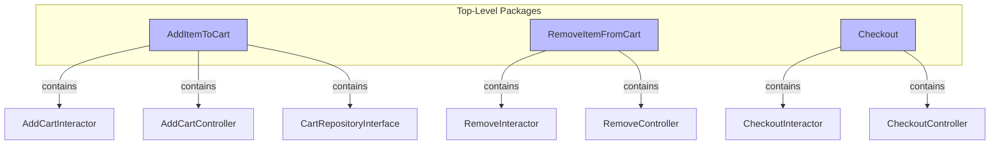

### 1. Architecture Cannot Force Behavior
- Behavior comes from the *code inside* the components, not from the arrangement of components themselves.
- You can have a beautifully layered architecture and still write bug‑ridden business logic.
- Conversely, a badly structured system can still “work” perfectly.
- Therefore, architecture’s contribution to behavior is *passive*: it cannot guarantee correctness, but it can make the intended behaviors **obvious, discoverable, and maintainable**.

### 2. What Does It Mean to “Expose” Use Cases?
A good architecture makes the **use cases** the most prominent elements of the system. When you open the top‑level source directory, you don’t see technology details first—you see **what the system does**.

A shopping cart application should scream “shopping cart.” Not “Spring Boot,” not “Angular,” not “REST API.” The directories, packages, or modules at the highest level should be named after the system’s core use cases.

**Example of a use‑case‑centric structure:**
```
src/
  usecases/
    AddItemToCart/
    RemoveItemFromCart/
    Checkout/
    ViewOrderHistory/
```
Each of these top‑level directories contains everything needed for that use case (its UI, business rules, data access), but these details are secondary.

### 3. The “Screaming Architecture” Principle
Coined in Chapter 21, it states:
> *Your architecture should scream the intent of the system.*

When you look at a house, you immediately know it’s a house—not because of the bricks, but because of the floorplan that serves the purpose of living. Similarly, a software system’s architecture should scream “healthcare system” or “inventory management”—not “Java EE” or “ASP.NET.”

**How to achieve this:**
- Use cases are **first‑class entities** visible at the highest level of abstraction.
- They have **prominent, intention‑revealing names** (e.g., `CreateInvoice`, `RegisterUser`, not `InvoiceService` or `UserManager`).
- The delivery mechanism (web, CLI, tests) is a **plugin** to these use cases—not the other way around.

### 4. The Practical Difference: Framework‑Centric vs. Use‑Case‑Centric

**Framework‑centric (common anti‑pattern):**
```
com.example.shop/
    controllers/
    services/
    repositories/
    models/
```
You have no idea what the system does from the top level. You have to dig into classes to discover that there is an “AddToCart” feature. The architecture screams “MVC” or “Spring.”

**Use‑case‑centric (screaming architecture):**
```
com.example.shop/
    additemtocart/
        AddItemToCartUseCase.java
        AddItemToCartController.java
        CartRepository.java (interface)
    removeitemfromcart/
        ...
    checkout/
        ...
```
Now the system screams “shopping cart.” The top‑level names directly map to the system’s capabilities. Developers don’t have to hunt for behaviours; they jump straight to the relevant use case.

### 5. Why This Matters: The Connection to Independence
Making use cases first‑class entities is not just about aesthetics—it has practical consequences:

- **Maintenance:** Adding a new use case means adding a new top‑level component, completely isolated from others. You don’t risk breaking existing features.
- **Development:** Teams can be organized around these use cases (Conway’s law), each owning a vertical slice. A team working on `Checkout` rarely touches code in `AddItemToCart`.
- **Deployment:** Use cases can be independently deployable (e.g., as micro‑services) because they are already decoupled at the source level.
- **Operation:** High‑throughput use cases can be scaled independently because they are not tangled with low‑traffic features.

Thus, **exposing use cases is the first step in achieving the decoupling that supports all four lifecycle pillars.**

### 6. How Use Cases Cut Through Layers
The architecture doesn’t just dump everything into one big package per use case. Inside each use case, you still separate the horizontal concerns (UI, business rules, data access). But those are **internal details** of the use case, not top‑level concerns.

Example internal structure of `AddItemToCart`:
```
additemtocart/
    AddItemToCartView.java          (input/output boundaries)
    AddItemToCartInteractor.java    (business logic)
    AddItemToCartRepository.java    (interface for data access)
```
This respects the **Single Responsibility Principle** and **Common Closure Principle**: things that change together are grouped together, and things that change for different reasons (like different use cases) are separated.

### 7. The Naming Discipline
Use‑case names should be **verbs or verb phrases** that describe what the user does:
- `AddItemToCart`
- `CalculateTax`
- `GenerateMonthlyReport`

Avoid technical noise like `CartService` or `OrderFacade`—they hide the intent. This discipline ensures that the codebase is a living documentation of the system’s capabilities.

### 8. Visualizing the Difference

Let’s contrast the two approaches with a simple Mermaid diagram.

**Framework‑centric (the system screams its technology):**

You can’t see what the system does. The primary organization is technical.

**Use‑case‑centric (screaming architecture):**

Now the architecture instantly communicates **what the system does**. The technical details are subservient to the use cases.

### 9. Deeper Implication: Keeping the Core Ignorant of Details
When use cases are the organising principle, it becomes natural to keep the inner layers (business rules) free of infrastructure details. The use‑case interactor does not know about the web or the database; it works through abstract interfaces. This is the classic **dependency inversion** that allows you to **defer decisions** about frameworks, databases, and delivery mechanisms.

The use‑case‑centric package structure reinforces this by making the delivery mechanism an outer layer that *wraps* the use case, not the other way around. For example, you might have:
```
additemtocart/
    AddItemToCartUseCase.java        (pure business logic)
    web/
        AddItemToCartController.java (web adapter)
    cli/
        AddItemToCartCommand.java    (CLI adapter)
    db/
        CartRepositoryImpl.java      (database implementation)
```
The core use case stands alone; the details are plugged in.

### 10. Conclusion
The advice to “expose, don’t just support” is a call to make the architecture a **mirror of the system’s intent**. It’s not enough to have a system that *works*—the architecture must actively communicate what it does. This:

- Drastically reduces the cognitive load for developers.
- Enables independent development, deployment, and maintenance of features.
- Keeps the door open to change frameworks, databases, and other details without disrupting the core.
- Is the practical realization of “leaving options open” by making each option (each use case) a self‑contained, isolated component that can evolve independently.

When architecture screams the use cases, it becomes a living roadmap of the system’s capabilities—one that remains resilient to change.