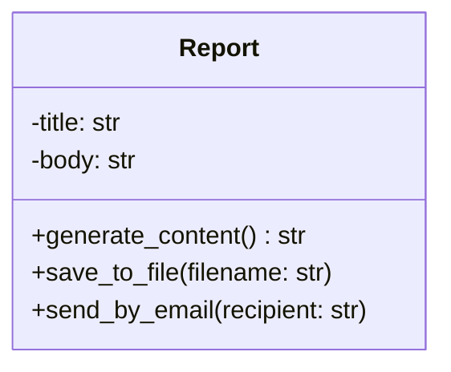
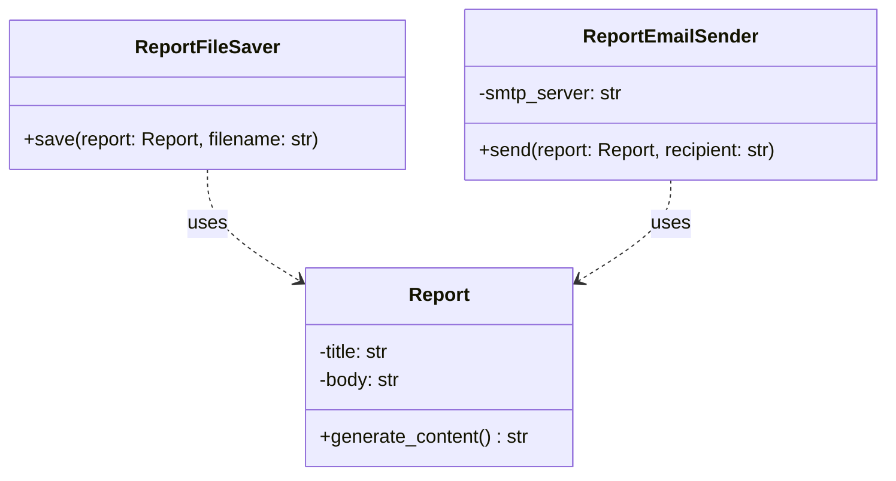

# Single Responsibility Principle (SRP)

> **Definition**: A class should have only one reason to change, meaning it should have only one job or responsibility.

The **Single Responsibility Principle** is the **S** in the [[SOLID]] acronym. It was formulated by Robert C. Martin. In essence, each software module (class, function, etc.) should encapsulate a single, well-defined piece of functionality. The “reason to change” is tied to a specific actor or business function that requests modifications.

---
## 🎯 Why SRP Matters

- **Maintainability** – Changes to one responsibility do not ripple through unrelated code.
- **Testability** – Small, focused units are easier to isolate and unit test.
- **Reusability** – A class with a single purpose can be reused without pulling in irrelevant dependencies.
- **Readability** – The intent of the class is crystal clear.

> [!tip]
> Ask yourself: *“What is the one thing this class does? Who would ask me to change it?”*

---

## 🔴 Violation of SRP – Example

The following `Report` class violates SRP because it manages three distinct responsibilities:
1. Generating the report content
2. Saving the report to a file
3. Sending the report via email

```python
class Report:
    def __init__(self, title: str, body: str):
        self.title = title
        self.body = body

    def generate_content(self) -> str:
        """Responsibility 1: format the report."""
        return f"# {self.title}\n\n{self.body}"

    def save_to_file(self, filename: str):
        """Responsibility 2: persist to disk."""
        content = self.generate_content()
        with open(filename, 'w') as file:
            file.write(content)
        print(f"Report saved to {filename}")

    def send_by_email(self, recipient: str):
        """Responsibility 3: email the report."""
        content = self.generate_content()
        # Simulate email sending
        print(f"Sending email to {recipient}:\n{content}")

# Usage
report = Report("Monthly Sales", "Total sales: $50,000")
report.save_to_file("report.md")
report.send_by_email("manager@example.com")
```

> [!warning] Multiple reasons to change
> If the file storage logic changes (e.g., switch to cloud storage) **or** the email system changes (e.g., add authentication), the `Report` class must be modified. It has **three** reasons to change.

---

## 🟢 Adhering to SRP – Refactored Design

We separate the concerns into three focused classes:

```python
class Report:
    """Responsibility: generate and format report content."""
    def __init__(self, title: str, body: str):
        self.title = title
        self.body = body

    def generate_content(self) -> str:
        return f"# {self.title}\n\n{self.body}"


class ReportFileSaver:
    """Responsibility: save reports to files."""
    @staticmethod
    def save(report: Report, filename: str):
        content = report.generate_content()
        with open(filename, 'w') as file:
            file.write(content)
        print(f"Report saved to {filename}")


class ReportEmailSender:
    """Responsibility: send reports via email."""
    def __init__(self, smtp_server: str):
        self.smtp_server = smtp_server  # configuration injected

    def send(self, report: Report, recipient: str):
        content = report.generate_content()
        # Real implementation would use smtplib with self.smtp_server
        print(f"Sending email to {recipient} via {self.smtp_server}:\n{content}")


# Usage
report = Report("Monthly Sales", "Total sales: $50,000")

saver = ReportFileSaver()
saver.save(report, "report.md")

emailer = ReportEmailSender(smtp_server="smtp.company.com")
emailer.send(report, "manager@example.com")
```

> [!success] Now each class has **one reason to change**
> - `Report` – only if the report format changes.
> - `ReportFileSaver` – only if file I/O logic changes.
> - `ReportEmailSender` – only if email infrastructure changes.

---

## 🧩 Visual Comparison with Mermaid

### Before (Violation)



### After (Adherence)



---

## 🔍 Detecting SRP Violations

A class **likely** violates SRP if it:
- Has many public methods that serve **different actors** (e.g., UI, database, business logic)
- Changes frequently for **unrelated reasons**
- Is **large** and imports from many different domains
- Requires **complex test setup** due to entangled dependencies

> [!quote] “Gather together the things that change for the same reasons. Separate those that change for different reasons.”

---

## 🧠 Key Takeaways

- **Single responsibility ≠ single action** – a class may have many methods, as long as they serve the same cohesive purpose.
- The “reason to change” is tied to the **actor** (user, stakeholder, external system) that requests it.
- Refactoring to SRP often yields **more, smaller** classes – a worthwhile trade-off for maintainability.
- Apply the principle not only to classes but also to **functions** and **modules**.

---

## 📚 See Also

- [[Open-Closed Principle (OCP)]]
- [[Liskov Substitution Principle (LSP)]]
- [[Interface Segregation Principle (ISP)]]
- [[Dependency Inversion Principle (DIP)]]
- [[SOLID Principles Overview]]
- [[Cohesion and Coupling]]

---
  #solid
  #oop
  #design-principles